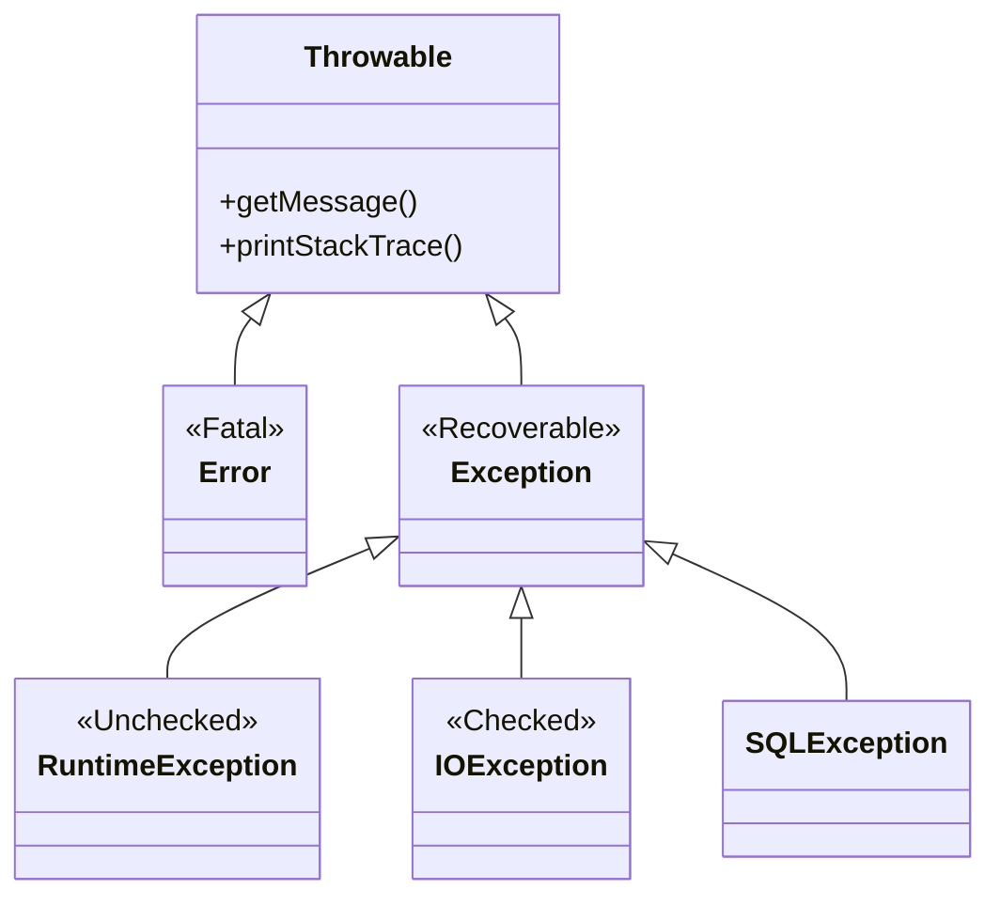

# Lesson 6 (Part 1): The Anatomy & Hierarchy

**(تشريح الاستثناءات والتسلسل الهرمي)**

#### 1. Reality Check: What is an Exception?

**(صدمة الواقع: يعني إيه استثناء؟)** **(Source:,,)**

##### 📖 The Surface (السطح)

لحد دلوقتي كنا عايشين في عالم افتراضي مثالي: الفايل موجود، الشبكة شغالة، واليوزر بيكتب أرقام صح. **الحقيقة (Reality Check):** العالم فوضوي. الفايلات بتتمسح، والواي فاي بيفصل. الـ **Exception** هو حدث غير متوقع بيحصل **أثناء التشغيل (Runtime)**، وبيقطع حبل تنفيذ البرنامج. لو معالجتوش، البرنامج بيعمل **Crash** واليوزر بيشتم.

##### 🧠 The Deep Dive: The "Object" Reality

**(الغوص العميق: حقيقة الكائن)** لما الإيرور بيحصل، الجافا مش بس بتقف وتصرخ. الـ JVM بيقوم بعملية معقدة:

1. **Instantiation (التخليق):** بيخلق **Object** في الـ Heap بيمثل نوع المشكلة (مثلاً `ArithmeticException`).
2. **Population (التعبئة):** بيملا الأوبجيكت ده بمعلومات حيوية: رسالة الخطأ، ونوعها، وأهم حاجة الـ **Stack Trace** (اللي هي "لقطة" للمكان اللي البرنامج كان واقف فيه).
3. **Throwing (الرمي):** بيسلم الأوبجيكت ده للـ Runtime ويقوله: "أنا مش قادر أكمل، خد المشكلة دي اتصرف فيها".

---

#### 2. The Hierarchy of Chaos (Throwable)


في الجافا، أي حاجة ممكن "تترمي" (Thrown) لازم تكون وارثة من الجد الأكبر **`Throwable`**. العيلة دي بتتقسم لفرعين رئيسيين، ولازم تفرق بينهم زي اسمك.

##### 📊 المخطط الهندسي (Mermaid Diagram)



##### Branch A: Error (The Apocalypse) 💥

**(فرع الكوارث)** دي مشاكل في "السيستم" نفسه أو الـ JVM.

- **أمثلة:** `OutOfMemoryError` (الرامات خلصت)، `StackOverflowError` (الريكيرجن ملوش نهاية).
- **القاعدة الصارمة:** **متحاولش تمسكها (Do not catch)**. لو الرامات خلصت، الكود بتاعك مش هيقدر يعمل حاجة. السفينة بتغرق، اهرب.

##### Branch B: Exception (The Recoverable) 🛠️

**(فرع المشاكل القابلة للحل)** دي أحداث البرنامج يقدر يتعافى منها.

- **أمثلة:** `FileNotFoundException`، `SQLException`.
- **القاعدة:** دي بنعملها **Catch** عشان نمنع الـ Crash ونطلع رسالة محترمة لليوزر.

---

#### 3. The "Your Fault" vs. "Not Your Fault" Debate

**(خناقة: غلطتك ولا مش غلطتك؟)** **(Source:,,)**

دي أهم نقطة في تصميم الأنظمة بالجافا. الجافا بتقسم الـ Exceptions لنوعين بناءً على "المسؤولية":

##### Type 1: RuntimeException (Unchecked) 🔴

**(استثناءات وقت التشغيل - غير المفحوصة)**

- **التشخيص:** دي **Bugs** في الكود بتاعك. غلطتك أنت يا هندسة.
- **الأمثلة:**
    - `NullPointerException`: نسيت تعمل initialize لمتغير.
    - `ArrayIndexOutOfBoundsException`: بتحاول تقرأ اندكس 10 في مصفوفة طولها 5.
    - `ArithmeticException`: قسمت على صفر.
- **سلوك المترجم:** الـ Compiler ملوش دعوة بيك. مش هيجبرك تكتب `try-catch`.
- **The Senior Mantra:** "لو هو Runtime Exception، يبقى **غلطتك**. متعملوش Catch، روح **صلح الكود**". (يعني حط `if (obj != null)` بدل ما تعمل `try-catch`).

##### Type 2: Checked Exceptions (IOException, etc.) 🟢

**(الاستثناءات المفحوصة)**

- **التشخيص:** دي مشاكل خارجية مش ذنبك. الشبكة وقعت، الهارد اتحرق.
- **سلوك المترجم:** بيشتغل "وصي" عليك. **بيجبرك (Forces)** إنك تتعامل مع المشكلة. الكود مش هيعمل Compile أصلاً إلا لما تقوله هتتصرف إزاي (يا تعمل Handle يا تعمل Declare).

---

#### 4. Declaring Exceptions (`throws`)

**(الإعلان عن الخطر)**

لو بتكتب ميثود فيها كود خطر (Checked Exception)، عندك خيارين: يا تعالجها في ساعتها (try-catch)، يا "ترمي البلية" على اللي ناداك.

##### 💻 Code Autopsy: The Warning Label

**(تشريح الكود: علامة التحذير)** _(بناءً على الوصف في المصدر)_

```java
// بنستخدم كلمة throws في الهيدر بتاع الميثود
public void loadImage(String path) throws IOException {
    // الكود ده بيحاول يفتح ملف، وده عملية خطرة
    File f = new File(path);
    FileInputStream fis = new FileInputStream(f); // ممكن يرمي FileNotFoundException
}

public void main(String[] args) {
    // بما إن loadImage "خطرة"، الـ main مجبرة تتعامل معاها
    // لو معملتش try-catch هنا، الكود مش هيعمل Compile
    loadImage("image.png");
}
```

##### 🧠 The Deep Dive: The "Pass the Buck" Strategy

**(استراتيجية تفويض المسؤولية)** لما بتكتب `throws IOException`، أنت بتقول للـ JVM: "أنا ميثود خطيرة، ومش هصلح المشكلة دي. اللي يناديني هو اللي يتصرف". ده اسمه **Propagating** للاستثناء.

##### 👨‍🏫 Senior Touch: The Overriding Rule ⚠️

**(قاعدة الوراثة الصارمة)**  دي قاعدة بتكسر جونيورز كتير في الإنترفيوهات. لو `Parent` عنده ميثود بترمي `IOException`، الـ `Child` اللي بيعمل Override للميثود دي:

1. ✅ **مسموح:** يرمي نفس الـ Exception (`IOException`).
2. ✅ **مسموح:** يرمي ابن ليه (`FileNotFoundException`). (لأن الابن هو حالة أخص من الأب).
3. ✅ **مسموح:** ميرميش حاجة خالص (لو حل المشكلة داخلياً).
4. ❌ **ممنوع:** يرمي أب أعم (`Exception`). (لأنك كده بتخون "العقد" Contract بتاع الأب).
5. ❌ **ممنوع:** يرمي Checked Exception جديد ملوش علاقة (`SQLException`).

---
# Lesson 6 (Part 2): The Hierarchy & Tactics


#### 1. The Battlefield Map (The Three Zones)

**(خريطة المعركة - المناطق الثلاث)** **(Source:,)**

عشان تكون سينيور، لازم تقسم الـ **Throwable Hierarchy** في دماغك لـ 3 مناطق خطر، زي ما المصدر بيوضح:

1. **المنطقة الوردية (The Pink Zone - Error):** ☢️
    - **النوع:** `Error` (زي `OutOfMemoryError`).
    - **الحكم:** **The Apocalypse** (نهاية العالم). الـ JVM نفسه باظ.
    - **التصرف:** اهرب. (Do not catch). مفيش كود هيقدر يرجع الرامات المحروقة.
2. **المنطقة الصفراء (The Yellow Zone - RuntimeException):** ⚠️
    - **النوع:** `Unchecked Exceptions` (زي `NullPointerException`).
    - **الحكم:** **The Bug**. دي غلطتك في اللوجيك.
    - **التصرف:** متعملش Catch. روح صلح الكود (`if x != null`).
3. **المنطقة الخضراء (The Green Zone - Checked Exceptions):** ✅
    - **النوع:** `IOException`, `SQLException`.
    - **الحكم:** **Bad Luck**. سوء حظ (نت فصل، ملف ضاع).
    - **التصرف:** **You MUST catch**. لازم تدافع هنا عشان السيستم ميقعش.

---

#### 2. The Offensive: How to Throw (Attack)

**(الهجوم: كيف ترمي الاستثناء)** **(Source:,)**

أحياناً أنت اللي بتكتب المكتبة (Library)، ومحتاج تقول للمطور اللي بيستخدم كودك: "الداتا اللي بعتها دي زبالة!".

##### 🧠 The Deep Dive: The 3-Step Dance

**(الغوص العميق: رقصة الخطوات الثلاث)** عملية الرمي بتتم في 3 خطوات معمارية:

1. **Find:** حدد الكلاس المناسب للمشكلة (مثلاً `EOFException` لو الملف خلص).
2. **Make:** اخلق أوبجيكت جديد (`new EOFException()`).
3. **Throw:** ارميه في وش الـ Runtime (`throw ...`).

##### 💻 Code Autopsy: The Manual Throw

```java
public void readData(int bytes) throws EOFException {
    // 1. Check logic
    if (bytes > fileSize) {
        // 2. Make & 3. Throw
        // لاحظ: استخدمنا throw (فعل) مش throws (إعلان)
        throw new EOFException("Not enough data provided!");
    }
}
```

##### 👨‍🏫 Senior Tip: The "Error Code" Anti-Pattern

**(نصيحة سينيور: فخ أكواد الخطأ)**

> [!WARNING] **Don't Return -1** زمان في الـ C كنا بنرجع `-1` أو `false` لما يحصل إيرور. **في الجافا ممنوع!**
> 
> - **السبب:** المبرمجين بيتجاهلوا الـ Return Values. لكن مستحيل يتجاهلوا الـ Exception لأنه بيعمل Crash للتطبيق. ده بيجبرهم يحلوا المشكلة.

---

#### 3. Custom Exceptions (Be Precise)

**(الاستثناءات المخصصة - كن دقيقاً)** **(Source:,)**

ليه نعمل كلاسات Exceptions خاصة بينا؟ عشان الـ Logs تكون مفهومة.

- **Bad Log:** `IOException: Error`. (مش فاهم حاجة 😕).
- **Good Log:** `FileFormatException: CSV Header missing`. (عرفت السبب فوراً 😃).

##### 💻 Code Autopsy: Creating a Custom Exception

```java
// بنورث من Exception عشان نجبر المطور يتعامل معاها (Checked)
public class FileFormatException extends Exception {
    public FileFormatException(String message) {
        super(message); // بنبعت الرسالة للأب (Throwable)
    }
}
```

---

#### 4. The Defensive: Catching Exceptions

**(الدفاع: اصطياد الاستثناءات)** **(Source:,,)**

لما بتعمل `try-catch`، الـ JVM بيغير مسار التنفيذ (Execution Flow) بحركة بهلوانية.

##### 💻 Code Autopsy: The Jump

```java
try {
    // Line 3: لو الملف مش موجود، الجافا بترمي القنبلة هنا
    FileInputStream fis = new FileInputStream("data.txt");

    // Line 4-7: الكود ده بيبقى Skipped (ميت)
    System.out.println("File opened!");
}
catch (FileNotFoundException e) {
    // Line 8: الـ JVM بينط هنا فوراً (The Landing)
    System.out.println("Recovering: File missing!");
}
// Line 9: البرنامج بيكمل عادي ومبيعملش Crash
System.out.println("Continuing...");
```

##### 👨‍🏫 Senior Touch: Handle or Propagate?

**(لمسة السينيور: تعالج ولا تفوض؟)** ده أهم قرار معماري:

- **Option A (Handle):** استخدم `try-catch`.
    - _إمتى؟_ لما تكون في طبقة الـ **UI** وتقدر تطلع رسالة لليوزر، أو تقدر تصلح المشكلة.
- **Option B (Propagate):** استخدم `throws`.
    - _إمتى؟_ لما تكون بتكتب **Low-level Library** (زي Database Driver). أنت مش عارف اليوزر عايز يعمل إيه (يطبع لوج؟ يبعت إيميل؟)، فبترميله المشكلة يتصرف هو.

> [!ERROR] **The Empty Catch Block** إوعى تعمل `catch (Exception e) {}` وتسيبها فاضية. دي جريمة! أنت كده بلعت القنبلة، والسيستم "شكله" شغال بس هو بايظ من جوه.

---

# Lesson 6 (Part 3): Advanced Tactics

**(التكتيكات المتقدمة)**

#### 1. Catching Multiple Exceptions (The Hierarchy Rule)

**(اصطياد استثناءات متعددة - قاعدة الهرم)** **(Source:,,)**

البلوك الواحد `try` ممكن يرمي أنواع كتير من القنابل. لازم يكون عندك "فرق مكافحة" لكل نوع.

##### 🧠 The Deep Dive: Child First, Parent Last

**(الغوص العميق: الابن أولاً، الأب أخيراً)** الترتيب هنا مسألة حياة أو موت للكود.

- لو حطيت `IOException` (الأب) في الأول، هو "هيشقط" كل الإيرورز (بما فيها `FileNotFoundException` لأنه ابنه). وكده البلوك الخاص بالابن مش هيشتغل أبداً (Unreachable Code).

##### 💻 Code Autopsy: The Correct Order

```java
try {
    // Code that throws errors
}
// 1. Specific (The Child) ✅
catch (FileNotFoundException e) {
    System.out.println("File gone!");
}
// 2. General (The Parent) ✅
catch (IOException e) {
    System.out.println("Some IO Error happened!");
}
```

##### 👨‍🏫 Modern Java (Java 7+): The Multi-Catch

لو الكود المكرر خنقك، استخدم الـ Pipe Operator `|`:

```java
// "يا ده يا ده" - بس بشرط ميكونوش أب وابنه
catch (SQLException | IOException e) {
    logger.log(e);
}
```

---

#### 2. Exception Chaining (Architecture Pattern)

**(سلسلة الاستثناءات - نمط معماري)** **(Source:,)**

دي حتة "سينيور" صرف. تخيل إنك بتبني Web App.

1. **Database Layer:** بترمي `SQLException` (تفاصيل تقنية: الجدول مش موجود).
2. **Web Layer:** مينفعش ترمي `SQLException` للـ Frontend. الـ UI ميفهمش يعني إيه SQL.

**الحل:** بنعمل **Wrapping**. بنغلف الإيرور التقني جوه إيرور عالي المستوى.

##### 💻 Code Autopsy: The Wrap

```java
try {
    // Low-level Logic
    database.connect();
} catch (SQLException e) {
    // ❌ Amateur Way: throw new ServletException("Error"); (ضياع السبب الأصلي)

    // ✅ Senior Way: Chaining
    // بنحط الـ exception القديم (e) جوه الجديد
    throw new ServletException("Database failed", e);
}
```

- **الفايدة:** لما تفتح اللوج، هتشوف: `ServletException caused by SQLException`. السلسلة كاملة معاك.

---
# Lesson 6 (Part 4): The Cleanup & Best Practices

**(التنظيف وأفضل الممارسات)**

#### 1. The `finally` Clause (The Janitor)

**(بلوك التنظيف - عامل النظافة)** **(Sources:,,)**

##### 📖 The Surface (السطح)

لما تفتح ملف أو تتصل بالداتابيز، أنت حجزت موارد (Resources) من نظام التشغيل. لو حصل Exception والبرنامج ضرب، الموارد دي بتفضل محجوزة (Leaked). الـ **`finally` block** هو الكود اللي الـ JVM بيقسم إنه هينفذه **مهما حصل** (سواء حصل Exception أو لا).

##### 💻 Code Autopsy: The Old Way (Pre-Java 7)

```java
FileInputStream fis = null; // لازم نعرفه بره الـ try
try {
    fis = new FileInputStream("file.txt");
    // ... شغل ...
} catch (IOException e) {
    System.out.println("Error!");
} finally {
    // عامل النظافة: بيشتغل دائماً
    if (fis != null) {
        try {
            fis.close(); // حتى الـ close ممكن ترمي Exception!
        } catch (IOException e) { /* Ignored */ }
    }
}
```

- **المشكلة:** الكود "قبيح" (Ugly) ومليان تكرار.

##### 👨‍🏫 Senior Trap: The `return` Nightmare 💀

**(نصيحة سينيور: كابوس الـ return)** **(Source:)**

> [!WARNING] **Never Return in Finally** إوعى تكتب `return` جوه الـ `finally`.
> 
> - **السيناريو:** لو الـ `try` بترجع قيمة `10`، والـ `finally` بترجع `20`.
> - **النتيجة:** الـ `finally` بتكسب، والميثود هترجع `20`. المصيبة الأكبر: لو حصل Exception، الـ `return` اللي في `finally` هتبلعه (Swallow) ومش هتحس إن فيه إيرور أصلاً!

---

#### 2. Try-with-Resources (The Modern Magic)

**(الإدارة التلقائية للموارد - السحر الحديث)** **(Sources:,)**

ظهرت في **Java 7**. بدل ما تكتب `finally` وتقفل بإيدك، الجافا قالتلك: "اديني الموارد جوه القوسين `()` وأنا هقفلهم لما البلوك يخلص".

##### 💻 Code Autopsy: The Syntax

**(Source:)**

```java
// لاحظ الأقواس () بعد try
// أي حاجة هنا لازم تكون بتعمل implements AutoCloseable
try (
    Scanner s = new Scanner(new File("test.txt"));
    PrintWriter pw = new PrintWriter(new File("out.txt"))
) {
    while (s.hasNext()) {
        pw.println(s.nextLine());
    }
} catch (IOException e) {
    System.out.println("IO Error");
}
// هنا: الجافا بتنادي s.close() و pw.close() أوتوماتيك
```

##### 🧠 The Deep Dive: Reverse Order Logic

**(الغوص العميق: منطق الترتيب العكسي)** **(Source:)** الجافا بتقفل الموارد **بالعكس** (Reverse Order).

- في الكود اللي فوق: فتحنا `Scanner` الأول، وبعدين `PrintWriter`.
- في الإغلاق: `PrintWriter` يتقفل الأول، وبعدين `Scanner`. (مبدأ الـ Stack: Last In, First Out).

---

#### 3. Suppressed Exceptions (The Hidden Ghost) 👻

**(الاستثناءات المكبوتة)** **(Source:,)**

دي حالة نادرة بس بتيجي في امتحانات الـ OCP والأنظمة الكبيرة.

- **السيناريو:**
    1. جوه الـ `try` حصل Exception A ("الفايل بايظ").
    2. الجافا راحت تقفل المورد `close()`، قام حصل Exception B ("الهارد فصل").
- **المعضلة:** الميثود ترمي مين؟ A ولا B؟
- **القاعدة:** الـ Exception الأصلي (A) هو اللي بيكسب. والـ Exception التاني (B) بيتحول لـ **Suppressed Exception**.

##### 💻 Code Autopsy: Retrieving the Ghost

**(Source:)**

```java
catch (IOException e) {
    System.out.println("Main Error: " + e.getMessage()); // هيطبع A

    // عشان تجيب B المستخبي
    Throwable[] suppressed = e.getSuppressed();
    for (Throwable t : suppressed) {
        System.out.println("Hidden Error: " + t.getMessage()); // هيطبع B
    }
}
```

---

#### 4. Architecture Best Practices (Rules of Engagement)

**(أفضل الممارسات المعمارية - قواعد الاشتباك)** **(Sources:,)**

##### Rule 1: The Inheritance Contract (Overriding)

**(قاعدة الوراثة الصارمة)** لو الأب (`Parent`) عنده ميثود بترمي `IOException`، الابن (`Child`) مسموح له بإيه؟

1. ✅ يرمي نفس النوع (`IOException`).
2. ✅ يرمي نوع أخص/ابن (`FileNotFoundException`).
3. ✅ ميرميش حاجة خالص (No Exception).
4. ❌ **ممنوع:** يرمي نوع أعم (`Exception`).
5. ❌ **ممنوع:** يرمي Checked Exception جديد (`SQLException`).

**ليه؟ (Why?)** عشان الـ **Polymorphism**. لو أنا ماسك ريفرنس للأب، أنا متوقع `IOException`. لو الابن رمالي `SQLException` فجأة، الكود بتاعي هينهار لأني مش عامل حسابي عليه.

---

### 🧪 Lab Exercise: The Space Ship Scenario 🚀

**(تمرين المعمل: سيناريو سفينة الفضاء)** **(Sources:,,,)**

هنطبق كل اللي اتعلمناه في نظام محاكاة لإطلاق صاروخ. هنستخدم:

1. **Custom Checked Exception**.
2. **Throws Declaration**.
3. **Try-Catch-Finally**.

#### Step 1: The Exception (`LaunchAbortException`)

```java
// 1. بنورث من Exception عشان نجبر الـ Mission Control يتعامل معاها
public class LaunchAbortException extends Exception {
    // بنبعت الرسالة للأب (Throwable)
    public LaunchAbortException(String message) {
        super(message);
    }
}
```

#### Step 2: The Dangerous Logic (`SpaceShip`)

```java
public class SpaceShip {
    // 3 methods that behave dangerously

    public void checkFuel(int fuelLevel) throws LaunchAbortException {
        if (fuelLevel < 50) {
            // "Fail Fast": ارمي القنبلة فوراً
            throw new LaunchAbortException("Fuel Level Critical: " + fuelLevel + "%");
        }
        System.out.println("Fuel Check: OK ✅");
    }

    public void checkNav(boolean isOnline) throws LaunchAbortException {
        if (!isOnline) {
            throw new LaunchAbortException("Navigation System Offline ❌");
        }
        System.out.println("Nav Check: OK ✅");
    }

    public void checkThrusters(int power) throws LaunchAbortException {
        if (power < 100) {
            throw new LaunchAbortException("Thruster Power Low ⚠️");
        }
        System.out.println("Thrusters: READY 🚀");
    }
}
```

#### Step 3: The Handler (`MissionControl`)

```java
public class MissionControl {
    public static void main(String[] args) {
        SpaceShip ship = new SpaceShip();

        try {
            System.out.println("--- Initiating Launch Sequence ---");

            // السيناريو: بنجرب الميثودز ورا بعض
            ship.checkFuel(60);       // ✅ هتعدي
            ship.checkNav(true);      // ✅ هتعدي
            ship.checkThrusters(80);  // 💥 BOOM! هترمي Exception هنا

            // السطر ده مش هيتنفذ أبداً بسبب الكراش اللي قبله
            System.out.println("LIFTOFF! 🌑");

        } catch (LaunchAbortException e) {
            // الدفاع: بنستقبل المشكلة ونطبع الرسالة
            System.out.println("ABORT LAUNCH: " + e.getMessage());

        } finally {
            // التنظيف: لازم نقفل سجل المهمة سواء نجحنا أو فشلنا
            System.out.println("--- Mission Log Closed ---");
        }
    }
}
```

##### 📊 Output Analysis (تحليل المخرجات)

```java
--- Initiating Launch Sequence ---
Fuel Check: OK ✅
Nav Check: OK ✅
ABORT LAUNCH: Thruster Power Low ⚠️
--- Mission Log Closed ---
```

لاحظ إن رسالة "LIFTOFF" متطبعتش لأن التنفيذ قفز للـ `catch`، بس رسالة `finally` اتطبعت في الآخر.

---
