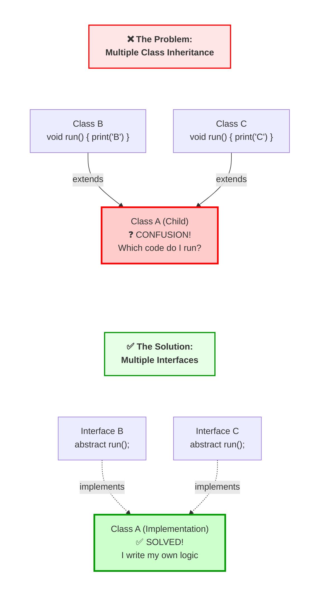

# Lesson 4 (Part 1): Modifiers & Access Specifiers

**(المعدلات ومحددات الوصول)**

#### 1. The Matrix of Control

**(مصفوفة التحكم)** **(Slides 166 - 167)**

##### 📖 The Surface (السطح / الظاهر)

الجافا بتقدم مجموعة من الكلمات المفتاحية (Keywords) بنسميها **Modifiers**، وظيفتها تغير سلوك الكلاسات، الميثودز، والمتغيرات. Slide 167 بتعرض جدول ضخم، تعال نقسمه لنوعين رئيسيين:

1. **Access Specifiers (محددات الوصول):** دول اللي بيحددوا "مين يقدر يشوف مين". وهم: `public`, `protected`, `private`, و الـ (friendly/default).
2. **Non-Access Modifiers (معدلات غير متعلقة بالوصول):** دول بيغيروا "السلوك" نفسه. وهم: `static`, `final`, `abstract`, `native`, `transient`, `volatile`, `synchronized`.

##### 🧠 The Deep Dive: The Philosophy of Encapsulation (فلسفة الكبسولة)

ليه بنخفي البيانات؟ تخيل الـ **CPU** (أو البرنامج بتاعك) عبارة عن مصنع كبير.

- **Public (العام):** البوابة الرئيسية. عربيات النقل (الكلاسات التانية) تقدر تدخل وتخرج عادي.
- **Private (الخاص):** الخزنة اللي فيها "الخلطة السرية". محدش يقدر يفتحها غير صاحب المصنع بس (الكلاس نفسه - `this`).
- **Protected (المحمي):** استراحة الموظفين. محدش يدخلها غير الموظفين (Subclasses - الوراثة) أو الناس اللي شغالة في نفس المبنى الإداري (Package).

###### The "Friendly" (Default) Mode

**(الوضع الافتراضي / الودود)** لو مكتبتش أي keyword قبل المتغير (مثلاً: `int x;`)، الجافا بتعين **Default Access** (والمشهور باسم "Friendly").

- **النطاق (Scope):** أي كلاس موجود في **نفس الـ Package** يقدر يشوف المتغير ده.
- **الخطر (Danger):** لو قررت تنقل الكلاس بتاعك لـ Package تانية، الكود بتاعك فجأة هيضرب (Breaks)، لأن "صحابك" اللي في الـ Package القديمة مبقوش شايفينك.

---

#### 2. The Advanced Modifiers (Under the Hood)

**(المعدلات المتقدمة - ما وراء الكواليس)** **(Slide 167)**

السلايد دي فيها "تقال الوزن". كمهندس سينيور، لازم تكون فاهم تأثير الكلمات دي على الـ **Memory** والـ **CPU**:

- **`static` (ثابت/ساكن):**
    
    - **تحسين الذاكرة:** المتغير ده بيتخزن في منطقة خاصة اسمها **Metaspace** (أو PermGen في النسخ القديمة)، ومش في الـ Heap مع كل Object.
    - **العدد:** توجد منه **نسخة واحدة فقط** على مستوى التطبيق كله، مهما عملت `new Objects`.
- **`final` (نهائي):**
    
    - **مع المتغير (Variable):** بيبقى ثابت (Constant). بيتخزن في الذاكرة للقراءة فقط (Read-Only Conceptually).
    - **مع الميثود (Method):** ممنوع يتعملها Override. ده بيدي أداء أسرع (Static Binding).
    - **مع الكلاس (Class):** ممنوع تورث منه (Inheritance Forbidden). ده بيستخدم للأمان (زي كلاس `String`، عشان محدش يعمل هاك عليه).
- **`transient` (عابر):**
    
    - بيستخدم في الـ **Serialization**.
    - لو عندك أوبجيكت بتسيفه في ملف (File) أو بتبعته عبر الشبكة، وعايز حقل معين (زي `password`) **مايتسيفش** مع الأوبجيكت، علمه بـ `transient`. الجافا هتتجاهله وتخليه `null` عند الاسترجاع.
- **`volatile` (متطاير):** ⚠️ **مهم جداً للـ Multi-threading**
    
    - المتغير العادي الـ CPU ممكن يخزنه في الـ **Cache** بتاع البروسيسور (L1/L2 Cache) عشان السرعة.
    - كلمة `volatile` بتجبر الـ CPU إنه يقرأ المتغير ده دايماً من الـ **RAM الرئيسية** (Main Memory) مباشرة، ويتجاهل الكاش.
    - **النتيجة:** بتضمن إن كل الـ Threads شايفة أحدث قيمة للمتغير ده (Visibility Guarantee).
- **`native` (أصلي):**
    
    - الميثود دي مش مكتوبة بجافا! دي بتنط بره الـ JVM عشان تنفذ كود مكتوب بـ **C** أو **C++** (باستخدام JNI).
- **`synchronized` (متزامن):**
    
    - بتحط "قفل" (Lock/Mutex) على الأوبجيكت.
    - بتسمح لـ Thread واحد بس إنه يدخل ينفذ الكود في المرة الواحدة (عشان ميبوظوش الداتا).

---

#### 3. Analogy: The Office Building 🏢

**(تشبيه: مبنى الشركة)**

عشان تثبت المعلومة في دماغك:

- **public:** موظف الاستقبال (Reception). أي حد من الشارع يقدر يدخل يكلمه.
- **protected:** مكاتب الموظفين (Cubicles). محتاج كارنيه موظف (Inheritance) أو تكون شغال في نفس المبنى (Package) عشان تدخل.
- **private:** حمام المدير التنفيذي (CEO's bathroom). المدير بس (الكلاس نفسه) اللي معاه المفتاح.
- **static:** ساعة الحائط اللي في الصالة. فيه منها واحدة بس، وكل الموظفين بيبصوا على نفس الساعة في نفس الوقت.
- **final:** أساسات المبنى الخرسانية. مينفعش تحركها ولا تغيرها بعد ما اتصبت.

---

#### 4. Initialization Blocks (The "Free Floating" Blocks)

**(كتل التهيئة - الكتل العائمة)** **(Slides 168 - 169)**

##### 📖 The Surface (السطح)

أنت عارف الـ Constructors طبعاً. بس هل تعرف إنك تقدر تكتب كود جوه الكلاس بس **مش جوه أي ميثود**؟

1. **Static Block `static { }`**: بيشتغل **مرة واحدة فقط** أول ما الكلاس يتحمل في الميموري (Class Loading).
2. **Instance Block `{ }`**: بيشتغل **كل مرة** بتعمل فيها `new Object`، وتحديداً **قبل** الـ Constructor.

##### 💻 Code Autopsy: FreeBlocksExample

الكود ده حيوي جداً عشان تفهم **ترتيب التنفيذ (Order of Execution)** في الجافا.

_المصدر بيشرح السيناريو، وإليك الكود المتوقع للسيناريو ده:_

```java
public class FreeBlocksExample {
    // 1. Static Block
    static {
        System.out.println("Free floating block");
    }

    // 2. Instance Block
    {
        System.out.println("Common Construtor body");
    }

    // 3. Constructors
    public FreeBlocksExample() {
        System.out.println("Default constr");
    }

    public FreeBlocksExample(int x) {
        System.out.println("Constrctor with one parameter");
    }

    public static void main(String[] args) {
        System.out.println("Main Starts");
        new FreeBlocksExample();
        new FreeBlocksExample(5);
    }
}
```

##### 🧠 The Deep Dive: Execution Flow (تدفق التنفيذ)

لما تشغل `java FreeBlocksExample`، ده اللي بيحصل بالترتيب الممل:

1. **ClassLoader:** بيلاقي الكلاس وبيحمله في الميموري.
2. **`static { }` executes:** أول حاجة بتضرب.
    - _Output:_ `"Free floating block"` (مرة واحدة بس).
3. **`main` starts:** الميثود الرئيسية بتبدأ.
4. **`new FreeBlocksExample()` called:**
    - حجز مساحة في الـ Heap.
    - **`Instance Block { }` executes:** (قبل الكونستركتور).
        - _Output:_ `"Common Construtor body"`
    - **`Constructor` executes:**
        - _Output:_ `"Default constr"`
5. **`new FreeBlocksExample(5)` called:**
    - **`Instance Block { }` executes:** (تاني مرة).
        - _Output:_ `"Common Construtor body"`
    - **`Constructor` executes:** (الكونستركتور التاني).
        - _Output:_ `"Constrctor with one parameter"`

---

#### 5. Senior Touch / Pro Tips

**(لمسات السينيور / نصائح المحترفين)**

> [!TIP] **فخ الـ "Friendly" (The Friendly Trap)** المطورين الجونيور بينسوا يكتبوا Access Specifier: `class User { String name; }` كده `name` بقى **Package-Private**.
> 
> - **الخطر:** لو عملت Test Class في نفس الـ Package، الكلاس ده يقدر يغير الـ `name` براحته ويكسر الـ Encapsulation. لو عايز حماية حقيقية، دايماً اكتب **`private`**.

> [!WARNING] **لا تفرط في استخدام الـ Static Blocks** الـ `static { }` حلو عشان تهيئ `Maps` معقدة أو تحمل `Drivers` للداتابيز. لكن الإفراط فيه بيخلي الكود صعب جداً في الـ Unit Testing، لأن الحالة (State) بتفضل "لازقة" في الميموري طول ما الـ JVM شغال ومبتتمسحش بين الاختبارات.

> [!NOTE] **Instance Blocks vs Constructors** نادراً ما هتشوف **Instance Blocks `{ }`** في كود الشركات الحديث.
> 
> - **ليه؟** عادةً بنحط الكود المشترك في ميثود `private void init()` ونناديها من كل الكونستركتورز. ده مقروء أكتر.
> - **الاستثناء:** الـ Instance Blocks ضرورية جداً مع **Anonymous Inner Classes** (اللي هندرسها بعدين)، لأن الكلاسات المجهولة **مفيش ليها Constructors**، فالحل الوحيد لتهيئتها هو البلوك ده.

---
تمام يا هندسة، واصلين. 🫡 زي ما اتفقنا، هنكمل دلوقتي مع **Lesson 4 (Part 2)**. الجزء ده بيبان سهل نظرياً، بس عملياً هو ده اللي بيفرق بين كود "الطلاب" وكود "الشركات". هنتكلم عن تنظيم الملفات (Packages) وإزاي ده بيأثر بشكل جوهري على الأمان (Security).

---

# Lesson 4 (Part 2): Packages & Organization

**(الحزم والتنظيم)**

#### 1. Why Packages? (The Namespace Problem)

**(ليه بنحتاج حزم؟ - مشكلة تضارب الأسماء)** **(Slides 170 - 171)**

##### 📖 The Surface (السطح)

- **المشكلة:** تخيل إنك شغال في مشروع كبير مع 50 مبرمج. أنت عملت كلاس سميته `User`، وزميلك في الفريق التاني عمل كلاس سماه `User`. لما تيجوا تشغلوا المشروع، الـ Compiler هيصرخ لأنه مش عارف يقصد انهي `User` فيهم. ده بنسميه **Name Collision**.
- **الحل:** الـ **Package** هي الحل. هي بتقسم المشروع لـ "حاويات" أو "أقسام" منفصلة. بتشتغل كآلية للتسمية (Naming) وآلية للتحكم في الرؤية (Visibility).

##### 💡 Analogy: The Surname (تشبيه: اسم العائلة)

- **بدون Packages:** زي ما تنادي في استاد مليان ناس وتقول "يا أحمد!". 500 واحد هيبصولك. فوضى.
- **مع Packages:** زي ما تنادي "يا أحمد اللي من عيلة **الغندور**". شخص واحد بس هيرد.
    - الـ Package هي "اسم العيلة" بتاع الكلاس.
    - الاسم الكامل للكلاس (Fully Qualified Name) بيبقى `family.name.ClassName`.

---

#### 2. Defining a Package & File System

**(تعريف الحزمة ونظام الملفات)** **(Slides 172 - 173)**

##### 📖 The Surface (السطح)

عشان تحط كلاس جوه Package، لازم أول سطر في ملف الجافا بتاعك يكون `package name;`.

##### 💻 Code Autopsy (تشريح الكود)

```java
// Line 1: The Declaration
package mypackage; // لازم تكون أول جملة (بعد الكومنتات)

public class MyClass {
    // ...
}
```

##### 🧠 The Deep Dive: The Hard Drive Mapping (الغوص العميق)

المبتدئين دايماً بيتلخبطوا هنا. الجافا بتربط الـ Logical Structure (اسم الباكيج) بالـ Physical Structure (الفولدرات) بشكل صارم.

1. **حساسية الأحرف (Case Sensitive):** لو كتبت `package MyPackage;`، لازم الفولدر يكون اسمه `MyPackage` بالحرف الكبير.
2. **التسلسل الهرمي (Hierarchy):**
    - لو كتبت: `package a.b.c;`
    - الـ JVM هتتوقع تلاقي الملف في المسار ده: `.../a/b/c/MyClass.class`.
    - لو حطيت الملف في فولدر تاني، الـ Compiler هيضرب `NoClassDefFoundError` وقت التشغيل حتى لو عمل Compile صح.

##### 👨‍🏫 Senior Touch / Pro Tips (لمسة السينيور)

> [!TIP] **عرف الشركات (Naming Convention)** الشركات بتستخدم **اسم الدومين معكوس** كاسم للباكيج عشان تضمن العالمية (Uniqueness).
> 
> - **Google:** بتسمي `com.google.search...`
> - **ITI:** بتسمي `eg.gov.iti.course...` ده بيضمن إن لو دمجت مكتبة من جوجل مع مكتبة من ITI، مستحيل يحصل تضارب في الأسماء.

> [!WARNING] **فخ الباكيج الافتراضي (The Default Package Trap)** إوعى تسيب الكلاس بتاعك "سايح" من غير سطر `package`. ده بيحطه في حاجة اسمها **Default Package**.
> 
> - **المشكلة:** الكلاسات اللي جوه Named Packages **متقدرش تعمل Import** لكلاس موجود في الـ Default Package. ده طريق مسدود في المشاريع الحقيقية.

---

#### 3. Access Control Matrix (The Security Law)

**(مصفوفة التحكم في الوصول)** **(Slides 175 - 177)**

دي أهم نقطة في الدرس كله. الباكيجز بتضيف طبقة حماية جديدة للكود.

##### 📊 المخطط الهندسي (The Matrix Table)

احفظ الجدول ده زي اسمك (من Slide 177):

|الموقع (Location)|private 🔒|default (friendly) 🤝|protected 🛡️|public 🌍|
|:--|:-:|:-:|:-:|:-:|
|**نفس الكلاس (Same Class)**|✅|✅|✅|✅|
|**نفس الباكيج (Same Package)**|❌|✅|✅|✅|
|**باكيج مختلف (Subclass)**|❌|❌|✅ (بشروط)|✅|
|**باكيج مختلف (World/Stranger)**|❌|❌|❌|✅|

##### 🧠 The Deep Dive: The `protected` Trap (فخ المحمي)

الـ `protected` هو أكتر واحد بيخدع المطورين.

- **القاعدة:** `protected` يعني "رؤية داخل الباكيج" + "رؤية للورثة (Inheritance)".
- **الفخ:** لو عندك كلاس `Parent` في باكيج A، وكلاس `Child` في باكيج B.
    - الـ `Child` يقدر يشوف الـ `protected member` بتاع أبوه، بس **فقط** من خلال الوراثة (`super.member` أو `this.member`).
    - الـ `Child` **لا يمكنه** عمل أوبجيكت جديد `Parent p = new Parent();` ومحاولة الوصول لـ `p.member`. الجافا بتعتبر ده وصول "غريب" (Stranger Access) مش "عائلي".

---

#### 4. Importing Packages

**(استيراد الحزم)** **(Slide 178)**

##### 📖 The Surface (السطح)

عشان تستخدم كلاس من باكيج تاني، لازم تعملّه `import`.

- **المكان:** بعد سطر `package` وقبل سطر `class`.

##### 💻 Code Autopsy

```java
package mygame;

// Import specific class (Best Practice)
import java.util.ArrayList;

// Import everything in the package (Lazy way)
import java.awt.*;

public class Game { ... }
```

##### 👨‍🏫 Senior Touch / Pro Tips (لمسة السينيور)

> [!TIP] **لا تستخدم النجمة `.*` بجهل** استخدام `import java.util.*;` مريح، بس ممكن يعمل مشاكل (Collisions).
> 
> - **مثال:** `java.util.Date` و `java.sql.Date`.
> - لو عملت Import للاثنين بالـ wildcard `*`، وجيت تكتب `Date d = new Date();`، الـ Compiler هيصرخ ويقولك "تقصد انهي واحدة؟".
> - ساعتها هتضطر تكتب الاسم الكامل: `java.util.Date myDate = ...`

---

#### 5. Standard Java SE Packages (The Toolkit)

**(مكتبات الجافا القياسية)** **(Slides 179 - 180)**

الجافا بتيجي بـ "عدة شغل" (Library) ضخمة جاهزة. الجدول ده (Slide 180) بيعرفك أهمهم:

|اسم الباكيج|الوظيفة|ملاحظة سينيور|
|:--|:--|:--|
|**`java.lang`**|الأساسيات (String, Math, System).|**بيتعملها Import أوتوماتيك.** مش محتاج تكتبها.|
|**`java.util`**|أدوات مساعدة (Collections, Date, Random).|دي "السكينة السويسري" بتاعتك.|
|**`java.io`**|المدخلات والمخرجات (File, Streams).|للتعامل مع الهارد والشبكات.|
|**`java.net`**|الشبكات (Sockets, URLs).|لبرمجة تطبيقات الويب والاتصالات.|
|**`java.awt`**|واجهات رسومية (GUI) قديمة.|الأساس لـ Swing، بس نادراً ما تستخدم لوحدها دلوقتي.|

---
# Lesson 4 (Part 3): Interfaces

**(الواجهات - عقود البرمجة)**

#### 1. What is an Interface? (The Philosophy)

**(ما هي الواجهة؟ - الفلسفة)** **(Slides 182 - 183)**

##### 📖 The Surface (السطح)

الـ **Interface** هي مجموعة من الميثودز المجردة (Abstract Methods) - يعني ميثودز من غير جسم (body). هي شبه الـ Abstract Class، لكنها "نقية" (Pure).

- هي بتحدد **إيه** المفروض يتعمل (WHAT).
- هي ملهاش دعوة **إزاي** هيتعمل (HOW).

##### 💡 Analogy: The USB Port 🔌 (تشبيه: مدخل الـ USB)

عشان تفهم الـ Interface صح، تخيل مدخل الـ USB في اللابتوب بتاعك.

- **The Interface (الواجهة):** شكل المدخل (مستطيل، 4 سنون). ده عبارة عن "عقد" (Contract). بيقول للأجهزة: _"لو عايزين تركبوا في اللابتوب، لازم يكون شكلكم كده"_.
- **The Implementation (التنفيذ):** الماوس، الكيبورد، الفلاشة، المروحة.
    - الماوس _بيبعت إحداثيات_.
    - الفلاشة _بتخزن داتا_.
    - هما شغالين بطرق مختلفة تماماً من جوه (الـ **HOW**)، بس كلهم بيركبوا في نفس المدخل (الـ **WHAT**) لأنهم التزموا بالعقد.

في الجافا، لما كلاس يقول `implements USB`، هو بيوعد الـ Compiler إنه هيشتغل كجهاز USB.

---

#### 2. Interface Syntax & Implicit Rules

**(نحو الواجهة والقواعد الضمنية)** **(Slide 184)**

دي الحتة اللي بتميز السينيور. لما بتكتب كود جوه Interface، الـ Compiler "بيمد إيده" في الكود وبيزود كلمات مفتاحية من ورا ضهرك.

##### 💻 Code Autopsy: What you write vs. What Java sees

**(ما تكتبه مقابل ما تراه الجافا)**

|اللي أنت بتكتبه|الحقيقة (اللي الـ Compiler بيحطه)|
|:--|:--|
|`int x = 10;`|`public static final int x = 10;`|
|`void run();`|`public abstract void run();`|

##### 🧠 The Deep Dive (الغوص العميق)

1. **Variables (المتغيرات):** في الـ Interface، المتغيرات هي **ثوابت (Constants)**.
    - هي `static` (لأن مفيش أوبجيكت من الإنترفيس يشيلها).
    - وهي `final` (ممنوع تتغير). بتستخدم عشان تخزن ثوابت مشتركة زي Error Codes.
2. **Methods (الميثودز):** هي ضمنياً `public`. دي نقطة حياة أو موت!
    - **الخطر:** لما تيجي تعمل `implements` للميثود دي في الكلاس بتاعك، **لازم** تكتب كلمة `public` بإيدك. لو مكتبتهاش، الجافا هتعتبرها `default` (friendly)، وكده أنت بتحاول تقلل رؤية الميثود من `public` لـ `default`، وده ممنوع في الوراثة. الكومبايلر هيرقعك Error فوراً.

---

#### 3. The Showdown: Interface vs. Abstract Class

**(المواجهة: الواجهة ضد الكلاس المجرد)** **(Slides 185 - 186)**

ده أشهر سؤال إنترفيو في العالم. إمتى أستخدم ده وإمتى أستخدم ده؟

##### The Logic (Meaning) / (المنطق والمعنى)

- **Abstract Class (`extends`):** بيمثل علاقة **"IS-A"** (هو يكون). بيحدد الهوية الأساسية للكائن.
    - _مثال:_ الكلب **هو** حيوان. العربية **هي** مركبة.
    - _الاستخدام:_ لما عايز تشارك **كود** (Common Logic) بين كلاسات قريبة من بعض في شجرة العيلة.
- **Interface (`implements`):** بيمثل علاقة **"CAN-DO"** (يستطيع أن يفعل). بيمثل قدرة أو دور (Capability/Role).
    - _مثال:_ الكلب **يقدر** يلعب. الروبوت **يقدر** يلعب. هما ملهمش علاقة ببعض وراثياً، بس مشتركين في "سلوك اللعب".
    - _الاستخدام:_ لما عايز تشارك **سلوك** (Method Signatures) بين كلاسات غير مرتبطة ببعضها.

##### 💻 The Code Comparison (مقارنة الكود)

|الميزة|Abstract Class|Interface (قبل Java 8)|
|:--|:--|:--|
|**الوراثة**|وراثية فردية (`extends A`)|تنفيذ متعدد (`implements A, B`)|
|**المتغيرات**|ممكن تكون `private`، `protected`، ومش `final`.|دايماً `public static final` (ثوابت).|
|**الكونستركتور**|**موجود** (لتهيئة الحالة/State).|**غير موجود** (ملهاش State).|
|**الميثودز**|ممكن يكون فيها كود فعلي (Concrete).|كلها `abstract` (بدون كود).|
|**الأداء**|أسرع قليلاً (Direct binding).|أبطأ قليلاً (Lookup).|

##### 👨‍🏫 Senior Touch: The "Diamond Problem" (مشكلة الجوهرة)

**(Slide 185)** ليه الجافا بتسمح بـ Multiple Interfaces بس بتمنع Multiple Inheritance للكلاسات؟

- **المشكلة:** لو Class A ورث من Class B و Class C، والاتنين عندهم ميثود `run()` بكود مختلف. Class A هيحتار: "أورث كود مين فيهم؟".
- **الحل:** الـ Interfaces (القديمة) مفيهاش كود (No Body). فمفيش حيرة. Class A مجبر يكتب الـ `run()` بتاعته هو. عشان كده "التعدد" مسموح هنا.


---

#### 4. Lecture Codes: The Series Example

**(أكواد المحاضرة: مثال المتسلسلة)** **(Slides 186 - 190)**

المثال بيبني نظام لتوليد سلاسل أرقام (زي 2, 4, 6 أو 3, 6, 9).

##### Step 1: The Contract (العقد)

```java
public interface Series {
    int getNext(); // هات الرقم الجاي
    void reset();  // ابدأ من الأول
    void setStart(int x); // حدد نقطة البداية
}
```

##### Step 2: Implementation (التنفيذ)

```java
class ByTwos implements Series {
    int start;
    int val;

    // لازم تكتب public هنا!
    public int getNext() {
        val += 2;
        return val;
    }
    // ... باقي الميثودز
}
```

الـ `ByTwos` بيمشي خطوتين، والـ `ByThrees` بيمشي تلاتة. الاتنين التزموا بنفس العقد `Series`.

---

#### 5. Polymorphism: The Power Move

**(تعدد الأشكال: حركة المحترفين)** **(Slide 191)**

دي أقوى نقطة في الدرس. تقدر تستخدم **اسم الإنترفيس** كنوع للمتغير المرجعي (Reference Variable).

##### 💻 Code Autopsy

```java
// بنعمل متغير مرجعي من نوع الإنترفيس
Series ob;

for (int i=0; i < 5; i++) {
    // السحر هنا: ob بيشاور مرة على ByTwos ومرة على ByThrees
    ob = new ByTwos();
    // ...
    ob = new ByThrees();
}
```

##### 🧠 The Deep Dive: "Program to an Interface" (برمج لواجعة)

ليه بنعمل كده؟ تخيل إنك بتبني لعبة. عندك `Monster` و `Villager` و `Hero`. كلهم بيعملوا `implements Movable`. تقدر تعمل `List<Movable>` وتمشيهم كلهم بلوب واحد: `ob.move()`. أنت مش مهتم هو وحش ولا بطل، أنت مهتم إنه "بيعرف يتحرك". ده بيخلي الكود بتاعك **Flexible** جداً. لو ضفت `Dragon` بكرة، اللوب بتاعتك هتشتغل عليه من غير تعديل!.

---

#### 6. General Considerations (Senior Tips)

**(اعتبارات عامة ونصائح سينيور)** **(Slide 191)**

1. **وراثة الإنترفيس:** إنترفيس ممكن يورث من إنترفيس تاني باستخدام `extends` (مش implements).
    - `interface B extends A { ... }`
2. **قاعدة التنفيذ (The Rule of Implementation):** لو الكلاس بتاعك عمل `implements B` (اللي بتورث من A)، الكلاس بتاعك مجبر ينفذ ميثودز **A و B مع بعض**. مينفعش تنفذ نص السلسلة وتسيب الباقي.

---


# Lesson 4 (Part 4): Default Methods in Interfaces

**(الطرق الافتراضية في الواجهات)**

#### 1. The Paradigm Shift (Breaking the Rules)

**(تغير النموذج - كسر القواعد)** **(Slide 193)**

##### 📖 The Surface (السطح)

قبل **Java 8**، لو حطيت جسم `{ ... }` لميثود جوه Interface، الكومبايلر كان بيصرخ في وشك. في **Java 8**، أصبح مسموح، بشرط استخدام كلمة **`default`**.

##### 💻 Code Autopsy: The New Syntax

```java
public interface MyInterface {
    // الطريقة القديمة (Abstract)
    void doWork();

    // الطريقة الجديدة (Default) - ليها جسم!
    default void doNewFeature() {
        System.out.println("Default logic here");
    }
}
```

##### 🧠 The Deep Dive: Why did they do this? (The Crisis)

**(الغوص العميق: ليه عملوا كده؟ - الأزمة)** ليه الجافا كسرت أهم قاعدة عندها؟ السبب هو **Streams API**. في Java 8، أوراكل كانت عايزة تضيف ميثود جديدة اسمها `stream()` لإنترفيس `List`.

- **المشكلة:** لو ضافوها كـ `abstract method`، كل مشاريع الجافا في العالم اللي اتكتبت من سنة 1995 وعاملة `implements List` هتضرب (Fail to compile) لأنها معملتش implement للميثود الجديدة دي.
- **الحل:** الطرق الافتراضية (Default Methods).
    - ضافوا `default stream() { ... }` في الإنترفيس نفسه.
    - الكود القديم تجاهلها واشتغل عادي (Backward Compatibility).
    - الكود الجديد يقدر يستخدمها.
    - كانت "حيلة" ذكية عشان ينقذوا الجافا من إنها تكسر نفسها.

---

#### 2. Inheritance Rules (The Three Choices)

**(قواعد الوراثة - الاختيارات الثلاثة)** **(Slides 194 - 197)**

لما تورث (أو تنفذ) إنترفيس عنده `default method`، عندك 3 خيارات:

1. **Option A: Inherit it (الوراثة الصامتة):**
    - متعملش حاجة خالص. الكلاس بتاعك هيورث الكود اللي في الإنترفيس ويستخدمه زي ما هو.
2. **Option B: Override it (إعادة التعريف):**
    - مش عاجبك السلوك الافتراضي؟ اكتب الميثود تاني في الكلاس بتاعك وغير الكود براحتك.
3. **Option C: Abstract it (زرار الريسيت):**
    - دي حركة خبيثة. تقدر في `abstract class` أو `interface` ابن، تعيد تعريف الميثود وتخليها `abstract` تاني.
    - ده بيجبر أي حد يورث منك إنه يكتب الكود بنفسه، ويلغي السلوك الافتراضي.

---

#### 3. The "Diamond Problem" (The Debate)

**(مشكلة الجوهرة - الجدل السينيور)** **(Slides Mentioned in logic)**

##### 🛑 The Problem (المشكلة)

الجافا بتمنع الوراثة المتعددة للكلاسات (`extends A, B`) عشان تمنع التضارب. طب ما الإنترفيس بيسمح بالتعدد، ودلوقتي بقى فيه كود! لو `Class C implements A, B`، والاتنين عندهم `default void run()`... الكلاس هيشغل مين؟

##### ✅ The Fix (الحل)

الكومبايلر هيطلع Error ويجبرك تعمل **Override** في `Class C` وتختار بنفسك:

```java
// لازم تختار يدوي
public void run() {
    A.super.run(); // اختار تنفيذ A
    // أو
    B.super.run(); // اختار تنفيذ B
}
```

##### 💡 Analogy: The Rental Car 🚗 (تشبيه: العربية الإيجار)

- **Old Interface:** عقد إيجار بيقول "لازم ترجع العربية ببانزين". (مش بيقولك تمون إزاي).
- **Default Method:** العقد الجديد بيقول "لازم ترجع العربية. وافتراضياً، هنخصم 50 دولار تمن البانزين لو ممونتش".
    - **خيار A:** سيبها وهتتخصم منك (Default).
    - **خيار B:** مونها بنفسك ووفر الفلوس (Override).

---

# Lesson 4 (Part 5): The Modern Interface & Callbacks

**(الواجهة الحديثة والـ Callbacks)**

#### 1. Static Methods in Interfaces

**(الميثودز الستاتيك في الواجهات)** **(Slide 198)**

##### 📖 The Surface (السطح)

في **Java 8**، تقدر تكتب ميثود `static` بجسم كامل جوه الإنترفيس.

- **السلوك:** تابعة للإنترفيس نفسه، مش للكلاس اللي بينفذه.
- **الاستدعاء:** لازم تناديها باسم الإنترفيس: `InterfaceName.method()`. مينفعش تناديها عن طريق أوبجيكت.

##### 🧠 The Deep Dive: The Death of "Utility Classes"

**(موت كلاسات المساعدة)** زمان، كنا بنعمل إنترفيس `Path`، وعشان نحط دوال مساعدة (Helpers) كنا بنعمل كلاس تاني اسمه `PathUtils` أو `Paths` (الجمع).

- مثال: `Collection` (إنترفيس) و `Collections` (كلاس مساعد مليان static methods).
- **الفلسفة الجديدة:** دلوقتي مش محتاجين الكلاس المساعد. حط الـ helpers كـ `static methods` جوه الإنترفيس نفسه. الكود بقى أنضف ومترتب في مكان واحد.

---

#### 2. Private Interface Methods

**(الميثودز الخاصة في الواجهات)** **(Slides 199 - 204)**

##### 📖 The Surface (السطح)

ظهرت في **Java 9**. تقدر تكتب ميثود `private` جوه الإنترفيس.

- **الرؤية:** متشافة بس جوه ملف الإنترفيس.
- **الهدف:** منع تكرار الكود (Code Duplication) بين الـ Default Methods.

##### 🧠 The Deep Dive: The "DRY" Rule

**(قاعدة لا تكرر نفسك)** لو عندك 2 default methods بيعملوا 90% نفس الشغل، بدل ما تاخد الكود Copy-Paste (وده عك)، أو تعمل ميثود `public` وتفضح تفاصيلك الداخلية للناس (وده خطر)، بتعمل ميثود `private` تشيل اللوجيك المشترك ده.

---

#### 3. Interfaces and Callbacks (The Pattern)

**(نمط الـ Callbacks)** **(Slides 205 - 210)**

ده أهم نمط معماري (Architecture Pattern) في الجزء ده. لو فهمته، هتفهم الـ Swing والـ Android والـ Spring Events.

##### 📖 The Surface (السطح)

**Callback:** يعني تقول لميثود: "روحي اشتغلي، ولما تخلصي (أو لما يحصل حدث معين)، **كلميني** على الرقم ده". بما إن الجافا (قبل اللامبدا) مكنش ينفع تبعت فيها "دالة" كمتغير، كنا بنبعت **Object** بيعمل `implements` لإنترفيس معين.

##### 💡 Analogy: The Wake-Up Call 🛎️ (تشبيه: مكالمة الإيقاظ)

- **The Timer (موظف الاستقبال):** هو بيعرف يبص في الساعة.
- **The Callback:** أنت بتقوله "صحيني الساعة 7".
- **The Interface:** "التليفون" اللي في غرفتك. موظف الاستقبال ميهمش أنت مين (وزير، غفير، سائح)، هو يهمه إن عندك "تليفون" (Interface) يقدر يرن عليه.

##### 💻 Code Autopsy: The Timer Example

**(تحليل كود Timer - من السلايدز)**

1. **The Contract (العقد):**
    
    ```java
    interface ActionListener {
        void actionPerformed(ActionEvent e); // التليفون بيرن
    }
    ```
    
2. **The Wiring (التوصيل):**
    
    ```java
    // Timer Class (Java Library)
    // بياخد أوبجيكت من نوع ActionListener
    Timer t = new Timer(1000, myObject);
    ```
    
3. **The Execution (التنفيذ):** كل 1000 مللي ثانية، الـ Timer هيروح لـ `myObject` وينادي `actionPerformed()`. هو ميعرفش الكلاس بتاعك، هو يعرف الإنترفيس بس. ده قمة الـ **Loose Coupling**.

---

# Lesson 8 (Part 1): Functional Interfaces

**(الواجهات الوظيفية)** **(Slides 211 - 221)**

دخلنا في الجد. ده الأساس اللي اتبنى عليه الـ **Lambda Expressions** والـ **Streams**.

#### 1. What is a Functional Interface? (The SAM Rule)

**(قاعدة الميثود الواحدة)** **(Slides 211 - 215)**

##### 📖 The Surface (السطح)

الـ **Functional Interface** هو إنترفيس فيه **ميثود Abstract واحدة فقط لا غير**.

- بنسميه **SAM** (Single Abstract Method).
- **Annotation:** بنحط فوقه `@FunctionalInterface`. دي مش إجبارية، بس بتخلي الكومبايلر يحميك: لو ضفت ميثود تانية بالغلط، يطلع Error.

##### 🧠 The Deep Dive: The "Object" Loophole

**(الغوص العميق: ثغرة الـ Object)** _(سؤال إنترفيو خبيث - Slide 215)_ بص على الكود ده:

```java
@FunctionalInterface
interface MyFunc {
    void doWork();           // Abstract Method 1
    String toString();       // Abstract Method 2 (??)
    boolean equals(Object o); // Abstract Method 3 (??)
}
```

- **هل ده Valid؟** الإجابة: **أيوة Valid جداً!** ✅
- **السبب:** الميثودز الـ `public` الموجودة في كلاس `java.lang.Object` (زي toString, equals) **لا تحتسب**.
- **التفسير:** أي كلاس هيعمل `implements MyFunc` هو غصب عنه وارث من `Object`، فبالتالي الميثودز دي مضمون إنها موجودة. الكومبايلر بيتجاهلها في العد.

---

#### 2. The Java 8 Toolbox (java.util.function)

**(صندوق أدوات جافا 8)** **(Slides 219 - 220)**

الجافا قالت: "المطورين كل شوية يعملوا إنترفيس يسموه `MyAction` و `MyCheck`. إحنا هنوحد المقامات". عملوا باكيج جاهزة فيها أهم 4 إنترفيسات هتحتاجهم في حياتك. **احفظ الجدول ده صم:**

|الإنترفيس|الدالة|الوظيفة (Role)|المثال الشعبي|
|:--|:--|:--|:--|
|**`Predicate<T>`**|`boolean test(T t)`|**المحقق (Bouncer):** بياخد أوبجيكت ويسأله سؤال (نعم/لا).|هل الرقم ده زوجي؟ هل اليوزر ده أدمن؟|
|**`Consumer<T>`**|`void accept(T t)`|**الثقب الأسود (Black Hole):** بياخد داتا ويستهلكها (طباعة، داتابيز) وميرجعش حاجة.|اطبع الاسم ده. ابعت الإيميل ده.|
|**`Supplier<T>`**|`T get()`|**المصنع (Factory):** مش بياخد حاجة، بس بينتج أوبجيكت.|هاتلي رقم عشوائي. هاتلي الوقت الحالي.|
|**`Function<T,R>`**|`R apply(T t)`|**المحول (Transformer):** بياخد Input ويحوله لـ Output من نوع تاني.|حول النص لرقم. استخرج الاسم من اليوزر.|

---

#### 3. Lab Exercise: Functional Interfaces

**(تمرين المعمل)** **(Slide 221)**

> [!NOTE] **المهمة (The Mission)**
> 
> 1. حول درجة الحرارة من مئوية لـ فهرنهايت باستخدام `Function`.
> 2. حل المعادلة التربيعية ($ax^2 + bx + c = 0$).

##### Task 2: Quadratic Equation (The Wrapper Trick)

**(حل المعادلة التربيعية - خدعة التغليف)**

- **التحدي:** الـ `Function<T, R>` بتاخد مدخل **واحد** (T). المعادلة محتاجة 3 مدخلات (a, b, c).
- **الحل السينيور:** نغلف الـ 3 متغيرات في كلاس واحد (أو مصفوفة) ونبعته.

```java
// 1. Define the Wrapper (DTO)
class QuadraticInput {
    double a, b, c;
    public QuadraticInput(double a, double b, double c) { ... }
}

// 2. Define the Function
Function<QuadraticInput, String> solver = (in) -> {
    double delta = (in.b * in.b) - (4 * in.a * in.c);
    if (delta > 0) return "Two Roots";
    else if (delta == 0) return "One Root";
    else return "No Real Roots";
};

// 3. Execution
System.out.println(solver.apply(new QuadraticInput(1, -5, 6)));
```

---

**بكده نكون قفلنا Lesson 4 تماماً وقطعنا شوط كبير في Lesson 8 Part 1.** المرة الجاية هندخل في **Lesson 9: Streams API**، وده المكان اللي كل القطع (Functional Interfaces + Lambdas) بتتركب فيه مع بعض عشان تعمل السحر.

**أكمل يا هندسة؟** 🚀

---
تمام يا هندسة. بما إننا قفلنا شرح الـ **Functional Interfaces** واللاب بتاعها، ناقصنا بس "مسك الختام" للملف ده. فيه جزء جوهري في المصادر (Source) بيسموه **"Senior Beast Mode Advice"**، وده هو "كلمة السر" اللي هتربط كل اللي فات باللي جاي (Streams).

لازم تفهم الجزء ده كويس جداً قبل ما ننقل للملف الجديد، لأنه هو الأساس اللي هيخليك تفهم "سحر" الـ Streams ومتبقاش مجرد حافظ كود.

---

# Lesson 8 (Part 1): Conclusion & The Senior Insight

**(خاتمة الدرس 8 - رؤية السينيور)**

#### 1. The "Beast Mode" Advice 🦁

**(نصيحة الوحش)** **(Source: Slide)**

اسمع كويس يا هندسة. ليه أنا (والمصادر) بنقول إن درس الـ **Functional Interfaces** هو الأصعب والأهم؟ لأن الـ **Generic Functional Interfaces** هي المحرك الخفي وراء الـ **Java Streams** (اللي هو Lesson 9 الجاي).

لما تشوف كود زي ده في المستقبل القريب:

```java
list.stream()
    .filter(x -> x > 10)
    .map(x -> x * 2)
    .forEach(System.out::println);
```

لو أنت مش فاهم الجدول اللي فات، الكود ده هيبان لك "سحر" (Magic). بس بما إنك سينيور دلوقتي، أنت عارف الحقيقة:

1. **`.filter()`**: دي ميثود مستنية **Predicate** (يعني بتسأل "أيوة ولا لأ؟").
2. **`.map()`**: دي ميثود مستنية **Function** (يعني بتقول "حول الداتا دي لـ دي").
3. **`.forEach()`**: دي ميثود مستنية **Consumer** (يعني بتقول "خد الداتا دي واعمل بيها حاجة").

أنت مش بتبعت "كود"؛ أنت بتبعت **Blocks of Logic** صغيرة (اللي هي الـ Functional Interfaces) جوه ماسورة البيانات (Pipeline).

---

#### 2. The Cheat Sheet (Summary Table)

**(البرشامة - جدول الملخص)** **(Source: Slide)**

ده الجدول اللي لازم يكون محفور في ذاكرتك قبل ما ندخل في الـ Streams. ده ملخص "العدة" بتاعتك:

|اسم الإنترفيس (Interface)|الميثود (Method)|الوظيفة (Purpose)|مثال من العالم الحقيقي|
|:--|:--|:--|:--|
|**Predicate**|`boolean test(T)`|**فلترة / فحص**|بودي جارد (يدخل / ميدخلش)|
|**Consumer**|`void accept(T)`|**طباعة / حفظ**|سلة مهملات / طابعة (بياخد ومبيرجعش)|
|**Supplier**|`T get()`|**توليد / إنشاء**|مصنع / مكنة ATM (بيدي ومبياخدش)|
|**Function<T,R>**|`R apply(T)`|**تحويل / خريطة**|فرن (بياخد عجين -> يطلع عيش)|

---

# Lab Exercise: Functional Interfaces

**(Slide 221)**

> [!NOTE] **The Mission**
> 
> 1. **Temperature Converter:** Convert Celsius to Fahrenheit using `Function<T, R>`.
> 2. **Quadratic Equation:** Solve $ax^2 + bx + c = 0$ using `java.util.function`.

---

## Task 1: Temperature Converter 🌡️

**The Requirement:** Use `Function<T, R>`.

- **Input (T):** Centigrade (`Double`).
- **Output (R):** Fahrenheit (`Double`).
- **Formula:** $F = (C \times 1.8) + 32$.

### 💻 Solution

```java
import java.util.function.Function;

public class TemperatureLab {
    public static void main(String[] args) {

        // 1. Define the Logic as a Function Object
        // T = Double (Input), R = Double (Output)
        Function<Double, Double> toFahrenheit = (centigrade) -> (centigrade * 1.8) + 32;

        // 2. Execute the Logic (The "apply" method)
        Double c = 25.0;
        Double f = toFahrenheit.apply(c);

        System.out.println(c + "°C is equal to " + f + "°F");
        // Output: 25.0°C is equal to 77.0°F
    }
}
```

### 🧠 Senior Analysis

Why is this better than a normal method? Imagine you are building a flexible "Unit Converter" app. You can have a `Map<String, Function<Double, Double>>` where you store converters:

```java
converters.put("CtoF", c -> (c * 1.8) + 32);
converters.put("KtoC", k -> k - 273.15);
converters.put("MtoF", m -> m * 3.28);
```

You are storing **behavior** in a data structure. That is the power of functional programming.

---

## Task 2: Quadratic Equation Solver 📐

**The Requirement:** Solve $ax^2 + bx + c = 0$. **The Challenge:** The `Function<T, R>` interface only accepts **ONE** argument (`T`). But a quadratic equation needs **THREE** inputs (`a`, `b`, `c`).

**The Solution:** We must cheat the system. We will bundle the three inputs into a single object (like an array or a custom class) and pass that single object to the function.

### 💻 Solution (Using an Array Wrapper)

We will pass a `double[]` array where:

- `index 0` = a
- `index 1` = b
- `index 2` = c

The output will be a `String` describing the roots.

```java
import java.util.function.Function;

public class QuadraticLab {
    public static void main(String[] args) {

        // INPUT: double[] {a, b, c}
        // OUTPUT: String (The solution)
        Function<double[], String> solver = (inputs) -> {
            double a = inputs;
            double b = inputs;
            double c = inputs;

            // 1. Calculate the Discriminant (delta)
            // formula: b^2 - 4ac
            double delta = (b * b) - (4 * a * c);

            // 2. Check conditions
            if (delta > 0) {
                // Two real roots
                double root1 = (-b + Math.sqrt(delta)) / (2 * a);
                double root2 = (-b - Math.sqrt(delta)) / (2 * a);
                return "Two Roots: " + root1 + " and " + root2;
            }
            else if (delta == 0) {
                // One root
                double root = -b / (2 * a);
                return "One Root: " + root;
            }
            else {
                // Negative delta means imaginary numbers (complex roots)
                return "No Real Roots (Complex Number)";
            }
        };

        // --- TEST CASES ---

        // Case 1: x^2 - 5x + 6 = 0  (Roots should be 3 and 2)
        double[] equation1 = {1, -5, 6};
        System.out.println("Eq 1: " + solver.apply(equation1));

        // Case 2: x^2 - 4x + 4 = 0 (Root should be 2)
        double[] equation2 = {1, -4, 4};
        System.out.println("Eq 2: " + solver.apply(equation2));
    }
}
```

### 👨‍🏫 Senior Touch / Pro Tips

> [!TIP] **Handling Multiple Arguments** In the real world, `Function` is limited to one argument and `BiFunction` is limited to two. If you need 3+ arguments, you have two professional choices:
> 
> 1. **The Wrapper Object (DTO):** Create a class `QuadraticInput { double a, b, c; }` and pass that. This is cleaner than `double[]` because names are explicit.
> 2. **Currying (Functional Purity):** This is advanced, but you can chain functions: `Function<Double, Function<Double, Function<Double, String>>>`. (Don't do this in Java unless you want your coworkers to hate you 😅).

---
## all codes:

### 1. أكواد مثال المتسلسلة (The Series Example)

**(المصدر: Slides 186 - 190)**

ده المثال الرئيسي لشرح الـ Interfaces. الكود متقسم لـ 4 أجزاء: العقد (Interface)، وتنفيذين مختلفين (Implementations)، وكلاس التشغيل.

#### أ. الواجهة (The Interface)

```java
// تعريف "العقد" اللي الكل لازم يلتزم بيه
public interface Series {
    int getNext();       // هات الرقم التالي
    void reset();        // صفر العداد
    void setStart(int x); // حدد نقطة البداية
}
```

#### ب. التنفيذ الأول: العد بالاثنين (ByTwos)

```java
class ByTwos implements Series {
    int start;
    int val;
    int prev; // عشان نخزن القيمة السابقة لو احتاجناها

    public ByTwos() {
        start = 0;
        val = 0;
        prev = -2;
    }

    // لازم تكون public عشان هي في الإنترفيس public ضمنياً
    public int getNext() {
        prev = val;
        val += 2; // الزيادة بـ 2
        return val;
    }

    public void reset() {
        val = start;
        prev = start - 2;
    }

    public void setStart(int x) {
        start = x;
        val = x;
        prev = x - 2;
    }

    // ميثود زيادة خاصة بالكلاس ده بس (مش في الإنترفيس)
    public int getPrevious() {
        return prev;
    }
}
```

#### ج. التنفيذ الثاني: العد بالثلاثة (ByThrees)

```java
class ByThrees implements Series {
    int start;
    int val;

    ByThrees() {
        start = 0;
        val = 0;
    }

    public int getNext() {
        val += 3; // الزيادة بـ 3
        return val;
    }

    public void reset() {
        val = start;
    }

    public void setStart(int x) {
        start = x;
        val = x;
    }
}
```

#### د. كلاس التشغيل (SeriesDemo)

```java
class SeriesDemo {
    public static void main(String[] args) {
        ByTwos twoOb = new ByTwos();
        ByThrees threeOb = new ByThrees();

        // استخدام المرجع من نوع Interface (Polymorphism)
        Series ob;

        for (int i=0; i < 5; i++) {
            ob = twoOb; // ob بيشاور على أوبجيكت ByTwos
            System.out.println("Next ByTwos value is " + ob.getNext());

            ob = threeOb; // ob بيشاور على أوبجيكت ByThrees
            System.out.println("Next ByThrees value is " + ob.getNext());
        }
    }
}
```

---

### 2. أكواد الطرق الافتراضية والخاصة (Modern Interface Codes)

#### أ. حل مشكلة الجوهرة (Diamond Problem Solution)

**(المصدر: Slides 194-197)** لما تورث من 2 interfaces عندهم نفس الـ default method.

```java
interface Alpha {
    default void reset() {
        System.out.println("Alpha Reset");
    }
}

interface Beta {
    default void reset() {
        System.out.println("Beta Reset");
    }
}

// الكلاس ده لازم يحل النزاع يدوياً
class MyClass implements Alpha, Beta {
    @Override
    public void reset() {
        // اختار واحد فيهم أو اكتب كود جديد
        Alpha.super.reset();
        // أو
        // Beta.super.reset();
    }
}
```

#### ب. الطرق الخاصة (Private Methods - Java 9+)

**(المصدر: Slides 200-202 - IntStack Example)** الكود ده بيوريك إزاي تمنع تكرار الكود جوه الـ Default Methods.

```java
interface IntStack {
    // ميثودز عادية (Abstract)
    void push(int item);
    int pop();

    // ميثود افتراضية بتستخدم لوجيك مشترك
    default int[] popElements(int n) {
        // بتنادي الميثود الـ private عشان تنفذ الشغل
        return getElements(n);
    }

    default int[] skipAndPop(int skip, int n) {
        // بتنادي نفس الميثود الـ private (إعادة استخدام الكود)
        for (int i = 0; i < skip; i++) {
             pop();
        }
        return getElements(n);
    }

    // Private Method: دي المستخبية اللي فيها اللوجيك الفعلي
    private int[] getElements(int n) {
        int[] elements = new int[n];
        for (int i = 0; i < n; i++) {
            // لاحظ: بتنادي pop() اللي هي abstract!
            // ده بيشتغل لأن الـ runtime object هو اللي هينفذها
            elements[i] = pop();
        }
        return elements;
    }
}
```

---

### 3. أكواد الواجهات الوظيفية العامة (Generic Functional Interfaces)

**(المصدر: Slides 216 - 218)**

ده الكود اللي بيشرح إزاي نعمل إنترفيس يقبل أي نوع (Generics) قبل ما نستخدم اللامبدا.

#### أ. التعريف (Definition)

```java
// T هو النوع العام (ممكن يكون Integer, String, Double...)
interface SomeTest<T> {
    boolean test(T n, T m);
}
```

#### ب. الاستخدام (Usage - الطريقة القديمة والجديدة)

```java
class GenericFunctionalInterfaceDemo {
    public static void main(String[] args) {

        // 1. استخدام مع Integer
        SomeTest<Integer> isFactor = (n, d) -> (n % d) == 0;

        if (isFactor.test(10, 2))
            System.out.println("2 is a factor of 10");

        // 2. استخدام مع Double
        SomeTest<Double> isFactorD = (n, d) -> (n % d) == 0.0;

        if (isFactorD.test(212.0, 4.0))
            System.out.println("212.0 is divisible by 4.0");

        // 3. استخدام مع String (قوة الـ Generics)
        SomeTest<String> isIn = (a, b) -> a.indexOf(b) != -1;

        String str = "Generic Functional Interface";
        if (isIn.test(str, "face"))
            System.out.println("'face' is found.");
    }
}
```

---

### 4. أكواد معامل الـ Lab (Lab Exercises Solutions) 🧪

**(المصدر: Slide 221 + Source)**

دي أهم جزئية للامتحان. حل اللاب كامل باستخدام `java.util.function`.

#### التمرين الأول: محول الحرارة (Temperature Converter)

المطلوب: تحويل مئوي لـ فهرنهايت باستخدام `Function<T, R>`.

```java
import java.util.function.Function;

public class TempConverter {
    public static void main(String[] args) {
        // T = Double (Input), R = Double (Output)
        Function<Double, Double> centigradeToFahrenheit = (c) -> {
            return (c * 1.8) + 32;
        };

        // تجربة الكود
        double c = 25.0;
        double f = centigradeToFahrenheit.apply(c);

        System.out.println(c + " Celsius is " + f + " Fahrenheit.");
        // Output: 25.0 Celsius is 77.0 Fahrenheit.
    }
}
```

#### التمرين الثاني: حل المعادلة التربيعية (Quadratic Equation)

المطلوب: حل المعادلة $ax^2 + bx + c = 0$. **التحدي:** `Function` بتاخد معامل واحد بس، والمعادلة محتاجة 3 (a, b, c). **الحل:** هنستخدم مصفوفة `double[]` كغلاف (Wrapper) نبعته للدالة.

```java
import java.util.function.Function;

public class QuadraticSolver {
    public static void main(String[] args) {

        // الدالة بتاخد مصفوفة double وبترجع نص String
        // Input: double[] where index 0=a, 1=b, 2=c
        Function<double[], String> solver = (coeffs) -> {
            double a = coeffs;
            double b = coeffs;
            double c = coeffs;

            // حساب المميز (Discriminant)
            double delta = (b * b) - (4 * a * c);

            if (delta > 0) {
                return "Two Real Roots";
            } else if (delta == 0) {
                return "One Real Root";
            } else {
                return "No Real Roots (Imaginary)";
            }
        };

        // تجربة 1: جذرين (x^2 - 5x + 6 = 0)
        double[] equation1 = {1, -5, 6};
        System.out.println("Eq 1: " + solver.apply(equation1));

        // تجربة 2: جذر واحد (x^2 - 2x + 1 = 0)
        double[] equation2 = {1, -2, 1};
        System.out.println("Eq 2: " + solver.apply(equation2));

        // تجربة 3: مفيش جذور (x^2 + x + 1 = 0)
        double[] equation3 = {1, 1, 1};
        System.out.println("Eq 3: " + solver.apply(equation3));
    }
}
```

كده يا هندسة معاك كل سطر كود اتذكر في الملفات دي من غير أي اختصار. بالتوفيق في الامتحان! 🚀