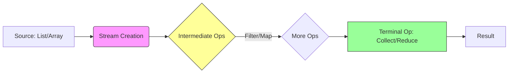
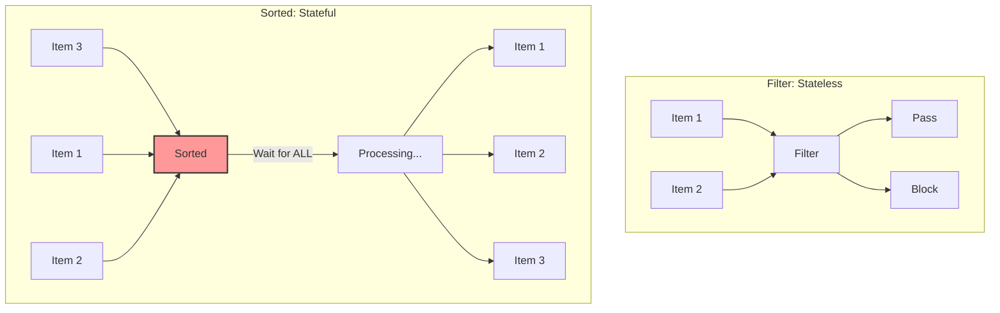
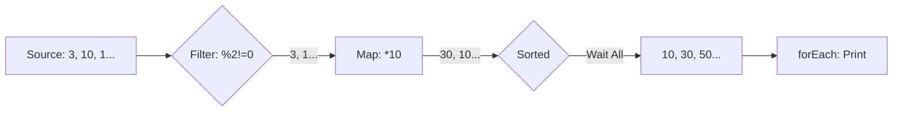
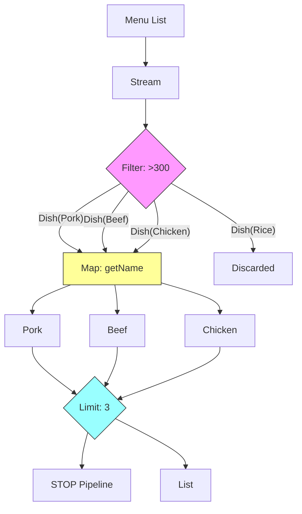

# Part 1: The Stream API Architecture

**(هندسة الـ Stream - خط الإنتاج الذكي)**

#### 1. The Stream Pipeline Concept 🏗️

**(مفهوم خط أنابيب الـ Stream)** **(Sources:,)**

##### 📖 The Surface (السطح 

أول قاعدة لازم تحفرها في دماغك: **الـ Stream مش Data Structure**. الـ Stream مش "مخزن" بيشيل الداتا زي الـ `List` أو الـ `Array`. هو عبارة عن **"سير ناقل" (Conveyor Belt)**. وظيفته يحرك الداتا من المصدر (Source)، يعديها على مراحل معالجة، ويسلمك النتيجة في الآخر. وبمجرد ما الـ Stream يخلص شغله، بيختفي. **لا يمكن إعادة استخدامه** (One-time use only).

##### 🧠 The Deep Dive: The Assembly Line Analogy

**(الغوص العميق: تشبيه خط التجميع)** **(Source:)** تخيل إننا في مصنع عربيات:

1. **Source (المصدر):** ده الصاج والمعدن الخام (اللي هو الـ `List` أو الداتا بتاعتك).
2. **Intermediate Operations (الروبوتات):** دي المحطات اللي في النص. روبوت بيلحم، روبوت بيدهن، روبوت بيركب الشبابيك. (دي عمليات زي `filter`, `map`).
3. **Terminal Operation (نقطة النهاية):** العربية بتخرج من الخط جاهزة. (دي النتيجة النهائية).

> [!NOTE] **The Golden Rule** لو مفيش معدن (Source)، الروبوتات مش هتشتغل. والأهم: لو مدوستش على زرار التشغيل في الآخر (Terminal Op)، السير مش هيتحرك أصلاً والروبوتات هتفضل واقفة مكانها.

##### 🧜‍♂️ Mermaid Visualization: The Pipeline Flow

**(المخطط الهندسي لتدفق البيانات - Slide 356)** **(Source:)**



---

#### 2. Intermediate Operations (The "Lazy" Ones) 😴

**(العمليات الوسيطة - العمليات الكسولة)** **(Sources:,,)**

##### 📖 The Surface (السطح)

العمليات دي (زي `filter`, `map`, `sorted`) بترجع **Stream جديد**. الميزة القاتلة هنا إنها **LAZY (كسولة)**. يعني إيه؟ لما تنادي `.filter()`، الجافا **مش بتنفذ الفلترة فعلياً** في ساعتها. هي بس بتكتب "ملحوظة" في النوتة بتاعتها: _"ابقى افتكر تفلتر الداتا دي بعدين لما يطلبوا النتيجة"_.

##### 🧠 The Deep Dive: Why Lazy? (Optimization)

**(الغوص العميق: ليه الكسل ده مفيد؟)** **(Source:)** الكسل ده هو سر تفوق الـ Stream API على الـ `for-loop` التقليدية. تخيل عندك قائمة فيها **مليون (1,000,000)** اسم، وأنت عايز تجيب **أول شخص** اسمه "عباس".

- **The Old Loop Way (الطريقة القديمة):** احتمال كبير تحمل المليون سجل كلهم في الميموري وتلف عليهم.
- **The Stream Way (طريقة ستريم):** الجافا بتعمل خط أنابيب ذكي:
    
    1. تسحب الاسم الأول. هل هو عباس؟ لأ.
    2. تسحب التاني. هل هو عباس؟ أيوة.
    3. **STOP (قف فوراً).**
    4. الجافا بتتجاهل الـ 999,998 اسم الباقيين تماماً.
    
    - العملية دي اسمها **Short-Circuiting** (الدارة القصيرة)، ودي بتوفر وقت وميموري بشكل مرعب.

---

#### 3. Debugging Streams (Pro Tip) 🕵️‍♂️

**(نصيحة سينيور: تصحيح أخطاء الـ Streams)** **(Source:,)**

بما إن الـ Stream عبارة عن سلسلة طويلة متصلة، الـ Debugging بتاعها رخم جداً لأنك مش عارف تحط Breakpoint في نص السطر بسهولة.

**الحل:** استخدم العملية الوسيطة `.peek()`.

- العملية دي عاملة زي "الجاسوس" (Spy).
- بتسمح لك تطبع العنصر وهو بيعدي من قدامك من غير ما تأثر على الـ Stream أو تغير فيه حاجة.

##### 💻 Code Autopsy: The Spy Method

```java
stream.filter(e -> e.length() > 3)
      .peek(e -> System.out.println("Passed Filter: " + e)) // الجاسوس بيطبع هنا
      .map(String::toUpperCase)
      .peek(e -> System.out.println("Passed Map: " + e))    // ونشوفه تاني هنا
      .collect(Collectors.toList());
```

---

# Part 2: Intermediate Operations (The Toolbox) 🛠️

**(العمليات الوسيطة - صندوق الأدوات)**

#### 1. The Golden Rule: Lazy & New Stream

**(القاعدة الذهبية: الكسل وتجديد التيار)** **(Source:)**

##### 📖 The Surface (السطح)

أي عملية وسيطة (`filter`, `map`, etc.) بتعمل حاجتين:

1. بترجع **Stream جديد** (عشان نقدر نكمل السلسلة).
2. بتكون **Lazy (كسولة):** يعني مابتنفذش أي كود في لحظتها. هي بس بتسجل "أمر شغل" هيتنفذ لما نضغط زرار التشغيل في الآخر.

---

#### 2. The Classification: Stateless vs. Stateful ⚖️

**(التصنيف: عديم الحالة مقابل ذو الحالة)** **(Sources:,)**

عشان تكون "Software Architect" شاطر، لازم تفرق بين نوعين من العمليات دي، لأن الفرق بينهم هو الفرق بين سيستم طيارة وسيستم بيزحف.

##### A. Stateless Operations (العمليات الخفيفة)

دي عمليات "سريعة النسيان". ميهمهاش غير العنصر اللي في إيدها دلوقتي.

- **مثال:** `filter`, `map`.
- **السلوك:** بتعدي البيانات عنصر بعنصر (One-by-one). مش محتاجة تعرف اللي قبلها ولا اللي بعدها.

##### B. Stateful Operations (العمليات المكلفة/الذاكرة)

دي عمليات "حشرية". لازم تشوف الداتا **كلها** قبل ما تخرج نتيجة واحدة.

- **مثال:** `sorted`, `distinct`.
- **السلوك:** بتوقف السير (Blocking). مينفعش ترتب أول 5 عناصر إلا لما تتأكد إن آخر عنصر (رقم مليون) مش أصغر منهم.

---

#### 3. The Intermediate Toolkit (Detailed Breakdown) 🧰

**(تفصيل صندوق الأدوات)** **(Sources:,,)**

الجدول ده بيجمع كل التفاصيل من الـ Slides مع تحليل السينيور لكل ميثود:

| العملية (Operation)     | النوع (Type) | الوظيفة (Description)                                      | تحليل السينيور (Senior Analogy)                                                                                                       |
| :---------------------- | :----------- | :--------------------------------------------------------- | :------------------------------------------------------------------------------------------------------------------------------------ |
| **`filter(Predicate)`** | Stateless    | بتعدي العناصر اللي الـ Lambda بترجعلها `true` بس.          | **The Bouncer (البودي جارد):** واقف على الباب، بيدخل الـ VIP بس ويطرد الباقي. سريعة جداً.                                             |
| **`map(Function)`**     | Stateless    | بتحول الداتا من نوع لنوع (مثلاً من `String` لـ `Integer`). | **The Alchemist (الخيميائي):** بيحول الرصاص لذهب. **ملحوظة:** العدد بيفضل ثابت، الشكل بس اللي بيتغير.                                 |
| **`distinct()`**        | **Stateful** | بتمسح التكرار (بتستخدم `equals` و `hashCode`).             | **The Memory Hog (غول الميموري):** عشان يعرف إن العنصر ده متكرر، لازم "يفتكر" كل العناصر اللي عدت عليه قبل كده.                       |
| **`sorted()`**          | **Stateful** | بترتب الـ Stream.                                          | **The Traffic Jam (زحمة المرور):** دي عملية Blocking. السير بيقف تماماً لحد ما كل العناصر توصل وتترتب، وبعدين يبدأ يتحرك تاني.        |
| **`limit(long n)`**     | Stateful     | بتقطع الـ Stream بعد عدد `n` من العناصر.                   | **The Stopwatch (ساعة الإيقاف):** بمجرد ما العداد يوصل لـ `n`، بتبعت إشارة "Stop" للمصدر (Short-Circuit).                             |
| **`skip(long n)`**      | Stateful     | بتطنش أول `n` عناصر وتكمل في الباقي.                       | **Pagination:** عكس `limit`. مفيدة جداً لو بتعمل صفحات (هاتلي الصفحة التانية).                                                        |
| **`peek(Consumer)`**    | Stateless    | بتعمل أكشن جانبي (زي الطباعة) من غير ما تأثر على الداتا.   | **The Spy (الجاسوس):** بتستخدم للـ Debugging بس. بتشوف الداتا وهي بتعدي من غير ما توقفها.                                             |
| **`flatMap(Function)`** | Stateless    | بتفك الهياكل المعقدة (Lists جوه Lists).                    | **The Steamroller (المكبس):** لو عندك `List<List<String>>`، الـ `map` هترجعلك ليستات، لكن `flatMap` هتسيحهم كلهم في Stream واحد مسطح. |

---

#### 4. 🧠 The Deep Dive: Visualization & Performance 🚀

**(الغوص العميق: التصور والأداء)** **(Sources:,)**

##### 🧜‍♂️ Mermaid Visualization: Sorted vs. Filter

**(مخطط انسيابي: الفرق بين الفلتر والترتيب - Source 11)**

شوف الفرق بين انسيابية الفلتر وعطلة الترتيب:



> [!WARNING] **Senior Warning: The Infinite Trap** **(Source:)** إياك تستخدم `sorted()` مع Stream لانهائي (Infinite Stream) أو ضخم جداً من غير ما تعمل `limit()` قبله. **السبب:** الجافا هتفضل تخزن الداتا في الميموري مستنية "النهاية" عشان ترتب... والنهاية مش هتيجي... فبيحصل **OutOfMemoryError**.

---

#### 5. 👨‍🏫 Senior Logic: Optimization (Order Matters!)

**(منطق السينيور: الترتيب بيفرق)** **(Sources:,,)**

في الـ Stream API، ترتيبك للعمليات بيفرق في الأداء بشكل مرعب.

##### 💻 Code Autopsy: Filter Early

تخيل عندنا أطباق (Dishes) وعايزين نجيب أسماء الأطباق اللي سعراتها عالية (> 300).

**الطريقة الغبية (Bad Practice):**

```java
menu.stream()
    .map(Dish::getName)      // 1. حولنا كل الأطباق لأسماء (مجهود ع الفاضي)
    .filter(n -> n.length() > 5) // 2. بعدين بنفلتر
    .collect(toList());
```

_هنا إحنا بذلنا مجهود في استخراج أسماء أطباق إحنا أصلاً هنرميها في الفلتر!_

**الطريقة الذكية (Senior Practice):**

```java
menu.stream()
    .filter(d -> d.getCalories() > 300) // 1. ارمي الزبالة الأول (قللنا العدد)
    .map(Dish::getName)                 // 2. اشتغل بس على اللي عدا
    .collect(toList());
```

> **القاعدة:** **Always Filter as early as possible.** (دايماً فلتر في الأول). 🛑

---
تمام يا هندسة. إحنا خلصنا **Part 1** (الهندسة) و **Part 2** (العمليات الوسيطة). دلوقتي هندخل في **Part 3**، وده أهم جزء، لأن من غيره الـ Stream ولا ليه أي لازمة.

هنا هنتكلم عن "زرار التشغيل" (Terminal Operations). هنتعلم إزاي نلم الداتا، إمتى نستخدم `reduce` وإمتى `collect`، والفرق القاتل بين `findFirst` و `findAny` في الأداء.

---

# Part 3: Terminal Operations (The "Go" Button) 🔴

**(العمليات النهائية - زر التشغيل)**

#### 1. The Concept: Eager & The Point of No Return

**(المفهوم: التنفيذ الفوري ونقطة اللاعودة)** **(Source:,)**

##### 📖 The Surface (السطح)

العمليات النهائية (Terminal Ops) هي عكس العمليات الوسيطة تماماً.

- **Eager (لهوجة):** بمجرد ما بتناديها، خط الإنتاج بيشتغل فوراً. الروبوتات بتبدأ تتحرك، والداتا بتجري في الأنابيب.
- **Consumed (مستهلكة):** بمجرد ما العملية تخلص، الـ Stream بيتقفل (Closed).
- **Rule:** **لا يمكن إعادة استخدام الـ Stream.** لو حاولت تنادي ميثود تانية عليه، هيضرب `IllegalStateException`.

---

#### 2. The Classification: 4 Types of Termination 🗂️

**(التصنيف: 4 أنواع للنهاية)** 

إحنا بنقسم العمليات النهائية لـ 4 "جرادل" (Buckets) رئيسية، كل واحدة ليها استخدام معماري مختلف:

##### A. Looping (Side Effects)

- **`forEach(Consumer)`**: بتمسك كل عنصر وتعمل بيه حاجة (غالباً طباعة).
    - **⚠️ تحذير سينيور:** إياك تستخدم `forEach` عشان تعدل متغيرات بره الـ Stream (Thread-Safety Issue). استخدمها للقراءة أو الطباعة بس.

##### B. Reduction (Math & Logic)

دي عمليات "طحن" البيانات. بتاخد 100 عنصر وتخرجلك بقيمة واحدة (رقم، أو عنصر واحد).

- **`count()`**: بترجع عدد العناصر. (لو المصدر `List` بدون فلتر، الجافا ذكية وبترجع `.size()` فوراً من غير ما تعد).
- **`min()` / `max()`**: بترجع أكبر أو أصغر قيمة.
- **`reduce()`**: "الجد الأكبر" لكل العمليات الحسابية. بيطبق معادلة تراكمية (زي الجمع) على كل العناصر.

##### C. Mutable Reduction (Collecting)

دي أهم واحدة في الشغل الحقيقي. بدل ما نطلع رقم، بنطلع **Data Structure** جديدة.

- **`collect()`**: الجوكر. بيحول الـ Stream لـ `List`, `Set`, `Map` أو حتى يلحم Strings ببعض.
- **`toArray()`**: بيرمي الداتا في مصفوفة عادية.

##### D. Search (Short-Circuiting)

عمليات البحث السريع. بتدور على "إبرة في كوم قش" وتقف أول ما تلاقيها.

- **`findFirst()`**: هاتلي أول واحد.
- **`anyMatch()`**: هل فيه "أي حد" بيحقق الشرط؟
- **`allMatch()`**: هل "كله" بيحقق الشرط؟

---

#### 3. 🧠 Deep Dive: `reduce` vs `collect` (The Trap) 🪤

**(الغوص العميق: الفخ بين التقليص والتجميع)** **(Sources:,,)**

دي نقطة بتوقع ناس في الـ Code Review. الاتنين بيلموا الداتا، بس التكلفة مختلفة تماماً.

- **`reduce` (للأشياء الثابتة - Immutable):**
    
    - ممتاز للعمليات الحسابية (`sum`, `product`).
    - **كارثة** لو استخدمته عشان تبني `List`.
    - _ليه؟_ لأنه مع كل عنصر جديد هيضطر يعمل `new List()` وينسخ القديم كله فيها. (Performance Disaster).
- **`collect` (للأشياء المتغيرة - Mutable):**
    
    - مصمم خصيصاً عشان "يحوش" الداتا في وعاء واحد (`Container`) زي `ArrayList`.
    - بيضيف العناصر لنفس الليستة بكفاءة عالية جداً.

> **القاعدة:** لو عايز رقم (Sum/Max) استخدم `reduce`. لو عايز داتا (List/Map) استخدم `collect`.

---

#### 4. 🧠 Deep Dive: `findFirst` vs `findAny` (Parallelism) ⚡

**(الغوص العميق: الأول مقابل أي واحد - في التوازي)** **(Source:)**

في الـ Stream العادي (Sequential)، الاتنين زي بعض تقريباً. بس في الـ **Parallel Stream** الفرق قاتل:

- **`findFirst()`**: صارمة جداً. لازم ترجع "أول عنصر" حسب ترتيب المصدر الأصلي. وده بيبطئ الـ Parallelism لأن الـ Threads لازم تنسق مع بعض مين الأول.
- **`findAny()`**: ديمقراطية جداً. "اللي يسبق ياكل النبق". أي Thread يلاقي نتيجة الأول يرجعها فوراً.
    - **نصيحة سينيور:** لو الترتيب مش فارق معاك، دايماً استخدم `findAny` في الـ Parallel Streams للأداء الأقصى.

---

#### 5. 🧠 Deep Dive: Why `Optional`? 🤔

**(الغوص العميق: لماذا الأوبشنال؟)** **(Source:)** ليه `min` و `max` و `findFirst` بيرجعوا `Optional<T>` مش `T` علطول؟ تخيل إن الـ Stream فاضي (Empty Stream). إيه هو "أكبر رقم" في لا شيء؟

- **Junior Dev:** يرجع `null` (ويعمل NullPointerException).
- **Architecture:** الجافا بتجبرك تتعامل مع حالة "اللا بيانات" عن طريق الـ `Optional.empty()`.

---

# Part 4: Primitive Streams (The Speed Factory) 🏎️

**(التيارات البدائية - مصنع السرعة)**

#### 1. The Problem: The Boxing Overhead 📦

**(المشكلة: تكلفة التعليب)** **(Source:)**

##### 📖 The Surface (السطح)

في الجافا، الـ Generics مبتشتغلش مع الـ Primitives (`int`, `double`). يعني مينفعش تكتب `List<int>`. لازم تكتب `List<Integer>`. لما تستخدم `Stream<Integer>`، الجافا بتعمل كارثة في الخلفية مع كل عملية حسابية:

1. **Unboxing:** بتفتح الصندوق (`Integer`) عشان تطلع الرقم (`int`).
2. **Calculation:** بتجمع الرقم `1 + 1`.
3. **Boxing:** بتحط النتيجة تاني في صندوق جديد (`Integer`).

العملية دي (Box/Unbox) بتقتل الأداء لو عندك ملايين الأرقام.

##### 🧠 The Senior Pro Tip: Why Primitive Streams?

**(نصيحة السينيور: لماذا التيارات البدائية؟)** **(Source:)** الجافا قدمت 3 تيارات خاصة جداً عشان تحل المشكلة دي:

- `IntStream`: للأرقام الصحيحة (`int`).
- `LongStream`: للأرقام الكبيرة (`long`).
- `DoubleStream`: للأرقام العشرية (`double`).

الميزة القاتلة هنا: **No Boxing**. التيارات دي بتشتغل على الـ Primitive values الخام مباشرة في الميموري. النتيجة؟ أداء "صاروخي" (Blazing Fast).

---

#### 2. 💻 Code Autopsy: Basic Statistics (IntStream)

**(تشريح الكود: الإحصائيات الأساسية)** **(Source:)**

في الـ Stream العادي، عشان تحسب المجموع `sum()`، كنت محتاج تعمل `reduce`. لكن في `IntStream`، العمليات دي مبنية جاهزة (Built-in) ومحسنة جداً.

```java
public class IntStreamDemo {
    public static void main(String[] args) {
        // Source: مصفوفة أرقام عادية
        int[] data = {3, 10, 6, 1, 4, 8, 2, 5, 9, 7};

        // 1. Creation: بنستخدم Arrays.stream للأرقام البدائية
        // لاحظ: النوع هنا IntStream مش Stream<Integer>
        IntStream stream = Arrays.stream(data);

        // 2. Built-in Math Operations
        // المميزات دي مش موجودة في Stream<T> العادي
        System.out.println("Min: " + Arrays.stream(data).min().getAsInt()); // 1
        System.out.println("Max: " + Arrays.stream(data).max().getAsInt()); // 10
        System.out.println("Sum: " + Arrays.stream(data).sum());            // 55
        System.out.println("Average: " + Arrays.stream(data).average().getAsDouble()); // 5.5
    }
}
```

---

#### 3. 🧠 The Deep Dive: The `reduce` Method (Under the Hood)

**(الغوص العميق: ميثود التقليص - ما تحت الغطاء)** **(Source:)**

الميثودز الجاهزة زي `sum` و `min` هي في الحقيقة مجرد "اختصارات" (Wrappers) لعملية أقوى وأعمق اسمها `reduce`. لو عايز تعمل عملية حسابية معقدة (زي ضرب كل الأرقام في بعض)، لازم تستخدم `reduce` بنفسك.

**The Syntax:** `.reduce(Identity, Accumulator)`

1. **Identity (نقطة البداية):** القيمة اللي بنبدأ بيها (مثلاً 0 للجمع، 1 للضرب).
2. **Accumulator (المراكم):** المعادلة اللي بتحدد إزاي ندمج الرقم الجديد مع النتيجة الحالية.

##### 💻 Code Autopsy: Manual Reduction

```java
// حساب حاصل ضرب الأرقام (Product)
// Identity = 1 (لأن 1 هو المحايد الضربي)
// Accumulator = (a, b) -> a * b
int product = Arrays.stream(data).reduce(1, (a, b) -> a * b);

// تخيلها كأنها Loop:
// Step 1: 1 * 3 = 3
// Step 2: 3 * 10 = 30
// Step 3: 30 * 6 = 180 ... وهكذا
```

---

#### 4. 🛠️ Advanced Pipelines: Mapping & Sorting

**(خطوط الأنابيب المتقدمة: التحويل والترتيب)** **(Sources:,,)**

دلوقتي هنبني خط إنتاج كامل بيعمل فلترة، وتحويل، وترتيب في نفس الوقت. **السيناريو:** عايزين الأرقام الفردية (Odd)، نضربها في 10، وبعدين نرتبها ونطبعها.

##### 💻 Code Autopsy: The Odd Number Pipeline

**(Source:)**

```java
// Source: استخدام of() لإنشاء ستريم سريع
IntStream.of(3, 10, 6, 1, 4, 8, 2, 5, 9, 7)
         // 1. Filter: عدي الفردي بس
         .filter(n -> n % 2 != 0)
         // 2. Map: اضرب في 10 (3->30, 1->10)
         .map(n -> n * 10)
         // 3. Sorted: رتبهم (Blocking Op!)
         .sorted()
         // 4. Terminal: اطبع كل واحد
         .forEach(n -> System.out.print(n + " "));

// Output: 10 30 50 70 90
```

##### 🧜‍♂️ Mermaid Visualization: The Pipeline Flow

**(المخطط الانسيابي لتدفق البيانات)** **(Source:)**



---

#### 5. 🧠 Senior Detail: `range` vs `rangeClosed` 📏

**(تفصيلة سينيور: النطاق المفتوح والمغلق)** **(Source:)**

ساعات كتير بتحتاج تولد أرقام "من الهوا" (On the fly) بدل ما تقرأ من مصفوفة. `IntStream` عنده الحل:

- **`IntStream.range(1, 10)`:** بيولد من 1 لحد 9. (**Excludes** the last number). زي `for(i=0; i<10; i++)`.
- **`IntStream.rangeClosed(1, 10)`:** بيولد من 1 لحد 10. (**Includes** the last number). زي `for(i=1; i<=10; i++)`.

> **نصيحة سينيور:** لو بتعمل Loop تقليدية، استخدم `range`. لو شغال على بزنس لوجيك (زي "من شهر 1 لشهر 12")، استخدم `rangeClosed` عشان الكود يكون مقروء وصحيح.

---

# Part 5: Object Streams & Real-World Data 🥗

**(تيارات الكائنات والبيانات الواقعية)**

#### 1. The Scenario: The Dish Menu 📜

**(السيناريو: قائمة الطعام)** **(Source:)**

عندنا كلاس اسمه `Dish` فيه بيانات: الاسم، السعرات، النوع، وهل هو نباتي ولا لأ. وعندنا `List<Dish> menu`.

##### ⚔️ Old vs. New: The Vegetarian Filter

**(القديم ضد الحديث: فلتر النباتيين - Slide 372)**

عايزين نطلع قائمة بكل الأطباق النباتية.

- **Java 7 (The Imperative Way - الطريقة الآمرة):** لازم تقول للجافا "إزاي" تعمل الحاجة:
    
    1. اعملي ليستة فاضية `vegetarianDishes`.
    2. افتحي `for-loop` على المنيو.
    3. لو الطبق نباتي `if`...
    4. ضيفيه في الليستة `add`.
    
    - _المشكلة:_ كود رغي (Verbose) وفيه متغيرات مؤقتة كتير (Garbage Variables).
- **Java 8 (The Stream Way - الطريقة التصريحية):** أنت بتقول للجافا "عايز إيه" بس:
    
    ```java
    List<Dish> vegetarianDishes = menu.stream()
                                      .filter(Dish::isVegetarian) // عايز نباتي
                                      .collect(toList());         // جمعهم
    ```
    
    - _الميزة:_ الكود بيتقري كأنه إنجليزي: _"From menu, stream, filter vegetarian, collect to list."_

---

#### 2. 🧪 The Complex Pipeline: High Calorie Names 🍔

**(خط الأنابيب المعقد: أسماء السعرات العالية)** **(Sources:,,)**

> **المهمة (The Mission):**
> 
> 1. هات الأطباق اللي سعراتها **أعلى من 300**.
> 2. استخرج **أسماءها** فقط.
> 3. هات **أول 3** أطباق بس.
> 4. حطهم في `List`.

##### 💻 Code Autopsy (Slide 374)

**(تشريح الكود)**

```java
List<String> names = menu.stream()
    // 1. Filter: التصفية أولاً (High Calories)
    .filter(d -> d.getCalories() > 300)

    // 2. Map: التحويل (Extract Name)
    // لاحظ: الـ Stream اتحول هنا من Stream<Dish> لـ Stream<String>
    .map(Dish::getName)

    // 3. Limit: القص (Short-Circuit)
    // بمجرد ما نلاقي 3، اقفل المحبس فوراً
    .limit(3)

    // 4. Terminal: التجميع
    .collect(Collectors.toList());
```

##### 🧜‍♂️ Mermaid Visualization: The Data Flow

**(المخطط الانسيابي لتدفق البيانات - Slide 375)** **(Source:)**

بص على حركة البيانات جوه الأنابيب:



---

#### 3. 👨‍🏫 Senior Architecture: The "Filter First" Rule 🛑

**(هندسة السينيور: قاعدة الفلترة أولاً)** 

دي أهم نقطة فنية في الجزء ده، وبتفرق بين المبرمج العادي والمعماري الفاهم للـ Internals.

لو بصيت على الكود، ممكن حد يقول: _"طب ما أنا ممكن أعمل `map` الأول أطلع الأسماء، وبعدين أعمل `filter`"_. الكود هيشتغل؟ **أه.** الكود سليم؟ **لأ، دي كارثة أداء (Performance Hit).**

##### 🧠 Why Order Matters? (ليه الترتيب بيفرق؟)

1. **Scenario A (Incorrect - Map First):**
    
    - عندك 1000 طبق.
    - بتعمل `map` للـ 1000 طبق (استخراج الاسم). **(1000 عملية)**.
    - بعدين بتعمل `filter`. بتكتشف إن 800 طبق منهم مش محتاجينهم أصلاً.
    - **النتيجة:** ضيعت CPU في استخراج أسماء لأطباق هتترمي في الزبالة.
2. **Scenario B (Correct - Filter First):**
    
    - عندك 1000 طبق.
    - بتعمل `filter`. الـ 800 طبق الوحشين بيترفضوا فوراً.
    - يتبقى 200 طبق.
    - بتعمل `map` للـ 200 بس. **(200 عملية)**.
    - **النتيجة:** وفرت 800 عملية معالجة!

> **القاعدة الذهبية:** **Always Filter as early as possible.** (دايماً حط الفلتر في بوز المدفع، عشان تقلل كمية الداتا اللي بتعدي لباقي المراحل).

---
تمام يا هندسة. بناءً على الخطة الصارمة (Ultimate Precision)، إحنا قفلنا كل أبواب الـ Sequential Streams. دلوقتي جه وقت **Part 6** والأخير. هنا هنتكلم عن "الوحش" الكامن في جهازك: **Multi-core Processing**.

في الجزء ده، هنتعلم إزاي نحول الـ Stream من "موظف واحد غلبان" لـ "جيش من الموظفين" بكلمة واحدة، وهنعرف إمتى الحركة دي تكون "ذكاء" وإمتى تكون "غباء" يبطئ السيستم.

---

# Part 6: Parallel Streams & Performance 🚀

**(التيارات المتوازية والأداء العالي - Lesson 9 Part 2)**

#### 1. The Evolution of Parallelism 🦕

**(تطور التوازي - من العصر الحجري للعصر الحديث)** **(Sources:,)**

##### 📖 The Surface (السطح)

زمان (قبل Java 7)، عشان تشغل الـ 4 Cores اللي في جهازك، كنت بتعيش في كابوس:

1. تعمل **Manual Threads**.
2. تقسم الداتا بنفسك (Sub-lists).
3. وأصعب حتة: **Synchronize Results** (تجميع النتايج من غير ما يحصل Race Conditions).

##### 🧠 The Deep Dive: "What" vs "How"

**(الغوص العميق: ماذا مقابل كيف)** **(Source:)** الـ Stream API في Java 8 غيرت اللعبة.

- **The Old Way (Imperative):** أنت المدير اللي بيقف فوق دماغ الموظفين ويقولهم يقسموا الشغل إزاي (Micro-management).
- **The Stream Way (Declarative):** أنت بتقول للجافا: _"أنا عايز الشغل ده يتم بالتوازي (Parallel)"_. والجافا هي اللي بتتصرف في تقسيم الـ Threads، والـ Scheduling، والتجميع.

---

#### 2. Under the Hood: The Fork/Join Framework ⚙️

**(ما تحت الغطاء: إطار التفرع والضم)** **(Sources:,)**

لما بتكتب `.parallel()`، إيه اللي بيحصل جوه الـ JVM؟

1. **Splitting (Decomposition):** الجافا بتمسك الداتا بتاعتك وتقطعها لـ "Chunks" (كتل صغيرة).
2. **Processing:** كل Core في البروسيسور بياخد Chunk يفرمها.
3. **Merging:** في الآخر، النتايج بتتجمع تاني في نتيجة واحدة.

##### 🧜‍♂️ Mermaid Visualization: The Fork/Join Strategy

**(مخطط انسيابي: استراتيجية التقسيم)** **(Source:)**

```mermad
graph TD
    Data[Big Data List] --> Split{Splitter}
    Split --> Chunk1[Chunk 1 -> Thread A]
    Split --> Chunk2[Chunk 2 -> Thread B]
    Split --> Chunk3[Chunk 3 -> Thread C]

    Chunk1 --> Result1
    Chunk2 --> Result2
    Chunk3 --> Result3

    Result1 & Result2 & Result3 --> Merge{Merger}
    Merge --> Final[Final Result]

    style Split fill:#f9f,stroke:#333
    style Merge fill:#9ff,stroke:#333
```

##### ⚠️ Senior Warning: The Splitting Cost (تكلفة التقسيم)

**(Source:)** المصدر بيحذر تحذير خطير: **"If you ignore this aspect, you could obtain unexpected results."** مش أي داتا ينفع تتقسم بسرعة:

- **ArrayList:** ممتازة. (لأنها Index Based، سهل نقول "خد من 0 لـ 500").
- **LinkedList:** سيئة جداً. (عشان تقسمها لازم تمشي على الـ Nodes واحدة واحدة، وده بياخد وقت أطول من المعالجة نفسها!).

---

#### 3. The Syntax & The Summing Trap 🪤

**(بناء الجملة وفخ الجمع)** **(Sources:,)**

تعال نشوف مثالين، واحد "غبي" وواحد "ذكي" في التوازي.

##### 💻 Code Autopsy: The Naive Approach (Wrong) ❌

**(Source:)**

```java
// الهدف: جمع الأرقام من 1 لـ N بالتوازي
Stream.iterate(1L, i -> i + 1) // 1. المصدر: Iterate
      .limit(N)
      .parallel()              // 2. تحويل لتوازي
      .reduce(0L, Long::sum);
```

**تحليل السينيور:** الكود ده **بطيء جداً**، وممكن يكون أبطأ من الـ Sequential. ليه؟

- `Stream.iterate` بيعتمد على الرقم اللي قبله عشان ينتج الرقم اللي بعده (`i -> i + 1`).
- الجافا مش عارفة تقسم الداتا لأنها مش شايفة المستقبل. لازم تحسب 1 عشان تجيب 2، وعشان تجيب 3.
- **النتيجة:** الـ Threads هتفضل مستنية بعض (Sequential bottleneck).

##### 💻 Code Autopsy: The Smart Approach (Correct) ✅

**(Source:)**

```java
// استخدام LongStream.rangeClosed
LongStream.rangeClosed(1, N) // 1. المصدر: نطاق رقمي
          .parallel()        // 2. توازي
          .reduce(0L, Long::sum);
```

**تحليل السينيور:**

- `rangeClosed(1, N)` دي معادلة رياضية. الجافا عارفة البداية والنهاية.
- بسهولة تقدر تقول: "Thread 1 ياخد من 1 لـ 500، و Thread 2 ياخد من 501 لـ 1000".
- **النتيجة:** توازي حقيقي وأداء عالي.

---

#### 4. Real-World Benchmark: Prime Numbers 🏁

**(اختبار الأداء الواقعي: الأعداد الأولية)** **(Source:)**

المصدر بيعمل اختبار حقيقي (CPU Intensive Task): حساب عدد الأعداد الأولية في أول مليون رقم.

##### 💻 Code Autopsy: The Benchmark Code

```java
// دالة بتشوف الرقم أولي ولا لأ (بتاخد وقت ومجهود من الـ CPU)
public boolean isPrime(long n) { ... }

// 1. Sequential Test
long start = System.currentTimeMillis();
long count = IntStream.rangeClosed(2, 1_000_000)
                      .filter(this::isPrime) // فلتر تقيل
                      .count();
// الوقت: ~1 دقيقة و 14 ثانية

// 2. Parallel Test
long start2 = System.currentTimeMillis();
long count2 = IntStream.rangeClosed(2, 1_000_000)
                       .parallel()          // السحر هنا
                       .filter(this::isPrime)
                       .count();
// الوقت: ~23 ثانية
```

##### 📊 The Result Analysis

**(تحليل النتائج)**

- **السرعة:** زادت 3 أضعاف (3x Speedup).
- **السبب:** عملية `isPrime` عملية حسابية بحتة، والـ Source (`rangeClosed`) سهل التقسيم. دي الحالة المثالية للـ Parallel Stream.

---

#### 5. 🎓 Senior Decision Matrix: To Parallel or Not?

**(مصفوفة قرار السينيور: نتوازى ولا لأ؟)** **(Source:)**

قبل ما تكتب `.parallel()` عشان تعمل فيها "جامد"، اسأل نفسك الـ 3 أسئلة دول (بناءً على Slides 378 & 385):

1. **Is the dataset massive?** (هل البيانات ضخمة؟)
    - لو عندك 1000 عنصر، التوازي هيبطئ الكود (بسبب تكلفة إنشاء الـ Threads).
    - لو عندك مليون؟ دوس `parallel`.
2. **Is the calculation heavy?** (هل العملية تقيلة؟)
    - عملية جمع بسيطة `+` بتخلص في نانو ثانية. التوازي هنا ملوش لازمة.
    - عملية معقدة (تششفير، Primes، Image Processing)؟ التوازي هنا هينقذك.
3. **Is the source easy to split?** (هل المصدر قابل للتقسيم؟)
    - `ArrayList`, `IntStream.range`: **ممتاز (Go).** ✅
    - `LinkedList`, `Stream.iterate`: **سيء (Stop).** ❌

---


