# The History and Evolution of Java

**(تاريخ وتطور الجافا)**

#### Group 1: The Origin Story (1991)

### 1. المشكلة الأصلية: التكلفة والتعقيد

> • An easier—and more cost-efficient—solution was needed.
> 
> • Gosling and others began work on a portable, platform-independent language...

- **الوضع:** جيمس جوسلينج (Gosling) وفريقه (Green Team) كانوا شغالين على **Embedded Controllers** (زي الريموتات، التلفزيونات الذكية، أجهزة المطبخ).
    
- **الأزمة:** الأجهزة دي بتستخدم **CPUs** مختلفة ومتغيرة باستمرار. لغات زي `C++` كانت بتعمل Compile لـ CPU محدد. يعني لو غيرت الشريحة (Chip)، لازم تعيد كتابة الكود وتعمل Compile من أول وجديد. ده كان **Cost** عالي جداً ومجهود رهيب.
    
- **الحل:** بدأوا يشتغلوا على لغة تكون **Portable** و **Platform-independent**. يعني تكتب الكود مرة واحدة، ويشتغل على أي CPU مهما كان نوعه. (ده اللي أدى لظهور الجافا).
    

### 2. العملاق النائم: الـ Portability المهملة

> • Portable (platform-independent) programs is nearly as old as the discipline of programming itself...
> 
> • ...much of the computer world had divided itself into the three competing camps of Intel, Macintosh, and UNIX...

- **التاريخ:** فكرة الـ Portability مكانتش جديدة، دي قديمة قدم البرمجة. لكن محدش كان مهتم بيها أوي. ليه؟
    
- **السبب (The Silos):** العالم كان متقسم "معسكرات محصنة" (Fortified Boundaries):
    
    1. معسكر **Intel/Windows**.
        
    2. معسكر **Macintosh**.
        
    3. معسكر **UNIX**.
        
- المبرمج كان بيختار معسكر ويفضل فيه. مكنش فيه داعي ملح إنه يكتب كود يشتغل هنا وهناك في نفس الوقت. فالـ Portability كانت واخدة **Back seat** (مش أولوية).
    

### 3. المحفز: ظهور الويب (The Catalyst)

> • A second, and ultimately more important, factor was emerging... the World Wide Web.
> 
> • ...Java was pushed to the forefront... because the Web, too, demanded portable programs.

- فجأة، ظهر الـ **World Wide Web**.
    
- الويب بطبيعته بيجمع كل المعسكرات دي في مكان واحد. السيرفر بيبعت صفحة، والصفحة دي ممكن يفتحها يوزر شغال بـ Windows، وواحد تاني بـ Mac، وواحد تالت بـ Unix.
    
- هنا الاحتياج للـ **Portability** تحول من "رفاهية" لـ "ضرورة قصوى" (Urgent Need).
    

### 4. لحظة التنوير (1993): التطابق المذهل

> _• By 1993, it became obvious... that the problems of portability... for embedded controllers are also found when creating code for the Internet._

- **اللحظة الفارقة:** فريق الجافا أدرك حقيقة مذهلة:
    
    - المشكلة اللي بيحلوها للـ **Toasters & Microwaves** (تعدد الـ CPUs).
        
    - هي هي نفس المشكلة اللي بتواجه الـ **Internet** (تعدد أنظمة التشغيل والـ Hardware).
        
- **الاستنتاج:** الحل اللي عملوه للأجهزة الصغيرة (لغة Oak اللي بقت Java) هو هو الحل المثالي للإنترنت!
    

### 5. التحول الكبير (The Pivot)

> _• This realization caused the focus of Java to switch from consumer electronics to Internet programming._

- **النتيجة النهائية:** الفريق غير الدفة تماماً. سابوا مجال الـ Consumer Electronics وركزوا كل طاقتهم على الـ **Internet Programming**.
    
- الرغبة في لغة **Architecture-neutral** كانت هي الشرارة الأولى، لكن الإنترنت هو اللي نفخ في النار دي وخلى الجافا تنجح النجاح الساحق ده.
    

---

### 📊 ملخص الأحداث (Visual Flow)

Code snippet

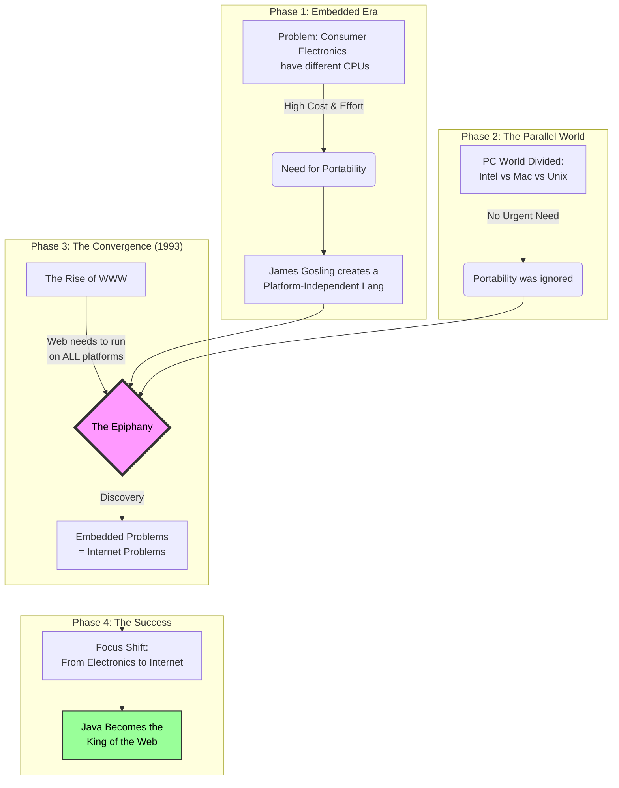
```mermaid
graph TD
    %% Phase 1
    subgraph P1 ["Phase 1: Embedded Era"]
        direction TB
        A["Problem: Consumer Electronics <br/> have different CPUs"] -->|High Cost & Effort| B("Need for Portability")
        B --> C["James Gosling creates a <br/> Platform-Independent Lang"]
    end

    %% Phase 2
    subgraph P2 ["Phase 2: The Parallel World"]
        direction TB
        D["PC World Divided: <br/> Intel vs Mac vs Unix"] -->|No Urgent Need| E("Portability was ignored")
    end

    %% Phase 3
    subgraph P3 ["Phase 3: The Convergence (1993)"]
        direction TB
        F["The Rise of WWW"] -->|Web needs to run <br/> on ALL platforms| G{"The Epiphany"}
        C --> G
        E --> G
        G -->|Discovery| H["Embedded Problems <br/> = Internet Problems"]
    end

    %% Phase 4
    subgraph P4 ["Phase 4: The Success"]
        direction TB
        H --> I["Focus Shift: <br/> From Electronics to Internet"]
        I --> J["Java Becomes the <br/> King of the Web"]
    end
    
    %% Styles
    style G fill:#f9f,stroke:#333,stroke-width:4px,color:black
    style J fill:#9f9,stroke:#333,stroke-width:2px,color:black
```

### 👨‍🏫 لمسة السينيور (The Key Takeaway)

الدرس المستفاد هنا مش تاريخ، بل Architecture:

الجافا مكنتش هتنجح لو كانت مجرد لغة "أنيقة". هي نجحت لأنها حلت مشكلة Business (التكلفة) ومشكلة Infrastructure (تعدد المنصات) في الوقت المناسب بالظبط (وقت انفجار الإنترنت).

الـ **Bytecode** والـ **JVM** هما "الآلة" اللي خلت الـ Portability دي ممكنة، وده اللي خلى شعار **"Write Once, Run Anywhere"** يبقى واقع مش خيال.

---
### The Strategic Syntax (خدعة التسويق) 🧠

> _• Java derives much of its character from C and C++. This is by intent._

التحليل:

جوسلينج وفريقه كانوا أذكياء جداً. هما عارفين إن العالم مليان ملايين المبرمجين شغالين C و C++. لو عملوا لغة الـ Syntax بتاعها غريب (زي Pascal أو Lisp)، محدش هيعبرها.

- **الخطة:** "خلوا الجافا تشبه الـ C++ شكلاً، لكن تشتغل بذكاء ومسؤولية من جوه".
    
- **النتيجة:** أي مبرمج C++ كان بيحتاج يومين بس عشان يفهم جافا. ده اللي عمل الـ **"Adoption Explosion"**.
    

### 2. A Language by Engineers, for Engineers 🛠️

> _• Java was designed... by real, working programmers... grounded in needs and experiences._

التحليل:

الجافا مش لغة أكاديمية اتعملت في معمل أبحاث عشان رسالة دكتوراه (زي لغات كتير بتموت). الجافا اتعملت عشان تحل مشاكل حقيقية واجهت الـ Green Team وهما بيبرمجوا الـ Star7.

- هي لغة **Pragmatic** (عملية). مفيش فيها تعقيدات فلسفية ملهاش لازمة.
    

### 3. The "No Training Wheels" Paradox 🚲

> _• Java is not a language with training wheels... Java gives you full control._

وقفة سينيور هنا: 🛑

الجملة دي ممكن تلخبطك. إحنا عارفين إن الجافا شالت الـ Pointers والـ Memory Management، فإزاي بتقول "Full Control" ومفيش "سنادات"؟

- **المقصود هنا:** إن الجافا لغة **Enterprise**. هي بتديك القوة إنك تبني أنظمة بنكية، سيرفرات عملاقة، ومحركات معقدة. هي مش لغة تعليمية للأطفال (زي Scratch مثلاً) بتحميك من كل حاجة.
    
- **المسؤولية:** الجملة _"If you program poorly, your programs reflect that"_ معناها إن الـ Garbage Collector مش هيحيلك مشاكل الـ **Logical Memory Leaks** (زي إنك تسيب Objects في Static List للأبد). بس أنت لسه مسؤول عن الـ Architecture.
    

### 4. The Evolution: What did Java add? 🧬

> _• Java enhanced and refined the object-oriented paradigm... added integrated support for multithreading._

الجافا مخدتش الـ C++ كوبي بيست. هي "نضفتها" وطورتها:

1. **Refined OOP:** منعت الـ Multiple Inheritance للكلاسات (عشان تتجنب التعقيد).
    
2. **Native Multithreading:** في C++ زمان، كنت عشان تعمل Thread لازم تكلم الـ OS API مباشرة.
   في جافا، الـ **Threading** جزء من اللغة نفسها (`java.lang.Thread`). دي كانت ثورة وقتها.
    
3. **Internet Ready:** مكتبات الـ Network كانت Built-in من أول يوم.
    

---

### 📊 ملخص الـ DNA (Mermaid Diagram)

Code snippet

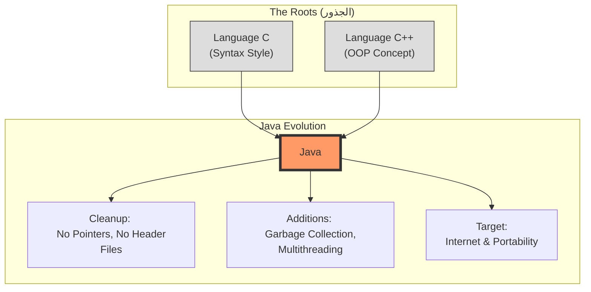
```mermaid
graph TD
    subgraph Roots ["The Roots (الجذور)"]
        direction TB
        C["Language C <br/> (Syntax Style)"]
        Cpp["Language C++ <br/> (OOP Concept)"]
    end

    subgraph Java ["Java Evolution"]
        direction TB
        J1["Java"]
        J_Feat1["Cleanup: <br/> No Pointers, No Header Files"]
        J_Feat2["Additions: <br/> Garbage Collection, Multithreading"]
        J_Target["Target: <br/> Internet & Portability"]
    end

    C --> J1
    Cpp --> J1
    J1 --> J_Feat1
    J1 --> J_Feat2
    J1 --> J_Target

    style J1 fill:#f96,stroke:#333,stroke-width:4px
    style C fill:#ddd,stroke:#333
    style Cpp fill:#ddd,stroke:#333
```

### 💡 الخلاصة (Senior Takeaway):

الجافا هي **"C++ ++ --"**.

- **++** زودت عليها الـ Garbage Collection والـ Portability.
    
- -- شالت منها الـ Pointers والتعقيدات الخطيرة.
    
    وده كان "الخلطة السرية" لنجاحها.
---
### 1. The Golden Analogy: Java vs. C ⚖️

> _Java was to Internet programming what C was to system programming._

التشبيه ده عبقري ولخص الحكاية كلها:

- **لغة C:** غيرت العالم لما مكنت المبرمجين إنهم يكتبوا أنظمة تشغيل (Unix) وبرامج System قوية وسريعة وتشتغل على هاردوير مختلف بكفاءة. هي **ملكة الـ System Programming**.
    
- **لغة Java:** عملت نفس الثورة بس في **الإنترنت**. هي اللغة اللي مكنت المبرمجين إنهم يحولوا الويب من مجرد صفحات ورق (Static HTML) لبرامج تفاعلية وشبكات معقدة (Distributed Computing). هي **ملكة الـ Internet Programming**.
    

### 2. The Symbiotic Relationship (العلاقة التبادلية) 🔄

> _The Internet helped pushing Java... and Java, in turn, had a deep effect on the Internet._

العلاقة بينهم كانت "Win-Win":

1. **الإنترنت خدم الجافا:** وفرلها البيئة المثالية للانتشار. مشكلة "اختلاف الأجهزة" اللي في الإنترنت كانت ملعب الجافا الأساسي.
    
2. **الجافا خدمت الإنترنت:** قبل الجافا، الويب كان "ممل". الجافا اخترعت الـ **Applets**، فخلت الويب "حي" (Dynamic).
    

---

### 3. The Trinity of Internet Success (ثالوث النجاح) 🔺

### 1. The Magic: Dynamic Web (سحر الويب التفاعلي) ✨

> _• At the time of Java’s creation... most exciting features was the applet._

التحليل:

زمان (1995)، الويب كان عبارة عن Static HTML. يعني صفحات "ميتة"، مجرد نصوص وصور ثابتة زي الجرنال.

- الـ **Applet** كان برنامج جافا صغير "بيسافر" عبر الإنترنت من السيرفر وينزل يشتغل جوه متصفح العميل (Browser).
    
- ده كان "سحر" لأن فجأة الصفحة بقى فيها أزرار بتتحرك، ورسوم بيانية بتتغير، وألعاب شغالة لايف.
    

### 2. Client-Side Execution (نقل الحمل للعميل) 🏗️

> _• They were typically used to... execute locally, rather than on the server._

التحليل الهندسي:

دي كانت النقلة المعمارية الكبيرة.

- **قبل الـ Applet:** لو عايز تحسب قسط قرض (Loan Calculator)، كنت تبعت الأرقام للسيرفر، السيرفر يحسب، ويرجعلك صفحة جديدة بالنتيجة (Slow & Heavy Server Load).
    
- **مع الـ Applet:** السيرفر بيبعتلك "كود البرنامج" (الآلة الحاسبة نفسها). وأي حسابات بتحصل **Locally** على الـ CPU بتاعك أنت (العميل).
    
- **الميزة:** تخفيف الحمل عن السيرفر (Offloading) واستجابة فورية للمستخدم بدون ما يعمل Reload للصفحة.
    

### 3. The End of an Era (النهاية والإنقراض) ⚰️

> _• Starting with JDK 9, applets are being phased out and deprecated..._

ليه ماتت؟

رغم إنها كانت Crucial في البداية، إلا أنها انتهت بدءاً من JDK 9. الأسباب اللي السلايد مش قايلها بس أنت لازم تعرفها:

1. **Security:** المتصفحات وقفت دعم الـ Plugins (زي Java Plugin) بسبب الثغرات الأمنية الخطيرة.
    
2. **Performance:** الـ Applet كان تقيل وبياخد وقت يحمل.
    
3. **Alternative:** ظهرت **HTML5** و **JavaScript** الحديثة (Angular/React)، وبقت تقدر تعمل نفس "الشغل الديناميكي" ده بس أسرع وأخف ومن غير Plugins.
    

---

### 📊 المخطط الهندسي (Applet Architecture)

Code snippet

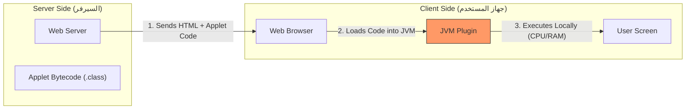
```mermaid
graph LR
    subgraph Server_Side ["Server Side (السيرفر)"]
        S[Web Server]
        Bytecode["Applet Bytecode (.class)"]
    end

    subgraph Client_Side ["Client Side (جهاز المستخدم)"]
        B[Web Browser]
        JVM[JVM Plugin]
        Display["User Screen"]
    end

    S -- 1. Sends HTML + Applet Code --> B
    B -- 2. Loads Code into JVM --> JVM
    JVM -- 3. Executes Locally (CPU/RAM) --> Display
    
    style JVM fill:#f96,stroke:#333
```

### 👨‍🏫 Senior Takeaway:

الـ Applet هو الجد الشرعي للـ Single Page Applications (SPAs) اللي بنعملها النهاردة بالـ React والـ Angular.

الفكرة واحدة: "ابعت الكود للعميل، وخلي المتصفح هو اللي يشتغل". الجافا كانت سابقة عصرها، بس التكنولوجيا بتاعتها (Plugins) عجزت وماتت.
    

---


### 1. Security: The "Sandbox" Revolution 🛡️

> • As you are likely aware, every time you download a “normal” program, you are taking a risk...
> 
> • Java achieved this protection by enabling you to confine an application to the Java execution environment...

التحليل العميق (Deep Dive):

زمان، لو نزلت برنامج .exe من النت، أنت بتلعب "روليت روسي". البرنامج ده عنده صلاحيات يوصل للـ Registery، يفرمت الـ Hard Disk، أو يسرق ملفاتك، لأن الـ OS بيثق فيه.

الجافا عملت ثورة بمفهوم **The Sandbox** (صندوق الرمل):

1. **العزل (Confinement):** الجافا مبتسمحش للكود يكلم الـ Hardware أو الـ OS مباشرة.
    
2. **الوسيط (The Middleman):** الكود بيشتغل جوه "بيئة معزولة" (Java Execution Environment - اللي هي الـ JVM).
    
3. **الحارس (Security Manager):** لو الـ Applet حاول يقرأ ملف من جهازك، الـ JVM بيضربه على إيده ويقوله `SecurityException` 🛑.
    

> 👨‍🏫 Senior Insight:
> 
> في C++، الغلطة بكارثة (Buffer Overflow ممكن يخترق السيستم). في جافا، الذاكرة (Memory) بتدار عن طريق الـ JVM، فمفيش Pointers تلعب في أماكن محظورة. ده اللي خلى الناس تثق تحمل برامج جافا.

---

### 2. Portability: The Universal Adapter 🌍

> • Portability is a major aspect of the Internet because there are many different types of computers...
> 
> • The same code must work on all computers...

التحليل العميق:

الإنترنت هو "سوق جمعة" كبير؛ فيه Windows، و Mac، و Linux، و Unix. المشكلة إن كل واحد فيهم بيتكلم "لغة آلة" (Machine Code) مختلفة.

- **الحل التقليدي:** تعمل 3 نسخ من البرنامج (نسخة exe، نسخة dmg، نسخة rpm). ده كابوس صيانة.
    
- **حل الجافا:** اخترعت "لغة موحدة" (Esperanto) اسمها **Bytecode**.
    
    - أنت بتكتب الكود مرة واحدة.
        
    - الـ Compiler بيحوله لـ Bytecode (ملف `.class`).
        
    - الملف ده بيشتغل على **أي جهاز** في الكون طالما عليه JVM.
        

---

### 3. The Missing Link: One Hero for Two Jobs 🔗

> _• The same mechanism that helps ensure security also helps create portability._

الجملة دي في منتهى الخطورة والعبقرية. الآلية المشتركة هي **The JVM (Java Virtual Machine)**.

إزاي الـ JVM بيحقق الاتنين؟

1. **عشان الـ Security:** الـ JVM بيشتغل كـ **"قفص"** بيحبس الكود جواه ويمنعه يؤذي الجهاز.
    
2. **عشان الـ Portability:** الـ JVM بيشتغل كـ **"مترجم فوري"** بيترجم الـ Bytecode للغة الجهاز اللي هو عليه.
    

فبقى عندنا "طبقة عازلة" (Abstraction Layer) هي سر القوة كلها.

---

### 📊 المخطط الهندسي (The JVM Architecture)

Code snippet

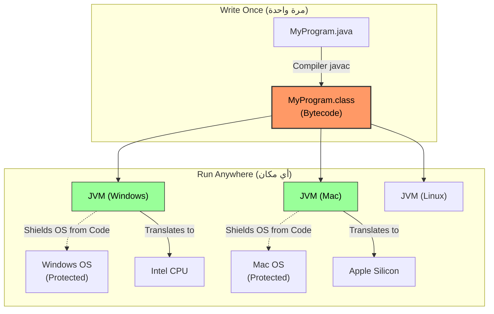
```mermaid
graph TD
    subgraph Source ["Write Once (مرة واحدة)"]
        direction TB
        JavaCode["MyProgram.java"] -->|Compiler javac| Bytecode["MyProgram.class <br/> (Bytecode)"]
    end

    subgraph Execution ["Run Anywhere (أي مكان)"]
        direction TB
        
        %% The JVM acts as the Shield and Translator
        Bytecode --> JVM_Win["JVM (Windows)"]
        Bytecode --> JVM_Mac["JVM (Mac)"]
        Bytecode --> JVM_Linux["JVM (Linux)"]
        
        %% Security Aspect
        JVM_Win -.->|Shields OS from Code| OS_Win["Windows OS <br/> (Protected)"]
        JVM_Mac -.->|Shields OS from Code| OS_Mac["Mac OS <br/> (Protected)"]
        
        %% Portability Aspect
        JVM_Win -->|Translates to| CPU_Win["Intel CPU"]
        JVM_Mac -->|Translates to| CPU_Mac["Apple Silicon"]
    end

    style Bytecode fill:#f96,stroke:#333,stroke-width:2px,color:black
    style JVM_Win fill:#9f9,stroke:#333,color:black
    style JVM_Mac fill:#9f9,stroke:#333,color:black
```

### 💡 الخلاصة (Senior Takeaway):

الجافا مكنتش مجرد لغة برمجة، كانت **Platform**. الـ JVM هو البطل الحقيقي اللي ضرب عصفورين بحجر:

1. **حمانا من الفيروسات** (Security).
    
2. **وحد لغة التفاهم بين الأجهزة** (Portability).
    

---

### 📊 المخطط الهندسي (The Ecosystem Diagram)

Code snippet

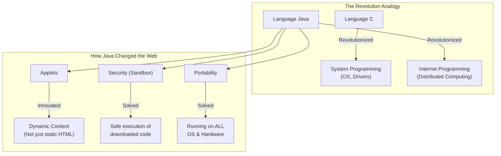
```mermaid
graph TD
    subgraph The_Analogy ["The Revolution Analogy"]
        direction TB
        C_Lang["Language C"] -->|Revolutionized| Sys["System Programming <br/> (OS, Drivers)"]
        Java_Lang["Language Java"] -->|Revolutionized| Web["Internet Programming <br/> (Distributed Computing)"]
    end

    subgraph The_Impact ["How Java Changed the Web"]
        direction TB
        Applets["Applets"] -->|Innovated| Content["Dynamic Content <br/> (Not just static HTML)"]
        Security["Security (Sandbox)"] -->|Solved| Trust["Safe execution of <br/> downloaded code"]
        Portability["Portability"] -->|Solved| Fragmentation["Running on ALL <br/> OS & Hardware"]
    end

    Java_Lang --> Applets
    Java_Lang --> Security
    Java_Lang --> Portability
```


---

### 1. The Core Innovation: Bytecode (اللغة الوسيطة) 📜

> • The output of a Java compiler is not executable code. Rather, it is bytecode.
> 
> • Bytecode is a highly optimized set of instructions designed to be executed by the Java run-time system (JVM).

التحليل:

في لغات زي C++، الكومبايلر بيحول الكود بتاعك مباشرة لـ Machine Code (أصفار وحايد) بيفهمها البروسيسور (CPU) بتاع جهازك وبس. عشان كده كود الـ Windows مبيشتغلش على Mac.

الجافا عملت "كوبري" في النص:

- الكومبايلر (`javac`) مبيكلمش الـ CPU. هو بيترجم الكود لـ **Bytecode** (ملفات `.class`).
    
- **الـ Bytecode** ده لغة "محسنة جداً" (Highly Optimized)، بس مين اللي بيفهمها؟ مش البروسيسور، لأ.. اللي بيفهمها هو الـ **JVM**.
    

---

### 2. JVM: The Universal Translator (حل مشكلة الـ Portability) 🌍

> • Translating a Java program into bytecode makes it much easier to run a program in a wide variety of environments...
> 
> • ...only the JVM needs to be implemented for each platform.

التحليل الهندسي:

عشان تشغل برنامجك على أي جهاز في العالم، مش محتاج تعيد كتابة البرنامج. أنت محتاج بس تركب "المترجم" (JVM) المناسب للجهاز ده.

- الـ JVM بتاع Windows مختلف عن الـ JVM بتاع Linux من جوه (Implementation Details differ).
    
- **لكن:** كلهم بيفهموا نفس الـ **Bytecode** بالظبط.
    
- **النتيجة:** `Write Once, Run Anywhere`.
    

---

### 3. JVM: The Jail Warden (حل مشكلة الـ Security) 🛡️

> • The fact that a Java program is executed by the JVM also helps to make it secure.
> 
> • It is possible for the JVM to create a restricted execution environment, called the sandbox...

التحليل:

بما إن الكود مش بيشتغل على الهاردوير مباشرة، والـ JVM هو اللي بيشغله، فالـ JVM يقدر يفرض "سيطرته".

- الـ JVM بيعمل بيئة معزولة اسمها **The Sandbox** (صندوق الرمل).
    
- الكود بيلعب جوه الصندوق ده. لو حاول يخرج يمسح ملفات السيستم أو يكلم ميموري غلط، الـ JVM بيمنعه فوراً. ده اللي خلى الجافا آمنة للإنترنت.
    

---

### 4. The Need for Speed: JIT Compilation 🚀

> _• Although Java was designed as an interpreted language, there is nothing ... that prevents on-the-fly compilation ... to boost performance._

> 👨‍🏫 Senior Insight:

زمان، الـ JVM كان بيشتغل Interpreter (مفسر)، يعني يقرأ سطر Bytecode ويترجمه للآلة، وده كان بطيء.

السلايد بيلمح للثورة اللي حصلت بعدين وهي JIT (Just-In-Time) Compiler.

- الـ JVM الحديث مبقاش مجرد مفسر. بقى ذكي.
    
- بيشوف الأجزاء اللي بتتكرر كتير في الكود (Hotspots) ويقوم مترجمها لـ **Native Code** (لغة آلة حقيقية) ويحفظها في الميموري "On-the-fly" (وهو شغال).
    
- ده خلى الجافا سريعة جداً وقريبة من سرعة C++.
    

---

### 📊 المخطط الهندسي (The Magic Flow)

Code snippet

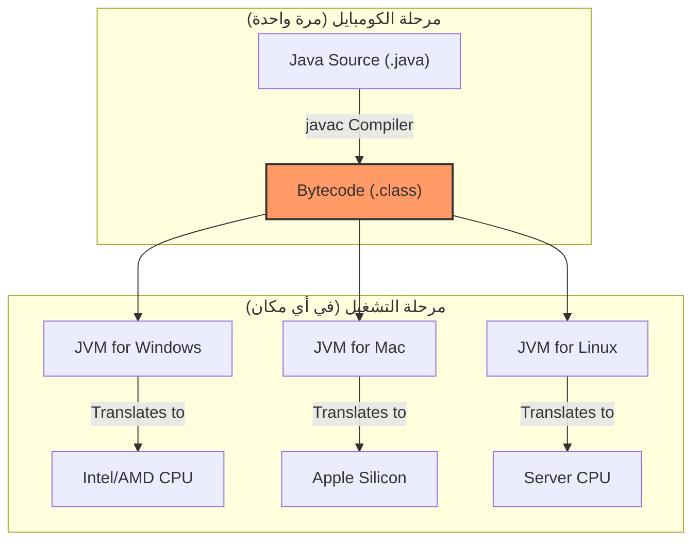
```mermaid
graph TD
    subgraph Compilation ["مرحلة الكومبايل (مرة واحدة)"]
        Source["Java Source (.java)"] -->|javac Compiler| Bytecode["Bytecode (.class)"]
    end

    subgraph Execution ["مرحلة التشغيل (في أي مكان)"]
        direction TB
        Bytecode --> JVM1["JVM for Windows"]
        Bytecode --> JVM2["JVM for Mac"]
        Bytecode --> JVM3["JVM for Linux"]
        
        JVM1 -->|Translates to| CPU1["Intel/AMD CPU"]
        JVM2 -->|Translates to| CPU2["Apple Silicon"]
        JVM3 -->|Translates to| CPU3["Server CPU"]
        
        style Bytecode fill:#f96,stroke:#333,stroke-width:2px
    end
```


---
###  Simple (بسيطة.. بس مش تافهة) 🧩

> • Java was designed to be easy for the professional programmer...
> 
> • If you are an experienced C++ programmer, moving to Java will require very little effort.

تحليل السينيور:

كلمة "Simple" هنا خادعة شوية. الجافا لغة قوية ومعقدة، أمال ليه بيقولوا بسيطة؟

1. **المألوفة (Familiarity):** الجافا أخدت نفس الـ Syntax بتاع **C++** (الأقواس `{}`، السيميكولون `;`، طريقة كتابة الـ Loops). لو أنت مبرمج C++، هتحس إنك في بيتك.
    
2. **التنظيف (Cleanup):** الجافا شالت الحاجات "الرخمة والمعقدة" في C++ زي الـ Pointers والـ Operator Overloading والـ Header Files.
    
    - **المعادلة:** `Java = C++ - (Pain & Complexity)`.
        

---

### 2. Object-Oriented (كائنية التوجه.. بذكاء) 📦

> • The object model in Java is simple and easy to extend...
> 
> • ...while primitive types, such as integers, are kept as high-performance non objects.

تحليل السينيور (نقطة معمارية مهمة):

في لغات تانية (زي Smalltalk)، كل حاجة حرفياً عبارة عن Object. حتى الرقم 1 عبارة عن Object. ده جميل نظرياً، بس كارثة في الأداء (Performance Heavy).

الجافا عملت **توازن عبقري (Trade-off):**

- **القاعدة:** كل حاجة Object.
    
- **الاستثناء:** البيانات الأساسية البسيطة (Primitives) زي `int`, `double`, `boolean`.
    
- **السبب:** عشان السرعة. التعامل مع `int` في الميموري أسرع بكتير من التعامل مع `Integer Object`.
    
- **النتيجة:** لغة OOP قوية، بس لسه سريعة كفاية للشغل التقيل.
    

---

### 3. Robust (صامدة/عضمها ناشف) 💪

> • Because Java is a strictly typed language... checks your code at compile time... and run time.
> 
> • ...consider two main reasons for failure: memory management mistakes and mishandled exceptional conditions.

تحليل السينيور:

كلمة Robust يعني "ضد الكسر". الجافا صممت عشان متضربش (Crash) بسهولة. إزاي؟

**أ. الشرطة الصارمة (Strict Typing):**

- الجافا مش بتسيبك تعك. مينفعش تحط `String` جوه متغير `int`.
    
- **Compile-time Check:** الكومبايلر بيقفشك وأنت بتكتب الكود.
    
- **Run-time Check:** حتى والبرنامج شغال، الـ JVM بيراقب عشان مفيش حاجة غريبة تحصل.
    

**ب. إدارة الذاكرة (Memory Management):**

- في C++، أكبر سبب للـ Crash هو إن المبرمج ينسى يمسح الميموري (Memory Leak).
    
- في Java، الـ **Garbage Collector** بيقوم بالدور ده. بينضف وراك أوتوماتيك، فبيحمي البرنامج من الانهيار.
    

**ج. التعامل مع الاستثناءات (Exception Handling):**

- الجافا بتجبرك تتعامل مع الأخطاء (زي إن الملف مش موجود أو النت قطع) وقت كتابة الكود (`try-catch`). مش بتسيبك تتفاجئ بيها والبرنامج شغال عند العميل.
    

---
### 4. Multithreaded (الأخطبوط متعدد الأذرع) 🐙

> _• Java supports multithreaded programming... allows you to write programs that do many things simultaneously._

التحليل:

زمان، عشان تخلي البرنامج يعمل حاجتين في نفس الوقت (مثلاً: يحمل ملف وفي نفس الوقت يخليك تكتب في الـ Text Box)، كنت محتاج تكلم نظام التشغيل (OS) وتدخل في تعقيدات مرعبة.

- **عبقرية الجافا:** خلت الـ **Multithreading** جزء من اللغة نفسها (Built-in).
    
- **التزامن (Synchronization):** الجافا قدمت حلول "أنيقة" (`synchronized` keyword) عشان تمنع خناقة الـ Threads على نفس الميموري (Race Condition).
    
- **التشبيه:** تخيل "ويتر" واحد في مطعم (Single Thread) بيخدم 10 ترابيزات، لو وقف عند ترابيزة واحدة الكل هيعطل. الجافا جابت "طقم ويترز" (Multi-thread) يخدموا في نفس الوقت بتناغم.
    

---

### 5. Architecture-neutral (الحياد المعماري) 🏛️

> _• Their goal was “write once; run anywhere.”_

التحليل:

إحنا اتكلمنا عنها قبل كده، بس هنا بيركز على كلمة Neutral.

- الجافا "محايدة". مش بتنحاز لـ Intel ولا AMD ولا ARM.
    
- هي بتعتمد على "مواصفات ثابتة" للـ Bytecode.
    
- **النتيجة:** لو كتبت كود بيجمع `1+1`، هيطلع `2` على الويندوز، و `2` على الماك، و `2` على محمصة العيش. مفيش مفاجآت (Undefined Behavior) زي الـ C++.
    

---

### 6. Interpreted and High Performance (المفارقة العجيبة) 🚀

> • Java enables creation... by compiling into bytecode.
> 
> • ...easy to translate directly into native machine code... by using a just-in-time compiler.

وقفة سينيور (The Paradox):

إزاي الجافا Interpreted (مفسرة - يعني بطيئة نظرياً) وفي نفس الوقت High Performance؟

1. **المرحلة الأولى (Interpreted):** الـ JVM بيقرأ الـ Bytecode ويترجمه سطر بسطر. ده بطيء شوية بس بيحقق الـ Portability.
    
2. **المرحلة الثانية (JIT - Just In Time):** هنا السحر. الـ JVM بيراقب الكود وهو شغال.
    
    - لو لقى "دالة" بتتنادى كتير (Hotspot)، بيقوم مترجمها لـ **Native Machine Code** (لغة آلة صريحة وسريعة جداً) ويحفظها في الرامات.
        
    - المرة الجاية لما تنادي الدالة دي، بتشتغل بسرعة الصاروخ (زي C++) لأنها بقت Native خلاص.
        

---

### 7. Distributed (اجتماعية بطبعها) 🌐

> • Java is designed for the distributed environment of the Internet because it handles TCP/IP protocols.
> 
> • Java also supports Remote Method Invocation (RMI).

التحليل:

لغات زمان كانت "انطوائية" (Standalone). الجافا صممت عشان "تكلم غيرها".

- **TCP/IP:** الجافا فيها مكتبات جاهزة للاتصال بالإنترنت (`java.net`).
    
- **RMI (Remote Method Invocation):** دي كانت ثورة وقتها.
    
    - تخيل إن عندك `Object A` على جهاز في أمريكا، و `Object B` على جهاز في مصر.
        
    - `Object B` يقدر ينادي ميثود جوه `Object A` كأنه جنبه في نفس الميموري! `A.doSomething()`.
        
    - **ملاحظة:** الـ RMI هو الجد الشرعي للـ Web Services والـ Microservices الموجودة دلوقتي.
        

---

### 8. Dynamic (متجددة ومرنة) 🔄

> • Java programs carry... run-time type information... verify and resolve access to objects at run time.
> 
> • ...small fragments of bytecode may be dynamically updated on a running system.

التحليل (الأصعب في الفهم):

في لغات زي C++، الربط بين الملفات (Linking) بيحصل وقت الـ Compile. لو غيرت ملف، لازم تعمل Re-compile للمشروع كله.

في الجافا، الربط بيحصل **Dynamic** (وقت التشغيل):

1. **Late Binding:** الجافا مش بتحمل الكلاس في الميموري إلا لما تحتاجها فعلاً.
    
2. **التحديث الحي:** ممكن يكون عندك سيرفر شغال، وتقوم مبدل ملف `.class` بملف أحدث، والسيرفر يكمل شغل عادي بالنسخة الجديدة من غير ما يقع (في حدود معينة).
    
3. **RTTI (Run-Time Type Information):** الجافا بتبقى عارفة نوع الأوبجيكت وهي شغالة، فبتقدر تمنعك لو حاولت تعمل Cast غلط، وده بيزود الأمان (Robustness).
    

---

### 📊 ملخص الـ JIT Compiler (أهم نقطة تقنية)

ده المخطط اللي بيشرح إزاي الجافا جمعت بين إنها Interpreted و High Performance:

Code snippet

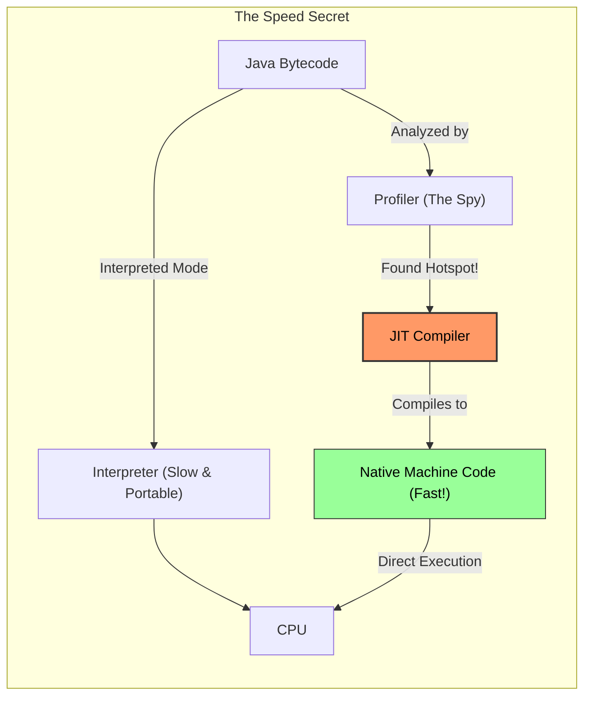
```mermaid
graph TD
    subgraph Execution_Cycle ["The Speed Secret"]
        direction TB
        Bytecode["Java Bytecode"] -->|Interpreted Mode| Interpreter["Interpreter (Slow & Portable)"]
        Interpreter --> CPU
        
        Bytecode -->|Analyzed by| Profiler["Profiler (The Spy)"]
        Profiler -->|Found Hotspot!| JIT["JIT Compiler"]
        JIT -->|Compiles to| Native["Native Machine Code (Fast!)"]
        Native -->|Direct Execution| CPU
    end
    
    style JIT fill:#f96,stroke:#333,stroke-width:2px,color:black
    style Native fill:#9f9,stroke:#333,color:black
```

---
### 📋 The Java Buzzwords Cheat Sheet

| **Buzzword (المصطلح)**                | **The Surface Meaning (المعنى السطحي)** | **🧠 Senior Insight (السر المعماري)**                                                                                                 |
| ------------------------------------- | --------------------------------------- | ------------------------------------------------------------------------------------------------------------------------------------- |
| **1. Simple**                         | لغة سهلة التعلم.                        | هي "بسيطة" لأنها شالت تعقيدات C++ (زي Pointers, Operator Overloading, Header Files). المعادلة: `Java = C++ - Pain`.                   |
| **2. Object-Oriented**                | كل حاجة عبارة عن كائنات.                | توازن ذكي: هي Pure OOP لكن احتفظت بالـ **Primitives** (زي `int`) عشان السرعة، عكس لغات تانية خلت كل حاجة Object وده كان بيقتل الأداء. |
| **3. Robust**                         | لغة قوية وضد الكسر.                     | الفضل يرجع لـ **Garbage Collector** (منع الـ Memory Leaks) والـ **Exception Handling** الإجباري، والـ **Strong Typing**.              |
| **4. Multithreaded**                  | تقدر تعمل كذا حاجة في نفس الوقت.        | الجافا خلت الـ Threading جزء من اللغة (`java.lang.Thread`) مش مجرد استدعاء لنظام التشغيل. وده كان ثورة في بناء السيرفرات.             |
| **5. Architecture-neutral**           | بتشتغل على أي معمارية (Intel, ARM).     | السر هو **Bytecode**. الكومبايلر بيطلع كود "محايد" ملوش علاقة بنوع البروسيسور، والـ JVM هو اللي بيتصرف.                               |
| **6. Portable**                       | Write Once, Run Anywhere.               | مش بس الكود بيشتغل في أي حتة، كمان حجم أنواع الداتا ثابت (الـ `int` دايماً 32-bit في أي جهاز)، عكس C++ اللي بيختلف حسب الجهاز.        |
| **7. Distributed**                    | جاهزة للشبكات.                          | صممت عشان الإنترنت. فيها مكتبات TCP/IP جاهزة، وتدعم **RMI** (تشغيل ميثود على سيرفر تاني عن بعد).                                      |
| **8. Secure**                         | آمنة من الفيروسات.                      | اعتمدت على **Sandbox Model** (صندوق الرمل). الكود محبوس جوه الـ JVM وممنوع يلمس ملفاتك أو الميموري الحساسة.                           |
| **9. Interpreted & High Performance** | سريعة رغم إنها مفسرة.                   | هي بتبدأ Interpreted (أبطأ)، بس الـ **JIT Compiler** بيحول الأكواد المهمة (Hotspots) لـ Native Code بسرعة الصاروخ أثناء التشغيل.      |
| **10. Dynamic**                       | لغة مرنة ومتجددة.                       | الربط (Linking) بيحصل وقت التشغيل (Runtime). تقدر تحدث مكتبات البرنامج وهو شغال من غير ما توقفه (Hot Swapping).                       |

---

### 🧩 خريطة ذهنية للعلاقات (Relationships)

عشان تربطهم ببعض في دماغك، قسمتهم لك لمجموعات منطقية:

Code snippet

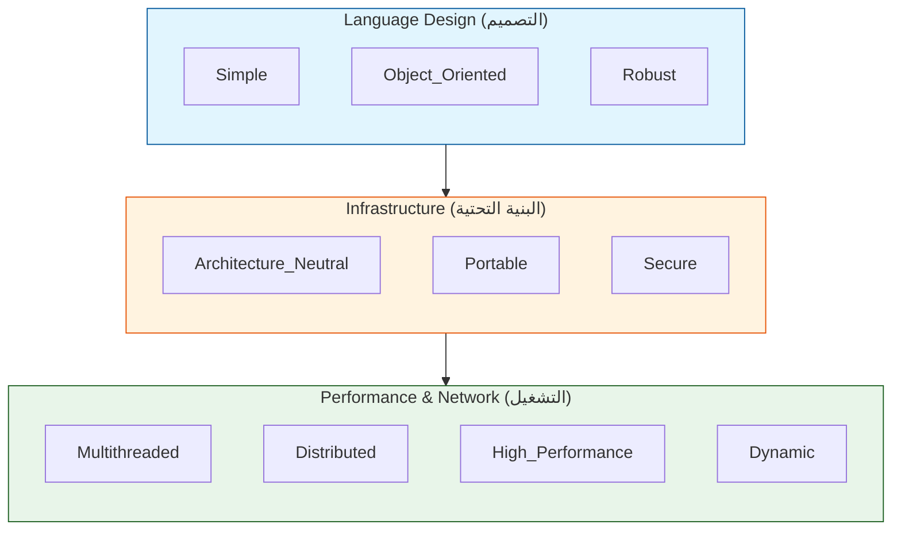
```mermaid
graph TD
    subgraph Design ["Language Design (التصميم)"]
        direction TB
        Simple
        Object_Oriented
        Robust
    end

    subgraph Infra ["Infrastructure (البنية التحتية)"]
        direction TB
        Architecture_Neutral
        Portable
        Secure
    end

    subgraph Runtime ["Performance & Network (التشغيل)"]
        direction TB
        Multithreaded
        Distributed
        High_Performance
        Dynamic
    end

    Design --> Infra
    Infra --> Runtime
    
    style Design fill:#e1f5fe,stroke:#01579b
    style Infra fill:#fff3e0,stroke:#e65100
    style Runtime fill:#e8f5e9,stroke:#1b5e20
```
---
### 1. The Equation (المعادلة الأساسية)

أي برنامج كمبيوتر في الدنيا عبارة عن حاجتين بس:

1. **Data (بيانات):** المعلومات اللي بنخزنها (أرقام، نصوص، أسماء).
    
2. **Code (كود):** الأوامر اللي بتشتغل على المعلومات دي (العمليات الحسابية، الدوال).
    

السؤال هنا: **إزاي بننظم العلاقة بينهم؟** هنا بيظهر المدرستين:

---

### 2. The Process-Oriented Model (مدرسة الـ C) 🍝

**(Code acting on Data)**

في النموذج ده، **الكود هو الملك**.

- أنت بتكتب دوال (Functions) وإجراءات (Procedures).
    
- البيانات (Variables) مرمية في الميموري، والدوال دي بتروح "تهجم" عليها وتغير فيها.
    
- **مثال:** لغة **C**.
    

المشكلة (The Chaos):

لما البرنامج يكبر، بيبقى عندك مئات الدوال وآلاف المتغيرات.

- أي دالة ممكن تغير أي متغير (Global Data).
    
- لو متغير قيمته باظت، مش هتعرف مين الدالة اللي بوظته.
    
- ده اللي بنسميه **Spaghetti Code** (الكود كله داخل في بعضه).
    

---

### 3. The Object-Oriented Model (مدرسة الـ Java) 📦

**(Data controlling access to Code)**

هنا قلبنا الآية. **البيانات هي الملكة**، والكود هو الحارس بتاعها.

- بدل ما البيانات تكون "سايحة"، بنحطها جوه "كبسولة" أو صندوق (اللي هو الـ **Object**).
    
- وبنحط معاها الكود (Methods) الخاص بيها جوه نفس الصندوق.
    
- **القاعدة:** "عايز تكلم البيانات بتاعتي؟ كلمني عن طريق الكود بتاعي بس (Interface)".
    
- **مثال:** لغة **Java**.
    

الميزة (Organized Control):

البيانات محمية. مفيش دالة غريبة تقدر تلعب في الداتا بتاعتك إلا بإذنك.Shutterstock

---

### 🆚 The Senior Comparison (مقارنة المهندسين)

عشان تفهم الفرق الجوهري "Data controlling access to code":

|**وجه المقارنة**|**Process-Oriented (زي C)**|**Object-Oriented (زي Java)**|
|---|---|---|
|**مين المدير؟**|**الكود (Function).** هو اللي بيتحكم في الداتا.|**البيانات (Object).** هي اللي بتتحكم مين يلمسها.|
|**الفلسفة**|"هات الداتا دي عشان أعدلها".|"يا أوبجيكت، لو سمحت عدل نفسك".|
|**التشبيه**|**ورشة مفتوحة:** العدة مرمية (Data) وأي عامل (Code) ييجي ياخد أي مفك يشتغل بيه. فوضى لو العمال كتروا.|**كبسولة طبية:** الدواء (Data) محمي جوه غلاف، والجسم مبيتعاملش مع الدواء مباشرة، بيتعامل مع الغلاف (Interface).|
|**النتيجة مع التعقيد**|ينهار لما البرنامج يكبر (Complex).|يفضل منظم وقابل للتوسع (Scalable).|

---

### 🧠 The Logic Switch (نقطة التحول)

في السلايد مكتوب جملة عبقرية:

> _"An object-oriented program can be characterized as data controlling access to code."_

يعني إيه؟

- في الـ OOP، أنت مش بتكتب كود يروح يغير قيمة متغير `balance` في البنك.
    
- لأ، أنت بتعمل Object اسمه `BankAccount`، وبتحط جواه دالة اسمها `deposit()`.
    
- الـ Data (الرصيد) هي اللي بتقرر: "هل أسمح للكود ده يشتغل ولا لأ؟" (مثلاً لو المبلغ بالسالب ترفض).
    
- كده الداتا هي اللي **تحكمت** في تنفيذ الكود.
    

### 📊 الرسم التوضيحي (Mermaid)

Code snippet

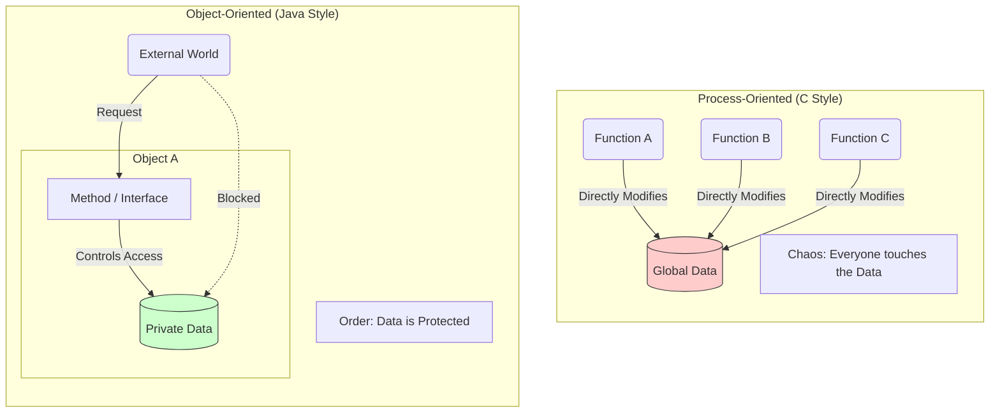
```mermaid
graph TD
    subgraph Process_Oriented ["Process-Oriented (C Style)"]
        direction TB
        Func1(Function A) -->|Directly Modifies| GlobalData[(Global Data)]
        Func2(Function B) -->|Directly Modifies| GlobalData
        Func3(Function C) -->|Directly Modifies| GlobalData
        style GlobalData fill:#ffcccc,stroke:#333
        note1[Chaos: Everyone touches the Data]
    end

    subgraph OOP ["Object-Oriented (Java Style)"]
        direction TB
        subgraph Object_A [Object A]
            DataA[(Private Data)]
            MethodA[Method / Interface]
            MethodA -->|Controls Access| DataA
        end
        
        ExternalCode(External World) -->|Request| MethodA
        ExternalCode -.->|Blocked| DataA
        style DataA fill:#ccffcc,stroke:#333
        note2[Order: Data is Protected]
    end
```

---
### 1. The Human Brain & The Car Paradox 🚗

> • Humans manage complexity through abstraction.
> 
> • People do not think of a car as a set of tens of thousands of individual parts...

التحليل:

تخيل لو كل ما تيجي تدور عربيتك، لازم تفكر في:

1. ضخ البنزين في الرشاشات.
    
2. إحداث شرارة في البوجيهات.
    
3. حركة البساتم والعمود المرفقي.
    
4. نقل الحركة للتروس.
    

مخك هينفجر! 🤯 عشان كده مخنا بيعمل **Abstraction**.

- **السطح (Abstraction):** أنت شايف "عربية". بتدوس زرار "Start".
    
- **العمق (Complexity):** جوه فيه آلاف القطع بتتحرك، بس أنت "مجرد" منها (Abstracted away).
    

---

### 2. Hierarchical Classifications (التسلسل الهرمي) 🌳

> • A powerful way to manage abstraction is through the use of hierarchical classifications.
> 
> • ...car consists of several subsystems: steering, brakes, sound system...

التحليل الهندسي:

إزاي بنبني سيستم معقد؟ بنقسمه طبقات (Layers).

1. **Level 1 (Whole):** العربية (Car).
    
2. **Level 2 (Subsystems):** الموتور، الفرامل، التكييف.
    
3. **Level 3 (Units):** جوه الموتور فيه (Pistons, Valves).
    

في البرمجة بنعمل نفس الكلام.

- بدل ما تكتب 10,000 سطر كود سايحين على بعض (Spaghetti Code).
    
- بتعمل Object اسمه `Car`.
    
- وجواه Object اسمه `Engine`.
    
- وجواه Object اسمه SparkPlug.
    
    كل واحد مسؤول عن نفسه بس.
    

---

### 3. The Paradigm Shift: From Process to Messages 📩

> • The data from a traditional process-oriented program can be transformed into its component objects.
> 
> • A sequence of process steps can become a collection of messages...

التحليل (أهم نقطة للمبرمجين):

ده الفرق الجوهري بين لغة C ولغة Java.

- **الطريقة القديمة (Process-Oriented):**
    
    - عندك داتا (بيانات العربية).
        
    - وعندك خطوات (دالة `move_car`، دالة `stop_car`).
        
    - أنت "بتأمر" الكمبيوتر يمشي خطوة خطوة.
        
- **طريقة OOP (Abstraction):**
    
    - أنت عندك **Object** اسمه `Car`.
        
    - أنت بتبعتله **Message** (رسالة) بتقوله: `car.start()`.
        
    - هو بيرد عليك وينفذ، من غير ما أنت تعرف هو عمل إيه جوه (هل شغل بطارية؟ هل ضخ بنزين؟ ملكش دعوة).
        

---

### 4. Why Abstraction Saves Software? (سر الخلود) 🕰️

> _• OOP is a powerful ... for creating programs that survive ... including conception, growth, and aging._

لمسة سينيور (Senior Insight): 💡

ليه السلايد بيقول إن التجريد بيخلي البرامج تعيش ومتمتش (Survive aging)؟

لأن التجريد بيعمل **فصل (Decoupling)**.

- النهاردة، كود الـ `Car` بيشغل موتور "بنزين".
    
- بكرة، العالم اتطور وعايزين نخليها "كهرباء".
    
- بفضل الـ Abstraction، أنا هدخل جوه الـ `Engine Object` وأغير الكود من بنزين لكهرباء.
    
- **المفاجأة:** الكود بتاع "السواق" (Driver) مش هيتغير ولا سطر! لأن السواق لسه بيبعت نفس الرسالة: `car.start()`.
    

ده اللي بيخلي المشاريع الضخمة تعيش سنين، إنك تقدر تغير "الأحشاء" من غير ما تغير "الواجهة".

---

### 📊 الخلاصة بمخطط (Mermaid)

Code snippet

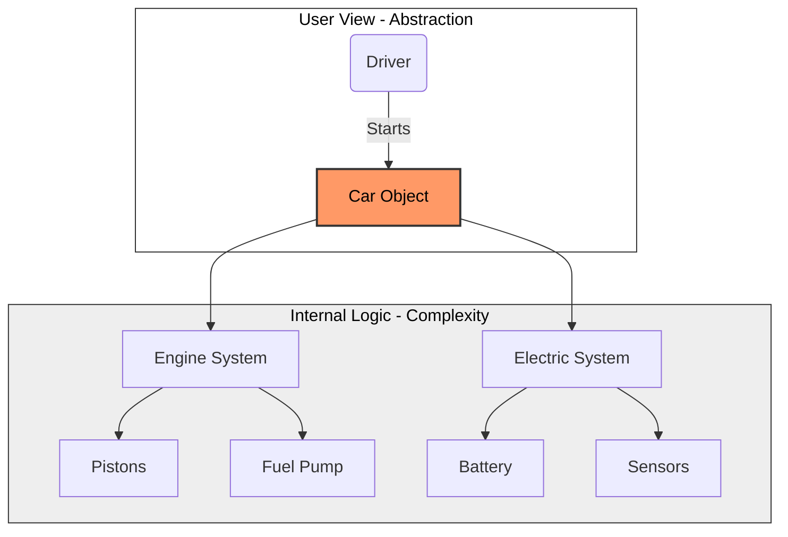
```mermaid
graph TD
    %% Subgraph 1: User View
    subgraph View ["User View - Abstraction"]
        direction TB
        User(Driver) -->|Starts| Car[Car Object]
    end

    %% Subgraph 2: Implementation
    subgraph Logic ["Internal Logic - Complexity"]
        direction TB
        Car --> Engine[Engine System]
        Car --> Elec[Electric System]
        
        Engine --> Pistons[Pistons]
        Engine --> Fuel[Fuel Pump]
        
        Elec --> Batt[Battery]
        Elec --> Sens[Sensors]
    end

    %% Styling
    style Car fill:#f96,stroke:#333,stroke-width:2px,color:black
    style Logic fill:#eee,stroke:#333,color:black
    style View fill:#fff,stroke:#333,color:black
```
---

### Encapsulation: The Protective Shield 🛡️

**(التغليف: الدرع الواقي)**

التعريف الأكاديمي بيقول: "هو ربط الكود بالبيانات وحمايتهم من التدخل الخارجي".

بس عشان تفهمها صح، تخيلها "كبسولة دواء":

- **المادة الفعالة (Data):** دي البيانات الحساسة اللي جوه.
    
- **الغلاف الجيلاتيني (Methods):** ده الغلاف اللي بيحوط المادة الفعالة.
    
- **الحماية:** مينفعش تفتح الكبسولة وتلمس المادة الفعالة بإيدك (Direct Access)، لازم تبلع الكبسولة كلها والغلاف هو اللي يتصرف.
    

في البرمجة، إحنا بنعمل كده بالظبط:

- بنخبي الـ **Data** (المتغيرات) جوه الصندوق.
    
- وبنجبر أي حد عايز يتعامل معاها إنه يستخدم الـ **Methods** (الدوال) اللي إحنا سامحين بيها بس.
    

---

### Class vs. Object: The Blueprint Paradox 🏗️

**(الكلاس والكائن: الخريطة والمبنى)**

دي نقطة جوهرية السلايد ركز عليها: **"Class is logical; Object is physical"**. يعني إيه؟

**The Class (الفكرة/المنطق):**

- ده **"الرسم الهندسي"** (Blueprint) للعمارة.
    
- الرسمة دي حبر على ورق، مبتخدش مساحة في الواقع، ومينفعش تسكن فيها.
    
- هي مجرد "وصف" للشكل والسلوك.
    

**The Object (الواقع/الفيزياء):**

- ده **"المبنى الحقيقي"** اللي اتبنى بناءً على الرسمة.
    
- ده أخد مساحة فعلية في الـ Memory (RAM).
    
- تقدر تعمل من نفس الـ Class (الرسمة) 100 عمارة (100 Objects)، وكل عمارة ليها سكانها المستقلين.
    

---

### Components of a Class 🧩

**(تشريح الكلاس من جوه)**

أي كلاس في الدنيا بيتكون من عنصرين أساسيين، والسلايد سماهم "Members" (أعضاء):

**Member Variables (Instance Variables):**

- دي **البيانات (Data)**.
    
- زي: `name`, `age`, `width`, `height`.
    
- دي بتمثل "حالة" الكائن (State).
    

**Member Methods:**

- دي **الكود (Code)**.
    
- زي: `calculateSalary()`, `printInfo()`.
    
- دي بتمثل "سلوك" الكائن (Behavior) وهي الوحيدة اللي المفروض تلمس الـ Variables.
    

---

### 📊 المخطط الهندسي (Encapsulation Architecture)

ده رسم بيوضح إزاي الـ Class بيشتغل كـ "سور" بيحمي الداتا من العالم الخارجي.

Code snippet

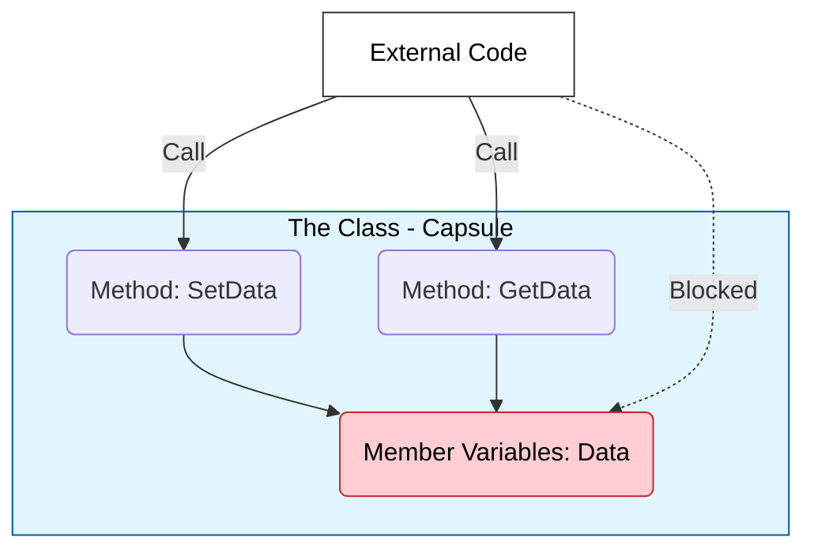
```mermaid
graph TD
    %% Class Definition
    subgraph ClassBox [The Class - Capsule]
        direction TB
        Data(Member Variables: Data)
        Method1(Method: SetData)
        Method2(Method: GetData)
        
        Method1 --> Data
        Method2 --> Data
    end

    %% External World
    User[External Code]

    %% Interaction
    User -->|Call| Method1
    User -->|Call| Method2
    User -.->|Blocked| Data

    %% Styling
    style ClassBox fill:#e1f5fe,stroke:#01579b,color:black
    style Data fill:#ffcdd2,stroke:#c62828,color:black
    style User fill:#fff,stroke:#333,color:black
```
---
### 🧬 The Genetic Code of Software

**(التوريث: الجينات البرمجية)**

السلايد بيقول: _"Inheritance is the process by which one object acquires the properties of another object."_

زي ما أنت ورثت لون العين أو الطول من والدك، الكلاسات في البرمجة بتورث من بعض.

- **Parent Class (Superclass):** ده الأب. بنحط فيه الصفات "العامة" المشتركة (زي إن أي كائن حي بيتنفس).
    
- **Child Class (Subclass):** ده الابن. بياخد كل صفات الأب "على الجاهز"، وبيزود عليها صفاته الخاصة (زي إن الإنسان بيتكلم، بس القط مبيتكلمش).
    

### 🏛️ Hierarchical Classification

**(التنظيم الهرمي: من العام للخاص)**

بدون التوريث، البرمجة كانت هتبقى جحيم من التكرار (Redundancy). تخيل لو بتعمل لعبة فيها `Dog` و `Cat` و `Lion`.

- **بدون توريث:** هتكتب كود `eat()` و `sleep()` و `walk()` جوه الـ Dog، وتعيد كتابتهم جوه الـ Cat، وتعيدهم تاني جوه الـ Lion.
    
- **بالتوريث:** إحنا بنعمل كلاس كبير اسمه `Animal` نحط فيه `eat, sleep, walk` مرة واحدة. والكل يورث منه.
    

### ⚡ The "Delta" Strategy

**(اكتب الفرق بس)**

السلايد فيه جملة عبقرية: _"an object need only define those qualities that make it unique."_

ده جوهر الـ **Inheritance**. أنت مش بتعيد اختراع العجلة.

- الابن مش محتاج يقول "أنا بآكل وأشرب"، لأن دي مسلمات ورثها.
    
- الابن بيركز بس على الـ **Unique Behavior** (السلوك المميز).
    
- مثلاً: الـ `Dog` هيعرف دالة `bark()` (يهوهو). والـ `Cat` هتعرف دالة `meow()` (تنونن).
    

---

### 🧠 Senior Insight: The IS-A Rule

**(قاعدة الـ Senior: اختبار النسب)**

عشان تعرف امتى تستخدم Inheritance، اسأل نفسك سؤال واحد: **"Is A?"** (هل هو؟).

- هل الـ Dog **is an** Animal؟ ✅ (يبقى ينفع يورث).
    
- هل الـ Car **is a** Wheel؟ ❌ (لأ، العربية "عندها" عجلة، بس هي مش عجلة. ده اسمه Composition مش Inheritance).
    

---

### 📊 المخطط الهندسي (Inheritance Tree)

ده مخطط يوضح إزاي "الخصائص العامة" بتنزل من فوق لتحت، والخصائص الخاصة بتتكتب في مكانها بس.

Code snippet

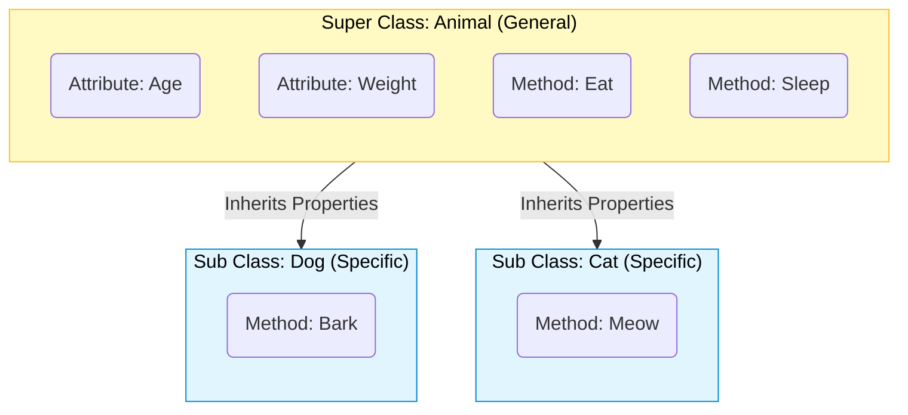
```mermaid
graph TD
    %% Parent Class (General)
    subgraph Parent ["Super Class: Animal (General)"]
        direction TB
        Attr1(Attribute: Age)
        Attr2(Attribute: Weight)
        Method1(Method: Eat)
        Method2(Method: Sleep)
    end

    %% Child Classes (Specific)
    subgraph Child1 ["Sub Class: Dog (Specific)"]
        direction TB
        DogUnique(Method: Bark)
    end

    subgraph Child2 ["Sub Class: Cat (Specific)"]
        direction TB
        CatUnique(Method: Meow)
    end

    %% Inheritance Relationships
    Parent -->|Inherits Properties| Child1
    Parent -->|Inherits Properties| Child2

    %% Styling
    style Parent fill:#fff9c4,stroke:#fbc02d,color:black
    style Child1 fill:#e1f5fe,stroke:#0288d1,color:black
    style Child2 fill:#e1f5fe,stroke:#0288d1,color:black
```

---
### 1. فلسفة الـ Polymorphism: "التعامل مع المجهول" 🎭

**(The Philosophy of Handling the Unknown)**

في البرمجة التقليدية (C Style)، لازم تكون عارف كل حاجة بالتفصيل قبل ما البرنامج يشتغل.

في الـ Java (OOP)، إحنا بنصمم الكود عشان يتعامل مع حاجات لسه مش موجودة!

**المثال الأعمق (USB Port):**

- مدخل الـ USB في اللابتوب هو **(Interface)**.
    
- اللابتوب ميعرفش أنت هتركب فيه إيه (ماوس؟ كيبورد؟ مروحة؟).
    
- لكن اللابتوب مبرمج إنه يبعت رسالة واحدة: `"Get Power & Start Data"`.
    
    - لو ركبت **ماوس**: هيفهم الرسالة وينور الليزر.
        
    - لو ركبت **كيبورد**: هيفهم الرسالة وينور اللمبات.
        
    - لو ركبت **مروحة**: هتفهم الرسالة وتلف.
        

ده هو الـ Polymorphism: **واجهة واحدة (USB Port)، واستجابات متعددة (حسب الجهاز اللي ركب).**

---

### 2. أنواع الـ Polymorphism (تشريح تقني) ⚙️

الجافا بتعمل السحر ده بطريقتين، ولازم تفرق بينهم زي اسمك:

#### أ) Static Polymorphism (Overloading) - "تعدد وقت الكتابة"

ده النوع "الطيب". الكومبايلر بيعرفه وأنت بتكتب الكود.

- **الفكرة:** دوال بنفس الاسم بس "بتاخد داتا مختلفة".
    
- **المثال:** دالة `print(int x)` ودالة `print(String s)`.
    
- **الربط:** ده بيعتمد على **Encapsulation**، إنك عامل كلاس منظم فيه دوال بتقوم بمهام متشابهة بأسماء نظيفة.
    

#### ب) Dynamic Polymorphism (Overriding) - "تعدد وقت التشغيل"

ده النوع "الشرير والعبقري" (The Real Magic). ده اللي بيحصل فيه **Late Binding**.

- **الفكرة:** الكومبايلر ميكونش عارف هو هينادي انهي دالة بالظبط! القرار بيتأجل لحد ما البرنامج يشتغل (Runtime).
    
- **السر:** هنا بنستخدم **Inheritance** عشان نعمل "أب" (Superclass) و"أبناء" (Subclasses) بيغيروا سلوك الأب.
    

---

### 3. ربط الـ Principles ببعض (The Holy Trinity) 🔗

السلايد كان بيشرح كل واحد لوحده، بس في الحقيقة هم "تروس" في مكنة واحدة. ركز في السيناريو ده:

تخيل بنعمل نظام دفع إلكتروني (Payment System).

#### الخطوة 1: Inheritance (التوريث - الهيكل العظمي) 💀

هنعمل كلاس أب اسمه `PaymentMethod`، وكلاسات أبناء: `Visa`, `MasterCard`, `PayPal`.

- **الفايدة:** وفرنا كود، وعملنا تسلسل هرمي (Hierarchy). أي وسيلة دفع هي في الأصل `IS-A PaymentMethod`.
    

#### الخطوة 2: Encapsulation (التغليف - الحماية) 🛡️

جوه كلاس Visa، رقم الكارت cardNumber هيكون private.

وطريقة الاتصال بالبنك هتكون جوه ميثود pay() ومحدش يعرف تفاصيلها.

- **الفايدة:** الـ Polymorphism مش محتاج يعرف "إزاي" الفيزا بتدفع، هو بس محتاج ينادي `pay()`. التفاصيل "مغلفة".
    

#### الخطوة 3: Polymorphism (الذكاء - المخ) 🧠

هنا اللحظة الحاسمة. الكود بتاعك هيكون كده:

Java

```java
// دالة بتستقبل "أي" وسيلة دفع
public void processPayment(PaymentMethod method) {
    method.pay(100); // السحر هنا!
}
```

- لو بعت `Visa`.. الـ Java هتشغل `Visa.pay()`.
    
- لو بعت `PayPal`.. الـ Java هتشغل `PayPal.pay()`.
    
- **المفاجأة:** لو بعد سنة ضفت طريقة دفع جديدة `Bitcoin`.. الدالة `processPayment` **مش هتتعدل ولا حرف!** (Extensibility).
    

---

### 4. المخطط الهندسي العميق (The Dynamic Binding Flow) 📊

المخطط ده بيوضح إزاي الـ Runtime بيقرر ينادي مين، وإزاي الـ 3 مبادئ شغالين مع بعض.

Code snippet

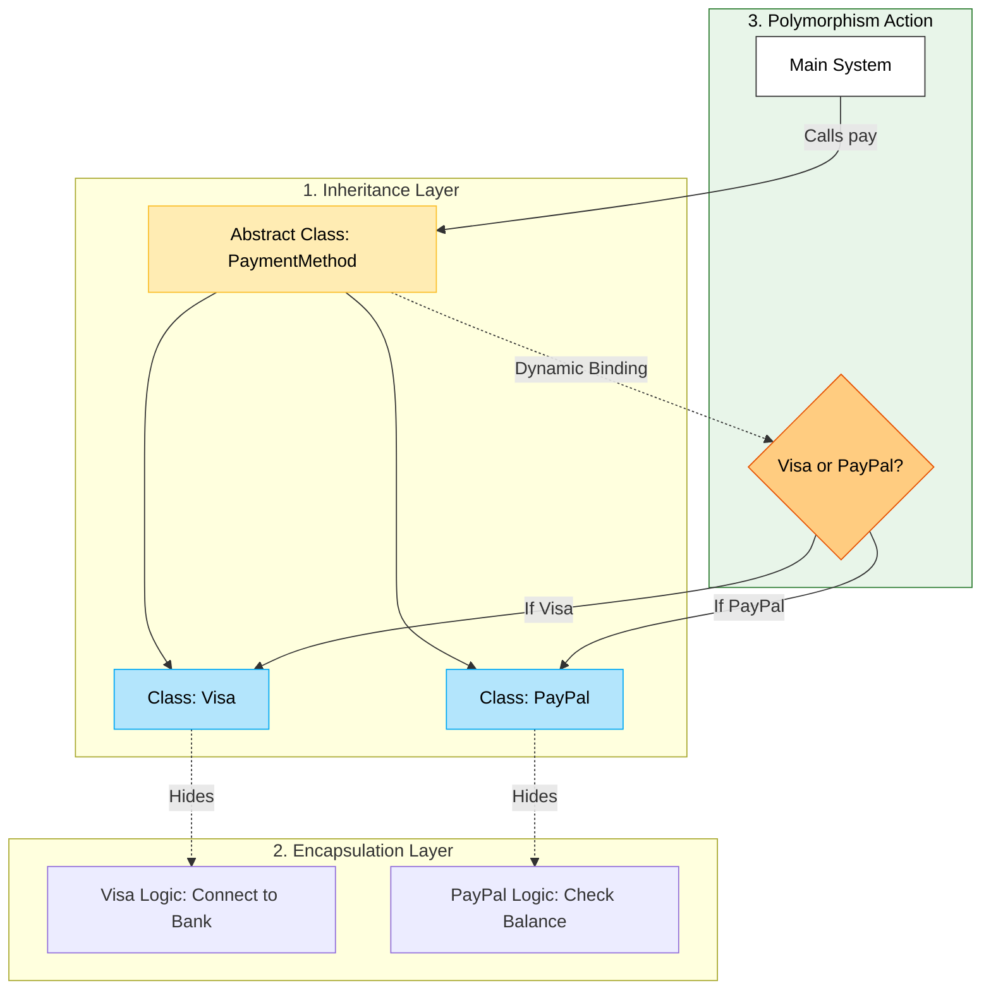
```mermaid
graph TD
    %% 1. Define Nodes
    Parent[Abstract Class: PaymentMethod]
    Child1[Class: Visa]
    Child2[Class: PayPal]
    
    Secret1[Visa Logic: Connect to Bank]
    Secret2[PayPal Logic: Check Balance]
    
    UserCode[Main System]
    Decision{Visa or PayPal?}

    %% 2. Structure & Connections
    subgraph Inheritance [1. Inheritance Layer]
        direction TB
        Parent --> Child1
        Parent --> Child2
    end

    subgraph Encapsulation [2. Encapsulation Layer]
        direction TB
        Child1 -.->|Hides| Secret1
        Child2 -.->|Hides| Secret2
    end

    subgraph Polymorphism [3. Polymorphism Action]
        direction TB
        UserCode -->|Calls pay| Parent
        Parent -.->|Dynamic Binding| Decision
        
        Decision -->|If Visa| Child1
        Decision -->|If PayPal| Child2
    end

    %% 3. Styling
    style Parent fill:#ffecb3,stroke:#fbc02d,color:black
    style Child1 fill:#b3e5fc,stroke:#03a9f4,color:black
    style Child2 fill:#b3e5fc,stroke:#03a9f4,color:black
    style UserCode fill:#fff,stroke:#333,color:black
    style Polymorphism fill:#e8f5e9,stroke:#2e7d32,color:black
    style Decision fill:#ffcc80,stroke:#e65100,color:black
```

### 💡 الخلاصة السينيور (The Senior Verdict)

- **Encapsulation:** بيخلي الكائن "صندوق أسود" (محدش يلمس الداتا).
    
- **Inheritance:** بيخلي الصناديق دي "قرايب" (عشان نعاملهم معاملة واحدة).
    
- **Polymorphism:** بيخلينا نكلم الصناديق دي كلها "بلغة واحدة" (Interface)، وكل صندوق يرد بطريقته.
    

بدون Polymorphism، كنت هتضطر تكتب `if (type == Visa) ... else if (type == PayPal) ...` وده كود "مبتدئين" غير قابل للتطوير. الـ Polymorphism هو سر الـ **Clean Code**.

---
### The Anatomy of a Java Program 🧬

**(تشريح الكود)**

الكود اللي قدامك ده مش مجرد سطور، ده هيكل معماري صارم.

Java

```java
/*
This is a simple Java program.
Call this file "Example.java".
*/
class Example {
    // Your program begins with a call to main().
    public static void main(String args[]) {
        System.out.println("This is a simple Java program.");
    }
}
```

**Compilation Unit (وحدة التجميع)**

- الملف النصي اللي بتكتب فيه الكود (اللي آخره `.java`) اسمه الرسمي في الجافا **Compilation Unit**.
    
- **القاعدة الذهبية:** اسم الملف لازم يطابق اسم الـ Class اللي جواه (Case Sensitive).
    
    - الكلاس اسمه `Example`؟ يبقى الملف لازم يكون `Example.java`. لو سميته `example.java` (بحرف صغير) الكومبايلر هيعترض.
        

**The Class Block**

- `class Example { ... }`
    
- في الجافا، مفيش دالة يتيمة. أي كود لازم يعيش جوه **Class**. الكلاس هو "الحاوية" الأساسية للكود والبيانات (زي ما شرحنا في الـ Encapsulation).
    

---

### The Sacred Line: `public static void main` 🗝️

**(السطر المقدس)**

ده أهم سطر في الجافا، وده المدخل (Entry Point) اللي الـ JVM بيدور عليه عشان يبدأ البرنامج. ليه مكتوب كده؟

- **`public`:** عشان الـ JVM (اللي هو برنامج خارجي) يقدر يشوف الدالة ويناديها. لو كانت `private`، الـ JVM مش هيقدر يدخل.
    
- **`static`:** دي كلمة السر. الـ `main` بتشتغل **قبل** ما أي Object يتخلق في الميموري. الـ JVM بيناديها باسم الكلاس مباشرة `Example.main()`، مش محتاج يعمل `new Example()`.
    
- **`void`:** الـ `main` مش بترجع قيمة. لما بتخلص، البرنامج بيموت.
    
- **`String args[]`:** دي مصفوفة بتشيل أي كلام بتكتبه جنب اسم البرنامج وأنت بتشغله (Command Line Arguments).
    

---

### The Lifecycle: From Text to Life 🔄

**(دورة حياة البرنامج)**

هنا بنشوف الـ Buzzwords اللي شرحناها (Compiler, Bytecode, JVM) وهي شغالة عملي.

**Step 1: Compiling (الترجمة)**

- **الأمر:** `javac Example.java`
    
- **اللي بيحصل:** الـ Compiler (`javac`) بيقرأ الكود، يتأكد إن مفيش أخطاء (Syntax Errors)، ويحوله لـ **Bytecode**.
    
- **النتيجة:** ملف جديد بيظهر اسمه `Example.class`.
    
    - الملف ده **مفيهوش** Machine Code.
        
    - الملف ده فيه **Bytecode** (لغة الـ JVM).
        

**Step 2: Running (التشغيل)**

- **الأمر:** `java Example`
    
- **ملاحظة خطيرة:** لاحظ إننا كتبنا `Example` بس، من غير `.class` ومن غير `.java`.
    
- **اللي بيحصل:**
    
    1. برنامج الـ Launcher (`java`) بيقوم الـ **JVM**.
        
    2. الـ JVM بيحمل ملف `Example.class` في الميموري.
        
    3. بيدور على دالة `main` ويبدأ ينفذ التعليمات سطر سطر (أو يديها للـ JIT Compiler).
        
- **النتيجة:** الجملة تظهر على الشاشة.
    

---

### 📊 المخطط الهندسي (The Workflow)

ده الرسم اللي بيوضح الرحلة من الكيبورد بتاعك لحد الشاشة، وتطبيق مفهوم الـ "Write Once, Run Anywhere".


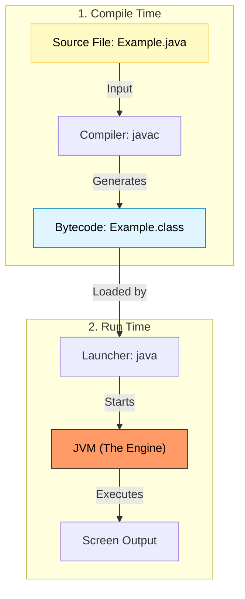
```mermaid
graph TD
    %% Nodes Definition
    SourceFile["Source File: Example.java"]
    Compiler["Compiler: javac"]
    BytecodeFile["Bytecode: Example.class"]
    Launcher["Launcher: java"]
    JVM["JVM (The Engine)"]
    Output["Screen Output"]

    %% Flow
    subgraph Development [1. Compile Time]
        direction TB
        SourceFile -->|Input| Compiler
        Compiler -->|Generates| BytecodeFile
    end

    subgraph Execution [2. Run Time]
        direction TB
        BytecodeFile -->|Loaded by| Launcher
        Launcher -->|Starts| JVM
        JVM -->|Executes| Output
    end

    %% Styling
    style SourceFile fill:#fff9c4,stroke:#fbc02d,color:black
    style BytecodeFile fill:#e1f5fe,stroke:#0288d1,color:black
    style JVM fill:#f96,stroke:#333,color:black
```

### 💡 Senior Tip (نصيحة محترف)

لو جيت تشغل البرنامج وكتبت java Example.class، الـ Java هتضرب Error مشهور جداً:

Could not find or load main class Example.class.

ليه؟ لأن الـ java command منتظر اسم Class (منطقي)، مش اسم ملف (فيزيائي). هو أوتوماتيك عارف إنه هيدور على .class، فمتكتبش الامتداد.

---
### The Silent Code: Comments 🤫

**(الكود الصامت: التعليقات)**

التعليقات هي سطور **للبشر فقط**. الـ Compiler بيعملها "Ignore" تماماً وكأنه مش شايفها. وظيفتها الوحيدة هي التوثيق (Documentation).

الجافا بتقدم 3 أنواع، وكل نوع ليه استخدامه الاحترافي:

- **Single Line Comment `//`**:
    
    - ده للملاحظات السريعة. أي حاجة بعد العلامة دي لحد آخر السطر بتعتبر تعليق.
        
    - _استخدامه:_ شرح سطر كود معقد، أو تهميش سطر مؤقتاً (Debugging).
        
- **Multiline Comment `/* ... */`**:
    
    - ده للمقالات القصيرة. ممكن تكتب فيه سطور كتير ورا بعض.
        
    - _استخدامه:_ شرح خوارزمية كاملة، أو كتابة حقوق الملكية في أول الملف.
        
- **Documentation Comment `/** ... */` (Javadoc)**: 🛑 **ركز هنا عشان دي بتاعة السينيور**
    
    - شكله شبه الـ Multiline بس بيبدأ بـ `/**`.
        
    - النوع ده مش مجرد ملاحظات. ده بيتعالج بأداة اسمها `javadoc`.
        
    - الأداة دي بتسحب الكلام اللي جوه التعليق ده وتطلع منه ملفات **HTML** (صفحات ويب) تشرح الكود بتاعك تلقائياً.
        
    - ده اللي بيتعمل بيه الـ Java Official Documentation اللي بنذاكر منها!
        

---

### The Container: Class Definition 📦

**(الوعاء: تعريف الكلاس)**

Java

```java
class Example {
    // ...
}
```

السطر ده هو إعلان الميلاد.

- **`class`**: دي **Keyword** (كلمة محجوزة). بتقول للكومبايلر: "أنا هبدأ أعرف كلاس جديد دلوقتي".
    
- **`Example`**: ده **Identifier** (اسم المعرف). ده الاسم اللي أنت اخترته للكلاس.
    
    - _قاعدة:_ لازم يبدأ بحرف كابيتال (PascalCase) كعرف سائد (Convention).
        
    - _شرط:_ لازم يكون مطابق لاسم الملف `Example.java`.
        
- **`{ }` (Curly Braces)**: دي حدود الدولة.
    
    - القوس المفتوح `{`: بداية الكلاس.
        
    - القوس المقفول `}`: نهاية الكلاس.
        
    - أي حاجة بره الأقواس دي متخصش الكلاس ده.
        

---

### The Gatekeeper: `public` Access Modifier 🔓

**(البواب: إذن الدخول)**

Java

```java
public static void main(String args[])
```

السلايد ركزت جداً على كلمة **`public`**. ليه الـ main لازم تكون public؟

- **Access Modifier (محدد الوصول):** دي كلمات بتتحكم مين يقدر يشوف الكود ومين لا (`public`, `private`, `protected`).
    
- **لماذا Public؟**
    
    - دالة الـ `main` هي أول حاجة بتشتغل.
        
    - مين اللي بيشغلها؟ الـ **JVM**.
        
    - الـ JVM ده برنامج خارجي (غريب عن الكلاس بتاعك).
        
    - عشان الغريب يقدر يدخل جوه الكلاس وينادي الدالة، لازم الدالة تكون "مشاع" أو "عامة" (**Public**).
        
    - لو خليتها `private`، الـ JVM هيخبط على الباب ومش هيعرف يدخل، والبرنامج هيضرب `Main method not found`.
        

---

### 📊 المخطط الهندسي (Anatomy of Execution)

المخطط ده بيوضح العلاقة بين الـ JVM (الطارق) وبين الـ `public main` (الباب المفتوح)، ودور التعليقات المختفية.

Code snippet

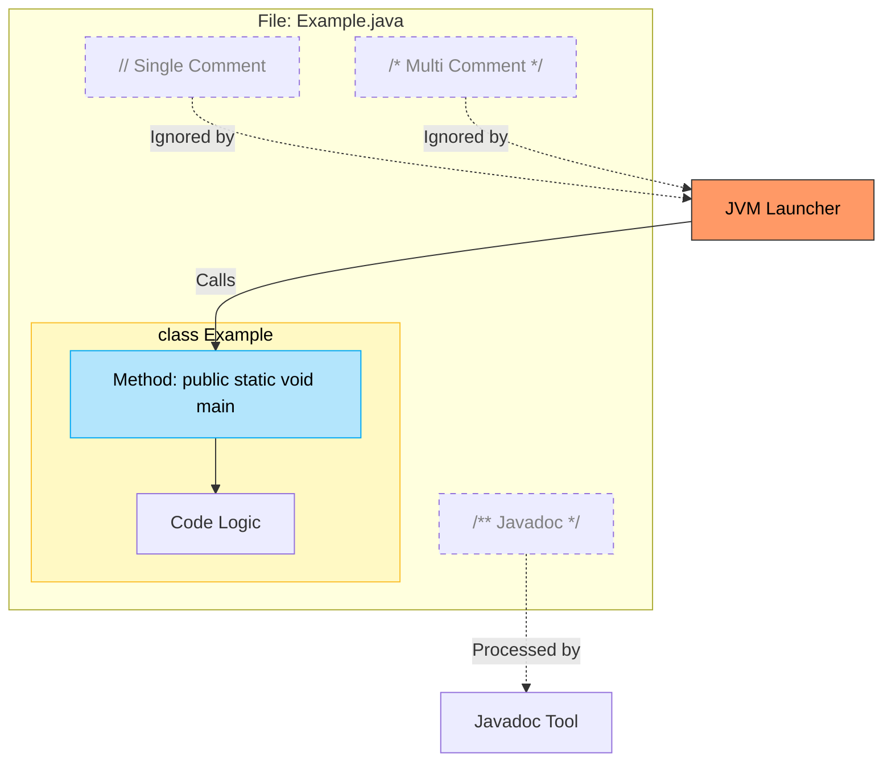
```mermaid
graph TD
    %% Entities
    JVM[JVM Launcher]
    JavadocTool[Javadoc Tool]
    
    subgraph File_Scope [File: Example.java]
        direction TB
        
        %% 🛑 الحماية: لازم علامات تنصيص عشان الرموز دي متعملش مشاكل
        Comment1["// Single Comment"]
        Comment2["/* Multi Comment */"]
        Comment3["/** Javadoc */"]
        
        %% The Class Structure
        subgraph Class_Scope [class Example]
            direction TB
            MainMethod["Method: public static void main"]
            CodeLogic[Code Logic]
            
            MainMethod --> CodeLogic
        end
    end

    %% Relationships
    JVM -->|Calls| MainMethod
    
    Comment1 -.->|Ignored by| JVM
    Comment2 -.->|Ignored by| JVM
    Comment3 -.->|Processed by| JavadocTool

    %% Styles
    style JVM fill:#f96,stroke:#333,color:black
    style MainMethod fill:#b3e5fc,stroke:#03a9f4,color:black
    style Class_Scope fill:#fff9c4,stroke:#fbc02d,color:black
    style Comment1 stroke-dasharray: 5 5,color:gray
    style Comment2 stroke-dasharray: 5 5,color:gray
    style Comment3 stroke-dasharray: 5 5,color:gray
```

### 💡 الخلاصة (Senior Insight)

الـ Curly Braces {} هما اللي بيحددوا الـ Scope (المجال).

في الجافا، المتغير اللي يتعرف جوه قوسين، بيموت بمجرد ما نخرج منهم. دي معلومة هتحتاجها جداً قدام في الـ Memory Management.

---
### 1. The `static` Mystery 👻

**(سر الكلمة الثابتة)**

> _• The keyword static allows main() to be called without having to instantiate a particular instance..._

السؤال الفلسفي:

عشان تنادي أي دالة في الجافا، لازم الأول تعمل new Object() من الكلاس بتاعها، صح؟

طيب مين هيعمل new Example() عشان ينادي main، إذا كان main هي أصلاً بداية البرنامج؟!! (دي مشكلة البيضة والفرخة).

الحل السحري (static):

كلمة static بتقول للـ JVM: "يا عم الـ JVM، الدالة دي مستقلة، مش محتاجة Object عشان تشتغل. هي محفورة في ذاكرة الكلاس نفسه".

- عشان كده الـ JVM بيقدر يناديها كده: `Example.main()` من غير ما يضطر يعمل `new Example()`.
    

---

### 2. The `void` Void ⚫

**(اللاعودة)**

> _• The keyword void simply tells the compiler that main() does not return a value._

الـ `main` هي "المحطة الأخيرة". لما بتخلص، البرنامج بيقفل.

- مفيش حد مستني منها نتيجة (Result) ترجعله.
    
- لو كانت بترجع `int` (زي لغة C++)، كان لازم نكتب `return 0;`، بس الجافا قالتلك "خليها `void` وريح دماغك".
    

---

### 3. The Doorbell: `String args[]` 🔔

**(جرس الباب)**

> _• args receives any command-line arguments..._

ده "صندوق البوسته" بتاع البرنامج.

لو حبيت تبعت رسالة للبرنامج وهو بيبدأ (زي ما بتعمل في الـ Command Line)، الرسالة دي بتدخل هنا.

- **مثال:** لو شغلت البرنامج وكتبت `java Example Hello`
    
- الـ JVM هياخد كلمة "Hello" ويحطها جوه المصفوفة دي: `args[0] = "Hello"`.
    

---

### 4. The Printing Chain: `System.out.println` 🖨️

**(سلسلة الطباعة)**

السطر ده `System.out.println("...")` هو أشهر سطر، بس هو عبارة عن "سلسلة" (Chain) من 3 حلقات:

1. **`System` (The Class):**
    
    - ده كلاس ضخم جاهز في الجافا. ده "السفير" اللي بيكلم نظام التشغيل (Windows/Linux).
        
2. **`.out` (The Object):**
    
    - ده متغير `static` جوه كلاس `System`.
        
    - وظيفته: ماسك "كابل" واصل بالشاشة السوداء (Console).
        
3. **`.println()` (The Method):**
    
    - دي الدالة اللي جوه الـ `out` اللي بتاخد الكلام وتزقه في الكابل عشان يظهر على الشاشة.
        

---

### 📊 المخطط الهندسي (The Chain of Command)

ده رسم بيوضح تسلسل عملية الطباعة ومين بيكلم مين:

Code snippet

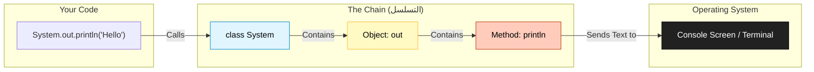
```mermaid
graph LR
    subgraph The_Code ["Your Code"]
        Instruction["System.out.println('Hello')"]
    end

    subgraph The_Chain ["The Chain (التسلسل)"]
        direction TB
        Sys[class System]
        Out[Object: out]
        Method[Method: println]
        
        Sys -->|Contains| Out
        Out -->|Contains| Method
    end

    subgraph The_OS ["Operating System"]
        Console[Console Screen / Terminal]
    end

    Instruction -->|Calls| Sys
    Method -->|Sends Text to| Console

    style Sys fill:#e1f5fe,stroke:#0288d1,color:black
    style Out fill:#fff9c4,stroke:#fbc02d,color:black
    style Method fill:#ffccbc,stroke:#bf360c,color:black
    style Console fill:#212121,stroke:#000,color:white
```

### 💡 الخلاصة (Senior Takeaway)

في الجافا، النقطة . معناها "ادخل جوه".

System.out.println تترجم لـ:

"هات كلاس System --> ادخل هات منه الكائن out --> ادخل هات منه الدالة println ونفذها".

---
### The Birth of a Variable: Declaration 📦

**(ميلاد المتغير: الإعلان)**

Java

```java
int num; // this declares a variable called num
```

السطر ده هو أمر مباشر لنظام التشغيل.

- **`int` (Type):** بتقول للـ Java: "أنا عايز صندوق حجمه 32-bit، ونوعه مخصص للأرقام الصحيحة بس (Integer)".
    
- **`num` (Identifier):** ده "الاستيكر" اللي بتلزقه على الصندوق عشان تعرف تناديه بعدين.
    
- **قاعدة السينيور:** الجافا لغة **Strongly Typed**. يعني لو حجزت صندوق `int`، مستحيل تحط فيه نص `String` أو كسر `double`. الصندوق ده للأرقام الصحيحة وفقط.
    

### The Assignment: Right-to-Left Rule ⬅️

**(التعيين: قاعدة اليمين للشمال)**

Java

```java
num = 100;
```

في الرياضيات، علامة `=` معناها "يساوي". في البرمجة، معناها **"خُذ القيمة دي وحطها هناك"**.

- الكمبيوتر بينفذ السطر ده من **اليمين لليسار**.
    
- بياخد الـ `100` (Value).
    
- ويروح يحطها جوه الصندوق اللي اسمه `num`.
    
- الآن، أي مكان في الكود هتكتب فيه كلمة `num`، الكمبيوتر هيشوف مكانها `100`.
    

### The Magic Operator: Concatenation `+` 🔗

**(الزائد السحري)**

Java

```java
System.out.println("This is num: " + num);
```

هنا علامة الـ `+` بتلعب دور جديد (Operator Overloading).

- لو الـ `+` بين رقمين ⬅️ بتجمعهم (Math).
    
- لو الـ `+` جه بعدها أو قبلها **String** ⬅️ بتتحول لـ **"لزق" (Concatenation)**.
    
- **اللي بيحصل في الكواليس:** الجافا بتاخد قيمة `num` (اللي هي 100)، وتحولها لنص "100"، وتلزقها جنب الجملة، فالنتيجة تطلع: `This is num: 100`.
    

### Manipulation & Reassignment 🔄

**(التلاعب وإعادة التعيين)**

Java

```java
num = num * 2;
```

ده أهم سطر في البرنامج. السطر ده بيثبت إن المتغير اسمه "متغير" (Variable) لأنه قابل للتغيير.

الترتيب مهم جداً هنا:

1. **Fetch:** الكمبيوتر يروح الذاكرة يجيب قيمة `num` القديمة (100).
    
2. **Calculate:** يضربها في 2 (النتيجة 200).
    
3. **Store:** ياخد الـ 200 الجديدة، ويمسح الـ 100 القديمة، ويحط مكانها 200.
    

### `print` vs `println` 🖨️

**(الفرق بين الطباعة)**

في الكود استخدمنا الاتنين:

- **`println`:** اطبع الكلام وانزل سطر جديد (Enter).
    
- **`print`:** اطبع الكلام وخليك واقف مكانك في نفس السطر.
    
- عشان كده جملة `The value of num * 2 is` وجملة `200` طلعوا جنب بعض في سطر واحد.
    

### 📊 مخطط الذاكرة (Memory Timeline)

المخطط ده بيوضح إزاي قيمة الصندوق `num` بتتغير مع مرور الوقت والأسطر.

Code snippet

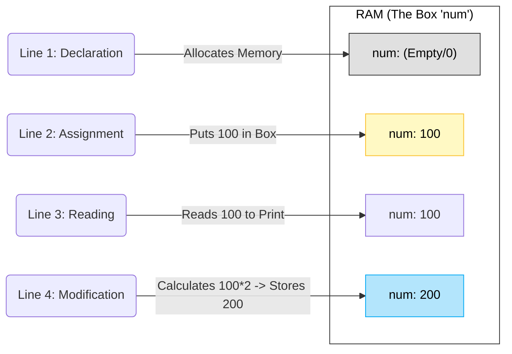
```mermaid
graph LR
    %% States of the Variable
    Step1(Line 1: Declaration)
    Step2(Line 2: Assignment)
    Step3(Line 3: Reading)
    Step4(Line 4: Modification)

    %% Memory Visualization
    subgraph Memory_State ["RAM (The Box 'num')"]
        direction TB
        State1["num: (Empty/0)"]
        State2["num: 100"]
        State3["num: 100"]
        State4["num: 200"]
    end

    %% Flow
    Step1 -->|Allocates Memory| State1
    Step2 -->|Puts 100 in Box| State2
    Step3 -->|Reads 100 to Print| State3
    Step4 -->|Calculates 100*2 -> Stores 200| State4

    %% Styling
    style State1 fill:#e0e0e0,stroke:#333,color:black
    style State2 fill:#fff9c4,stroke:#fbc02d,color:black
    style State4 fill:#b3e5fc,stroke:#03a9f4,color:black
    style Memory_State fill:#fff,stroke:#333,color:black
```

نصيحة سينيور: 💡

لاحظ إننا عرفنا المتغير int num; مرة واحدة بس في الأول.

لما جينا نغير قيمته كتبنا num = ... على طول من غير int.

لو كتبت int num = ... تاني، الكومبايلر هيضرب Error ويقولك: Variable 'num' is already defined. الصندوق بيتحجز مرة واحدة بس.

---
### 1. كود `IfSample.java` (تتبع تغير الحالة) 🚦

الكود ده بيعلمك إن "الشرط" (Condition) نتيجته بتتغير لما "قيمة المتغير" تتغير.

Java

```java
/*
Demonstrate the if. Call this file "IfSample.java".
*/
class IfSample {
    public static void main(String args[]) {
        int x, y;
        
        // 1. البداية
        x = 10; 
        y = 20;
        
        // 2. المقارنة الأولى (x بـ 10 و y بـ 20)
        if(x < y) System.out.println("x is less than y");
        
        // 3. التغيير الأول (x انضربت في 2 بقت 20)
        x = x * 2;
        if(x == y) System.out.println("x now equal to y");
        
        // 4. التغيير الثاني (x انضربت في 2 بقت 40)
        x = x * 2;
        if(x > y) System.out.println("x now greater than y");
        
        // 5. الشرط المستحيل (40 لا تساوي 20)
        if(x == y) System.out.println("you won't see this");
    }
}
```

**🔍 تحليل التنفيذ (Execution Trace):**

1. **السطر 10:** `x=10, y=20`. هل 10 < 20؟ **(نعم)** ✅.
    
    - _النتيجة:_ يطبع `x is less than y`.
        
2. **السطر 13:** `x` انضربت في 2، قيمتها بقت **20**.
    
3. **السطر 14:** هل 20 == 20؟ **(نعم)** ✅.
    
    - _النتيجة:_ يطبع `x now equal to y`.
        
4. **السطر 17:** `x` انضربت في 2، قيمتها بقت **40**.
    
5. **السطر 18:** هل 40 > 20؟ **(نعم)** ✅.
    
    - _النتيجة:_ يطبع `x now greater than y`.
        
6. **السطر 21:** هل 40 == 20؟ **(لأ)** ❌.
    
    - _النتيجة:_ يتجاهل السطر والبرنامج ينتهي.
        

---

### 2. كود `ForTest.java` (الدائرة المغلقة) 🔄

الكود ده بيوضح الـ 3 أجزاء بتوع اللوب: (ابدأ منين، اقف امتى، امشي إزاي).

Java

```java
/*
Demonstrate the for loop. Call this file "ForTest.java".
*/
class ForTest {
    public static void main(String args[]) {
        int x;
        
        // البداية; الشرط; الخطوة
        for(x = 0; x < 10; x = x + 1)
            System.out.println("This is x: " + x);
    }
}
```

**🔍 تحليل اللوب (Loop Anatomy):**

- **Initialization (`x = 0`):** بتحصل مرة واحدة في الأول. العداد بيبدأ بـ صفر.
    
- **Condition (`x < 10`):** السؤال اللي بيتسأل قبل كل لفة. "هل لسه موصلتش للـ 10؟".
    
- **Iteration (`x = x + 1`):** دي الخطوة اللي بتتم **بعد** الطباعة. بيزود 1 ويرجع يسأل السؤال تاني.
    

الناتج (Output):

هيطبع من This is x: 0 لحد This is x: 9.

بمجرد ما الـ x تبقى 10، الشرط x < 10 هيبقى False، والبرنامج يخرج.

---

### 📊 مخطط تتبع الذاكرة (Memory Logic)

المخطط ده بيوضحلك إزاي قيمة `x` بتتغير في كود `IfSample` وتأثيرها على قرار الـ `if`.

Code snippet

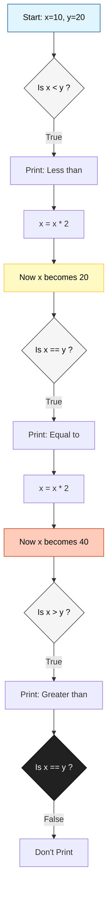
```mermaid
graph TD
    %% تعريف الحالات
    Start[Start: x=10, y=20]
    
    Check1{Is x < y ?}
    Print1[Print: Less than]
    
    Update1[x = x * 2]
    State1[Now x becomes 20]
    
    Check2{Is x == y ?}
    Print2[Print: Equal to]
    
    Update2[x = x * 2]
    State2[Now x becomes 40]
    
    Check3{Is x > y ?}
    Print3[Print: Greater than]
    
    Check4{Is x == y ?}
    DeadEnd[Don't Print]

    %% المسار
    Start --> Check1
    Check1 -->|True| Print1
    Print1 --> Update1
    Update1 --> State1
    
    State1 --> Check2
    Check2 -->|True| Print2
    Print2 --> Update2
    Update2 --> State2
    
    State2 --> Check3
    Check3 -->|True| Print3
    Print3 --> Check4
    Check4 -->|False| DeadEnd

    %% التنسيق
    style Start fill:#e1f5fe,stroke:#01579b,color:black
    style State1 fill:#fff9c4,stroke:#fbc02d,color:black
    style State2 fill:#ffccbc,stroke:#bf360c,color:black
    style Check1 fill:#f5f5f5,stroke:#333,color:black
    style Check2 fill:#f5f5f5,stroke:#333,color:black
    style Check3 fill:#f5f5f5,stroke:#333,color:black
    style Check4 fill:#212121,stroke:#000,color:white
```
---

### 1. The Logical Unit (الوحدة المنطقية) 📦

في الجافا، الـ `if` أو الـ `for` بطبيعتهم بيتحكموا في **سطر واحد بس** بييجي وراهم.

- لو عايزهم يتحكموا في 10 سطور؟ لازم تحطهم جوه "صندوق".
    
- الصندوق ده هو **الأقواس المعقوفة `{ }` (Curly Braces)**.
    

**القاعدة:**

> "Any place that a single statement can be used, a block can be used."
> 
> (أي مكان ينفع تحط فيه سطر، ينفع تحط فيه بلوك).

---

### 2. The Trap: Indentation is a Lie 🤥

**(الفخ: المسافات كدابة)**

في لغات زي Python، المسافات (Indentation) بتحدد مين تبع مين.

في Java، الكومبايلر أعمى عن المسافات. هو بيشوف { } وبس.

**شوف الكارثة دي (بدون بلوك):**

Java

```java
if (x < 10)
    y = 5;          // السطر ده تبع الـ if
    z = 10;         // ❌ مصيبة: السطر ده هيتنفذ دايماً، سواء الشرط صح أو غلط!
```

الكمبيوتر شايف إن `z = 10` دي بره الـ `if` خالص، حتى لو أنت راسمها تحتها.

**الحل (بالبلوك):**

Java

```java
if (x < 10) {       // بداية البلوك
    y = 5;
    z = 10;         // ✅ تمام: السطر ده بقى محمي جوه الصندوق
}                   // نهاية البلوك
```

---

### 3. Senior Insight: Variable Scope (عمر المتغير) ⏳

**(سر السينيور)**

أخطر حاجة في الـ Code Block مش بس التجميع، لكن **"الخصوصية"**.

- أي متغير تعرفه جوه `{ }`.. **بيموت** بمجرد ما تخرج من الـ `}`.
    
- ده بنسميه **Block Scope**.
    

Java

```java
if (x > 0) {
    int secret = 100; // متغير اتولد هنا
    System.out.println(secret); // شغال تمام
}

// System.out.println(secret); // ❌ Error!
// الكومبايلر هيقولك: مين secret ده؟ المتغير ده مات خلاص.
```

---

### 📊 المخطط الهندسي (Logic Flow)

المخطط ده بيوضح الفرق الجوهري في تدفق الكود بين "سطر واحد" و "بلوك كامل".

Code snippet

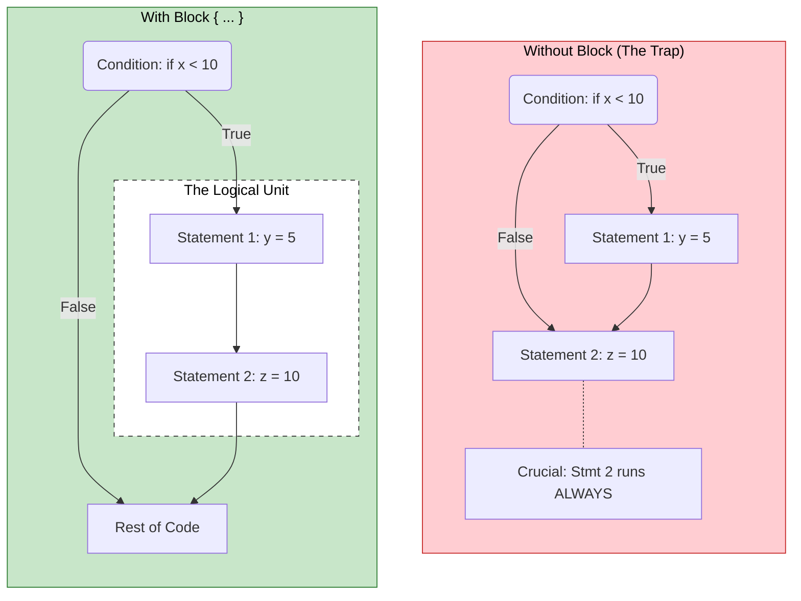
```mermaid
graph TD
    subgraph Scenario_A ["Without Block (The Trap)"]
        direction TB
        Start1(Condition: if x < 10)
        Stmt1[Statement 1: y = 5]
        Stmt2[Statement 2: z = 10]
        
        Start1 -->|True| Stmt1
        Start1 -->|False| Stmt2
        Stmt1 --> Stmt2
        
        Note1[Crucial: Stmt 2 runs ALWAYS]
        Stmt2 -.- Note1
    end

    subgraph Scenario_B ["With Block { ... }"]
        direction TB
        Start2(Condition: if x < 10)
        
        subgraph TheBlock ["The Logical Unit"]
            BlockStmt1[Statement 1: y = 5]
            BlockStmt2[Statement 2: z = 10]
            BlockStmt1 --> BlockStmt2
        end
        
        End2[Rest of Code]
        
        Start2 -->|True| BlockStmt1
        Start2 -->|False| End2
        BlockStmt2 --> End2
    end

    style Scenario_A fill:#ffcdd2,stroke:#c62828,color:black
    style Scenario_B fill:#c8e6c9,stroke:#2e7d32,color:black
    style TheBlock fill:#fff,stroke:#333,stroke-dasharray: 5 5,color:black
```

الخلاصة:

الـ { } هما "السور" اللي بيحمي الكود بتاعك. نصيحة مني، دايماً استخدم الـ Blocks مع if و for حتى لو هتكتب سطر واحد بس، عشان تحمي نفسك من أخطاء المستقبل.

---
### 1. Whitespace: The Freedom 🕊️

**(المسافات البيضاء: الحرية المطلقة)**

الجافا لغة **Free-form Language**.

- **يعني إيه؟** يعني الجافا مش بتشوف المسافات، ولا الـ Tabs، ولا السطور الجديدة (Enter).
    
- **الدليل:** أنت ممكن تكتب البرنامج كله في سطر واحد طويل جداً، وهيشتغل عادي!
    
- **السر:** السر هو الـ **Semicolon `;`**. دي اللي بتقول للجافا "السطر خلص"، مش زرار الـ Enter زي لغة Python.
    
- **نصيحة:** رغم إن الجافا مش بتجبرك على التنسيق (Indentation)، بس إحنا كبشر لازم ننسق الكود عشان نقدر نقراه (Code Readability).
    

---

### 2. Identifiers: The Naming Game 🏷️

**(المعرفات: لعبة الأسماء)**

الـ Identifier هو "الاسم" اللي أنت بتديه لأي حاجة (اسم متغير، اسم كلاس، اسم دالة).

عشان تختار اسم، فيه قوانين صارمة (Syntax Rules) وفيه عرف (Conventions).

#### 🚦 القوانين الصارمة (Compiler Rules):

1. **البداية:** لازم يبدأ بـ (حرف `A-Z`، أو `_`، أو `$`). **ممنوع يبدأ برقم**.
    
2. **الباقي:** بعد الحرف الأول، ممكن تحط أرقام عادي.
    
3. **الرموز:** الرمزين الوحيدين المسموح بيهم هما `_` و `$`. أي رمز تاني (`-`, `/`, `@`, `space`) ممنوع.
    
4. **Case Sensitive:** الجافا لغة حساسة جداً. `Value` غير `VALUE` غير `value`. التلاتة دول 3 متغيرات مختلفين تماماً.
    

#### 🛑 JDK 9 Update (تحديث مهم جداً):

السلايد ذكر نقطة في غاية الأهمية:

> _Beginning with JDK 9, the underscore cannot be used by itself as an identifier._

- **زمان:** كان ينفع تسمي متغير كده: `int _ = 10;`.
    
- **دلوقتي:** ممنوع. 🚫
    
- **السبب:** الجافا حجزت العلامة دي `_` لاستخدامات مستقبلية ومتقدمة (زي Lambda Parameters أو Pattern Matching) عشان تعبر عن "متغير مهمل" (Unnamed Variable).
    

---

### 3. Valid vs. Invalid (تحليل الأمثلة) 🕵️‍♂️

تعال نمسك الأمثلة اللي في السلايد ونشوف ليه صح وليه غلط:

|**Identifier**|**الحالة**|**السبب (Why?)**|
|---|---|---|
|`AvgTemp`|✅ **Valid**|حروف فقط، بادئة بحرف. (ده ستايل تسمية الكلاسات PascalCase).|
|`count`|✅ **Valid**|حروف صغيرة. (ده ستايل المتغيرات camelCase).|
|`a4`|✅ **Valid**|فيه رقم، بس مش في الأول.|
|`$test`|✅ **Valid**|بادئ بـ `$` (مسموح، بس غير مفضل إلا للكود المولد آلياً).|
|`this_is_ok`|✅ **Valid**|الـ Underscore مسموحة وتستخدم للفصل (Snake_Case).|
|`2count`|❌ **Invalid**|**بدأ برقم.** الكومبايلر هيفتكره رقم 2 وهيتلخبط لما يلاقي حروف بعده.|
|`high-temp`|❌ **Invalid**|العلامة `-` دي مش شرطة، دي علامة **طرح (Minus)**. الجافا هتفهمها `high` ناقص `temp`.|
|`Not/ok`|❌ **Invalid**|العلامة `/` دي علامة **قسمة**. الجافا هتفهمها `Not` مقسومة على `ok`.|

---

### 📊 خوارزمية التحقق من الاسم (Naming Logic Flow)

ده مخطط يوضحلك إزاي الكومبايلر بيفحص الاسم حرف حرف عشان يقرر هو Valid ولا لأ.

Code snippet

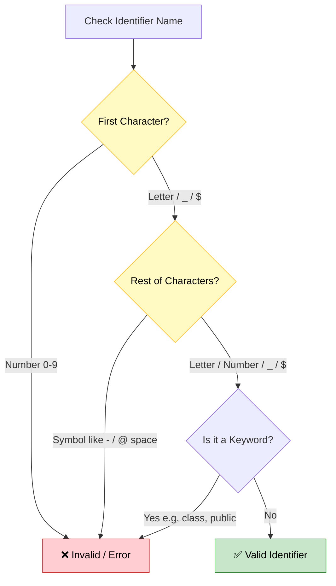
```mermaid
graph TD
    %% 1. Input Node
    Start[Check Identifier Name]
    
    %% 2. Decisions
    CheckFirst{First Character?}
    CheckRest{Rest of Characters?}
    CheckReserved{Is it a Keyword?}
    
    %% 3. Outcomes
    Valid[✅ Valid Identifier]
    Invalid[❌ Invalid / Error]

    %% 4. Logic Flow
    Start --> CheckFirst
    
    CheckFirst -->|Number 0-9| Invalid
    CheckFirst -->|Letter / _ / $| CheckRest
    
    CheckRest -->|Symbol like - / @ space| Invalid
    CheckRest -->|Letter / Number / _ / $| CheckReserved
    
    CheckReserved -->|Yes e.g. class, public| Invalid
    CheckReserved -->|No| Valid

    %% 5. Styling
    style Valid fill:#c8e6c9,stroke:#2e7d32,color:black
    style Invalid fill:#ffcdd2,stroke:#c62828,color:black
    style CheckFirst fill:#fff9c4,stroke:#fbc02d,color:black
    style CheckRest fill:#fff9c4,stroke:#fbc02d,color:black
```

### 💡 Senior Tip (نصيحة محترف)

رغم إن `_` و `$` مسموحين في الأول، حاول تتجنبهم في كودك العادي.

- **`$`**: غالباً بتستخدمها الـ Frameworks والـ Inner Classes.
    
- **`_`**: بتستخدم للثوابت (CONSTANTS) بس بتكون في النص، زي `MAX_VALUE`.
    

خليك دايماً ماشي على الـ **CamelCase** للمتغيرات (زي `myVariable`) والـ **PascalCase** للكلاسات (زي `MyClass`).

---
### 1. Literals: The Raw Data 💎

**(القيم المجردة)**

كلمة Literal معناها "قيمة صريحة ومباشرة" مكتوبة جوه الكود.

يعني لما تكتب int x = 100;... الـ x ده متغير، لكن الـ 100 دي Literal.

السلايد مديك 4 أنواع، لازم تفرق بينهم زي عينيك:

|**النوع (Type)**|**المثال (Example)**|**التوضيح السينيور 🧠**|
|---|---|---|
|**Integral Literal**<br><br>  <br><br>(عدد صحيح)|`100`|أي رقم صحيح بتكتبه، الجافا بتعتبره `int` أوتوماتيك.|
|**Floating-Point**<br><br>  <br><br>(عدد عشري)|`98.6`|أي رقم فيه نقطة، الجافا بتعتبره `double` (دقة مزدوجة) أوتوماتيك، مش `float`.|
|**Character Literal**<br><br>  <br><br>(حرف واحد)|`'X'`<br><br>  <br><br>`'\u03c0'`|**ركز جداً:** لازم يتحط بين **Single Quotes** `' '`.<br><br>  <br><br>الـ `\u03c0` ده كود **Unicode** لحرف "باي" (π). الجافا بتفهم لغات العالم كلها.|
|**String Literal**<br><br>  <br><br>(نص)|`"This is a test"`|مجموعة حروف. **لازم** تتحط بين **Double Quotes** `" "`.|

**🚨 فخ المبتدئين:**

- `'A'` ده حرف (Char) ⬅️ بياخد 2 بايت.
    
- `"A"` ده نص (String) ⬅️ ده كائن (Object) كامل في الميموري.
    
- متخلطش بين الـ `'` والـ `"` عشان الكومبايلر هيرفض.
    

---

### The Skeleton Builders (عضم الكود) 💀

- **`()` Parentheses (الأقواس الهلالية):**
    
    - دي "أقواس التشغيل" والمنطق.
        
    - بتتحط فيها شروط الـ `if`، وبتتحط فيها الـ Parameters وأنت بتنادي أي دالة `method()`.
        
- **`{}` Braces (الأقواس المعقوفة):**
    
    - دي "أقواس الحدود".
        
    - بتحدد الـ **Scope** (المجال). بداية ونهاية الكلاس، الميثود، أو اللوب.
        
    - أي متغير يتولد جواها، بيموت لما تتقفل.
        
- **`[]` Brackets (الأقواس المربعة):**
    
    - دي "أقواس المصفوفات".
        
    - حصرية للـ Arrays. تعريف `int[] x` أو وصول لعنصر `x[0]`.
        

---

### The Navigation Tools (أدوات الوصول) 🧭

- **`.` Period (النقطة):**
    
    - دي "مفتاح الدخول".
        
    - معناها: "ادخل جوه الكائن ده وهات منه كذا".
        
    - مثال: `System.out` (ادخل جوه System هات out).
        
- **`::` Double Colon (النقطتين الرأسيتين) - 🌟 (Java 8+):**
    
    - دي اسمها **Method Reference**.
        
    - دي طريقة حديثة جداً (Functional Programming).
        
    - بدل ما تنادي الميثود وتنفذها، أنت "بتشاور عليها" بس عشان تبعتها لحد تاني ينفذها.
        
    - _مثال:_ `System.out::println` (شاور على دالة الطباعة).
        

---

### The Flow Controllers (منظمين المرور) 🚦

- **`;` Semicolon (الفصلة المنقوطة):**
    
    - نقطة النهاية. الجافا مبتفهمش إن السطر خلص غير لما تشوفها.
        
- **`,` Comma (الفصلة):**
    
    - بتفصل بين الحاجات المتشابهة. (متغيرات جنب بعض، أو مدخلات دالة).
        

---

### The Syntactic Sugar (الإضافات السحرية) 🍬

- **`...` Ellipses (الثلاث نقاط) - (Java 5+):**
    
    - دي اسمها **Varargs** (Variable Arguments).
        
    - **الفكرة:** بتسمح للدالة تستقبل "أي عدد" من المدخلات.
        
    - _مثال:_ `void printAll(String... texts)`.
        
    - ممكن تناديها بـ `printAll("A")` أو `printAll("A", "B", "C")`. الجافا بتحولهم لمصفوفة أوتوماتيك.
        
- **`@` At Sign (علامة الـ At):**
    
    - _تصحيح:_ السلايد مكتوب فيه "Ampersand"، وده خطأ شائع أو مطبعي في السلايد. الـ Ampersand هي `&`. أما الـ `@` اسمها "At Sign".
        
    - **الوظيفة:** بداية **Annotation**.
        
    - دي "ملصقات" بتتحط على الكود عشان تدي معلومات إضافية للكومبايلر.
        
    - _أشهر مثال:_ `@Override` (بتقول للكومبايلر تأكد إني بغير دالة موروثة من الأب).
        

---

### 📊 خريطة الرموز (The Separators Map)

مخطط يجمعلك الرموز حسب وظيفتها في بناء الكود:

Code snippet

```mermaid
graph TD
    %% Categories
    Structure[Structure & Scope]
    Access[Access & Reference]
    Control[Control & Metadata]

    %% Symbols
    Braces["{ }  (Scope/Blocks)"]
    Parens["( )  (Logic/Params)"]
    Brackets["[ ]  (Arrays)"]

    Dot[" .  (Member Access)"]
    Ref["::  (Method Reference)"]
    
    Semi[";  (Terminator)"]
    Comma[",  (Separator)"]
    Varargs["... (Varargs)"]
    Annot["@  (Annotation)"]

    %% Connections
    Structure --> Braces
    Structure --> Parens
    Structure --> Brackets

    Access --> Dot
    Access --> Ref

    Control --> Semi
    Control --> Comma
    Control --> Varargs
    Control --> Annot

    %% Styling
    style Structure fill:#bbdefb,stroke:#1976d2,color:black
    style Access fill:#fff9c4,stroke:#fbc02d,color:black
    style Control fill:#c8e6c9,stroke:#2e7d32,color:black
```

### 💡 Senior Insight (سر Varargs)

الرمز ... هو في الحقيقة خدعة.

لما تكتب public void foo(int... numbers)، الكومبايلر بيحولها في السر لـ public void foo(int[] numbers).

الفرق الوحيد إنك وأنت بتناديها مش مضطر تعمل new int[] {1, 2}، بتكتب الأرقام على طول foo(1, 2) والجافا بتخدمك وتحولهم لـ Array.
---

### 📊 خريطة ذهنية للقيم (Literals Taxonomy)

ده مخطط يلملك أنواع الـ Literals عشان يثبتوا في دماغك:

Code snippet

```mermaid
graph TD
    %% Root
    Root["Java Literals"]

    %% Categories
    Num["Numeric Values"]
    Text["Textual Values"]
    Bool["Logical Values"]

    %% Breakdown
    Integer["Integral: 100, -5"]
    Decimal["Floating-Point: 98.6, 3.14"]
    
    Char["Character: 'A', 'u03c0'"]
    Str["String: 'Hello'"]
    
    TF["Boolean: true, false"]

    %% Connections
    Root --> Num
    Root --> Text
    Root --> Bool

    Num --> Integer
    Num --> Decimal
    
    Text --> Char
    Text --> Str
    
    Bool --> TF

    %% Styling
    style Root fill:#212121,stroke:#000,color:white
    style Num fill:#bbdefb,stroke:#1976d2,color:black
    style Text fill:#ffccbc,stroke:#bf360c,color:black
    style Bool fill:#c8e6c9,stroke:#2e7d32,color:black
    style Integer fill:#e3f2fd,stroke:#1565c0,color:black
    style Decimal fill:#e3f2fd,stroke:#1565c0,color:black
    style Char fill:#fbe9e7,stroke:#d84315,color:black
    style Str fill:#fbe9e7,stroke:#d84315,color:black
    style TF fill:#e8f5e9,stroke:#2e7d32,color:black
```

### 💡 Senior Tip (Unicode Magic)

بما إنك شوفت \u03c0، لازم تعرف إن الجافا بتدعم Unicode.

يعني ينفع تسمي متغير بالعربي!

Java

```java
int مرتب = 5000; // ده كود valid جداً في الجافا!
char myChar = '\u0041'; // دي هي هي حرف 'A'
```

بس طبعاً في الشغل الحقيقي بنكتب إنجليزي بس عشان الاحترافية (Standardization).

---
### 1. The Forbidden Names Rule 🚫

**(قاعدة الأسماء المحرمة)**

السلايد بيقول: "cannot be used as identifiers".

يعني بما إن كلمة class ليها وظيفة محددة، مينفعش تيجي أنت وتسمي متغير:

int class = 10; // ❌ خطأ قاتل! الكومبايلر هيتلخبط ومش هيفهم.

الاستثناء الذكي (Context-Sensitive - JDK 9):

السلايد ذكر إن فيه كلمات جديدة خاصة بالـ Modules (زي module, exports, requires).

- الكلمات دي **"ذكية"**. هي بتشتغل كـ Keywords بس جوه ملف `module-info.java`.
    
- لكن في الكود العادي، لو حبيت تسمي متغير `int module = 5;`.. الجافا هتسمحلك (عشان التوافق مع الأكواد القديمة)، بس ده طبعاً **Bad Practice**.
    

---

### 2. The Ghosts: `const` & `goto` 👻

**(الأشباح المحجوزة)**

السلايد بيقول: _"reserved but not used"_.

- **ليه موجودين؟** دول كانوا موجودين في C++.
    
- **ليه مش شغالين؟** فريق الجافا شاف إن `goto` بتعمل كود سباجيتي (Spaghetti Code) وتخلي البرنامج صعب التتبع، فقرروا يلغوها.
    
- **ليه حجزوها؟** عشان يمنعوا مبرمجين C++ إنهم يستخدموها بالغلط، وكمان عشان لو قرروا يضيفوها في المستقبل (وده محصلش بقاله 30 سنة).
    
- **الخلاصة:** لو كتبت `goto` في الكود، الكومبايلر هيديك Error، مش عشان هي مش موجودة، لكن عشان هي "ممنوعة".
    

---

### 3. The VIP Guests: `true`, `false`, `null` 🎩

**(الضيوف المهمين)**

السلايد بيقول: "In addition to the keywords...".

تقنياً، التلاتة دول مش Keywords، دول اسمهم Literals (قيم ثابتة).

- بس بيتعاملوا نفس المعاملة: **محجوزين**.
    
- مينفعش تسمي متغير اسمه `true`.
    
- `boolean true = false;` // ❌ مستحيل.
    

---

### 📊 تصنيف الكلمات (Mental Map)

بدل ما تحفظ الـ 61 كلمة ورا بعض، السينيور بيقسمهم في دماغه لمجموعات وظيفية.

عملتلك خريطة ذهنية تلمهم عشان ميتنسوش:

Code snippet

```mermaid
mindmap
  root((Java Keywords))
    Primitives & Void
      int
      byte
      char
      boolean
      void
    Flow Control
      if
      else
      switch
      for
      break
      return
    OOP & Objects
      class
      interface
      extends
      new
      this
      super
    Modifiers
      public
      private
      static
      final
      abstract
    Exceptions
      try
      catch
      throw
      finally
    The Ghosts
      goto
      const
    Modules JDK9
      module
      requires
      exports
```

### 💡 Senior Insight

كلمة strictfp اللي في القائمة دي نادراً ما حد بيستخدمها.

دي اختصار لـ Strict Floating Point.

وظيفتها إنها تجبر العمليات الحسابية العشرية (Double/Float) إنها تطلع نفس الناتج بالمللي على أي جهاز (Windows, Mac, Linux). من غيرها، ممكن تلاقي فروقات بسيطة جداً في الكسور بسبب اختلاف البروسيسور.