# Lesson 9: Introduction to Java Collections Framework

**(Slides 391 - 401)**

> [!ABSTRACT] **Overview**
> 
> 1. **الفلسفة:** ليه عملوا Framework كامل للـ Data Structures؟
> 2. **التاريخ:** الفرق بين الـ Legacy Classes (زي Vector) والـ Modern Framework.
> 3. **المعمارية (Architecture):** فصل الـ Interface عن الـ Implementation.
> 4. **التطبيق:** مقارنة بين `CircularArrayQueue` و `LinkedListQueue`.

---

## 1. ليه محتاجين Collections Framework؟

**(Slides 391 - 392)**

### 📖 The Surface

في البداية (Java 1.0)، كانت الجافا فقيرة جدًا في الـ Data Structures. كان عندنا حاجات يتيمة زي `Vector` و `Stack` و `Hashtable`. بداية من **Java 1.2**، المهندسين في Sun Microsystems قرروا يعملوا مكتبة معيارية (Standard Library) قوية، صغيرة، وسهلة التعلم عشان تغطي كل احتياجات التخزين (Lists, Sets, Maps).

### 🧠 The Deep Dive: The "Why"

ليه مابنكتبش الـ Data Structures بإيدينا؟

1. **Performance:** الـ Classes دي مكتوبة بواسطة مهندسين عباقرة (زي Joshua Bloch). هما عملوا Optimization لكل bit في الميموري. صعب تكتب `LinkedList` بإيدك تكون أكفأ من بتاعة Java.
2. **Interoperability:** لما كلنا نستخدم `List`، أي مكتبة خارجية (Library) هتفهم الكود بتاعك. لو أنت عامل `MyCustomList` وأنا عامل `MyBestList`، مش هنعرف نكلم بعض.

### 🚌 Senior Analogy: العِدة الموحدة

زمان (Legacy) كان كل سباك بيصنع مفاتيحه بنفسه. دلوقتي (Framework) فيه مقاسات Standard للمفاتيح والمواسير. الـ Collections Framework هو صندوق العدة الـ Standard اللي كل Java Developers بيستخدموه.

---

## 2. المعمارية: فصل الـ Interface عن الـ Implementation

**(Slides 393 - 396)**

دي أهم نقطة معمارية في الـ Lesson ده كله. الـ Framework مبني على مبدأ: **افصل "ماذا تفعل" (Interface) عن "كيف تفعله" (Implementation).**

### 📊 المخطط الهندسي (Interface vs Implementation)

عشان نفهم الـ Queue كمثال، خليني أرسم لك العلاقة دي:

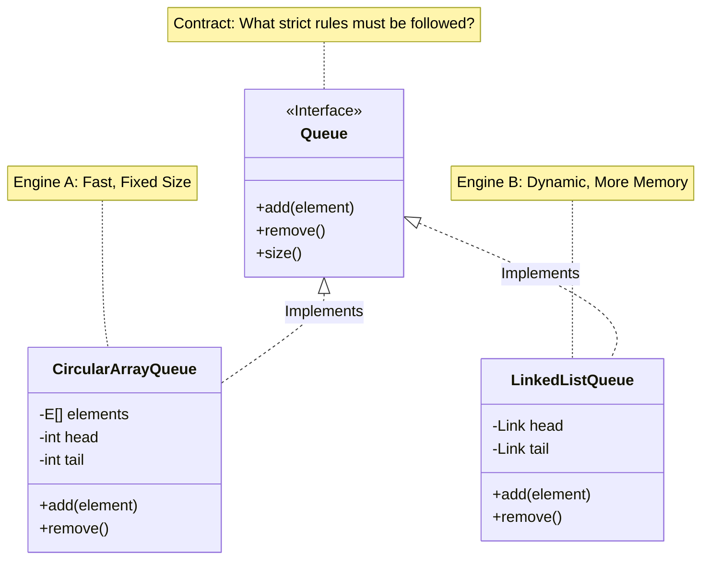

### 🧠 الشرح العميق (Deep Dive)

- **الـ Interface (زي `Queue` في Slide 394):** بيقولك "أنا بضمن لك إن البيانات تمشي بنظام طابور (FIFO)". ملكش دعوة أنا مخزنها إزاي جوه.
- **الـ Implementation (زي `CircularArray` أو `LinkedList`):** ده الموتور اللي شغال جوه.
    - **Circular Array:** بيستخدم Array عادية وبيلف حوالين نفسه (Wrap around) عشان يوفر ميموري.
    - **Linked List:** بيستخدم Nodes (عقد) متوصلة ببعضها بـ References.

---

## 3. تشريح الكود: التطبيقات المختلفة (Code Autopsy)

**(Slides 397 - 398)**

الـ Slides بتديك "Mock Implementations" (كود توضيحي) عشان تفهم الفكرة، مش الكود الحقيقي بتاع الـ JDK، بس هو بيشرح المفهوم ببراعة.

### A. تطبيق المصفوفة الدائرية (`CircularArrayQueue`)

**(Slide 397)**

```java
// Not a real JDK class, but a conceptual example
class CircularArrayQueue<E> implements Queue<E> {
    // Fields that define the implementation strategy
    private int head;       // Points to the first element
    private int tail;       // Points to the next empty slot
    private E[] elements;   // The raw storage (fixed size array)

    // Constructor defines capacity (Bounded Collection)
    CircularArrayQueue(int capacity) { ... }

    public void add(E element) { ... }
    public E remove() { return null; }
    // Simply calculates difference between pointers
    public int size() { return head; }
}
```

- **Line 6 (`E[] elements`):** هنا بنخزن الداتا في Array حتة واحدة في الميموري (Contiguous Memory). ده بيدي **سرعة رهيبة** (CPU Cache Friendly).
- **Concept:** يعني إيه Circular؟ يعني لما الـ `tail` يوصل لآخر الـ Array، بيرجع تاني للأول (index 0) لو فيه مكان فاضي. المعادلة بتبقى `(index + 1) % capacity`.

### B. تطبيق القائمة المتصلة (`LinkedListQueue`)

**(Slide 398)**

```java
class LinkedListQueue<E> implements Queue<E> {
    // Fields are totally different here!
    private Link head; // Object Reference
    private Link tail; // Object Reference

    LinkedListQueue() { } // No capacity needed! (Unbounded)

    public void add(E element) { }
    public E remove() { }
    public int size() { }
}
```

- **Line 3-4 (`Link head, tail`):** هنا مفيش Array. هنا كل عنصر عبارة عن Object شايل الداتا وشايل عنوان اللي بعده.
- **Difference:** الـ LinkedList ممكن تكبر لحد ما الرامات تخلص (Unbounded)، مفيش `capacity` محدودة زي الـ Array.

---

## 4. قوة الـ Polymorphism

**(Slide 399)**

هنا الـ Senior Developer بيبان. إزاي نستخدم الكلاسات دي؟

### 💻 تشريح الكود (Slide 399)

```java
// The Golden Rule of Java Collections:
// Use the INTERFACE type for the reference variable.

// Right Side: Concrete Implementation (The Engine)
// Left Side: Interface (The Steering Wheel)
Queue<Customer> expressLane = new CircularArrayQueue<>(100);

expressLane.add(new Customer("Harry"));
```

- **ليه كتبنا `Queue` مش `CircularArrayQueue` في الأول؟**
    - عشان لو قررنا بكرة نغير الـ implementation لـ `LinkedList`، هنغير سطر واحد بس (السطر بتاع `new`). باقي الكود (اللي بينادي `add` و `remove`) مش هيحس بأي فرق. دي قمة الـ **Loose Coupling**.

---

## 5. أختار مين؟ (Performance & Trade-offs)

**(Slide 400)**

الـ Slide بيطرح سؤال جوهري: **"Why would you choose one implementation over another?"**

### 🌍 في سوق العمل (Production Reality)

إمتى تستخدم ده وإمتى ده؟

|وجه المقارنة|Circular Array (e.g., ArrayDeque)|Linked List|
|:--|:--|:--|
|**Memory**|**أوفر.** Array واحدة بس.|**أغلى.** كل عنصر محتاج Node Object زيادة + Pointer Address.|
|**Speed**|**أسرع.** (Cache Locality). البيانات جنب بعضها في الرامات.|**أبطأ.** البيانات متنتورة في الرامات (Cache Misses).|
|**Limit**|**Bounded.** (أو لازم تعمل Resize مكلف).|**Unbounded.** بتكبر براحتها.|

> [!WARNING] **نصيحة سينيور:** في 90% من الحالات في الـ Modern Hardware، الـ **Array-based implementations** (زي `ArrayList` و `ArrayDeque`) بتكسب الـ LinkedList بسبب الـ **CPU Cache**. الـ Processor بيحب يقرأ بلوكات ورا بعضها، والـ Array بتحقق ده. الـ LinkedList بتخلي الـ CPU يتنطط في الميموري وده مكلف جدًا (Latency). **في السلايد 400:** بيقولك "Circular array is generally preferable".

---
# Lesson 9 (Part 2): The Iterator & Collection Utilities

## 1. The Iterator Interface (الموتور الخفي)

**(Slides 402 - 404)**

### 📖 المفهوم (The Concept)

أي `Collection` (سواء `List`, `Set`, `Queue`) لازم يكون عندها طريقة نمشي بيها على العناصر واحد واحد. الـ Interface `Collection` بيجبر أي كلاس إنه يعمل Implement لميثود اسمها `iterator()`. الميثود دي بترجع أوبجيكت من نوع `Iterator<E>`.

### 💻 تشريح الكود: الطريقة الكلاسيكية (Slide 404)

زمان قبل Java 5 (وقبل الـ for-each loop)، كنا بنكتب الكود ده بإيدينا:

```java
// 1. Get the Iterator object
Iterator<String> iter = c.iterator();

// 2. Loop condition: Is there anything left?
while (iter.hasNext()) {
    // 3. Move cursor forward & return the element
    String element = iter.next();

    // 4. Do work
    System.out.println(element);
}
```

- **`iter.hasNext()`:** دي بتسأل: "يا ترى وصلنا لآخر الخط ولا لسه فيه ركاب؟". بترجع `true` لو فيه.
- **`iter.next()`:** دي بتعمل حاجتين في نفس الوقت:
    
    1. بترجع العنصر الحالي.
    2. بتحرك الـ Pointer خطوة لقدام.
    
    - **Senior Note:** لو ناديت `next()` وانت في آخر الليست، هتاخد في وشك `NoSuchElementException`. عشان كدة لازم تتأكد بـ `hasNext()` الأول .

---

## 2. Java 8 Style (الأسلوب الحديث)

**(Slide 405)**

### 📖 The Update

في Java 8، ضافوا ميثود جديدة اسمها `forEachRemaining` جوه الـ Iterator interface. دي بتخليك تبعت **Lambda Expression** وتوفر كتابة الـ Loop.

### 💻 تشريح الكود

```java
// Instead of writing a while loop manually:
iterator.forEachRemaining(element -> {
    // This code runs for every remaining element
    System.out.println("Processing: " + element);
});
```

- **الميزة:** الكود بقى مقروء أكتر (Declarative) ومش محتاج تتابع الـ Index ولا الـ `hasNext` بنفسك .

---

## 3. 🧠 المفهوم الهندسي العميق: مكان الـ Cursor

**(Slides 406 - 408)**

دي أخطر نقطة في الـ Lesson كله، وأغلب الـ Juniors بيقعوا فيها. الـ Iterator في الجافا **مش بيشاور على العنصر**.. هو بيشاور **بين العناصر**!

### 📊 المخطط الهندسي (The "In-Between" Model)

تخيل الـ List فيها العناصر: `[A, B, C, D]`

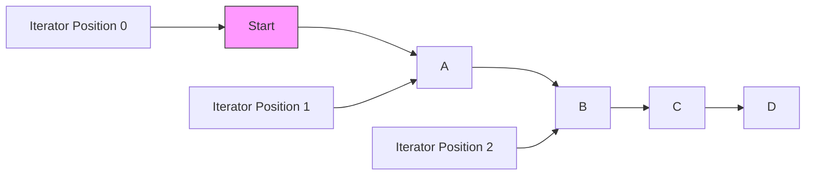

- **قبل ما تعمل أي حاجة:** الـ Iterator واقف **قبل** `A`. (Index 0).
- **بعد `iter.next()`:** الـ Iterator نط فوق `A` ووقف **بين** `A` و `B`. وبيرجعلك `A`.
- **الخلاصة:** الـ Iterator عامل زي المؤشر اللي بين الحروف وانت بتكتب في الوورد (Word Cursor) .

### 💣 قنبلة الـ `remove()`

الـ `remove()` في الـ Iterator بتمسح **آخر عنصر عدينا من عليه** بـ `next()`. يعني مينفعش تعمل `remove()` مرتين ورا بعض من غير ما تعمل `next()` في النص. لو عملت كدة هتاخد `IllegalStateException` .

**السيناريو الصحيح للمسح:**

1. `next()` (نطيت فوق العنصر).
2. `remove()` (امسح العنصر اللي لسه ناطط من فوقه).

---

## 4. The ListIterator (لما نحتاج نرجع بضهرنا)

**(Slide 409)**

الـ `Iterator` العادي بيمشي في اتجاه واحد (Forward Only). لكن الـ `List` (زي `ArrayList` و `LinkedList`) فيها ميزة زيادة، وهي الـ `ListIterator`.

### 💻 المميزات الزيادة:

1. **Bi-directional:** تقدر تعمل `previous()` و `hasPrevious()` (ترجع لورا).
2. **Modification:** تقدر تعمل `add(E e)` و `set(E e)` وانت جوه الـ Loop.

**رسمة توضيحية من السلايد:**

```java

Original: | D  H  R  T
next():   D | H  R  T   (Returned D)
next():   D  H | R  T   (Returned H)
add(J):   D  H  J | R  T
```

لما بتعمل `add`، العنصر بيتحط **قبل** مكان الـ Cursor الحالي، والـ Cursor بيفضل سابق العنصر الجديد .

---

## 5. Generic Utility Methods (شنطة العدة)

**(Slide 410)**

الـ `Collection Interface` مش بس للـ Looping، دي مليانة "شغل جاهز" عشان متكتبش خوارزميات بايدك. أي كلاس بيعمل Implement لـ `Collection` (زي `ArrayList`, `HashSet`) عنده الميثودز دي:

### 🛠️ أهم الأدوات:

- `int size()`: عدد العناصر.
- `boolean isEmpty()`: هل فاضية؟
- `boolean contains(Object obj)`: بتعمل Search (بتستخدم `equals()` جوه).
- `boolean addAll(Collection c)`: بتضيف ليستة كاملة جوه ليستة تانية (Union).
- `boolean removeAll(Collection c)`: بتمسح كل العناصر المشتركة (Difference).
- `boolean retainAll(Collection c)`: بتمسح كل حاجة **ماعدا** المشترك (Intersection).
- `Object[] toArray()`: بتحول الـ Collection لـ Array عادية.

### 🔥 ميزة Java 8: `removeIf`

دي ميثود عبقرية ضافوها كـ **Default Method**. بدل ما تعمل Loop وتمسح بإيدك، بتكتب شرط (Predicate):

```java
// امسح أي اسم أطول من 5 حروف
names.removeIf(n -> n.length() > 5);
```

الكود ده thread-safe وأسرع وأنضف بكتير من الـ manual iteration .

---

## 6. The Architecture: AbstractCollection

**(Slide 411)**

### 🧠 ما وراء الكواليس

عشان المبرمجين اللي بيعملوا Library ميتعبوش، الجافا عملت كلاس اسمه `AbstractCollection`. الكلاس ده بيعمل Implement لكل الميثودز "الروتينية" (زي `isEmpty` اللي هي عبارة عن `size() == 0`). وبيسيبلك بس الميثودز الأساسية (`iterator` و `size`) تعملهم بنفسك.

- **تطور تاريخي:** في Java 8، بقى عندنا **Default Methods** في الـ Interfaces، فمبقاش الاعتماد على `AbstractCollection` ضروري أوي زي زمان، بس لسه موجود عشان الـ Legacy Code .

---
# Lesson 9 (Part 3): The Framework Hierarchy & Concrete Classes

## 1. Interfaces in the Collections Framework

**(Slides 413 - 415)**

### 📖 المفهوم (The Big Picture)

الـ Framework مقسوم نصين كبار (زي ما هو واضح في **سلايد 413**):

1. **Collection:** دي العيلة اللي بتخزن "عناصر" (Objects) ورا بعضها (زي `List`, `Set`, `Queue`).
2. **Map:** دي العيلة "المنعزلة" اللي بتخزن (Key/Value Pairs). الـ Map **لا ترث** من `Collection`، وده سؤال انترفيو مشهور.

### 📊 المخطط الهندسي (Interfaces Diagram)

ده شكل العلاقات بين الـ Interfaces بناءً على **سلايد 413**:

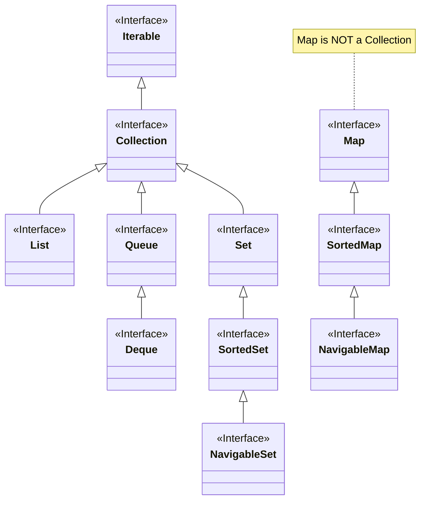

### 🧠 التحليل العميق (Deep Dive)

- **List (سلايد 414):**
    - **Ordered:** الترتيب مهم. العنصر اللي يدخل الأول، يفضل الأول (إلا لو رتبته).
    - **Duplicates:** بتقبل التكرار عادي.
    - **ListIterator:** عندها Iterator خاص بيمشي رايح جاي (Bi-directional).
- **Set (سلايد 414):**
    - **Unique:** ممنوع التكرار. لو ضفت عنصر موجود قبل كدة، الـ `add` هترجع `false`.
    - **Mathematics:** بتمثل المجموعات الرياضية.
- **SortedSet / SortedMap (سلايد 415):**
    - بتحافظ على العناصر مترتبة أوتوماتيك (زي `TreeSet`).
    - بتستخدم `Comparator` عشان تعرف مين أكبر من مين.
- **NavigableSet (Java 6+):**
    - دي "تحسين" للـ SortedSet. بتديك ميثودز زي `lower()`, `higher()`, `floor()` عشان تعمل Search بذكاء (هاتلي أقرب رقم لأقل من 50 مثلاً).

---

## 2. Concrete Collections (أدوات الشغل الحقيقية)

**(Slides 416 - 417)**

هنا بقى الـ Classes اللي بنعمل منها `new`. الجدول ده من **سلايد 417** وفيه الخلاصة:

|Collection Type|Description (الوصف الهندسي)|Senior Notes 🧠|
|:--|:--|:--|
|**`ArrayList`**|مصفوفة ديناميكية بتكبر وتصغر.|دي الـ **Default Choice** في 90% من شغلك. سريعة جدًا في القراءة (Random Access).|
|**`LinkedList`**|قائمة متصلة (Nodes).|سريعة في الإضافة والحذف من النص، بس بطيئة في البحث (Search).|
|**`ArrayDeque`**|طابور مزدوج (Double Ended Queue).|أسرع من `Stack` القديمة وأسرع من `LinkedList` لو هتستخدمها كـ Queue.|
|**`HashSet`**|مجموعة غير مرتبة ترفض التكرار.|بتستخدم `HashCode`. الترتيب فيها عشوائي وموش مضمون. الأسرع في الـ Search.|
|**`TreeSet`**|مجموعة مرتبة (Sorted Set).|بطيئة شوية عن HashSet في الإضافة (`O(log n)`) بس ميزتها إن الداتا دايماً مترتبة.|
|**`EnumSet`**|مجموعة مخصصة للـ Enums.|سريعة جداً (Bitwise Operations) وموفرة للميموري بشكل مرعب.|
|**`LinkedHashSet`**|بتحفظ ترتيب الإدخال (Insertion Order).|كوبري بين الـ List والـ Set.|
|**`PriorityQueue`**|طابور بيرتب العناصر حسب الأهمية.|بتستخدم في خوارزميات الـ Scheduling (زي ترتيب التاسكات في الـ OS).|

---

## 3. Map Implementations (الخرائط)

**(Slide 418)**

الـ Maps هي المخازن اللي بتشيل (Key -> Value). الجدول ده من **سلايد 418**:

|Map Type|Description|
|:--|:--|
|**`HashMap`**|الأشهر والأسرع. الترتيب عشوائي للـ Keys. بتسمح بـ `null` key واحد.|
|**`TreeMap`**|الـ Keys مترتبة دايماً (Sorted). ممتازة لو محتاج تعرض داتا مترتبة أبجدياً مثلاً.|
|**`EnumMap`**|مخصصة لما يكون الـ Key عبارة عن `Enum`. سريعة جداً.|
|**`LinkedHashMap`**|بتحفظ ترتيب الإدخال (Insertion Order). مفيدة في الـ Caching (LRU Cache).|
|**`WeakHashMap`**|الـ Keys بتاعتها ممكن الـ Garbage Collector يمسحها لو محدش بيستخدمها. (للخبراء فقط).|
|**`IdentityHashMap`**|بتقارن الـ Keys بـ `==` بدل `equals()`. نادرة الاستخدام جداً.|

---

## 4. The Class Hierarchy (الهيكل الداخلي)

**(Slides 419 - 421)**

### 📖 ما وراء الكواليس

عشان الجافا متكررش الكود، عملوا Classes بتبدأ بكلمة `Abstract`. دي بتعمل Implement للميثودز المشتركة، وتسيبلك الحاجات المهمة. إحنا كمبرمجين مش بنستخدم الـ Abstract classes دي مباشرة، بس بنستخدم ولادها (Concrete Classes).

### 📊 مخطط الكلاسات (Class Diagram)

بناءً على **سلايد 420 و 421**:

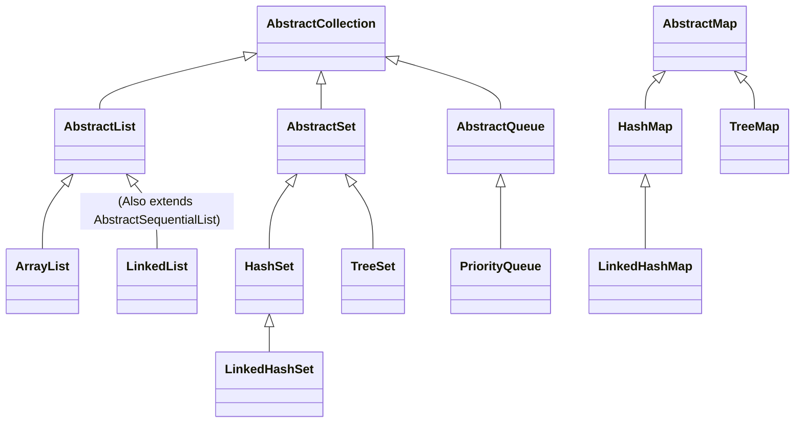

---

## 5. Linked Lists: المشكلة والحل

**(Slide 422)**

في **سلايد 422**، المحاضرة بتنقلنا لنقطة محورية: **ليه `ArrayList` مش كفاية؟**

### 💣 المشكلة في `ArrayList`:

الـ `ArrayList` من جوه عبارة عن `Array` عادية. لو حبيت تمسح عنصر من **النص** (أو تضيف عنصر في الأول)، لازم تعمل **Shift** لكل العناصر اللي بعده عشان تسد الفراغ أو تفضي مكان.

- **التكلفة:** عالية جداً لو الليست كبيرة (`O(n)`).

### 💡 الحل: `LinkedList`

الـ Linked List بتحل المشكلة دي بإن كل عنصر بيبقى ماسك إيد اللي قبله واللي بعده (Links). عشان تمسح عنصر، كل اللي بتعمله إنك بتغير "الوصلة" (Reference)، من غير ما تحرك أي داتا تانية في الميموري.

- **التكلفة:** رخيصة جداً (`O(1)`).

---
# Lesson 9 (Part 4): The LinkedList Internals

**(Slides 423 - 433)**

## 1. The LinkedList Anatomy (التشريح)

**(Slide 423)**

### 📖 المفهوم العميق (Deep Dive)

في الـ `ArrayList`، الداتا كلها قاعدة جنب بعض في الميموري (Consecutive Memory Addresses). لو شلت واحد من النص، لازم "تزحزح" كل اللي بعده عشان تسد الفراغ (Shifting).

الـ `LinkedList` فلسفتها مختلفة: **"كل واحد يمسك في إيد اللي جنبه"**.

- العنصر مابقاش مجرد داتا، بقى اسمه **Node**.
- الـ Node شايلة 3 حاجات:
    1. **Data:** القيمة نفسها.
    2. **Next Pointer:** عنوان اللي بعدي.
    3. **Prev Pointer:** عنوان اللي قبلي (لأن Java LinkedList هي **Doubly** Linked).

عشان تمسح عنصر من النص، أنت مش محتاج تنقل داتا.. أنت بس بتغير "الوصلات" (References).

### 📊 المخطط الهندسي (Memory Layout)

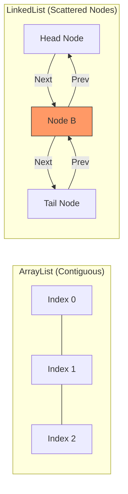

---

## 2. Basic Operations & Iterator

**(Slide 424)**

### 💻 تشريح الكود (Code Autopsy)

السلايد بتورينا إزاي نمسح عنصر باستخدام الـ Iterator.

```java
// 1. Create the List
List<String> staff = new LinkedList<>();
staff.add("First");
staff.add("Second");
staff.add("Third");

// 2. Get the Iterator (The Cursor)
Iterator iter = staff.iterator();

// 3. Move cursor: | First Second Third
String first = iter.next(); // Cursor jumps over "First"

// 4. Move cursor: First | Second Third
String second = iter.next(); // Cursor jumps over "Second"

// 5. Remove logic
// Important: remove() deletes the element *most recently returned* by next()
iter.remove(); // Removes "Second"
```

> [!WARNING] **Senior Note:** خد بالك من السطر الأخير. `remove()` بتمسح "آخر حاجة عدينا عليها". لو ناديت `remove()` مرتين ورا بعض من غير `next()` في النص.. **Crashes** (`IllegalStateException`).

---

## 3. The ListIterator (الإضافة في المنتصف)

**(Slides 425 - 428)**

### 📖 المشكلة

الـ `Collection.add()` العادية بترمي العنصر في **آخر** الليستة. طب لو عايز أحط عنصر "بين" الأول والتاني؟ هنا بيجي دور الـ `ListIterator`. ده "مفك" متطور عن الـ Iterator العادي، فيه ميثود اسمها `add()`.

### 💻 تشريح الكود (Slide 428)

```java
List<String> numbers = new LinkedList<>();
numbers.add("First");
numbers.add("Second");
numbers.add("Third");

// 1. Create ListIterator
ListIterator<String> iter = numbers.listIterator();

// 2. Skip past first element
// Current State: First | Second Third
iter.next();

// 3. Insert in the gap
// The add method inserts *before* the current cursor position
iter.add("Before Second");

// Final State: First, "Before Second", Second, Third
```

### 🧠 ما وراء الكواليس (Reference Remapping)

لما عملنا `iter.add`، الجافا معملتش Shifting لأي داتا. هي عملت الآتي:

1. عملت Node جديدة.
2. خلت `First.next` يشاور على الجديدة.
3. خلت `NewNode.next` يشاور على `Second`.
4. الموضوع خلص في خطوة واحدة `O(1)`.

---

## 4. Efficiency Trade-offs (أداء الكود)

**(Slide 429)**

السلايد دي بتلخص امتى تستخدم `LinkedList`.

|العملية (Operation)|LinkedList|ArrayList|السبب (Why?)|
|:--|:--|:--|:--|
|**Random Access** (`get(500)`)|**بطيء جدًا O(n)**|**صاروخ O(1)**|الـ LinkedList لازم تمشي على 500 نود عشان توصل. الـ Array بتروح للعنوان مباشرة.|
|**Insertion (Middle)**|**سريع O(1)**|**بطيء O(n)**|الـ LinkedList بتغير وصلات بس. الـ Array بتعمل Shift للداتا.|
|**Insertion (End)**|سريع O(1)|سريع O(1)|الاتنين زي بعض، بس الـ ArrayList أحيانًا بتحتاج Resize مكلف.|

---

## 5. Linked Lists Concurrency (فخ التعديل المتزامن)

**(Slides 430 - 431)**

### 📖 المفهوم (The Fail-Fast Concept)

الجافا بتحمي نفسها. لو فيه 2 Iterators شغالين على نفس الليستة، وواحد منهم غير شكل الليستة (مسح أو أضاف)، التاني بيضرب فوراً. ليه؟ لأن ترتيب العناصر اتغير، فالـ Iterator التاني مبقاش عارف هو واقف فين ولا رايح فين.

### 💻 تشريح الكود (Slide 431)

```java
List<String> list = ...;
ListIterator<String> iter1 = list.listIterator();
ListIterator<String> iter2 = list.listIterator(); // Iterator تاني خالص

iter1.next();
iter1.remove(); // iter1 عدّل الليستة ومسح عنصر

iter2.next(); // BOOM! 💥 ConcurrentModificationException
```

- **السبب:** `iter2` لقى إن الـ "Modification Count" بتاع الليستة اتغير عن آخر مرة شافه، فبيعرف إن فيه حد "لعب" في الداتا من وراه، فبيرمي Exception فوراً.

### 🌍 في سوق العمل (Best Practice)

عشان تتجنب المشكلة دي:

1. خلي **Iterator واحد بس** هو اللي يكتب (Write/Remove).
2. الباقيين كلهم يقروا بس (Read-only)، وبشرط إن محدش يكتب في نفس الوقت (Thread Safety issues).

---

## 6. Linked Lists Example (Part 1)

**(Slides 432 - 433)**

ده مثال شامل بيجمع كل اللي اتعلمناه.

**الهدف:** دمج قائمة `b` داخل قائمة `a`، وبعدين فلترة العناصر.

### 💻 تشريح الكود (Slide 433 - Setup)

```java
List<String> a = new LinkedList<>();
a.add("A"); a.add("B"); a.add("C");

List<String> b = new LinkedList<>();
b.add("D"); b.add("E"); b.add("F"); b.add("G");

// تحضير الـ Iterators
ListIterator<String> aIter = a.listIterator(); // هنستخدمه للكتابة والقراءة
Iterator<String> bIter = b.iterator(); // هنستخدمه للقراءة فقط
```

- **Line 1-5:** بنجهز الداتا.
- **Line 8:** استخدمنا `ListIterator` مع `a` عشان هنحتاج نعمل `add` جواه (ندمج عناصر `b`).
- **Line 9:** استخدمنا `Iterator` عادي مع `b` عشان إحنا بس هناخد منه داتا.

---
# Advanced LinkedList Operations

**(Slides 434 - 436)**

> [!ABSTRACT] **سيناريو العملية (The Scenario)** عندنا 2 Lists:
> 
> - `a = [A, B, C]`
> - `b = [D, E, F, G]`
> 
> **المطلوب تنفيذه:**
> 
> 1. **Merge:** ادمج عناصر `b` جوه `a` بالتبادل (واحد من هنا وواحد من هنا).
> 2. **Filter:** امسح كل "تاني" كلمة من القائمة `b`.
> 3. **Bulk Remove:** امسح من `a` أي حاجة متبقية في `b`.

---

## 1. عملية الدمج (The Merge Operation)

**(Slide 434 - Part 1)**

هنا إحنا بنعمل Merge يدوي باستخدام الـ Iterators عشان نتحكم في مكان الإضافة بالظبط.

### 💻 تشريح الكود (Code Autopsy)

```java
// 1. Setup Iterators
ListIterator<String> aIter = a.listIterator(); // ListIterator allows ADD operation
Iterator<String> bIter = b.iterator();         // Regular Iterator is fine for reading

// 2. The Merge Loop
while (bIter.hasNext()) { // طول ما القائمة b فيها عناصر.. كمل لف

    // Line A: Skip one element in 'a' if available
    if (aIter.hasNext()) {
        aIter.next();
    }

    // Line B: Take from 'b' and insert into 'a'
    aIter.add(bIter.next());
}

System.out.println(a);
```

### 🧠 التحليل الهندسي العميق (Deep Dive)

- **Line A (`aIter.next()`):**
    - ليه عملنا `next()`؟ عشان الـ `ListIterator` لما بيعمل `add`، بيحط العنصر **قبل** الـ Cursor.
    - فإحنا بنقوله: "نط الأول فوق العنصر `A`، وبعدين ضيف". فكأننا بنقوله "سيب `A` في مكانها وحط العنصر الجديد بعدها".
- **Line B (`aIter.add(...)`):**
    - هنا الـ Magic بيحصل. الـ LinkedList بتعمل Link جديد من غير ما تحرك بقية العناصر في الميموري. العملية دي `O(1)`.

### 📊 المخطط الهندسي (Zipper Merge Visualization)

شوف حركة الـ Cursor وإزاي الداتا بتدخل:

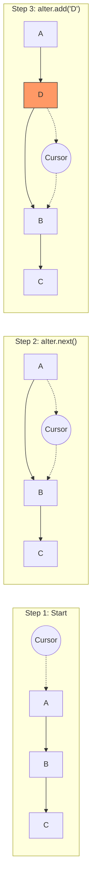

**النتيجة النهائية في `a`:** `[A, D, B, E, C, F, G]` (لاحظ إن `G` نزلت في الآخر لأن `a` خلصت قبل `b`).

---

## 2. عملية الحذف الانتقائي (Selective Removal)

**(Slide 434 - Part 2)**

المطلوب: مسح كل "تاني" كلمة من القائمة `b` الأصلية.

### 💻 تشريح الكود (Code Autopsy)

```java
// Reset Iterator for 'b' to start from the beginning
bIter = b.iterator();

while (bIter.hasNext()) {

    // Line 1: Jump over the 1st element (Keep it)
    bIter.next();

    // Line 2: Check if there is a 2nd element
    if (bIter.hasNext()) {

        // Line 3: Jump over the 2nd element (Target)
        bIter.next();

        // Line 4: Kill the Target!
        bIter.remove();
    }
}

System.out.println(b);
```

### 🧠 التريكاية هنا (The Senior Trick)

- **Line 4 (`remove`):** الميثود دي بتمسح **آخر حاجة** رجعتها `next()`.
    - عشان كده عملنا `next()` مرتين. المرة الأولى عشان "نفوت" العنصر اللي عايزين نحتفظ بيه، والمرة التانية عشان "نمسك" العنصر اللي عايزين نمسحه.
- **Safety Check:** لازم نتأكد `if (bIter.hasNext())` قبل الـ `next()` التانية، وإلا لو الليستة عددها فردي، الكود هيضرب `NoSuchElementException`.

**النتيجة النهائية في `b`:** الأصل: `[D, E, F, G]` بعد المسح: `[D, F]` (مسحنا `E` و `G`).

---

## 3. الحذف الجماعي (Bulk Operation)

**(Slide 435)**

آخر خطوة، هننظف القائمة `a`.

### 💻 تشريح الكود (Code Autopsy)

```java
// Bulk operation: Remove all words present in 'b' from 'a'
a.removeAll(b);

System.out.println(a);
```

- **Logic:** دلوقتي `b` فيها `[D, F]`.
    - القائمة `a` كانت `[A, D, B, E, C, F, G]`.
    - العملية: شيل `D` وشيل `F`.
- **Result:** `[A, B, E, C, G]`.

> [!WARNING] **Performance Note:** العملية `removeAll` في الـ Lists بتشتغل بـ Complexity **O(N * M)**. لأنها بتمشي على كل عنصر في `a`، وتدور عليه جوه `b`. لو الداتا كبيرة جداً، يفضل تحول `b` لـ `HashSet` الأول عشان البحث يبقى أسرع.

---

## 4. الخاتمة قبل الـ Maps

**(Slide 436)**

بانتهاء المثال ده، الـ Slides بتنقلنا لموضوع جديد تماماً وهو الـ **Maps**.

> [!NOTE] **ملخص Linked Lists**
> 
> 1. **Nodes:** الداتا مش جنب بعضها، الداتا متوصلة ببعض.
> 2. **Insertion:** الإضافة في النص سريعة جداً (مجرد تغيير وصلات).
> 3. **Iterators:** هم المشرط الجراحي اللي بنستخدمه للتعديل أثناء الدوران.

---

# Lesson 9 (Part 6): The Map Interface

**(Slides 437 - 446)**

> [!ABSTRACT] **خريطة الطريق**
> 
> 1. **المفهوم:** يعني إيه Key/Value Pair؟ والفرق بين `HashMap` و `TreeMap`.
> 2. **العمليات الأساسية:** `put`, `get`, `remove`.
> 3. **التعامل مع الـ Null:** استخدام `getOrDefault`.
> 4. **تطبيق عملي:** كود كامل لـ "دليل موظفين" (Employee Directory).

---

## 1. Maps: The Concept (المفهوم)

**(Slide 437)**

### 📖 السطح (The Surface)

الـ `Set` ممتازة عشان تعرف لو العنصر "موجود ولا لأ". لكن لو عايز توصل لمعلومة بدلالة معلومة تانية (زي ما بتدور في القاموس على كلمة عشان تلاقي معناها)، هنا محتاج **Map**. الـ Map بتخزن البيانات في شكل أزواج **(Key, Value)**.

### 🧠 التحليل العميق (Deep Dive)

الـ Map ليست Collection بالمعنى الحرفي (مش بتورث من `Collection Interface`). هي عالم موازي. في الجافا، عندنا نوعين رئيسيين (زي ما السلايد بتقول):

1. **`HashMap`:** بتستخدم دالة Hash (خوارزمية) عشان تحسب مكان التخزين. سريعة جداً `O(1)` لكن **مش بترتب** العناصر.
2. **`TreeMap`:** بترتب الـ Keys (أبجدياً أو رقمياً). أبطأ شوية `O(log n)` بس مفيدة لو محتاج تعرض الداتا مترتبة.

### 📊 المخطط الهندسي (Hash vs Tree)

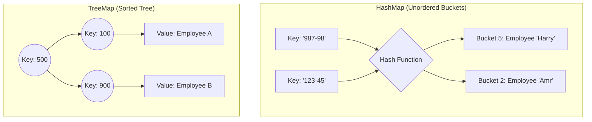

---

## 2. Basic Map Operations (العمليات الأساسية)

**(Slides 438 - 442)**

### 🛠️ الإضافة والاسترجاع (`put` & `get`)

**(Slide 438 - 439)**

```java
// 1. Create HashMap (Key=String, Value=Employee)
Map<String, Employee> staff = new HashMap<>();

// 2. Add Data (Key, Value)
Employee harry = new Employee("Harry Hacker");
staff.put("987-98-9996", harry);

// 3. Retrieve Data
String id = "987-98-9996";
Employee e = staff.get(id); // Returns Harry object
```

- **Key:** لازم يكون **Unique**. لو استخدمت نفس الـ Key مرتين، القيمة الجديدة **هتمسح** القديمة (Overwrite).

### 🛡️ شبكة الأمان (`getOrDefault`)

**(Slide 440)** لو عملت `get` لـ ID مش موجود، الـ Map هترجع `null`. وده أصل كل شرور الـ `NullPointerException`. الجافا الحديثة (Java 8) قدمت حل عبقري:

```java
// لو الـ id مش موجود، رجع لي 0 بدل null
int score = scores.getOrDefault(id, 0);
```

### 🔄 التكرار والمسح (`forEach` & `remove`)

**(Slide 441)**

- **`remove(key)`:** بيمسح الـ Key والـ Value بتاعته.
- **`size()`:** عدد الأزواج في الـ Map.
- **`forEach`:** دي الطريقة الحديثة للمرور على الـ Map باستخدام Lambda:

```java
// k = key, v = value
staff.forEach((k, v) -> System.out.println("Key: " + k + ", Val: " + v));
```

---

## 3. Map Example: Employee Directory (تطبيق عملي)

**(Slides 443 - 446)**

ده المثال الكامل اللي بيجمع كل العمليات دي.

### A. The Setup (تجهيز الكلاس)

**(Slide 443)** كلاس بسيط اسمه `Employee` شايل اسم الموظف بس.

```java
public class Employee {
    private String name;
    public Employee(String name) { this.setName(name); }
    // Getters and Setters...
    public String toString() { return "Employee: " + name; } // (مهم عشان الطباعة)
}
```

### B. The Logic (الكود الرئيسي)

**(Slide 444 - 445)** نركز في كل سطر بيعمل إيه في الميموري:

```java
import java.util.*;

public class MapTest {
    public static void main(String[] args) {

        // 1. Construction
        Map<String, Employee> staff = new HashMap<>();

        // 2. Filling the Map (Insertion)
        staff.put("144-25-5464", new Employee("Amr"));
        staff.put("567-24-2546", new Employee("Mohsen"));
        staff.put("157-62-7935", new Employee("Medhat"));
        staff.put("456-62-5527", new Employee("Iman"));

        // 3. Printing (Calls toString of HashMap)
        System.out.println(staff);

        // 4. Removal
        staff.remove("567-24-2546"); // Bye Bye Mohsen 👋

        // 5. Replacement (Update)
        // Key "456-62-5527" already exists (Iman).
        // This will REPLACE Iman with Mona.
        staff.put("456-62-5527", new Employee("Mona"));

        // 6. Lookup
        System.out.println(staff.get("157-62-7935")); // Prints Medhat

        // 7. Iteration (Java 8 Style)
        staff.forEach((k, v) -> System.out.println("key=" + k + ", value=" + v));
    }
}
```

### C. Output Analysis (تحليل النتيجة)

**(Slide 446)**

بص على الـ Output اللي في السلايد، هتلاحظ حاجة غريبة:

```java
{157-62-7935=..., 144-25-5464=..., 456-62-5527=...}
```

- **الترتيب عشوائي!** إحنا ضفنا "Amr" الأول، بس في الطباعة طلع تاني واحد أو تالت واحد.
    
    - **السبب:** دي `HashMap`. هي بترتب العناصر بناءً على الـ Hash Code بتاع الـ Key، مش بناءً على مين دخل الأول.
    - لو عايز الترتيب يفضل زي ما دخلته، استخدم **`LinkedHashMap`**.
    - لو عايز الترتيب يكون حسب الأرقام (IDs)، استخدم **`TreeMap`**.
- **تحديث البيانات:** لاحظ إن "Iman" اختفت وظهر مكانها "Mona" بنفس الـ Key، وده بيأكد إن `put` بتعمل Update لو المفتاح موجود.
    

---

# Lesson 9 (Part 7): Map Interface & Advanced Updates

**(Slides 447 - 452)**

> [!ABSTRACT] **خريطة الطريق**
> 
> 1. **The API:** نظرة سريعة على أدوات التحكم (Methods) في سلايد 447.
> 2. **The "Counting" Problem:** سيناريو عد الكلمات (المشاكل والحلول التقليدية).
> 3. **The Java 8 Solution:** سحر الـ `merge` method.
> 4. **Map Views:** إزاي نبص على الـ Map كأنها Collection (Keys, Values, Entries).

---

## 1. Map Interface Methods (شنطة العدة)

**(Slide 447)**

قبل ما ندخل في المشاكل، السلايد دي بتديك لستة بالأدوات المتاحة في الـ `Map Interface`.

|Method|Description (الوصف الهندسي)|Senior Notes 🧠|
|:--|:--|:--|
|**`get(key)`**|بيرجع القيمة أو `null`.|المصدر رقم 1 للـ Bugs بسبب الـ `null`.|
|**`getOrDefault(key, default)`**|بيرجع القيمة، ولو مش موجودة يرجع الـ default.|دي "الدرع" بتاعك ضد الـ NullPointerException.|
|**`put(key, value)`**|بيضيف أو يعمل Replace.|لو الـ Key موجود، القيمة القديمة بتتمسح وبترجعلك في الـ return.|
|**`putAll(map)`**|بيصب map تانية جوه الـ map بتاعتك.|زي `addAll` في الليست.|
|**`containsKey(key)`**|هل المفتاح ده موجود؟|سريعة جداً `O(1)`.|
|**`containsValue(value)`**|هل القيمة دي موجودة؟|بطيئة جداً `O(n)` لأنها بتدور في القيم واحدة واحدة.|
|**`forEach(BiConsumer)`**|بتلف على الـ Map.|(Java 8) أسرع وأنضف من الـ Loops القديمة.|

---

## 2. Updating Map Entries (سيناريو عد الكلمات)

**(Slides 448 - 449)**

### 📖 المشكلة (The Problem)

تخيل إنك بتقرأ ملف وعايز تعد كل كلمة اتكررت كام مرة. المنطق بيقول: "هات العدد القديم للكلمة، زود عليه 1، ورجعه تاني".

### 💻 تشريح الكود: الطريقة الساذجة (The Naive Way)

**(Slide 448 - 449)**

```java
// Buggy Code Alert! 🚨
counts.put(word, counts.get(word) + 1);
```

- **Line 1 Analysis:**
    - `counts.get(word)`: أول مرة تشوف الكلمة، الميثود دي هترجع `null`.
    - `+ 1`: الجافا هتحاول تعمل Unboxing للـ `null` عشان تجمعه على 1.
    - **Result:** `NullPointerException`. الكود هيضرب في وشك.

### 🛠️ الحل رقم 1: الدفاعي (`getOrDefault`)

**(Slide 449)**

```java
// Safe but manual
counts.put(word, counts.getOrDefault(word, 0) + 1);
```

- **الشرح:** لو الكلمة مش موجودة، اعتبر العدد الحالي `0`، وبعدين زود `1`. كدة حلينا الـ NPE.

### 🛠️ الحل رقم 2: لو مش موجود ضيفه (`putIfAbsent`)

**(Slide 449)**

```java
counts.putIfAbsent(word, 0); // 1. Initialize if missing
counts.put(word, counts.get(word) + 1); // 2. Increment safely
```

- **الشرح:** بنضمن الأول إن فيه قيمة (حتى لو صفر)، وبعدين نجمع براحتنا. عيبها إنها سطرين كود مش سطر واحد.

---

## 3. The Java 8 "Merge" Solution (الحل العبقري)

**(Slide 450)**

دي أهم جزئية في التحديثات الجديدة. ميثود `merge` بتعمل كل الخطوات اللي فاتت في سطر واحد وبذكاء.

### 📊 المخطط الهندسي (Merge Logic)

الميثود دي بتاخد 3 حاجات: `Key`, `Initial Value`, و `Re-mapping Function`.

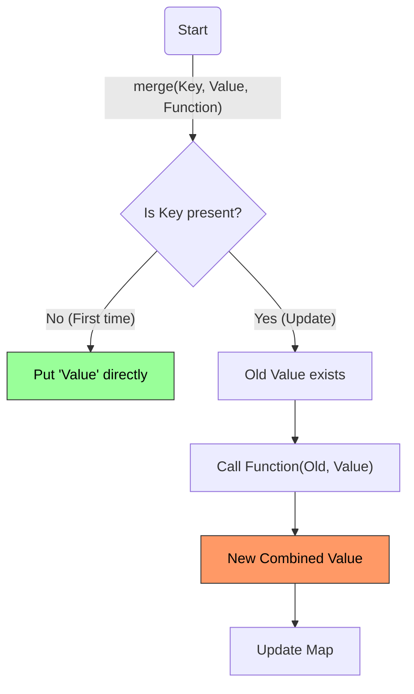

### 💻 تشريح الكود (Code Autopsy)

```java
// The Professional Way (Java 8+)
counts.merge(word, 1, Integer::sum);
```

- **`word` (Param 1):** المفتاح اللي بنلعب عليه.
- **`1` (Param 2):** دي القيمة اللي هنحطها لو الكلمة دي **أول مرة** تظهر (Default).
- **`Integer::sum` (Param 3):** دي دالة الجمع `(old, new) -> old + new`.
    - لو الكلمة **موجودة**، الجافا هتاخد القيمة القديمة (مثلاً 5)، والقيمة الجديدة اللي أنت باعتها (1)، وتجمعهم (5+1 = 6)، وتعمل Update.

> [!NOTE] **Senior Insight:** الـ `merge` مش بس للجمع. ممكن تستخدمها لدمج النصوص `String::concat`، أو لاختيار الأكبر `Math::max`. هي بتديك "Old Value" و "New Value" وأنت قرر تعمل بيهم إيه.

---

## 4. Map Views (رؤية ما بداخل الصندوق)

**(Slides 451 - 452)**

الـ Map في حد ذاتها **مش Collection** (مش بتورث منها). عشان كدة مينفعش تعمل عليها `for loop` مباشرة زي الليست. الحل؟ الـ Map بتقدم لك 3 "نوافذ" (Views) عشان تشوف الداتا كأنها Collection.

### 🔍 النوافذ الثلاثة (The 3 Views)

1. **`keySet()`**: بترجع `Set<K>`. (مجموعة المفاتيح).
2. **`values()`**: بترجع `Collection<V>`. (مجموعة القيم - ممكن تتكرر عشان كدة هي Collection مش Set).
3. **`entrySet()`**: بترجع `Set<Map.Entry<K, V>>`. (مجموعة الأزواج).

### 💻 تشريح الكود (Slide 452)

السلايد بتوريك إزاي تجيب الـ Views دي، بس فيه نقطة قاتلة لازم تفهمها.

```java
Map<String, String> map = new HashMap<>();
map.put("A", "Apple");
map.put("B", "Banana");

// 1. Get the KeySet View
Set<String> keys = map.keySet();

// 2. Modify the VIEW (Danger Zone 💀)
keys.remove("A");

// 3. Check the MAP
System.out.println(map); // Output: {B=Banana}
```

### 🧠 المفهوم العميق (Deep Dive)

ليه الـ Map اتأثرت؟ لأن الـ `keySet()` مش بترجع "نسخة" (Copy) من المفاتيح. هي بترجع **View** (مراية) متوصلة بالـ Map الأصلية.

- لو مسحت مفتاح من الـ `Set` $\to$ يتمسح هو وقيمته من الـ `Map`.
- لو مسحت داتا من الـ `Map` $\to$ تختفي من الـ `Set`.
- **تنبيه:** الـ Views دي تدعم الـ Removal، لكن **لا تدعم الـ Addition** (مينفعش تضيف مفتاح للـ keySet لوحده، لأن الـ Map هتقولك "طب فين القيمة بتاعته؟").

### 📊 مخطط العلاقات (View Architecture)

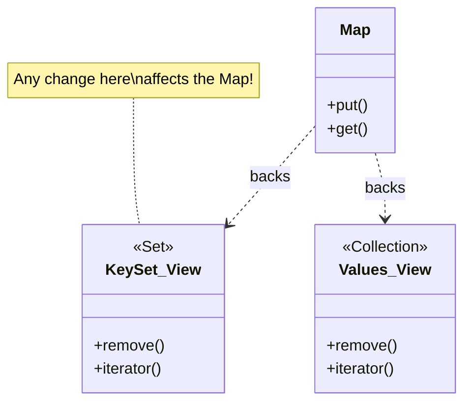

---

> [!success] **Checkpoint: Slides 447-452** إحنا وقفنا بالظبط قبل **Slide 453 (Algorithms)**. ملخص اللي فات:
> 
> 1. **Updating:** إوعى تستخدم `get` و `put` بسذاجة مع العدادات. استخدم `merge` أو `getOrDefault`.
> 2. **Views:** الـ `keySet` و `values` هي بوابات للتحكم في الـ Map، وأي حذف فيها بيسمع في الداتا الأصلية.
> 
> **المحطة القادمة:** بداية من **Slide 453**، هنتعلم الـ **Algorithms** الجاهزة اللي الجافا بتقدمها (زي Sorting, Shuffling, Binary Search) عشان منكتبش الكود ده بإيدينا تاني. 🚀

---

# Lesson 9 (Part 8): Collection Algorithms

**(Slides 454 - 465)**

> [!ABSTRACT] **خريطة الطريق**
> 
> 1. **The DRY Principle:** ليه نكتب كود `max` و `min` لكل Collection؟ (Generic Algorithms).
> 2. **Sorting & Shuffling:** الترتيب والخلط (تطبيق عملي: اللوتري).
> 3. **Binary Search:** إزاي تدور في مليون عنصر في 20 خطوة بس!

---

## 1. Generic Algorithms (كتابة الكود مرة واحدة)

**(Slides 454 - 457)**

### 📖 المشكلة (The Pain)

في **Slide 454**، بيوريك كود بيحسب "أكبر عنصر" (Max) تلات مرات:

1. مرة للـ `Array` (باستخدام `[]`).
2. مرة للـ `ArrayList` (باستخدام `get(i)`).
3. مرة للـ `LinkedList` (باستخدام `Iterator`).

**رأي السينيور:** ده كود "سباغيتي". لو عندك `HashSet` هتكتب ميثود رابعة؟ طب `TreeSet`؟ ده ضد مبدأ **DRY (Don't Repeat Yourself)**.

### 💡 الحل: Polymorphic Algorithm

بما إن كل الكلاسات دي بتعمل Implement لـ `Collection` Interface، إحنا ممكن نكتب الميثود مرة واحدة بس تقبل أي `Collection`.

### 💻 تشريح الكود (Slide 457)

ده الـ **Ultimate Generic Method** اللي بيشتغل على أي حاجة:

```java
// <T extends Comparable>: بنقول للجافا العنصر T ده لازم يكون قابل للمقارنة (عشان نعرف مين الكبير)
public static <T extends Comparable> T max(Collection<T> c) {

    // 1. Safety Check: لو الليستة فاضية، مفيش "كبير"، ارمي Exception.
    if (c.isEmpty()) throw new NoSuchElementException();

    // 2. Setup Iterator: الموتور اللي هيلف على أي نوع Collection
    Iterator<T> iter = c.iterator();

    // 3. Initialize: افترض إن أول واحد هو الكبير مؤقتاً
    T largest = iter.next();

    // 4. The Loop: طول ما فيه عناصر تانية...
    while (iter.hasNext()) {
        T next = iter.next();

        // 5. Compare: لو العنصر الجديد (next) أكبر من (largest)
        // compareTo بترجع رقم موجب لو next هو الأكبر
        if (largest.compareTo(next) < 0)
            largest = next; // بدّل العرش
    }

    return largest;
}
```

---

## 2. Sorting & Shuffling (الترتيب والخلط)

**(Slides 458 - 461)**

الترتيب (Sorting) والخلط (Shuffling) وجهان لعملة واحدة.

### A. Sorting (Java 8 Style)

**(Slide 459)** زمان كنا بنستخدم `Collections.sort(list)`. في Java 8، الـ List نفسها بقى فيها ميثود `sort`.

```java
// 1. Sort by Salary (Ascending - تصاعدي)
staff.sort(Comparator.comparingDouble(Employee::getSalary));

// 2. Sort by Salary (Descending - تنازلي)
// reversed() بتقلب المقارنة
staff.sort(Comparator.comparingDouble(Employee::getSalary).reversed());
```

### B. Shuffling (The Lottery Example)

**(Slide 461)** المثال ده عبقري. بيحاكي سحب اليانصيب (Lottery). عايزين نختار 6 أرقام عشوائية من 1 لـ 49، ونعرضهم مترتبين.

### 📊 المخطط الهندسي (Simulation)

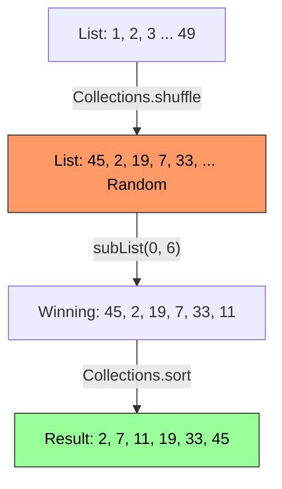

### 💻 تشريح كود الـ Shuffle (Slide 461)

```java
public class ShuffleTest {
    public static void main(String[] args) {
        // 1. Prepare the Deck
        List<Integer> numbers = new ArrayList<>();
        for (int i = 1; i <= 49; i++)
            numbers.add(i); // [1, 2, 3, ..., 49]

        // 2. Shake it! 🎲
        // دي خوارزمية بتلخبط أماكن العناصر عشوائياً (Linear Time Shuffle)
        Collections.shuffle(numbers);

        // 3. Pick Winners
        // بناخد أول 6 عناصر بس من الليستة المتلخبطة (View مش Copy)
        List<Integer> winningCombination = numbers.subList(0, 6);

        // 4. Sort for Display
        // لازم نرتبهم عشان شكلهم يبقى حلو في الطباعة
        Collections.sort(winningCombination);

        System.out.println(winningCombination);
    }
}
```

- **Senior Note:** الـ `subList` بترجع "شباك" (View) على الليستة الأصلية. لما عملنا `sort` للـ `winningCombination`، الـ 6 عناصر دول ترتبوا جوه الـ `numbers` الأصلية كمان!

---

## 3. Binary Search (البحث الذكي)

**(Slides 462 - 464)**

دي أهم خوارزمية بحث لازم تكون عارفها.

### 📖 المفهوم (The Concept)

لو بتدور على كلمة في قاموس، هل بتمشي صفحة صفحة من الأول؟ لأ. بتفتح القاموس من النص، وتشوف الكلمة فين، وتروح للنص اليمين أو الشمال. ده اسمه **Binary Search**.

- **الشرط الأساسي:** لازم الـ Collection تكون **Sorted** (مترتبة) الأول.

### 📊 المخطط الهندسي (Linear vs Binary)

تخيل بندور على رقم **80** في لستة مترتبة.

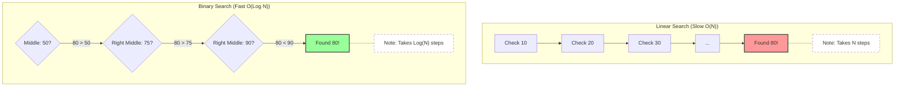

### 🧠 عمق هندسي (Slide 463)

- **Linear Search:** لو عندك 1024 عنصر، ممكن تحتاج 1024 خطوة. ($O(N)$).
- **Binary Search:** الـ 1024 عنصر بيتقسموا للنص كل مرة: $1024 \to 512 \to 256 \to 128 \to 64 \to 32 \to 16 \to 8 \to 4 \to 2 \to 1$ يعني بتلاقي العنصر في **10 خطوات بس!** ($O(\log N)$).

### 💻 تشريح الكود (Slide 464)

```java
// 1. Call the method
int index = Collections.binarySearch(c, element);

// أو لو بتستخدم Comparator خاص
int index = Collections.binarySearch(c, element, comparator);
```

**قيمة الـ `index` الراجعة (Return Value):**

1. **لو $\ge$ 0:** العنصر موجود، وده الـ Index بتاعه.
2. **لو رقم سالب:** العنصر **مش موجود**.
    - الرقم السالب ده ليه معنى! المعادلة هي: `(-insertionPoint - 1)`.
    - يعني بيقولك: "لو كنت عايز تضيف العنصر ده وتحافظ على الترتيب، المفروض تحطه فين".

---

## 🌍 في سوق العمل (Production Reality)

1. **Sorting:** إوعى تكتب Sorting Algorithm بإيدك (Bubble Sort وكده) إلا لو بتتعلم. استخدم دايماً `Collections.sort` لأنها بتستخدم **TimSort** (خوارزمية مهجنة وسريعة جداً).
2. **Binary Search:** متستخدموش مع `LinkedList`. الـ Binary Search بيحتاج ينط للنص، والـ `LinkedList` مبتعرفش تنط (لازم تمشي خطوة خطوة). لو استخدمته معاها هتبقى أبطأ من الـ Linear Search العادي! استخدمه بس مع `ArrayList` أو `Arrays`.

---

> [!success] **Checkpoint: Slides 454-465** أنت دلوقتي في جيبك أهم أدوات الـ Algorithms:
> 
> 1. **Generic Max/Min:** بتشتغل على أي داتا.
> 2. **Sort & Shuffle:** لترتيب وعشوائية البيانات.
> 3. **Binary Search:** للبحث الصاروخي في البيانات المترتبة.
> 
> **المحطة الجاية:** هنلقي نظرة سريعة على **Simple Algorithms** تانية في سلايد 466، وبعدين ندخل على الـ **Legacy Collections** (حاجات قديمة لازم تعرفها عشان لو شفت كود مكتوب سنة 2000). جاهز؟ 👴🏼📜

---

# Lesson 9 (Final Part): Algorithms & Legacy Collections

**(Slides 466 - 471)**


## 1. Simple Algorithms (شنطة العدة الإضافية)

**(Slides 466 - 467)**

إحنا اتكلمنا عن الـ Sorting والـ Searching، بس الكلاس `java.util.Collections` مليان أدوات تانية بتنجز مهام روتينية بدل ما تكتب Loop بإيدك.

### 🛠️ أهم الأدوات (كما ورد في Slide 467)

بدل ما تكتب كود يلف على الليستة عشان يملأها أصفار، أو يبدل عنصرين، استخدم دول:

1. **`Collections.fill(list, value)`**: بتملأ الليستة كلها بقيمة واحدة (Resetting data).
2. **`Collections.copy(dest, src)`**: بتنسخ عناصر من ليستة للتانية (خد بالك لازم الـ destination تكون حجمها كفاية).
3. **`Collections.swap(list, i, j)`**: بتبدل أماكن عنصرين بالـ index. مفيدة جداً في خوارزميات الترتيب اليدوية.
4. **`Collections.reverse(list)`**: بتقلب الليستة (المتشقلب يتعدل).
5. **`Collections.rotate(list, distance)`**: بتلف العناصر زي "العجلة". العنصر الأخير يجي في الأول وهكذا.
6. **`Collections.frequency(collection, obj)`**: بتقولك العنصر ده اتكرر كام مرة جوه الـ Collection.

### 🔥 إضافات Java 8 (Slide 466)

ضافوا Methods جوه الـ Collection interface نفسه بتستخدم الـ Lambda:

- **`removeIf(Predicate)`**: "امسح كل الناس اللي اسمهم أحمد".
- **`replaceAll(UnaryOperator)`**: "خلي كل الحروف UpperCase".

```java
// مثال: شيل الكلمات القصيرة وكبّر الحروف في الباقي
words.removeIf(w -> w.length() <= 3);
words.replaceAll(String::toLowerCase);
```

---

## 2. Legacy Collections (تاريخ وتراث)

**(Slides 468 - 470)**

### 📖 الحكاية (The Story)

قبل Java 1.2 (سنة 1998)، مكنش فيه `ArrayList` ولا `HashMap`. كان فيه كلاسات قديمة اسمها **`Vector`** و **`Stack`** و **`Hashtable`**. لما عملوا الـ Collections Framework الجديد، مقدروش يرموا القديم عشان البرامج اللي شغالة متضربش. فعملوا "Re-engineering" وخلو الكلاسات القديمة دي تعمل Implement للـ Interfaces الجديدة.

### 🧠 الفرق بين القديم والجديد (Interview Question)

- **`Vector` vs `ArrayList`**: الـ Vector هو الجد القديم للـ ArrayList. الفرق الجوهري إن الـ Vector كل الميثودز بتاعته **Synchronized** (Thread-safe). ده بيخليه أبطأ بكتير. الـ ArrayList مش synchronized وده بيخليها أسرع (وهي الـ Standard دلوقتي).
- **`Hashtable` vs `HashMap`**: نفس الفكرة. الـ Hashtable قديمة، synchronized، ومبتقبلش `null` لا في الـ Key ولا الـ Value. الـ HashMap جديدة، سريعة، وبتقبل `null`.

---

## 3. 📊 المخطط الهندسي (Legacy Hierarchy)

**(Slide 470)**

ده الرسم المطلوب توضيحه وشرحه. بيوضح إزاي العيلة القديمة (Legacy) اندمجت مع العيلة الجديدة.

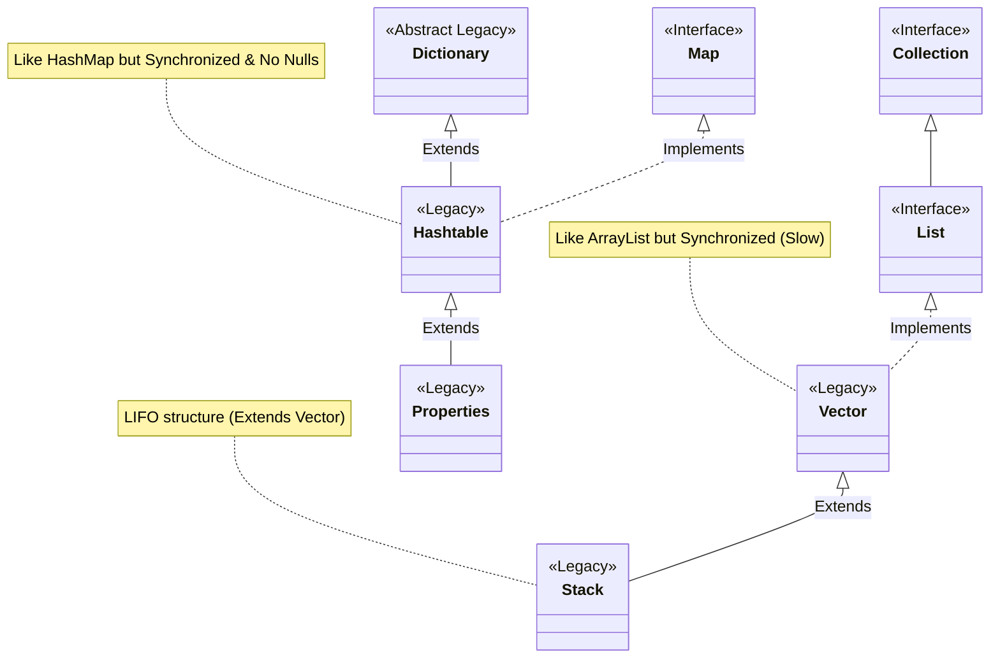

### 🧠 شرح الرسمة:

1. **`Vector`**: قرروا يخلوه يعمل Implement لـ `List`. فبقى يتصرف زي الليستة العادية.
2. **`Stack`**: زمان كان بيورث من `Vector`. وده تصميم غلط (لأن الـ Stack مفيهوش index access)، بس مضطرين يسيبوه عشان الـ Backward Compatibility. (الصح دلوقتي تستخدم `ArrayDeque` كـ Stack).
3. **`Hashtable`**: خلوها تعمل Implement لـ `Map`.
4. **`Properties`**: ده كلاس مهم لسه بنستخدمه لحد النهاردة لقراءة ملفات الـ configuration (`.properties`)، وهو بيورث من `Hashtable` (Key/Value بس الاتنين Strings).

---

## 4. 💻 حل الـ Lab Exercise (Word Dictionary)

**(Slide 471)**

**المطلوب:**

1. Map بتستخدم الحروف (A, B..) كـ Keys.
2. الـ Value عبارة عن Collection شايلة الكلمات اللي بتبدأ بالحرف ده.
3. الكلمات لازم تكون **مترتبة**. (Sorted).
4. ميثودز للطباعة.

### الحل الهندسي (Best Practice)

بما إنه طلب إن الكلمات تكون **Sorted**، يبقى أنسب Collection نستخدمها كـ Value هي **`TreeSet`**. وبما إننا بنعمل قاموس، يفضل الحروف نفسها (Keys) تكون مترتبة، فهنستخدم **`TreeMap`** للـ Dictionary نفسه.

### 💻 الكود (The Solution)

```java
import java.util.*;

public class SimpleWordDictionary {

    // 1. The Data Structure
    // Map<Character, Set<String>>
    // Key: Character (A, B, C...) -> Sorted by TreeMap
    // Value: Set<String> (Words...) -> Sorted by TreeSet to avoid duplicates & keep order
    private Map<Character, Set<String>> dictionary;

    public SimpleWordDictionary() {
        // TreeMap ensures keys (Characters) are sorted automatically
        dictionary = new TreeMap<>();
    }

    // 2. Method to add words
    public void addWord(String word) {
        if (word == null || word.isEmpty()) return;

        // Normalize: First letter uppercase, rest lowercase
        String cleanWord = word.substring(0, 1).toUpperCase() + word.substring(1).toLowerCase();
        Character firstChar = cleanWord.charAt(0);

        // Check if alphabet key exists? if not, create new TreeSet
        // Java 8 Style (computeIfAbsent):
        // "If 'A' doesn't exist, create a new TreeSet, put it in map, and return it. Then add the word."
        dictionary.computeIfAbsent(firstChar, k -> new TreeSet<>()).add(cleanWord);

        // --- Legacy Way (Pre-Java 8) ---
        /*
        if (!dictionary.containsKey(firstChar)) {
            dictionary.put(firstChar, new TreeSet<>());
        }
        dictionary.get(firstChar).add(cleanWord);
        */
    }

    // 3. Print All Letters and corresponding words
    public void printAll() {
        System.out.println("\n--- Full Dictionary ---");
        // Using Java 8 forEach for clean iteration
        dictionary.forEach((letter, words) -> {
            System.out.println("Letter '" + letter + "': " + words);
        });
    }

    // 4. Print words of a specific letter
    public void printWordsByLetter(char letter) {
        char key = Character.toUpperCase(letter);
        System.out.println("\n--- Words for '" + key + "' ---");

        // Defensive coding: Check if key exists using getOrDefault
        Set<String> words = dictionary.getOrDefault(key, Collections.emptySet());

        if (words.isEmpty()) {
            System.out.println("(No words found)");
        } else {
            System.out.println(words);
        }
    }

    // Main Method to test the application
    public static void main(String[] args) {
        SimpleWordDictionary dict = new SimpleWordDictionary();

        // Adding words randomly
        dict.addWord("Apple");
        dict.addWord("ant"); // Should be sorted with Apple
        dict.addWord("Banana");
        dict.addWord("Boy");
        dict.addWord("Cat");
        dict.addWord("Arrow"); // Should appear in 'A' sorted
        dict.addWord("Zebra");

        // Test Print All
        dict.printAll();

        // Test Print Specific Letter
        dict.printWordsByLetter('a');
        dict.printWordsByLetter('z');
        dict.printWordsByLetter('x'); // Not existing
    }
}
```

### 🔍 تحليل الكود (Code Autopsy):

- **`new TreeMap<>()`**: استخدمنا `TreeMap` عشان لما نطبع القاموس كله، الحروف تطلع (A, B, C) بالترتيب، مش عشوائي زي `HashMap`.
- **`new TreeSet<>()`**: استخدمنا `TreeSet` جوه الـ Map عشان الكلمات نفسها (Arrow, Ant, Apple) تترتب أبجدياً أوتوماتيك، وكمان تمنع التكرار (لو ضفت "Apple" مرتين تدخل مرة واحدة).
- **`computeIfAbsent`**: دي ميثود عبقرية من Java 8، بتوفر عليك كتابة `if (map.get(key) == null) createNewList()`.

---

