# The History and Evolution of Java

**(ุชุงุฑูŠุฎ ูˆุชุทูˆุฑ ุงู„ุฌุงูุง)**

#### Group 1: The Origin Story (1991)

### 1. ุงู„ู…ุดูƒู„ุฉ ุงู„ุฃุตู„ูŠุฉ: ุงู„ุชูƒู„ูุฉ ูˆุงู„ุชุนู‚ูŠุฏ

> โ€ข An easierโ€”and more cost-efficientโ€”solution was needed.
> 
> โ€ข Gosling and others began work on a portable, platform-independent language...

- **ุงู„ูˆุถุน:** ุฌูŠู…ุณ ุฌูˆุณู„ูŠู†ุฌ (Gosling) ูˆูุฑูŠู‚ู‡ (Green Team) ูƒุงู†ูˆุง ุดุบุงู„ูŠู† ุนู„ู‰ **Embedded Controllers** (ุฒูŠ ุงู„ุฑูŠู…ูˆุชุงุชุŒ ุงู„ุชู„ูุฒูŠูˆู†ุงุช ุงู„ุฐูƒูŠุฉุŒ ุฃุฌู‡ุฒุฉ ุงู„ู…ุทุจุฎ).
    
- **ุงู„ุฃุฒู…ุฉ:** ุงู„ุฃุฌู‡ุฒุฉ ุฏูŠ ุจุชุณุชุฎุฏู… **CPUs** ู…ุฎุชู„ูุฉ ูˆู…ุชุบูŠุฑุฉ ุจุงุณุชู…ุฑุงุฑ. ู„ุบุงุช ุฒูŠ `C++` ูƒุงู†ุช ุจุชุนู…ู„ Compile ู„ู€ CPU ู…ุญุฏุฏ. ูŠุนู†ูŠ ู„ูˆ ุบูŠุฑุช ุงู„ุดุฑูŠุญุฉ (Chip)ุŒ ู„ุงุฒู… ุชุนูŠุฏ ูƒุชุงุจุฉ ุงู„ูƒูˆุฏ ูˆุชุนู…ู„ Compile ู…ู† ุฃูˆู„ ูˆุฌุฏูŠุฏ. ุฏู‡ ูƒุงู† **Cost** ุนุงู„ูŠ ุฌุฏุงู‹ ูˆู…ุฌู‡ูˆุฏ ุฑู‡ูŠุจ.
    
- **ุงู„ุญู„:** ุจุฏุฃูˆุง ูŠุดุชุบู„ูˆุง ุนู„ู‰ ู„ุบุฉ ุชูƒูˆู† **Portable** ูˆ **Platform-independent**. ูŠุนู†ูŠ ุชูƒุชุจ ุงู„ูƒูˆุฏ ู…ุฑุฉ ูˆุงุญุฏุฉุŒ ูˆูŠุดุชุบู„ ุนู„ู‰ ุฃูŠ CPU ู…ู‡ู…ุง ูƒุงู† ู†ูˆุนู‡. (ุฏู‡ ุงู„ู„ูŠ ุฃุฏู‰ ู„ุธู‡ูˆุฑ ุงู„ุฌุงูุง).
    

### 2. ุงู„ุนู…ู„ุงู‚ ุงู„ู†ุงุฆู…: ุงู„ู€ Portability ุงู„ู…ู‡ู…ู„ุฉ

> โ€ข Portable (platform-independent) programs is nearly as old as the discipline of programming itself...
> 
> โ€ข ...much of the computer world had divided itself into the three competing camps of Intel, Macintosh, and UNIX...

- **ุงู„ุชุงุฑูŠุฎ:** ููƒุฑุฉ ุงู„ู€ Portability ู…ูƒุงู†ุชุด ุฌุฏูŠุฏุฉุŒ ุฏูŠ ู‚ุฏูŠู…ุฉ ู‚ุฏู… ุงู„ุจุฑู…ุฌุฉ. ู„ูƒู† ู…ุญุฏุด ูƒุงู† ู…ู‡ุชู… ุจูŠู‡ุง ุฃูˆูŠ. ู„ูŠู‡ุŸ
    
- **ุงู„ุณุจุจ (The Silos):** ุงู„ุนุงู„ู… ูƒุงู† ู…ุชู‚ุณู… "ู…ุนุณูƒุฑุงุช ู…ุญุตู†ุฉ" (Fortified Boundaries):
    
    1. ู…ุนุณูƒุฑ **Intel/Windows**.
        
    2. ู…ุนุณูƒุฑ **Macintosh**.
        
    3. ู…ุนุณูƒุฑ **UNIX**.
        
- ุงู„ู…ุจุฑู…ุฌ ูƒุงู† ุจูŠุฎุชุงุฑ ู…ุนุณูƒุฑ ูˆูŠูุถู„ ููŠู‡. ู…ูƒู†ุด ููŠู‡ ุฏุงุนูŠ ู…ู„ุญ ุฅู†ู‡ ูŠูƒุชุจ ูƒูˆุฏ ูŠุดุชุบู„ ู‡ู†ุง ูˆู‡ู†ุงูƒ ููŠ ู†ูุณ ุงู„ูˆู‚ุช. ูุงู„ู€ Portability ูƒุงู†ุช ูˆุงุฎุฏุฉ **Back seat** (ู…ุด ุฃูˆู„ูˆูŠุฉ).
    

### 3. ุงู„ู…ุญูุฒ: ุธู‡ูˆุฑ ุงู„ูˆูŠุจ (The Catalyst)

> โ€ข A second, and ultimately more important, factor was emerging... the World Wide Web.
> 
> โ€ข ...Java was pushed to the forefront... because the Web, too, demanded portable programs.

- ูุฌุฃุฉุŒ ุธู‡ุฑ ุงู„ู€ **World Wide Web**.
    
- ุงู„ูˆูŠุจ ุจุทุจูŠุนุชู‡ ุจูŠุฌู…ุน ูƒู„ ุงู„ู…ุนุณูƒุฑุงุช ุฏูŠ ููŠ ู…ูƒุงู† ูˆุงุญุฏ. ุงู„ุณูŠุฑูุฑ ุจูŠุจุนุช ุตูุญุฉุŒ ูˆุงู„ุตูุญุฉ ุฏูŠ ู…ู…ูƒู† ูŠูุชุญู‡ุง ูŠูˆุฒุฑ ุดุบุงู„ ุจู€ WindowsุŒ ูˆูˆุงุญุฏ ุชุงู†ูŠ ุจู€ MacุŒ ูˆูˆุงุญุฏ ุชุงู„ุช ุจู€ Unix.
    
- ู‡ู†ุง ุงู„ุงุญุชูŠุงุฌ ู„ู„ู€ **Portability** ุชุญูˆู„ ู…ู† "ุฑูุงู‡ูŠุฉ" ู„ู€ "ุถุฑูˆุฑุฉ ู‚ุตูˆู‰" (Urgent Need).
    

### 4. ู„ุญุธุฉ ุงู„ุชู†ูˆูŠุฑ (1993): ุงู„ุชุทุงุจู‚ ุงู„ู…ุฐู‡ู„

> _โ€ข By 1993, it became obvious... that the problems of portability... for embedded controllers are also found when creating code for the Internet._

- **ุงู„ู„ุญุธุฉ ุงู„ูุงุฑู‚ุฉ:** ูุฑูŠู‚ ุงู„ุฌุงูุง ุฃุฏุฑูƒ ุญู‚ูŠู‚ุฉ ู…ุฐู‡ู„ุฉ:
    
    - ุงู„ู…ุดูƒู„ุฉ ุงู„ู„ูŠ ุจูŠุญู„ูˆู‡ุง ู„ู„ู€ **Toasters & Microwaves** (ุชุนุฏุฏ ุงู„ู€ CPUs).
        
    - ู‡ูŠ ู‡ูŠ ู†ูุณ ุงู„ู…ุดูƒู„ุฉ ุงู„ู„ูŠ ุจุชูˆุงุฌู‡ ุงู„ู€ **Internet** (ุชุนุฏุฏ ุฃู†ุธู…ุฉ ุงู„ุชุดุบูŠู„ ูˆุงู„ู€ Hardware).
        
- **ุงู„ุงุณุชู†ุชุงุฌ:** ุงู„ุญู„ ุงู„ู„ูŠ ุนู…ู„ูˆู‡ ู„ู„ุฃุฌู‡ุฒุฉ ุงู„ุตุบูŠุฑุฉ (ู„ุบุฉ Oak ุงู„ู„ูŠ ุจู‚ุช Java) ู‡ูˆ ู‡ูˆ ุงู„ุญู„ ุงู„ู…ุซุงู„ูŠ ู„ู„ุฅู†ุชุฑู†ุช!
    

### 5. ุงู„ุชุญูˆู„ ุงู„ูƒุจูŠุฑ (The Pivot)

> _โ€ข This realization caused the focus of Java to switch from consumer electronics to Internet programming._

- **ุงู„ู†ุชูŠุฌุฉ ุงู„ู†ู‡ุงุฆูŠุฉ:** ุงู„ูุฑูŠู‚ ุบูŠุฑ ุงู„ุฏูุฉ ุชู…ุงู…ุงู‹. ุณุงุจูˆุง ู…ุฌุงู„ ุงู„ู€ Consumer Electronics ูˆุฑูƒุฒูˆุง ูƒู„ ุทุงู‚ุชู‡ู… ุนู„ู‰ ุงู„ู€ **Internet Programming**.
    
- ุงู„ุฑุบุจุฉ ููŠ ู„ุบุฉ **Architecture-neutral** ูƒุงู†ุช ู‡ูŠ ุงู„ุดุฑุงุฑุฉ ุงู„ุฃูˆู„ู‰ุŒ ู„ูƒู† ุงู„ุฅู†ุชุฑู†ุช ู‡ูˆ ุงู„ู„ูŠ ู†ูุฎ ููŠ ุงู„ู†ุงุฑ ุฏูŠ ูˆุฎู„ู‰ ุงู„ุฌุงูุง ุชู†ุฌุญ ุงู„ู†ุฌุงุญ ุงู„ุณุงุญู‚ ุฏู‡.
    

---

### ๐Ÿ“Š ู…ู„ุฎุต ุงู„ุฃุญุฏุงุซ (Visual Flow)

Code snippet

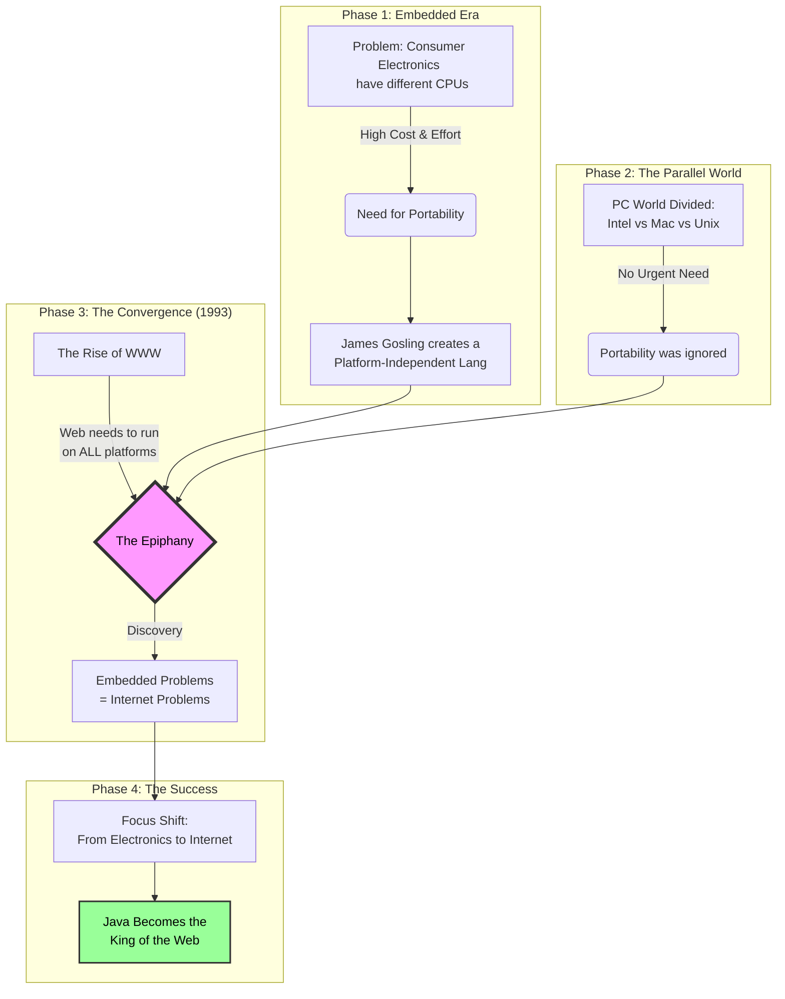
```mermaid
graph TD
    %% Phase 1
    subgraph P1 ["Phase 1: Embedded Era"]
        direction TB
        A["Problem: Consumer Electronics <br/> have different CPUs"] -->|High Cost & Effort| B("Need for Portability")
        B --> C["James Gosling creates a <br/> Platform-Independent Lang"]
    end

    %% Phase 2
    subgraph P2 ["Phase 2: The Parallel World"]
        direction TB
        D["PC World Divided: <br/> Intel vs Mac vs Unix"] -->|No Urgent Need| E("Portability was ignored")
    end

    %% Phase 3
    subgraph P3 ["Phase 3: The Convergence (1993)"]
        direction TB
        F["The Rise of WWW"] -->|Web needs to run <br/> on ALL platforms| G{"The Epiphany"}
        C --> G
        E --> G
        G -->|Discovery| H["Embedded Problems <br/> = Internet Problems"]
    end

    %% Phase 4
    subgraph P4 ["Phase 4: The Success"]
        direction TB
        H --> I["Focus Shift: <br/> From Electronics to Internet"]
        I --> J["Java Becomes the <br/> King of the Web"]
    end
    
    %% Styles
    style G fill:#f9f,stroke:#333,stroke-width:4px,color:black
    style J fill:#9f9,stroke:#333,stroke-width:2px,color:black
```

### ๐Ÿ‘จโ€๐Ÿซ ู„ู…ุณุฉ ุงู„ุณูŠู†ูŠูˆุฑ (The Key Takeaway)

ุงู„ุฏุฑุณ ุงู„ู…ุณุชูุงุฏ ู‡ู†ุง ู…ุด ุชุงุฑูŠุฎุŒ ุจู„ Architecture:

ุงู„ุฌุงูุง ู…ูƒู†ุชุด ู‡ุชู†ุฌุญ ู„ูˆ ูƒุงู†ุช ู…ุฌุฑุฏ ู„ุบุฉ "ุฃู†ูŠู‚ุฉ". ู‡ูŠ ู†ุฌุญุช ู„ุฃู†ู‡ุง ุญู„ุช ู…ุดูƒู„ุฉ Business (ุงู„ุชูƒู„ูุฉ) ูˆู…ุดูƒู„ุฉ Infrastructure (ุชุนุฏุฏ ุงู„ู…ู†ุตุงุช) ููŠ ุงู„ูˆู‚ุช ุงู„ู…ู†ุงุณุจ ุจุงู„ุธุจุท (ูˆู‚ุช ุงู†ูุฌุงุฑ ุงู„ุฅู†ุชุฑู†ุช).

ุงู„ู€ **Bytecode** ูˆุงู„ู€ **JVM** ู‡ู…ุง "ุงู„ุขู„ุฉ" ุงู„ู„ูŠ ุฎู„ุช ุงู„ู€ Portability ุฏูŠ ู…ู…ูƒู†ุฉุŒ ูˆุฏู‡ ุงู„ู„ูŠ ุฎู„ู‰ ุดุนุงุฑ **"Write Once, Run Anywhere"** ูŠุจู‚ู‰ ูˆุงู‚ุน ู…ุด ุฎูŠุงู„.

---
### The Strategic Syntax (ุฎุฏุนุฉ ุงู„ุชุณูˆูŠู‚) ๐Ÿง

> _โ€ข Java derives much of its character from C and C++. This is by intent._

ุงู„ุชุญู„ูŠู„:

ุฌูˆุณู„ูŠู†ุฌ ูˆูุฑูŠู‚ู‡ ูƒุงู†ูˆุง ุฃุฐูƒูŠุงุก ุฌุฏุงู‹. ู‡ู…ุง ุนุงุฑููŠู† ุฅู† ุงู„ุนุงู„ู… ู…ู„ูŠุงู† ู…ู„ุงูŠูŠู† ุงู„ู…ุจุฑู…ุฌูŠู† ุดุบุงู„ูŠู† C ูˆ C++. ู„ูˆ ุนู…ู„ูˆุง ู„ุบุฉ ุงู„ู€ Syntax ุจุชุงุนู‡ุง ุบุฑูŠุจ (ุฒูŠ Pascal ุฃูˆ Lisp)ุŒ ู…ุญุฏุด ู‡ูŠุนุจุฑู‡ุง.

- **ุงู„ุฎุทุฉ:** "ุฎู„ูˆุง ุงู„ุฌุงูุง ุชุดุจู‡ ุงู„ู€ C++ ุดูƒู„ุงู‹ุŒ ู„ูƒู† ุชุดุชุบู„ ุจุฐูƒุงุก ูˆู…ุณุคูˆู„ูŠุฉ ู…ู† ุฌูˆู‡".
    
- **ุงู„ู†ุชูŠุฌุฉ:** ุฃูŠ ู…ุจุฑู…ุฌ C++ ูƒุงู† ุจูŠุญุชุงุฌ ูŠูˆู…ูŠู† ุจุณ ุนุดุงู† ูŠูู‡ู… ุฌุงูุง. ุฏู‡ ุงู„ู„ูŠ ุนู…ู„ ุงู„ู€ **"Adoption Explosion"**.
    

### 2. A Language by Engineers, for Engineers ๐Ÿ›๏ธ

> _โ€ข Java was designed... by real, working programmers... grounded in needs and experiences._

ุงู„ุชุญู„ูŠู„:

ุงู„ุฌุงูุง ู…ุด ู„ุบุฉ ุฃูƒุงุฏูŠู…ูŠุฉ ุงุชุนู…ู„ุช ููŠ ู…ุนู…ู„ ุฃุจุญุงุซ ุนุดุงู† ุฑุณุงู„ุฉ ุฏูƒุชูˆุฑุงู‡ (ุฒูŠ ู„ุบุงุช ูƒุชูŠุฑ ุจุชู…ูˆุช). ุงู„ุฌุงูุง ุงุชุนู…ู„ุช ุนุดุงู† ุชุญู„ ู…ุดุงูƒู„ ุญู‚ูŠู‚ูŠุฉ ูˆุงุฌู‡ุช ุงู„ู€ Green Team ูˆู‡ู…ุง ุจูŠุจุฑู…ุฌูˆุง ุงู„ู€ Star7.

- ู‡ูŠ ู„ุบุฉ **Pragmatic** (ุนู…ู„ูŠุฉ). ู…ููŠุด ููŠู‡ุง ุชุนู‚ูŠุฏุงุช ูู„ุณููŠุฉ ู…ู„ู‡ุงุด ู„ุงุฒู…ุฉ.
    

### 3. The "No Training Wheels" Paradox ๐Ÿšฒ

> _โ€ข Java is not a language with training wheels... Java gives you full control._

ูˆู‚ูุฉ ุณูŠู†ูŠูˆุฑ ู‡ู†ุง: ๐Ÿ›‘

ุงู„ุฌู…ู„ุฉ ุฏูŠ ู…ู…ูƒู† ุชู„ุฎุจุทูƒ. ุฅุญู†ุง ุนุงุฑููŠู† ุฅู† ุงู„ุฌุงูุง ุดุงู„ุช ุงู„ู€ Pointers ูˆุงู„ู€ Memory ManagementุŒ ูุฅุฒุงูŠ ุจุชู‚ูˆู„ "Full Control" ูˆู…ููŠุด "ุณู†ุงุฏุงุช"ุŸ

- **ุงู„ู…ู‚ุตูˆุฏ ู‡ู†ุง:** ุฅู† ุงู„ุฌุงูุง ู„ุบุฉ **Enterprise**. ู‡ูŠ ุจุชุฏูŠูƒ ุงู„ู‚ูˆุฉ ุฅู†ูƒ ุชุจู†ูŠ ุฃู†ุธู…ุฉ ุจู†ูƒูŠุฉุŒ ุณูŠุฑูุฑุงุช ุนู…ู„ุงู‚ุฉุŒ ูˆู…ุญุฑูƒุงุช ู…ุนู‚ุฏุฉ. ู‡ูŠ ู…ุด ู„ุบุฉ ุชุนู„ูŠู…ูŠุฉ ู„ู„ุฃุทูุงู„ (ุฒูŠ Scratch ู…ุซู„ุงู‹) ุจุชุญู…ูŠูƒ ู…ู† ูƒู„ ุญุงุฌุฉ.
    
- **ุงู„ู…ุณุคูˆู„ูŠุฉ:** ุงู„ุฌู…ู„ุฉ _"If you program poorly, your programs reflect that"_ ู…ุนู†ุงู‡ุง ุฅู† ุงู„ู€ Garbage Collector ู…ุด ู‡ูŠุญูŠู„ูƒ ู…ุดุงูƒู„ ุงู„ู€ **Logical Memory Leaks** (ุฒูŠ ุฅู†ูƒ ุชุณูŠุจ Objects ููŠ Static List ู„ู„ุฃุจุฏ). ุจุณ ุฃู†ุช ู„ุณู‡ ู…ุณุคูˆู„ ุนู† ุงู„ู€ Architecture.
    

### 4. The Evolution: What did Java add? ๐Ÿงฌ

> _โ€ข Java enhanced and refined the object-oriented paradigm... added integrated support for multithreading._

ุงู„ุฌุงูุง ู…ุฎุฏุชุด ุงู„ู€ C++ ูƒูˆุจูŠ ุจูŠุณุช. ู‡ูŠ "ู†ุถูุชู‡ุง" ูˆุทูˆุฑุชู‡ุง:

1. **Refined OOP:** ู…ู†ุนุช ุงู„ู€ Multiple Inheritance ู„ู„ูƒู„ุงุณุงุช (ุนุดุงู† ุชุชุฌู†ุจ ุงู„ุชุนู‚ูŠุฏ).
    
2. **Native Multithreading:** ููŠ C++ ุฒู…ุงู†ุŒ ูƒู†ุช ุนุดุงู† ุชุนู…ู„ Thread ู„ุงุฒู… ุชูƒู„ู… ุงู„ู€ OS API ู…ุจุงุดุฑุฉ.
   ููŠ ุฌุงูุงุŒ ุงู„ู€ **Threading** ุฌุฒุก ู…ู† ุงู„ู„ุบุฉ ู†ูุณู‡ุง (`java.lang.Thread`). ุฏูŠ ูƒุงู†ุช ุซูˆุฑุฉ ูˆู‚ุชู‡ุง.
    
3. **Internet Ready:** ู…ูƒุชุจุงุช ุงู„ู€ Network ูƒุงู†ุช Built-in ู…ู† ุฃูˆู„ ูŠูˆู….
    

---

### ๐Ÿ“Š ู…ู„ุฎุต ุงู„ู€ DNA (Mermaid Diagram)

Code snippet

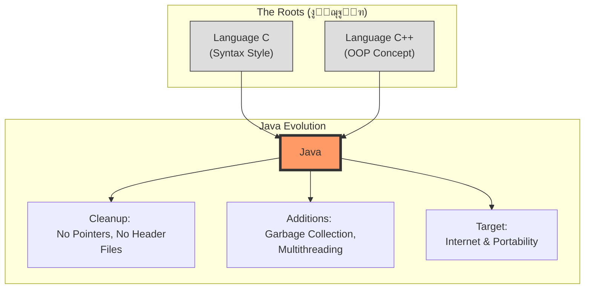
```mermaid
graph TD
    subgraph Roots ["The Roots (ุงู„ุฌุฐูˆุฑ)"]
        direction TB
        C["Language C <br/> (Syntax Style)"]
        Cpp["Language C++ <br/> (OOP Concept)"]
    end

    subgraph Java ["Java Evolution"]
        direction TB
        J1["Java"]
        J_Feat1["Cleanup: <br/> No Pointers, No Header Files"]
        J_Feat2["Additions: <br/> Garbage Collection, Multithreading"]
        J_Target["Target: <br/> Internet & Portability"]
    end

    C --> J1
    Cpp --> J1
    J1 --> J_Feat1
    J1 --> J_Feat2
    J1 --> J_Target

    style J1 fill:#f96,stroke:#333,stroke-width:4px
    style C fill:#ddd,stroke:#333
    style Cpp fill:#ddd,stroke:#333
```

### ๐Ÿ’ก ุงู„ุฎู„ุงุตุฉ (Senior Takeaway):

ุงู„ุฌุงูุง ู‡ูŠ **"C++ ++ --"**.

- **++** ุฒูˆุฏุช ุนู„ูŠู‡ุง ุงู„ู€ Garbage Collection ูˆุงู„ู€ Portability.
    
- -- ุดุงู„ุช ู…ู†ู‡ุง ุงู„ู€ Pointers ูˆุงู„ุชุนู‚ูŠุฏุงุช ุงู„ุฎุทูŠุฑุฉ.
    
    ูˆุฏู‡ ูƒุงู† "ุงู„ุฎู„ุทุฉ ุงู„ุณุฑูŠุฉ" ู„ู†ุฌุงุญู‡ุง.
---
### 1. The Golden Analogy: Java vs. C โš–๏ธ

> _Java was to Internet programming what C was to system programming._

ุงู„ุชุดุจูŠู‡ ุฏู‡ ุนุจู‚ุฑูŠ ูˆู„ุฎุต ุงู„ุญูƒุงูŠุฉ ูƒู„ู‡ุง:

- **ู„ุบุฉ C:** ุบูŠุฑุช ุงู„ุนุงู„ู… ู„ู…ุง ู…ูƒู†ุช ุงู„ู…ุจุฑู…ุฌูŠู† ุฅู†ู‡ู… ูŠูƒุชุจูˆุง ุฃู†ุธู…ุฉ ุชุดุบูŠู„ (Unix) ูˆุจุฑุงู…ุฌ System ู‚ูˆูŠุฉ ูˆุณุฑูŠุนุฉ ูˆุชุดุชุบู„ ุนู„ู‰ ู‡ุงุฑุฏูˆูŠุฑ ู…ุฎุชู„ู ุจูƒูุงุกุฉ. ู‡ูŠ **ู…ู„ูƒุฉ ุงู„ู€ System Programming**.
    
- **ู„ุบุฉ Java:** ุนู…ู„ุช ู†ูุณ ุงู„ุซูˆุฑุฉ ุจุณ ููŠ **ุงู„ุฅู†ุชุฑู†ุช**. ู‡ูŠ ุงู„ู„ุบุฉ ุงู„ู„ูŠ ู…ูƒู†ุช ุงู„ู…ุจุฑู…ุฌูŠู† ุฅู†ู‡ู… ูŠุญูˆู„ูˆุง ุงู„ูˆูŠุจ ู…ู† ู…ุฌุฑุฏ ุตูุญุงุช ูˆุฑู‚ (Static HTML) ู„ุจุฑุงู…ุฌ ุชูุงุนู„ูŠุฉ ูˆุดุจูƒุงุช ู…ุนู‚ุฏุฉ (Distributed Computing). ู‡ูŠ **ู…ู„ูƒุฉ ุงู„ู€ Internet Programming**.
    

### 2. The Symbiotic Relationship (ุงู„ุนู„ุงู‚ุฉ ุงู„ุชุจุงุฏู„ูŠุฉ) ๐Ÿ”„

> _The Internet helped pushing Java... and Java, in turn, had a deep effect on the Internet._

ุงู„ุนู„ุงู‚ุฉ ุจูŠู†ู‡ู… ูƒุงู†ุช "Win-Win":

1. **ุงู„ุฅู†ุชุฑู†ุช ุฎุฏู… ุงู„ุฌุงูุง:** ูˆูุฑู„ู‡ุง ุงู„ุจูŠุฆุฉ ุงู„ู…ุซุงู„ูŠุฉ ู„ู„ุงู†ุชุดุงุฑ. ู…ุดูƒู„ุฉ "ุงุฎุชู„ุงู ุงู„ุฃุฌู‡ุฒุฉ" ุงู„ู„ูŠ ููŠ ุงู„ุฅู†ุชุฑู†ุช ูƒุงู†ุช ู…ู„ุนุจ ุงู„ุฌุงูุง ุงู„ุฃุณุงุณูŠ.
    
2. **ุงู„ุฌุงูุง ุฎุฏู…ุช ุงู„ุฅู†ุชุฑู†ุช:** ู‚ุจู„ ุงู„ุฌุงูุงุŒ ุงู„ูˆูŠุจ ูƒุงู† "ู…ู…ู„". ุงู„ุฌุงูุง ุงุฎุชุฑุนุช ุงู„ู€ **Applets**ุŒ ูุฎู„ุช ุงู„ูˆูŠุจ "ุญูŠ" (Dynamic).
    

---

### 3. The Trinity of Internet Success (ุซุงู„ูˆุซ ุงู„ู†ุฌุงุญ) ๐Ÿ”บ

### 1. The Magic: Dynamic Web (ุณุญุฑ ุงู„ูˆูŠุจ ุงู„ุชูุงุนู„ูŠ) โœจ

> _โ€ข At the time of Javaโ€™s creation... most exciting features was the applet._

ุงู„ุชุญู„ูŠู„:

ุฒู…ุงู† (1995)ุŒ ุงู„ูˆูŠุจ ูƒุงู† ุนุจุงุฑุฉ ุนู† Static HTML. ูŠุนู†ูŠ ุตูุญุงุช "ู…ูŠุชุฉ"ุŒ ู…ุฌุฑุฏ ู†ุตูˆุต ูˆุตูˆุฑ ุซุงุจุชุฉ ุฒูŠ ุงู„ุฌุฑู†ุงู„.

- ุงู„ู€ **Applet** ูƒุงู† ุจุฑู†ุงู…ุฌ ุฌุงูุง ุตุบูŠุฑ "ุจูŠุณุงูุฑ" ุนุจุฑ ุงู„ุฅู†ุชุฑู†ุช ู…ู† ุงู„ุณูŠุฑูุฑ ูˆูŠู†ุฒู„ ูŠุดุชุบู„ ุฌูˆู‡ ู…ุชุตูุญ ุงู„ุนู…ูŠู„ (Browser).
    
- ุฏู‡ ูƒุงู† "ุณุญุฑ" ู„ุฃู† ูุฌุฃุฉ ุงู„ุตูุญุฉ ุจู‚ู‰ ููŠู‡ุง ุฃุฒุฑุงุฑ ุจุชุชุญุฑูƒุŒ ูˆุฑุณูˆู… ุจูŠุงู†ูŠุฉ ุจุชุชุบูŠุฑุŒ ูˆุฃู„ุนุงุจ ุดุบุงู„ุฉ ู„ุงูŠู.
    

### 2. Client-Side Execution (ู†ู‚ู„ ุงู„ุญู…ู„ ู„ู„ุนู…ูŠู„) ๐Ÿ—๏ธ

> _โ€ข They were typically used to... execute locally, rather than on the server._

ุงู„ุชุญู„ูŠู„ ุงู„ู‡ู†ุฏุณูŠ:

ุฏูŠ ูƒุงู†ุช ุงู„ู†ู‚ู„ุฉ ุงู„ู…ุนู…ุงุฑูŠุฉ ุงู„ูƒุจูŠุฑุฉ.

- **ู‚ุจู„ ุงู„ู€ Applet:** ู„ูˆ ุนุงูŠุฒ ุชุญุณุจ ู‚ุณุท ู‚ุฑุถ (Loan Calculator)ุŒ ูƒู†ุช ุชุจุนุช ุงู„ุฃุฑู‚ุงู… ู„ู„ุณูŠุฑูุฑุŒ ุงู„ุณูŠุฑูุฑ ูŠุญุณุจุŒ ูˆูŠุฑุฌุนู„ูƒ ุตูุญุฉ ุฌุฏูŠุฏุฉ ุจุงู„ู†ุชูŠุฌุฉ (Slow & Heavy Server Load).
    
- **ู…ุน ุงู„ู€ Applet:** ุงู„ุณูŠุฑูุฑ ุจูŠุจุนุชู„ูƒ "ูƒูˆุฏ ุงู„ุจุฑู†ุงู…ุฌ" (ุงู„ุขู„ุฉ ุงู„ุญุงุณุจุฉ ู†ูุณู‡ุง). ูˆุฃูŠ ุญุณุงุจุงุช ุจุชุญุตู„ **Locally** ุนู„ู‰ ุงู„ู€ CPU ุจุชุงุนูƒ ุฃู†ุช (ุงู„ุนู…ูŠู„).
    
- **ุงู„ู…ูŠุฒุฉ:** ุชุฎููŠู ุงู„ุญู…ู„ ุนู† ุงู„ุณูŠุฑูุฑ (Offloading) ูˆุงุณุชุฌุงุจุฉ ููˆุฑูŠุฉ ู„ู„ู…ุณุชุฎุฏู… ุจุฏูˆู† ู…ุง ูŠุนู…ู„ Reload ู„ู„ุตูุญุฉ.
    

### 3. The End of an Era (ุงู„ู†ู‡ุงูŠุฉ ูˆุงู„ุฅู†ู‚ุฑุงุถ) โšฐ๏ธ

> _โ€ข Starting with JDK 9, applets are being phased out and deprecated..._

ู„ูŠู‡ ู…ุงุชุชุŸ

ุฑุบู… ุฅู†ู‡ุง ูƒุงู†ุช Crucial ููŠ ุงู„ุจุฏุงูŠุฉุŒ ุฅู„ุง ุฃู†ู‡ุง ุงู†ุชู‡ุช ุจุฏุกุงู‹ ู…ู† JDK 9. ุงู„ุฃุณุจุงุจ ุงู„ู„ูŠ ุงู„ุณู„ุงูŠุฏ ู…ุด ู‚ุงูŠู„ู‡ุง ุจุณ ุฃู†ุช ู„ุงุฒู… ุชุนุฑูู‡ุง:

1. **Security:** ุงู„ู…ุชุตูุญุงุช ูˆู‚ูุช ุฏุนู… ุงู„ู€ Plugins (ุฒูŠ Java Plugin) ุจุณุจุจ ุงู„ุซุบุฑุงุช ุงู„ุฃู…ู†ูŠุฉ ุงู„ุฎุทูŠุฑุฉ.
    
2. **Performance:** ุงู„ู€ Applet ูƒุงู† ุชู‚ูŠู„ ูˆุจูŠุงุฎุฏ ูˆู‚ุช ูŠุญู…ู„.
    
3. **Alternative:** ุธู‡ุฑุช **HTML5** ูˆ **JavaScript** ุงู„ุญุฏูŠุซุฉ (Angular/React)ุŒ ูˆุจู‚ุช ุชู‚ุฏุฑ ุชุนู…ู„ ู†ูุณ "ุงู„ุดุบู„ ุงู„ุฏูŠู†ุงู…ูŠูƒูŠ" ุฏู‡ ุจุณ ุฃุณุฑุน ูˆุฃุฎู ูˆู…ู† ุบูŠุฑ Plugins.
    

---

### ๐Ÿ“Š ุงู„ู…ุฎุทุท ุงู„ู‡ู†ุฏุณูŠ (Applet Architecture)

Code snippet

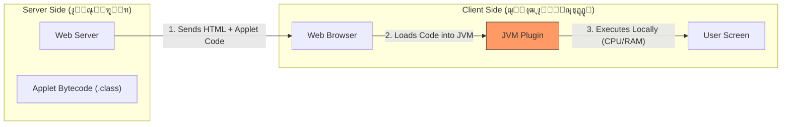
```mermaid
graph LR
    subgraph Server_Side ["Server Side (ุงู„ุณูŠุฑูุฑ)"]
        S[Web Server]
        Bytecode["Applet Bytecode (.class)"]
    end

    subgraph Client_Side ["Client Side (ุฌู‡ุงุฒ ุงู„ู…ุณุชุฎุฏู…)"]
        B[Web Browser]
        JVM[JVM Plugin]
        Display["User Screen"]
    end

    S -- 1. Sends HTML + Applet Code --> B
    B -- 2. Loads Code into JVM --> JVM
    JVM -- 3. Executes Locally (CPU/RAM) --> Display
    
    style JVM fill:#f96,stroke:#333
```

### ๐Ÿ‘จโ€๐Ÿซ Senior Takeaway:

ุงู„ู€ Applet ู‡ูˆ ุงู„ุฌุฏ ุงู„ุดุฑุนูŠ ู„ู„ู€ Single Page Applications (SPAs) ุงู„ู„ูŠ ุจู†ุนู…ู„ู‡ุง ุงู„ู†ู‡ุงุฑุฏุฉ ุจุงู„ู€ React ูˆุงู„ู€ Angular.

ุงู„ููƒุฑุฉ ูˆุงุญุฏุฉ: "ุงุจุนุช ุงู„ูƒูˆุฏ ู„ู„ุนู…ูŠู„ุŒ ูˆุฎู„ูŠ ุงู„ู…ุชุตูุญ ู‡ูˆ ุงู„ู„ูŠ ูŠุดุชุบู„". ุงู„ุฌุงูุง ูƒุงู†ุช ุณุงุจู‚ุฉ ุนุตุฑู‡ุงุŒ ุจุณ ุงู„ุชูƒู†ูˆู„ูˆุฌูŠุง ุจุชุงุนุชู‡ุง (Plugins) ุนุฌุฒุช ูˆู…ุงุชุช.
    

---


### 1. Security: The "Sandbox" Revolution ๐Ÿ›ก๏ธ

> โ€ข As you are likely aware, every time you download a โ€œnormalโ€ program, you are taking a risk...
> 
> โ€ข Java achieved this protection by enabling you to confine an application to the Java execution environment...

ุงู„ุชุญู„ูŠู„ ุงู„ุนู…ูŠู‚ (Deep Dive):

ุฒู…ุงู†ุŒ ู„ูˆ ู†ุฒู„ุช ุจุฑู†ุงู…ุฌ .exe ู…ู† ุงู„ู†ุชุŒ ุฃู†ุช ุจุชู„ุนุจ "ุฑูˆู„ูŠุช ุฑูˆุณูŠ". ุงู„ุจุฑู†ุงู…ุฌ ุฏู‡ ุนู†ุฏู‡ ุตู„ุงุญูŠุงุช ูŠูˆุตู„ ู„ู„ู€ RegisteryุŒ ูŠูุฑู…ุช ุงู„ู€ Hard DiskุŒ ุฃูˆ ูŠุณุฑู‚ ู…ู„ูุงุชูƒุŒ ู„ุฃู† ุงู„ู€ OS ุจูŠุซู‚ ููŠู‡.

ุงู„ุฌุงูุง ุนู…ู„ุช ุซูˆุฑุฉ ุจู…ูู‡ูˆู… **The Sandbox** (ุตู†ุฏูˆู‚ ุงู„ุฑู…ู„):

1. **ุงู„ุนุฒู„ (Confinement):** ุงู„ุฌุงูุง ู…ุจุชุณู…ุญุด ู„ู„ูƒูˆุฏ ูŠูƒู„ู… ุงู„ู€ Hardware ุฃูˆ ุงู„ู€ OS ู…ุจุงุดุฑุฉ.
    
2. **ุงู„ูˆุณูŠุท (The Middleman):** ุงู„ูƒูˆุฏ ุจูŠุดุชุบู„ ุฌูˆู‡ "ุจูŠุฆุฉ ู…ุนุฒูˆู„ุฉ" (Java Execution Environment - ุงู„ู„ูŠ ู‡ูŠ ุงู„ู€ JVM).
    
3. **ุงู„ุญุงุฑุณ (Security Manager):** ู„ูˆ ุงู„ู€ Applet ุญุงูˆู„ ูŠู‚ุฑุฃ ู…ู„ู ู…ู† ุฌู‡ุงุฒูƒุŒ ุงู„ู€ JVM ุจูŠุถุฑุจู‡ ุนู„ู‰ ุฅูŠุฏู‡ ูˆูŠู‚ูˆู„ู‡ `SecurityException` ๐Ÿ›‘.
    

> ๐Ÿ‘จโ€๐Ÿซ Senior Insight:
> 
> ููŠ C++ุŒ ุงู„ุบู„ุทุฉ ุจูƒุงุฑุซุฉ (Buffer Overflow ู…ู…ูƒู† ูŠุฎุชุฑู‚ ุงู„ุณูŠุณุชู…). ููŠ ุฌุงูุงุŒ ุงู„ุฐุงูƒุฑุฉ (Memory) ุจุชุฏุงุฑ ุนู† ุทุฑูŠู‚ ุงู„ู€ JVMุŒ ูู…ููŠุด Pointers ุชู„ุนุจ ููŠ ุฃู…ุงูƒู† ู…ุญุธูˆุฑุฉ. ุฏู‡ ุงู„ู„ูŠ ุฎู„ู‰ ุงู„ู†ุงุณ ุชุซู‚ ุชุญู…ู„ ุจุฑุงู…ุฌ ุฌุงูุง.

---

### 2. Portability: The Universal Adapter ๐ŸŒ

> โ€ข Portability is a major aspect of the Internet because there are many different types of computers...
> 
> โ€ข The same code must work on all computers...

ุงู„ุชุญู„ูŠู„ ุงู„ุนู…ูŠู‚:

ุงู„ุฅู†ุชุฑู†ุช ู‡ูˆ "ุณูˆู‚ ุฌู…ุนุฉ" ูƒุจูŠุฑุ› ููŠู‡ WindowsุŒ ูˆ MacุŒ ูˆ LinuxุŒ ูˆ Unix. ุงู„ู…ุดูƒู„ุฉ ุฅู† ูƒู„ ูˆุงุญุฏ ููŠู‡ู… ุจูŠุชูƒู„ู… "ู„ุบุฉ ุขู„ุฉ" (Machine Code) ู…ุฎุชู„ูุฉ.

- **ุงู„ุญู„ ุงู„ุชู‚ู„ูŠุฏูŠ:** ุชุนู…ู„ 3 ู†ุณุฎ ู…ู† ุงู„ุจุฑู†ุงู…ุฌ (ู†ุณุฎุฉ exeุŒ ู†ุณุฎุฉ dmgุŒ ู†ุณุฎุฉ rpm). ุฏู‡ ูƒุงุจูˆุณ ุตูŠุงู†ุฉ.
    
- **ุญู„ ุงู„ุฌุงูุง:** ุงุฎุชุฑุนุช "ู„ุบุฉ ู…ูˆุญุฏุฉ" (Esperanto) ุงุณู…ู‡ุง **Bytecode**.
    
    - ุฃู†ุช ุจุชูƒุชุจ ุงู„ูƒูˆุฏ ู…ุฑุฉ ูˆุงุญุฏุฉ.
        
    - ุงู„ู€ Compiler ุจูŠุญูˆู„ู‡ ู„ู€ Bytecode (ู…ู„ู `.class`).
        
    - ุงู„ู…ู„ู ุฏู‡ ุจูŠุดุชุบู„ ุนู„ู‰ **ุฃูŠ ุฌู‡ุงุฒ** ููŠ ุงู„ูƒูˆู† ุทุงู„ู…ุง ุนู„ูŠู‡ JVM.
        

---

### 3. The Missing Link: One Hero for Two Jobs ๐Ÿ”—

> _โ€ข The same mechanism that helps ensure security also helps create portability._

ุงู„ุฌู…ู„ุฉ ุฏูŠ ููŠ ู…ู†ุชู‡ู‰ ุงู„ุฎุทูˆุฑุฉ ูˆุงู„ุนุจู‚ุฑูŠุฉ. ุงู„ุขู„ูŠุฉ ุงู„ู…ุดุชุฑูƒุฉ ู‡ูŠ **The JVM (Java Virtual Machine)**.

ุฅุฒุงูŠ ุงู„ู€ JVM ุจูŠุญู‚ู‚ ุงู„ุงุชู†ูŠู†ุŸ

1. **ุนุดุงู† ุงู„ู€ Security:** ุงู„ู€ JVM ุจูŠุดุชุบู„ ูƒู€ **"ู‚ูุต"** ุจูŠุญุจุณ ุงู„ูƒูˆุฏ ุฌูˆุงู‡ ูˆูŠู…ู†ุนู‡ ูŠุคุฐูŠ ุงู„ุฌู‡ุงุฒ.
    
2. **ุนุดุงู† ุงู„ู€ Portability:** ุงู„ู€ JVM ุจูŠุดุชุบู„ ูƒู€ **"ู…ุชุฑุฌู… ููˆุฑูŠ"** ุจูŠุชุฑุฌู… ุงู„ู€ Bytecode ู„ู„ุบุฉ ุงู„ุฌู‡ุงุฒ ุงู„ู„ูŠ ู‡ูˆ ุนู„ูŠู‡.
    

ูุจู‚ู‰ ุนู†ุฏู†ุง "ุทุจู‚ุฉ ุนุงุฒู„ุฉ" (Abstraction Layer) ู‡ูŠ ุณุฑ ุงู„ู‚ูˆุฉ ูƒู„ู‡ุง.

---

### ๐Ÿ“Š ุงู„ู…ุฎุทุท ุงู„ู‡ู†ุฏุณูŠ (The JVM Architecture)

Code snippet

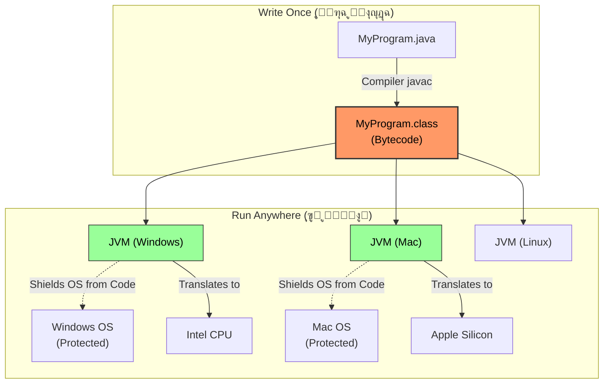
```mermaid
graph TD
    subgraph Source ["Write Once (ู…ุฑุฉ ูˆุงุญุฏุฉ)"]
        direction TB
        JavaCode["MyProgram.java"] -->|Compiler javac| Bytecode["MyProgram.class <br/> (Bytecode)"]
    end

    subgraph Execution ["Run Anywhere (ุฃูŠ ู…ูƒุงู†)"]
        direction TB
        
        %% The JVM acts as the Shield and Translator
        Bytecode --> JVM_Win["JVM (Windows)"]
        Bytecode --> JVM_Mac["JVM (Mac)"]
        Bytecode --> JVM_Linux["JVM (Linux)"]
        
        %% Security Aspect
        JVM_Win -.->|Shields OS from Code| OS_Win["Windows OS <br/> (Protected)"]
        JVM_Mac -.->|Shields OS from Code| OS_Mac["Mac OS <br/> (Protected)"]
        
        %% Portability Aspect
        JVM_Win -->|Translates to| CPU_Win["Intel CPU"]
        JVM_Mac -->|Translates to| CPU_Mac["Apple Silicon"]
    end

    style Bytecode fill:#f96,stroke:#333,stroke-width:2px,color:black
    style JVM_Win fill:#9f9,stroke:#333,color:black
    style JVM_Mac fill:#9f9,stroke:#333,color:black
```

### ๐Ÿ’ก ุงู„ุฎู„ุงุตุฉ (Senior Takeaway):

ุงู„ุฌุงูุง ู…ูƒู†ุชุด ู…ุฌุฑุฏ ู„ุบุฉ ุจุฑู…ุฌุฉุŒ ูƒุงู†ุช **Platform**. ุงู„ู€ JVM ู‡ูˆ ุงู„ุจุทู„ ุงู„ุญู‚ูŠู‚ูŠ ุงู„ู„ูŠ ุถุฑุจ ุนุตููˆุฑูŠู† ุจุญุฌุฑ:

1. **ุญู…ุงู†ุง ู…ู† ุงู„ููŠุฑูˆุณุงุช** (Security).
    
2. **ูˆุญุฏ ู„ุบุฉ ุงู„ุชูุงู‡ู… ุจูŠู† ุงู„ุฃุฌู‡ุฒุฉ** (Portability).
    

---

### ๐Ÿ“Š ุงู„ู…ุฎุทุท ุงู„ู‡ู†ุฏุณูŠ (The Ecosystem Diagram)

Code snippet

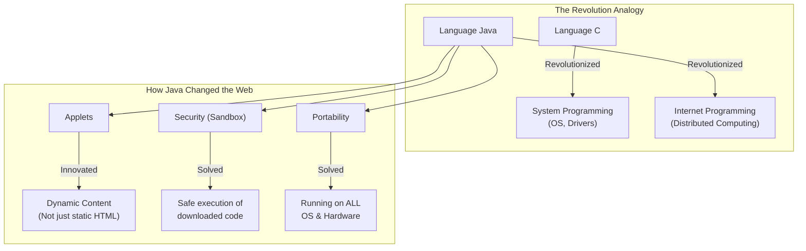
```mermaid
graph TD
    subgraph The_Analogy ["The Revolution Analogy"]
        direction TB
        C_Lang["Language C"] -->|Revolutionized| Sys["System Programming <br/> (OS, Drivers)"]
        Java_Lang["Language Java"] -->|Revolutionized| Web["Internet Programming <br/> (Distributed Computing)"]
    end

    subgraph The_Impact ["How Java Changed the Web"]
        direction TB
        Applets["Applets"] -->|Innovated| Content["Dynamic Content <br/> (Not just static HTML)"]
        Security["Security (Sandbox)"] -->|Solved| Trust["Safe execution of <br/> downloaded code"]
        Portability["Portability"] -->|Solved| Fragmentation["Running on ALL <br/> OS & Hardware"]
    end

    Java_Lang --> Applets
    Java_Lang --> Security
    Java_Lang --> Portability
```


---

### 1. The Core Innovation: Bytecode (ุงู„ู„ุบุฉ ุงู„ูˆุณูŠุทุฉ) ๐Ÿ“œ

> โ€ข The output of a Java compiler is not executable code. Rather, it is bytecode.
> 
> โ€ข Bytecode is a highly optimized set of instructions designed to be executed by the Java run-time system (JVM).

ุงู„ุชุญู„ูŠู„:

ููŠ ู„ุบุงุช ุฒูŠ C++ุŒ ุงู„ูƒูˆู…ุจุงูŠู„ุฑ ุจูŠุญูˆู„ ุงู„ูƒูˆุฏ ุจุชุงุนูƒ ู…ุจุงุดุฑุฉ ู„ู€ Machine Code (ุฃุตูุงุฑ ูˆุญุงูŠุฏ) ุจูŠูู‡ู…ู‡ุง ุงู„ุจุฑูˆุณูŠุณูˆุฑ (CPU) ุจุชุงุน ุฌู‡ุงุฒูƒ ูˆุจุณ. ุนุดุงู† ูƒุฏู‡ ูƒูˆุฏ ุงู„ู€ Windows ู…ุจูŠุดุชุบู„ุด ุนู„ู‰ Mac.

ุงู„ุฌุงูุง ุนู…ู„ุช "ูƒูˆุจุฑูŠ" ููŠ ุงู„ู†ุต:

- ุงู„ูƒูˆู…ุจุงูŠู„ุฑ (`javac`) ู…ุจูŠูƒู„ู…ุด ุงู„ู€ CPU. ู‡ูˆ ุจูŠุชุฑุฌู… ุงู„ูƒูˆุฏ ู„ู€ **Bytecode** (ู…ู„ูุงุช `.class`).
    
- **ุงู„ู€ Bytecode** ุฏู‡ ู„ุบุฉ "ู…ุญุณู†ุฉ ุฌุฏุงู‹" (Highly Optimized)ุŒ ุจุณ ู…ูŠู† ุงู„ู„ูŠ ุจูŠูู‡ู…ู‡ุงุŸ ู…ุด ุงู„ุจุฑูˆุณูŠุณูˆุฑุŒ ู„ุฃ.. ุงู„ู„ูŠ ุจูŠูู‡ู…ู‡ุง ู‡ูˆ ุงู„ู€ **JVM**.
    

---

### 2. JVM: The Universal Translator (ุญู„ ู…ุดูƒู„ุฉ ุงู„ู€ Portability) ๐ŸŒ

> โ€ข Translating a Java program into bytecode makes it much easier to run a program in a wide variety of environments...
> 
> โ€ข ...only the JVM needs to be implemented for each platform.

ุงู„ุชุญู„ูŠู„ ุงู„ู‡ู†ุฏุณูŠ:

ุนุดุงู† ุชุดุบู„ ุจุฑู†ุงู…ุฌูƒ ุนู„ู‰ ุฃูŠ ุฌู‡ุงุฒ ููŠ ุงู„ุนุงู„ู…ุŒ ู…ุด ู…ุญุชุงุฌ ุชุนูŠุฏ ูƒุชุงุจุฉ ุงู„ุจุฑู†ุงู…ุฌ. ุฃู†ุช ู…ุญุชุงุฌ ุจุณ ุชุฑูƒุจ "ุงู„ู…ุชุฑุฌู…" (JVM) ุงู„ู…ู†ุงุณุจ ู„ู„ุฌู‡ุงุฒ ุฏู‡.

- ุงู„ู€ JVM ุจุชุงุน Windows ู…ุฎุชู„ู ุนู† ุงู„ู€ JVM ุจุชุงุน Linux ู…ู† ุฌูˆู‡ (Implementation Details differ).
    
- **ู„ูƒู†:** ูƒู„ู‡ู… ุจูŠูู‡ู…ูˆุง ู†ูุณ ุงู„ู€ **Bytecode** ุจุงู„ุธุจุท.
    
- **ุงู„ู†ุชูŠุฌุฉ:** `Write Once, Run Anywhere`.
    

---

### 3. JVM: The Jail Warden (ุญู„ ู…ุดูƒู„ุฉ ุงู„ู€ Security) ๐Ÿ›ก๏ธ

> โ€ข The fact that a Java program is executed by the JVM also helps to make it secure.
> 
> โ€ข It is possible for the JVM to create a restricted execution environment, called the sandbox...

ุงู„ุชุญู„ูŠู„:

ุจู…ุง ุฅู† ุงู„ูƒูˆุฏ ู…ุด ุจูŠุดุชุบู„ ุนู„ู‰ ุงู„ู‡ุงุฑุฏูˆูŠุฑ ู…ุจุงุดุฑุฉุŒ ูˆุงู„ู€ JVM ู‡ูˆ ุงู„ู„ูŠ ุจูŠุดุบู„ู‡ุŒ ูุงู„ู€ JVM ูŠู‚ุฏุฑ ูŠูุฑุถ "ุณูŠุทุฑุชู‡".

- ุงู„ู€ JVM ุจูŠุนู…ู„ ุจูŠุฆุฉ ู…ุนุฒูˆู„ุฉ ุงุณู…ู‡ุง **The Sandbox** (ุตู†ุฏูˆู‚ ุงู„ุฑู…ู„).
    
- ุงู„ูƒูˆุฏ ุจูŠู„ุนุจ ุฌูˆู‡ ุงู„ุตู†ุฏูˆู‚ ุฏู‡. ู„ูˆ ุญุงูˆู„ ูŠุฎุฑุฌ ูŠู…ุณุญ ู…ู„ูุงุช ุงู„ุณูŠุณุชู… ุฃูˆ ูŠูƒู„ู… ู…ูŠู…ูˆุฑูŠ ุบู„ุทุŒ ุงู„ู€ JVM ุจูŠู…ู†ุนู‡ ููˆุฑุงู‹. ุฏู‡ ุงู„ู„ูŠ ุฎู„ู‰ ุงู„ุฌุงูุง ุขู…ู†ุฉ ู„ู„ุฅู†ุชุฑู†ุช.
    

---

### 4. The Need for Speed: JIT Compilation ๐Ÿš€

> _โ€ข Although Java was designed as an interpreted language, there is nothing ... that prevents on-the-fly compilation ... to boost performance._

> ๐Ÿ‘จโ€๐Ÿซ Senior Insight:

ุฒู…ุงู†ุŒ ุงู„ู€ JVM ูƒุงู† ุจูŠุดุชุบู„ Interpreter (ู…ูุณุฑ)ุŒ ูŠุนู†ูŠ ูŠู‚ุฑุฃ ุณุทุฑ Bytecode ูˆูŠุชุฑุฌู…ู‡ ู„ู„ุขู„ุฉุŒ ูˆุฏู‡ ูƒุงู† ุจุทูŠุก.

ุงู„ุณู„ุงูŠุฏ ุจูŠู„ู…ุญ ู„ู„ุซูˆุฑุฉ ุงู„ู„ูŠ ุญุตู„ุช ุจุนุฏูŠู† ูˆู‡ูŠ JIT (Just-In-Time) Compiler.

- ุงู„ู€ JVM ุงู„ุญุฏูŠุซ ู…ุจู‚ุงุด ู…ุฌุฑุฏ ู…ูุณุฑ. ุจู‚ู‰ ุฐูƒูŠ.
    
- ุจูŠุดูˆู ุงู„ุฃุฌุฒุงุก ุงู„ู„ูŠ ุจุชุชูƒุฑุฑ ูƒุชูŠุฑ ููŠ ุงู„ูƒูˆุฏ (Hotspots) ูˆูŠู‚ูˆู… ู…ุชุฑุฌู…ู‡ุง ู„ู€ **Native Code** (ู„ุบุฉ ุขู„ุฉ ุญู‚ูŠู‚ูŠุฉ) ูˆูŠุญูุธู‡ุง ููŠ ุงู„ู…ูŠู…ูˆุฑูŠ "On-the-fly" (ูˆู‡ูˆ ุดุบุงู„).
    
- ุฏู‡ ุฎู„ู‰ ุงู„ุฌุงูุง ุณุฑูŠุนุฉ ุฌุฏุงู‹ ูˆู‚ุฑูŠุจุฉ ู…ู† ุณุฑุนุฉ C++.
    

---

### ๐Ÿ“Š ุงู„ู…ุฎุทุท ุงู„ู‡ู†ุฏุณูŠ (The Magic Flow)

Code snippet

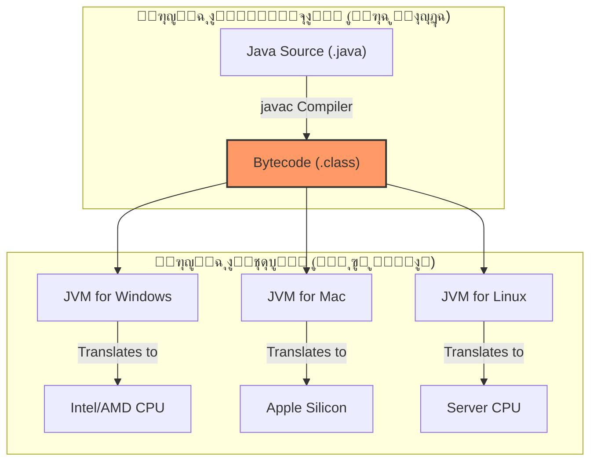
```mermaid
graph TD
    subgraph Compilation ["ู…ุฑุญู„ุฉ ุงู„ูƒูˆู…ุจุงูŠู„ (ู…ุฑุฉ ูˆุงุญุฏุฉ)"]
        Source["Java Source (.java)"] -->|javac Compiler| Bytecode["Bytecode (.class)"]
    end

    subgraph Execution ["ู…ุฑุญู„ุฉ ุงู„ุชุดุบูŠู„ (ููŠ ุฃูŠ ู…ูƒุงู†)"]
        direction TB
        Bytecode --> JVM1["JVM for Windows"]
        Bytecode --> JVM2["JVM for Mac"]
        Bytecode --> JVM3["JVM for Linux"]
        
        JVM1 -->|Translates to| CPU1["Intel/AMD CPU"]
        JVM2 -->|Translates to| CPU2["Apple Silicon"]
        JVM3 -->|Translates to| CPU3["Server CPU"]
        
        style Bytecode fill:#f96,stroke:#333,stroke-width:2px
    end
```


---
###  Simple (ุจุณูŠุทุฉ.. ุจุณ ู…ุด ุชุงูู‡ุฉ) ๐Ÿงฉ

> โ€ข Java was designed to be easy for the professional programmer...
> 
> โ€ข If you are an experienced C++ programmer, moving to Java will require very little effort.

ุชุญู„ูŠู„ ุงู„ุณูŠู†ูŠูˆุฑ:

ูƒู„ู…ุฉ "Simple" ู‡ู†ุง ุฎุงุฏุนุฉ ุดูˆูŠุฉ. ุงู„ุฌุงูุง ู„ุบุฉ ู‚ูˆูŠุฉ ูˆู…ุนู‚ุฏุฉุŒ ุฃู…ุงู„ ู„ูŠู‡ ุจูŠู‚ูˆู„ูˆุง ุจุณูŠุทุฉุŸ

1. **ุงู„ู…ุฃู„ูˆูุฉ (Familiarity):** ุงู„ุฌุงูุง ุฃุฎุฏุช ู†ูุณ ุงู„ู€ Syntax ุจุชุงุน **C++** (ุงู„ุฃู‚ูˆุงุณ `{}`ุŒ ุงู„ุณูŠู…ูŠูƒูˆู„ูˆู† `;`ุŒ ุทุฑูŠู‚ุฉ ูƒุชุงุจุฉ ุงู„ู€ Loops). ู„ูˆ ุฃู†ุช ู…ุจุฑู…ุฌ C++ุŒ ู‡ุชุญุณ ุฅู†ูƒ ููŠ ุจูŠุชูƒ.
    
2. **ุงู„ุชู†ุธูŠู (Cleanup):** ุงู„ุฌุงูุง ุดุงู„ุช ุงู„ุญุงุฌุงุช "ุงู„ุฑุฎู…ุฉ ูˆุงู„ู…ุนู‚ุฏุฉ" ููŠ C++ ุฒูŠ ุงู„ู€ Pointers ูˆุงู„ู€ Operator Overloading ูˆุงู„ู€ Header Files.
    
    - **ุงู„ู…ุนุงุฏู„ุฉ:** `Java = C++ - (Pain & Complexity)`.
        

---

### 2. Object-Oriented (ูƒุงุฆู†ูŠุฉ ุงู„ุชูˆุฌู‡.. ุจุฐูƒุงุก) ๐Ÿ“ฆ

> โ€ข The object model in Java is simple and easy to extend...
> 
> โ€ข ...while primitive types, such as integers, are kept as high-performance non objects.

ุชุญู„ูŠู„ ุงู„ุณูŠู†ูŠูˆุฑ (ู†ู‚ุทุฉ ู…ุนู…ุงุฑูŠุฉ ู…ู‡ู…ุฉ):

ููŠ ู„ุบุงุช ุชุงู†ูŠุฉ (ุฒูŠ Smalltalk)ุŒ ูƒู„ ุญุงุฌุฉ ุญุฑููŠุงู‹ ุนุจุงุฑุฉ ุนู† Object. ุญุชู‰ ุงู„ุฑู‚ู… 1 ุนุจุงุฑุฉ ุนู† Object. ุฏู‡ ุฌู…ูŠู„ ู†ุธุฑูŠุงู‹ุŒ ุจุณ ูƒุงุฑุซุฉ ููŠ ุงู„ุฃุฏุงุก (Performance Heavy).

ุงู„ุฌุงูุง ุนู…ู„ุช **ุชูˆุงุฒู† ุนุจู‚ุฑูŠ (Trade-off):**

- **ุงู„ู‚ุงุนุฏุฉ:** ูƒู„ ุญุงุฌุฉ Object.
    
- **ุงู„ุงุณุชุซู†ุงุก:** ุงู„ุจูŠุงู†ุงุช ุงู„ุฃุณุงุณูŠุฉ ุงู„ุจุณูŠุทุฉ (Primitives) ุฒูŠ `int`, `double`, `boolean`.
    
- **ุงู„ุณุจุจ:** ุนุดุงู† ุงู„ุณุฑุนุฉ. ุงู„ุชุนุงู…ู„ ู…ุน `int` ููŠ ุงู„ู…ูŠู…ูˆุฑูŠ ุฃุณุฑุน ุจูƒุชูŠุฑ ู…ู† ุงู„ุชุนุงู…ู„ ู…ุน `Integer Object`.
    
- **ุงู„ู†ุชูŠุฌุฉ:** ู„ุบุฉ OOP ู‚ูˆูŠุฉุŒ ุจุณ ู„ุณู‡ ุณุฑูŠุนุฉ ูƒูุงูŠุฉ ู„ู„ุดุบู„ ุงู„ุชู‚ูŠู„.
    

---

### 3. Robust (ุตุงู…ุฏุฉ/ุนุถู…ู‡ุง ู†ุงุดู) ๐Ÿ’ช

> โ€ข Because Java is a strictly typed language... checks your code at compile time... and run time.
> 
> โ€ข ...consider two main reasons for failure: memory management mistakes and mishandled exceptional conditions.

ุชุญู„ูŠู„ ุงู„ุณูŠู†ูŠูˆุฑ:

ูƒู„ู…ุฉ Robust ูŠุนู†ูŠ "ุถุฏ ุงู„ูƒุณุฑ". ุงู„ุฌุงูุง ุตู…ู…ุช ุนุดุงู† ู…ุชุถุฑุจุด (Crash) ุจุณู‡ูˆู„ุฉ. ุฅุฒุงูŠุŸ

**ุฃ. ุงู„ุดุฑุทุฉ ุงู„ุตุงุฑู…ุฉ (Strict Typing):**

- ุงู„ุฌุงูุง ู…ุด ุจุชุณูŠุจูƒ ุชุนูƒ. ู…ูŠู†ูุนุด ุชุญุท `String` ุฌูˆู‡ ู…ุชุบูŠุฑ `int`.
    
- **Compile-time Check:** ุงู„ูƒูˆู…ุจุงูŠู„ุฑ ุจูŠู‚ูุดูƒ ูˆุฃู†ุช ุจุชูƒุชุจ ุงู„ูƒูˆุฏ.
    
- **Run-time Check:** ุญุชู‰ ูˆุงู„ุจุฑู†ุงู…ุฌ ุดุบุงู„ุŒ ุงู„ู€ JVM ุจูŠุฑุงู‚ุจ ุนุดุงู† ู…ููŠุด ุญุงุฌุฉ ุบุฑูŠุจุฉ ุชุญุตู„.
    

**ุจ. ุฅุฏุงุฑุฉ ุงู„ุฐุงูƒุฑุฉ (Memory Management):**

- ููŠ C++ุŒ ุฃูƒุจุฑ ุณุจุจ ู„ู„ู€ Crash ู‡ูˆ ุฅู† ุงู„ู…ุจุฑู…ุฌ ูŠู†ุณู‰ ูŠู…ุณุญ ุงู„ู…ูŠู…ูˆุฑูŠ (Memory Leak).
    
- ููŠ JavaุŒ ุงู„ู€ **Garbage Collector** ุจูŠู‚ูˆู… ุจุงู„ุฏูˆุฑ ุฏู‡. ุจูŠู†ุถู ูˆุฑุงูƒ ุฃูˆุชูˆู…ุงุชูŠูƒุŒ ูุจูŠุญู…ูŠ ุงู„ุจุฑู†ุงู…ุฌ ู…ู† ุงู„ุงู†ู‡ูŠุงุฑ.
    

**ุฌ. ุงู„ุชุนุงู…ู„ ู…ุน ุงู„ุงุณุชุซู†ุงุกุงุช (Exception Handling):**

- ุงู„ุฌุงูุง ุจุชุฌุจุฑูƒ ุชุชุนุงู…ู„ ู…ุน ุงู„ุฃุฎุทุงุก (ุฒูŠ ุฅู† ุงู„ู…ู„ู ู…ุด ู…ูˆุฌูˆุฏ ุฃูˆ ุงู„ู†ุช ู‚ุทุน) ูˆู‚ุช ูƒุชุงุจุฉ ุงู„ูƒูˆุฏ (`try-catch`). ู…ุด ุจุชุณูŠุจูƒ ุชุชูุงุฌุฆ ุจูŠู‡ุง ูˆุงู„ุจุฑู†ุงู…ุฌ ุดุบุงู„ ุนู†ุฏ ุงู„ุนู…ูŠู„.
    

---
### 4. Multithreaded (ุงู„ุฃุฎุทุจูˆุท ู…ุชุนุฏุฏ ุงู„ุฃุฐุฑุน) ๐Ÿ™

> _โ€ข Java supports multithreaded programming... allows you to write programs that do many things simultaneously._

ุงู„ุชุญู„ูŠู„:

ุฒู…ุงู†ุŒ ุนุดุงู† ุชุฎู„ูŠ ุงู„ุจุฑู†ุงู…ุฌ ูŠุนู…ู„ ุญุงุฌุชูŠู† ููŠ ู†ูุณ ุงู„ูˆู‚ุช (ู…ุซู„ุงู‹: ูŠุญู…ู„ ู…ู„ู ูˆููŠ ู†ูุณ ุงู„ูˆู‚ุช ูŠุฎู„ูŠูƒ ุชูƒุชุจ ููŠ ุงู„ู€ Text Box)ุŒ ูƒู†ุช ู…ุญุชุงุฌ ุชูƒู„ู… ู†ุธุงู… ุงู„ุชุดุบูŠู„ (OS) ูˆุชุฏุฎู„ ููŠ ุชุนู‚ูŠุฏุงุช ู…ุฑุนุจุฉ.

- **ุนุจู‚ุฑูŠุฉ ุงู„ุฌุงูุง:** ุฎู„ุช ุงู„ู€ **Multithreading** ุฌุฒุก ู…ู† ุงู„ู„ุบุฉ ู†ูุณู‡ุง (Built-in).
    
- **ุงู„ุชุฒุงู…ู† (Synchronization):** ุงู„ุฌุงูุง ู‚ุฏู…ุช ุญู„ูˆู„ "ุฃู†ูŠู‚ุฉ" (`synchronized` keyword) ุนุดุงู† ุชู…ู†ุน ุฎู†ุงู‚ุฉ ุงู„ู€ Threads ุนู„ู‰ ู†ูุณ ุงู„ู…ูŠู…ูˆุฑูŠ (Race Condition).
    
- **ุงู„ุชุดุจูŠู‡:** ุชุฎูŠู„ "ูˆูŠุชุฑ" ูˆุงุญุฏ ููŠ ู…ุทุนู… (Single Thread) ุจูŠุฎุฏู… 10 ุชุฑุงุจูŠุฒุงุชุŒ ู„ูˆ ูˆู‚ู ุนู†ุฏ ุชุฑุงุจูŠุฒุฉ ูˆุงุญุฏุฉ ุงู„ูƒู„ ู‡ูŠุนุทู„. ุงู„ุฌุงูุง ุฌุงุจุช "ุทู‚ู… ูˆูŠุชุฑุฒ" (Multi-thread) ูŠุฎุฏู…ูˆุง ููŠ ู†ูุณ ุงู„ูˆู‚ุช ุจุชู†ุงุบู….
    

---

### 5. Architecture-neutral (ุงู„ุญูŠุงุฏ ุงู„ู…ุนู…ุงุฑูŠ) ๐Ÿ›๏ธ

> _โ€ข Their goal was โ€œwrite once; run anywhere.โ€_

ุงู„ุชุญู„ูŠู„:

ุฅุญู†ุง ุงุชูƒู„ู…ู†ุง ุนู†ู‡ุง ู‚ุจู„ ูƒุฏู‡ุŒ ุจุณ ู‡ู†ุง ุจูŠุฑูƒุฒ ุนู„ู‰ ูƒู„ู…ุฉ Neutral.

- ุงู„ุฌุงูุง "ู…ุญุงูŠุฏุฉ". ู…ุด ุจุชู†ุญุงุฒ ู„ู€ Intel ูˆู„ุง AMD ูˆู„ุง ARM.
    
- ู‡ูŠ ุจุชุนุชู…ุฏ ุนู„ู‰ "ู…ูˆุงุตูุงุช ุซุงุจุชุฉ" ู„ู„ู€ Bytecode.
    
- **ุงู„ู†ุชูŠุฌุฉ:** ู„ูˆ ูƒุชุจุช ูƒูˆุฏ ุจูŠุฌู…ุน `1+1`ุŒ ู‡ูŠุทู„ุน `2` ุนู„ู‰ ุงู„ูˆูŠู†ุฏูˆุฒุŒ ูˆ `2` ุนู„ู‰ ุงู„ู…ุงูƒุŒ ูˆ `2` ุนู„ู‰ ู…ุญู…ุตุฉ ุงู„ุนูŠุด. ู…ููŠุด ู…ูุงุฌุขุช (Undefined Behavior) ุฒูŠ ุงู„ู€ C++.
    

---

### 6. Interpreted and High Performance (ุงู„ู…ูุงุฑู‚ุฉ ุงู„ุนุฌูŠุจุฉ) ๐Ÿš€

> โ€ข Java enables creation... by compiling into bytecode.
> 
> โ€ข ...easy to translate directly into native machine code... by using a just-in-time compiler.

ูˆู‚ูุฉ ุณูŠู†ูŠูˆุฑ (The Paradox):

ุฅุฒุงูŠ ุงู„ุฌุงูุง Interpreted (ู…ูุณุฑุฉ - ูŠุนู†ูŠ ุจุทูŠุฆุฉ ู†ุธุฑูŠุงู‹) ูˆููŠ ู†ูุณ ุงู„ูˆู‚ุช High PerformanceุŸ

1. **ุงู„ู…ุฑุญู„ุฉ ุงู„ุฃูˆู„ู‰ (Interpreted):** ุงู„ู€ JVM ุจูŠู‚ุฑุฃ ุงู„ู€ Bytecode ูˆูŠุชุฑุฌู…ู‡ ุณุทุฑ ุจุณุทุฑ. ุฏู‡ ุจุทูŠุก ุดูˆูŠุฉ ุจุณ ุจูŠุญู‚ู‚ ุงู„ู€ Portability.
    
2. **ุงู„ู…ุฑุญู„ุฉ ุงู„ุซุงู†ูŠุฉ (JIT - Just In Time):** ู‡ู†ุง ุงู„ุณุญุฑ. ุงู„ู€ JVM ุจูŠุฑุงู‚ุจ ุงู„ูƒูˆุฏ ูˆู‡ูˆ ุดุบุงู„.
    
    - ู„ูˆ ู„ู‚ู‰ "ุฏุงู„ุฉ" ุจุชุชู†ุงุฏู‰ ูƒุชูŠุฑ (Hotspot)ุŒ ุจูŠู‚ูˆู… ู…ุชุฑุฌู…ู‡ุง ู„ู€ **Native Machine Code** (ู„ุบุฉ ุขู„ุฉ ุตุฑูŠุญุฉ ูˆุณุฑูŠุนุฉ ุฌุฏุงู‹) ูˆูŠุญูุธู‡ุง ููŠ ุงู„ุฑุงู…ุงุช.
        
    - ุงู„ู…ุฑุฉ ุงู„ุฌุงูŠุฉ ู„ู…ุง ุชู†ุงุฏูŠ ุงู„ุฏุงู„ุฉ ุฏูŠุŒ ุจุชุดุชุบู„ ุจุณุฑุนุฉ ุงู„ุตุงุฑูˆุฎ (ุฒูŠ C++) ู„ุฃู†ู‡ุง ุจู‚ุช Native ุฎู„ุงุต.
        

---

### 7. Distributed (ุงุฌุชู…ุงุนูŠุฉ ุจุทุจุนู‡ุง) ๐ŸŒ

> โ€ข Java is designed for the distributed environment of the Internet because it handles TCP/IP protocols.
> 
> โ€ข Java also supports Remote Method Invocation (RMI).

ุงู„ุชุญู„ูŠู„:

ู„ุบุงุช ุฒู…ุงู† ูƒุงู†ุช "ุงู†ุทูˆุงุฆูŠุฉ" (Standalone). ุงู„ุฌุงูุง ุตู…ู…ุช ุนุดุงู† "ุชูƒู„ู… ุบูŠุฑู‡ุง".

- **TCP/IP:** ุงู„ุฌุงูุง ููŠู‡ุง ู…ูƒุชุจุงุช ุฌุงู‡ุฒุฉ ู„ู„ุงุชุตุงู„ ุจุงู„ุฅู†ุชุฑู†ุช (`java.net`).
    
- **RMI (Remote Method Invocation):** ุฏูŠ ูƒุงู†ุช ุซูˆุฑุฉ ูˆู‚ุชู‡ุง.
    
    - ุชุฎูŠู„ ุฅู† ุนู†ุฏูƒ `Object A` ุนู„ู‰ ุฌู‡ุงุฒ ููŠ ุฃู…ุฑูŠูƒุงุŒ ูˆ `Object B` ุนู„ู‰ ุฌู‡ุงุฒ ููŠ ู…ุตุฑ.
        
    - `Object B` ูŠู‚ุฏุฑ ูŠู†ุงุฏูŠ ู…ูŠุซูˆุฏ ุฌูˆู‡ `Object A` ูƒุฃู†ู‡ ุฌู†ุจู‡ ููŠ ู†ูุณ ุงู„ู…ูŠู…ูˆุฑูŠ! `A.doSomething()`.
        
    - **ู…ู„ุงุญุธุฉ:** ุงู„ู€ RMI ู‡ูˆ ุงู„ุฌุฏ ุงู„ุดุฑุนูŠ ู„ู„ู€ Web Services ูˆุงู„ู€ Microservices ุงู„ู…ูˆุฌูˆุฏุฉ ุฏู„ูˆู‚ุชูŠ.
        

---

### 8. Dynamic (ู…ุชุฌุฏุฏุฉ ูˆู…ุฑู†ุฉ) ๐Ÿ”„

> โ€ข Java programs carry... run-time type information... verify and resolve access to objects at run time.
> 
> โ€ข ...small fragments of bytecode may be dynamically updated on a running system.

ุงู„ุชุญู„ูŠู„ (ุงู„ุฃุตุนุจ ููŠ ุงู„ูู‡ู…):

ููŠ ู„ุบุงุช ุฒูŠ C++ุŒ ุงู„ุฑุจุท ุจูŠู† ุงู„ู…ู„ูุงุช (Linking) ุจูŠุญุตู„ ูˆู‚ุช ุงู„ู€ Compile. ู„ูˆ ุบูŠุฑุช ู…ู„ูุŒ ู„ุงุฒู… ุชุนู…ู„ Re-compile ู„ู„ู…ุดุฑูˆุน ูƒู„ู‡.

ููŠ ุงู„ุฌุงูุงุŒ ุงู„ุฑุจุท ุจูŠุญุตู„ **Dynamic** (ูˆู‚ุช ุงู„ุชุดุบูŠู„):

1. **Late Binding:** ุงู„ุฌุงูุง ู…ุด ุจุชุญู…ู„ ุงู„ูƒู„ุงุณ ููŠ ุงู„ู…ูŠู…ูˆุฑูŠ ุฅู„ุง ู„ู…ุง ุชุญุชุงุฌู‡ุง ูุนู„ุงู‹.
    
2. **ุงู„ุชุญุฏูŠุซ ุงู„ุญูŠ:** ู…ู…ูƒู† ูŠูƒูˆู† ุนู†ุฏูƒ ุณูŠุฑูุฑ ุดุบุงู„ุŒ ูˆุชู‚ูˆู… ู…ุจุฏู„ ู…ู„ู `.class` ุจู…ู„ู ุฃุญุฏุซุŒ ูˆุงู„ุณูŠุฑูุฑ ูŠูƒู…ู„ ุดุบู„ ุนุงุฏูŠ ุจุงู„ู†ุณุฎุฉ ุงู„ุฌุฏูŠุฏุฉ ู…ู† ุบูŠุฑ ู…ุง ูŠู‚ุน (ููŠ ุญุฏูˆุฏ ู…ุนูŠู†ุฉ).
    
3. **RTTI (Run-Time Type Information):** ุงู„ุฌุงูุง ุจุชุจู‚ู‰ ุนุงุฑูุฉ ู†ูˆุน ุงู„ุฃูˆุจุฌูŠูƒุช ูˆู‡ูŠ ุดุบุงู„ุฉุŒ ูุจุชู‚ุฏุฑ ุชู…ู†ุนูƒ ู„ูˆ ุญุงูˆู„ุช ุชุนู…ู„ Cast ุบู„ุทุŒ ูˆุฏู‡ ุจูŠุฒูˆุฏ ุงู„ุฃู…ุงู† (Robustness).
    

---

### ๐Ÿ“Š ู…ู„ุฎุต ุงู„ู€ JIT Compiler (ุฃู‡ู… ู†ู‚ุทุฉ ุชู‚ู†ูŠุฉ)

ุฏู‡ ุงู„ู…ุฎุทุท ุงู„ู„ูŠ ุจูŠุดุฑุญ ุฅุฒุงูŠ ุงู„ุฌุงูุง ุฌู…ุนุช ุจูŠู† ุฅู†ู‡ุง Interpreted ูˆ High Performance:

Code snippet

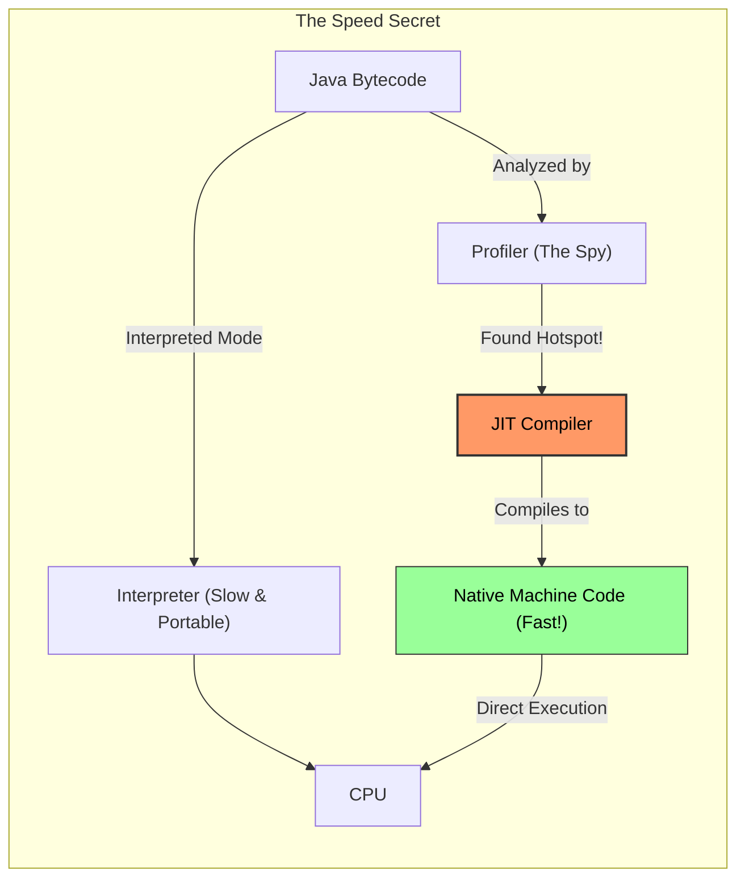
```mermaid
graph TD
    subgraph Execution_Cycle ["The Speed Secret"]
        direction TB
        Bytecode["Java Bytecode"] -->|Interpreted Mode| Interpreter["Interpreter (Slow & Portable)"]
        Interpreter --> CPU
        
        Bytecode -->|Analyzed by| Profiler["Profiler (The Spy)"]
        Profiler -->|Found Hotspot!| JIT["JIT Compiler"]
        JIT -->|Compiles to| Native["Native Machine Code (Fast!)"]
        Native -->|Direct Execution| CPU
    end
    
    style JIT fill:#f96,stroke:#333,stroke-width:2px,color:black
    style Native fill:#9f9,stroke:#333,color:black
```

---
### ๐Ÿ“‹ The Java Buzzwords Cheat Sheet

| **Buzzword (ุงู„ู…ุตุทู„ุญ)**                | **The Surface Meaning (ุงู„ู…ุนู†ู‰ ุงู„ุณุทุญูŠ)** | **๐Ÿง Senior Insight (ุงู„ุณุฑ ุงู„ู…ุนู…ุงุฑูŠ)**                                                                                                 |
| ------------------------------------- | --------------------------------------- | ------------------------------------------------------------------------------------------------------------------------------------- |
| **1. Simple**                         | ู„ุบุฉ ุณู‡ู„ุฉ ุงู„ุชุนู„ู….                        | ู‡ูŠ "ุจุณูŠุทุฉ" ู„ุฃู†ู‡ุง ุดุงู„ุช ุชุนู‚ูŠุฏุงุช C++ (ุฒูŠ Pointers, Operator Overloading, Header Files). ุงู„ู…ุนุงุฏู„ุฉ: `Java = C++ - Pain`.                   |
| **2. Object-Oriented**                | ูƒู„ ุญุงุฌุฉ ุนุจุงุฑุฉ ุนู† ูƒุงุฆู†ุงุช.                | ุชูˆุงุฒู† ุฐูƒูŠ: ู‡ูŠ Pure OOP ู„ูƒู† ุงุญุชูุธุช ุจุงู„ู€ **Primitives** (ุฒูŠ `int`) ุนุดุงู† ุงู„ุณุฑุนุฉุŒ ุนูƒุณ ู„ุบุงุช ุชุงู†ูŠุฉ ุฎู„ุช ูƒู„ ุญุงุฌุฉ Object ูˆุฏู‡ ูƒุงู† ุจูŠู‚ุชู„ ุงู„ุฃุฏุงุก. |
| **3. Robust**                         | ู„ุบุฉ ู‚ูˆูŠุฉ ูˆุถุฏ ุงู„ูƒุณุฑ.                     | ุงู„ูุถู„ ูŠุฑุฌุน ู„ู€ **Garbage Collector** (ู…ู†ุน ุงู„ู€ Memory Leaks) ูˆุงู„ู€ **Exception Handling** ุงู„ุฅุฌุจุงุฑูŠุŒ ูˆุงู„ู€ **Strong Typing**.              |
| **4. Multithreaded**                  | ุชู‚ุฏุฑ ุชุนู…ู„ ูƒุฐุง ุญุงุฌุฉ ููŠ ู†ูุณ ุงู„ูˆู‚ุช.        | ุงู„ุฌุงูุง ุฎู„ุช ุงู„ู€ Threading ุฌุฒุก ู…ู† ุงู„ู„ุบุฉ (`java.lang.Thread`) ู…ุด ู…ุฌุฑุฏ ุงุณุชุฏุนุงุก ู„ู†ุธุงู… ุงู„ุชุดุบูŠู„. ูˆุฏู‡ ูƒุงู† ุซูˆุฑุฉ ููŠ ุจู†ุงุก ุงู„ุณูŠุฑูุฑุงุช.             |
| **5. Architecture-neutral**           | ุจุชุดุชุบู„ ุนู„ู‰ ุฃูŠ ู…ุนู…ุงุฑูŠุฉ (Intel, ARM).     | ุงู„ุณุฑ ู‡ูˆ **Bytecode**. ุงู„ูƒูˆู…ุจุงูŠู„ุฑ ุจูŠุทู„ุน ูƒูˆุฏ "ู…ุญุงูŠุฏ" ู…ู„ูˆุด ุนู„ุงู‚ุฉ ุจู†ูˆุน ุงู„ุจุฑูˆุณูŠุณูˆุฑุŒ ูˆุงู„ู€ JVM ู‡ูˆ ุงู„ู„ูŠ ุจูŠุชุตุฑู.                               |
| **6. Portable**                       | Write Once, Run Anywhere.               | ู…ุด ุจุณ ุงู„ูƒูˆุฏ ุจูŠุดุชุบู„ ููŠ ุฃูŠ ุญุชุฉุŒ ูƒู…ุงู† ุญุฌู… ุฃู†ูˆุงุน ุงู„ุฏุงุชุง ุซุงุจุช (ุงู„ู€ `int` ุฏุงูŠู…ุงู‹ 32-bit ููŠ ุฃูŠ ุฌู‡ุงุฒ)ุŒ ุนูƒุณ C++ ุงู„ู„ูŠ ุจูŠุฎุชู„ู ุญุณุจ ุงู„ุฌู‡ุงุฒ.        |
| **7. Distributed**                    | ุฌุงู‡ุฒุฉ ู„ู„ุดุจูƒุงุช.                          | ุตู…ู…ุช ุนุดุงู† ุงู„ุฅู†ุชุฑู†ุช. ููŠู‡ุง ู…ูƒุชุจุงุช TCP/IP ุฌุงู‡ุฒุฉุŒ ูˆุชุฏุนู… **RMI** (ุชุดุบูŠู„ ู…ูŠุซูˆุฏ ุนู„ู‰ ุณูŠุฑูุฑ ุชุงู†ูŠ ุนู† ุจุนุฏ).                                      |
| **8. Secure**                         | ุขู…ู†ุฉ ู…ู† ุงู„ููŠุฑูˆุณุงุช.                      | ุงุนุชู…ุฏุช ุนู„ู‰ **Sandbox Model** (ุตู†ุฏูˆู‚ ุงู„ุฑู…ู„). ุงู„ูƒูˆุฏ ู…ุญุจูˆุณ ุฌูˆู‡ ุงู„ู€ JVM ูˆู…ู…ู†ูˆุน ูŠู„ู…ุณ ู…ู„ูุงุชูƒ ุฃูˆ ุงู„ู…ูŠู…ูˆุฑูŠ ุงู„ุญุณุงุณุฉ.                           |
| **9. Interpreted & High Performance** | ุณุฑูŠุนุฉ ุฑุบู… ุฅู†ู‡ุง ู…ูุณุฑุฉ.                   | ู‡ูŠ ุจุชุจุฏุฃ Interpreted (ุฃุจุทุฃ)ุŒ ุจุณ ุงู„ู€ **JIT Compiler** ุจูŠุญูˆู„ ุงู„ุฃูƒูˆุงุฏ ุงู„ู…ู‡ู…ุฉ (Hotspots) ู„ู€ Native Code ุจุณุฑุนุฉ ุงู„ุตุงุฑูˆุฎ ุฃุซู†ุงุก ุงู„ุชุดุบูŠู„.      |
| **10. Dynamic**                       | ู„ุบุฉ ู…ุฑู†ุฉ ูˆู…ุชุฌุฏุฏุฉ.                       | ุงู„ุฑุจุท (Linking) ุจูŠุญุตู„ ูˆู‚ุช ุงู„ุชุดุบูŠู„ (Runtime). ุชู‚ุฏุฑ ุชุญุฏุซ ู…ูƒุชุจุงุช ุงู„ุจุฑู†ุงู…ุฌ ูˆู‡ูˆ ุดุบุงู„ ู…ู† ุบูŠุฑ ู…ุง ุชูˆู‚ูู‡ (Hot Swapping).                       |

---

### ๐Ÿงฉ ุฎุฑูŠุทุฉ ุฐู‡ู†ูŠุฉ ู„ู„ุนู„ุงู‚ุงุช (Relationships)

ุนุดุงู† ุชุฑุจุทู‡ู… ุจุจุนุถ ููŠ ุฏู…ุงุบูƒุŒ ู‚ุณู…ุชู‡ู… ู„ูƒ ู„ู…ุฌู…ูˆุนุงุช ู…ู†ุทู‚ูŠุฉ:

Code snippet

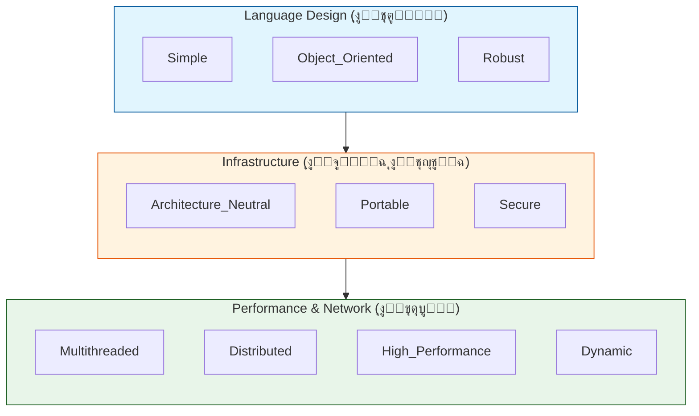
```mermaid
graph TD
    subgraph Design ["Language Design (ุงู„ุชุตู…ูŠู…)"]
        direction TB
        Simple
        Object_Oriented
        Robust
    end

    subgraph Infra ["Infrastructure (ุงู„ุจู†ูŠุฉ ุงู„ุชุญุชูŠุฉ)"]
        direction TB
        Architecture_Neutral
        Portable
        Secure
    end

    subgraph Runtime ["Performance & Network (ุงู„ุชุดุบูŠู„)"]
        direction TB
        Multithreaded
        Distributed
        High_Performance
        Dynamic
    end

    Design --> Infra
    Infra --> Runtime
    
    style Design fill:#e1f5fe,stroke:#01579b
    style Infra fill:#fff3e0,stroke:#e65100
    style Runtime fill:#e8f5e9,stroke:#1b5e20
```
---
### 1. The Equation (ุงู„ู…ุนุงุฏู„ุฉ ุงู„ุฃุณุงุณูŠุฉ)

ุฃูŠ ุจุฑู†ุงู…ุฌ ูƒู…ุจูŠูˆุชุฑ ููŠ ุงู„ุฏู†ูŠุง ุนุจุงุฑุฉ ุนู† ุญุงุฌุชูŠู† ุจุณ:

1. **Data (ุจูŠุงู†ุงุช):** ุงู„ู…ุนู„ูˆู…ุงุช ุงู„ู„ูŠ ุจู†ุฎุฒู†ู‡ุง (ุฃุฑู‚ุงู…ุŒ ู†ุตูˆุตุŒ ุฃุณู…ุงุก).
    
2. **Code (ูƒูˆุฏ):** ุงู„ุฃูˆุงู…ุฑ ุงู„ู„ูŠ ุจุชุดุชุบู„ ุนู„ู‰ ุงู„ู…ุนู„ูˆู…ุงุช ุฏูŠ (ุงู„ุนู…ู„ูŠุงุช ุงู„ุญุณุงุจูŠุฉุŒ ุงู„ุฏูˆุงู„).
    

ุงู„ุณุคุงู„ ู‡ู†ุง: **ุฅุฒุงูŠ ุจู†ู†ุธู… ุงู„ุนู„ุงู‚ุฉ ุจูŠู†ู‡ู…ุŸ** ู‡ู†ุง ุจูŠุธู‡ุฑ ุงู„ู…ุฏุฑุณุชูŠู†:

---

### 2. The Process-Oriented Model (ู…ุฏุฑุณุฉ ุงู„ู€ C) ๐Ÿ

**(Code acting on Data)**

ููŠ ุงู„ู†ู…ูˆุฐุฌ ุฏู‡ุŒ **ุงู„ูƒูˆุฏ ู‡ูˆ ุงู„ู…ู„ูƒ**.

- ุฃู†ุช ุจุชูƒุชุจ ุฏูˆุงู„ (Functions) ูˆุฅุฌุฑุงุกุงุช (Procedures).
    
- ุงู„ุจูŠุงู†ุงุช (Variables) ู…ุฑู…ูŠุฉ ููŠ ุงู„ู…ูŠู…ูˆุฑูŠุŒ ูˆุงู„ุฏูˆุงู„ ุฏูŠ ุจุชุฑูˆุญ "ุชู‡ุฌู…" ุนู„ูŠู‡ุง ูˆุชุบูŠุฑ ููŠู‡ุง.
    
- **ู…ุซุงู„:** ู„ุบุฉ **C**.
    

ุงู„ู…ุดูƒู„ุฉ (The Chaos):

ู„ู…ุง ุงู„ุจุฑู†ุงู…ุฌ ูŠูƒุจุฑุŒ ุจูŠุจู‚ู‰ ุนู†ุฏูƒ ู…ุฆุงุช ุงู„ุฏูˆุงู„ ูˆุขู„ุงู ุงู„ู…ุชุบูŠุฑุงุช.

- ุฃูŠ ุฏุงู„ุฉ ู…ู…ูƒู† ุชุบูŠุฑ ุฃูŠ ู…ุชุบูŠุฑ (Global Data).
    
- ู„ูˆ ู…ุชุบูŠุฑ ู‚ูŠู…ุชู‡ ุจุงุธุชุŒ ู…ุด ู‡ุชุนุฑู ู…ูŠู† ุงู„ุฏุงู„ุฉ ุงู„ู„ูŠ ุจูˆุธุชู‡.
    
- ุฏู‡ ุงู„ู„ูŠ ุจู†ุณู…ูŠู‡ **Spaghetti Code** (ุงู„ูƒูˆุฏ ูƒู„ู‡ ุฏุงุฎู„ ููŠ ุจุนุถู‡).
    

---

### 3. The Object-Oriented Model (ู…ุฏุฑุณุฉ ุงู„ู€ Java) ๐Ÿ“ฆ

**(Data controlling access to Code)**

ู‡ู†ุง ู‚ู„ุจู†ุง ุงู„ุขูŠุฉ. **ุงู„ุจูŠุงู†ุงุช ู‡ูŠ ุงู„ู…ู„ูƒุฉ**ุŒ ูˆุงู„ูƒูˆุฏ ู‡ูˆ ุงู„ุญุงุฑุณ ุจุชุงุนู‡ุง.

- ุจุฏู„ ู…ุง ุงู„ุจูŠุงู†ุงุช ุชูƒูˆู† "ุณุงูŠุญุฉ"ุŒ ุจู†ุญุทู‡ุง ุฌูˆู‡ "ูƒุจุณูˆู„ุฉ" ุฃูˆ ุตู†ุฏูˆู‚ (ุงู„ู„ูŠ ู‡ูˆ ุงู„ู€ **Object**).
    
- ูˆุจู†ุญุท ู…ุนุงู‡ุง ุงู„ูƒูˆุฏ (Methods) ุงู„ุฎุงุต ุจูŠู‡ุง ุฌูˆู‡ ู†ูุณ ุงู„ุตู†ุฏูˆู‚.
    
- **ุงู„ู‚ุงุนุฏุฉ:** "ุนุงูŠุฒ ุชูƒู„ู… ุงู„ุจูŠุงู†ุงุช ุจุชุงุนุชูŠุŸ ูƒู„ู…ู†ูŠ ุนู† ุทุฑูŠู‚ ุงู„ูƒูˆุฏ ุจุชุงุนูŠ ุจุณ (Interface)".
    
- **ู…ุซุงู„:** ู„ุบุฉ **Java**.
    

ุงู„ู…ูŠุฒุฉ (Organized Control):

ุงู„ุจูŠุงู†ุงุช ู…ุญู…ูŠุฉ. ู…ููŠุด ุฏุงู„ุฉ ุบุฑูŠุจุฉ ุชู‚ุฏุฑ ุชู„ุนุจ ููŠ ุงู„ุฏุงุชุง ุจุชุงุนุชูƒ ุฅู„ุง ุจุฅุฐู†ูƒ.Shutterstock

---

### ๐Ÿ†š The Senior Comparison (ู…ู‚ุงุฑู†ุฉ ุงู„ู…ู‡ู†ุฏุณูŠู†)

ุนุดุงู† ุชูู‡ู… ุงู„ูุฑู‚ ุงู„ุฌูˆู‡ุฑูŠ "Data controlling access to code":

|**ูˆุฌู‡ ุงู„ู…ู‚ุงุฑู†ุฉ**|**Process-Oriented (ุฒูŠ C)**|**Object-Oriented (ุฒูŠ Java)**|
|---|---|---|
|**ู…ูŠู† ุงู„ู…ุฏูŠุฑุŸ**|**ุงู„ูƒูˆุฏ (Function).** ู‡ูˆ ุงู„ู„ูŠ ุจูŠุชุญูƒู… ููŠ ุงู„ุฏุงุชุง.|**ุงู„ุจูŠุงู†ุงุช (Object).** ู‡ูŠ ุงู„ู„ูŠ ุจุชุชุญูƒู… ู…ูŠู† ูŠู„ู…ุณู‡ุง.|
|**ุงู„ูู„ุณูุฉ**|"ู‡ุงุช ุงู„ุฏุงุชุง ุฏูŠ ุนุดุงู† ุฃุนุฏู„ู‡ุง".|"ูŠุง ุฃูˆุจุฌูŠูƒุชุŒ ู„ูˆ ุณู…ุญุช ุนุฏู„ ู†ูุณูƒ".|
|**ุงู„ุชุดุจูŠู‡**|**ูˆุฑุดุฉ ู…ูุชูˆุญุฉ:** ุงู„ุนุฏุฉ ู…ุฑู…ูŠุฉ (Data) ูˆุฃูŠ ุนุงู…ู„ (Code) ูŠูŠุฌูŠ ูŠุงุฎุฏ ุฃูŠ ู…ููƒ ูŠุดุชุบู„ ุจูŠู‡. ููˆุถู‰ ู„ูˆ ุงู„ุนู…ุงู„ ูƒุชุฑูˆุง.|**ูƒุจุณูˆู„ุฉ ุทุจูŠุฉ:** ุงู„ุฏูˆุงุก (Data) ู…ุญู…ูŠ ุฌูˆู‡ ุบู„ุงูุŒ ูˆุงู„ุฌุณู… ู…ุจูŠุชุนุงู…ู„ุด ู…ุน ุงู„ุฏูˆุงุก ู…ุจุงุดุฑุฉุŒ ุจูŠุชุนุงู…ู„ ู…ุน ุงู„ุบู„ุงู (Interface).|
|**ุงู„ู†ุชูŠุฌุฉ ู…ุน ุงู„ุชุนู‚ูŠุฏ**|ูŠู†ู‡ุงุฑ ู„ู…ุง ุงู„ุจุฑู†ุงู…ุฌ ูŠูƒุจุฑ (Complex).|ูŠูุถู„ ู…ู†ุธู… ูˆู‚ุงุจู„ ู„ู„ุชูˆุณุน (Scalable).|

---

### ๐Ÿง The Logic Switch (ู†ู‚ุทุฉ ุงู„ุชุญูˆู„)

ููŠ ุงู„ุณู„ุงูŠุฏ ู…ูƒุชูˆุจ ุฌู…ู„ุฉ ุนุจู‚ุฑูŠุฉ:

> _"An object-oriented program can be characterized as data controlling access to code."_

ูŠุนู†ูŠ ุฅูŠู‡ุŸ

- ููŠ ุงู„ู€ OOPุŒ ุฃู†ุช ู…ุด ุจุชูƒุชุจ ูƒูˆุฏ ูŠุฑูˆุญ ูŠุบูŠุฑ ู‚ูŠู…ุฉ ู…ุชุบูŠุฑ `balance` ููŠ ุงู„ุจู†ูƒ.
    
- ู„ุฃุŒ ุฃู†ุช ุจุชุนู…ู„ Object ุงุณู…ู‡ `BankAccount`ุŒ ูˆุจุชุญุท ุฌูˆุงู‡ ุฏุงู„ุฉ ุงุณู…ู‡ุง `deposit()`.
    
- ุงู„ู€ Data (ุงู„ุฑุตูŠุฏ) ู‡ูŠ ุงู„ู„ูŠ ุจุชู‚ุฑุฑ: "ู‡ู„ ุฃุณู…ุญ ู„ู„ูƒูˆุฏ ุฏู‡ ูŠุดุชุบู„ ูˆู„ุง ู„ุฃุŸ" (ู…ุซู„ุงู‹ ู„ูˆ ุงู„ู…ุจู„ุบ ุจุงู„ุณุงู„ุจ ุชุฑูุถ).
    
- ูƒุฏู‡ ุงู„ุฏุงุชุง ู‡ูŠ ุงู„ู„ูŠ **ุชุญูƒู…ุช** ููŠ ุชู†ููŠุฐ ุงู„ูƒูˆุฏ.
    

### ๐Ÿ“Š ุงู„ุฑุณู… ุงู„ุชูˆุถูŠุญูŠ (Mermaid)

Code snippet

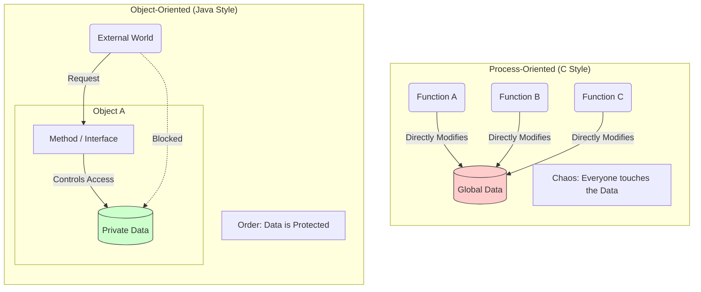
```mermaid
graph TD
    subgraph Process_Oriented ["Process-Oriented (C Style)"]
        direction TB
        Func1(Function A) -->|Directly Modifies| GlobalData[(Global Data)]
        Func2(Function B) -->|Directly Modifies| GlobalData
        Func3(Function C) -->|Directly Modifies| GlobalData
        style GlobalData fill:#ffcccc,stroke:#333
        note1[Chaos: Everyone touches the Data]
    end

    subgraph OOP ["Object-Oriented (Java Style)"]
        direction TB
        subgraph Object_A [Object A]
            DataA[(Private Data)]
            MethodA[Method / Interface]
            MethodA -->|Controls Access| DataA
        end
        
        ExternalCode(External World) -->|Request| MethodA
        ExternalCode -.->|Blocked| DataA
        style DataA fill:#ccffcc,stroke:#333
        note2[Order: Data is Protected]
    end
```

---
### 1. The Human Brain & The Car Paradox ๐Ÿš—

> โ€ข Humans manage complexity through abstraction.
> 
> โ€ข People do not think of a car as a set of tens of thousands of individual parts...

ุงู„ุชุญู„ูŠู„:

ุชุฎูŠู„ ู„ูˆ ูƒู„ ู…ุง ุชูŠุฌูŠ ุชุฏูˆุฑ ุนุฑุจูŠุชูƒุŒ ู„ุงุฒู… ุชููƒุฑ ููŠ:

1. ุถุฎ ุงู„ุจู†ุฒูŠู† ููŠ ุงู„ุฑุดุงุดุงุช.
    
2. ุฅุญุฏุงุซ ุดุฑุงุฑุฉ ููŠ ุงู„ุจูˆุฌูŠู‡ุงุช.
    
3. ุญุฑูƒุฉ ุงู„ุจุณุงุชู… ูˆุงู„ุนู…ูˆุฏ ุงู„ู…ุฑูู‚ูŠ.
    
4. ู†ู‚ู„ ุงู„ุญุฑูƒุฉ ู„ู„ุชุฑูˆุณ.
    

ู…ุฎูƒ ู‡ูŠู†ูุฌุฑ! ๐Ÿคฏ ุนุดุงู† ูƒุฏู‡ ู…ุฎู†ุง ุจูŠุนู…ู„ **Abstraction**.

- **ุงู„ุณุทุญ (Abstraction):** ุฃู†ุช ุดุงูŠู "ุนุฑุจูŠุฉ". ุจุชุฏูˆุณ ุฒุฑุงุฑ "Start".
    
- **ุงู„ุนู…ู‚ (Complexity):** ุฌูˆู‡ ููŠู‡ ุขู„ุงู ุงู„ู‚ุทุน ุจุชุชุญุฑูƒุŒ ุจุณ ุฃู†ุช "ู…ุฌุฑุฏ" ู…ู†ู‡ุง (Abstracted away).
    

---

### 2. Hierarchical Classifications (ุงู„ุชุณู„ุณู„ ุงู„ู‡ุฑู…ูŠ) ๐ŸŒณ

> โ€ข A powerful way to manage abstraction is through the use of hierarchical classifications.
> 
> โ€ข ...car consists of several subsystems: steering, brakes, sound system...

ุงู„ุชุญู„ูŠู„ ุงู„ู‡ู†ุฏุณูŠ:

ุฅุฒุงูŠ ุจู†ุจู†ูŠ ุณูŠุณุชู… ู…ุนู‚ุฏุŸ ุจู†ู‚ุณู…ู‡ ุทุจู‚ุงุช (Layers).

1. **Level 1 (Whole):** ุงู„ุนุฑุจูŠุฉ (Car).
    
2. **Level 2 (Subsystems):** ุงู„ู…ูˆุชูˆุฑุŒ ุงู„ูุฑุงู…ู„ุŒ ุงู„ุชูƒูŠูŠู.
    
3. **Level 3 (Units):** ุฌูˆู‡ ุงู„ู…ูˆุชูˆุฑ ููŠู‡ (Pistons, Valves).
    

ููŠ ุงู„ุจุฑู…ุฌุฉ ุจู†ุนู…ู„ ู†ูุณ ุงู„ูƒู„ุงู….

- ุจุฏู„ ู…ุง ุชูƒุชุจ 10,000 ุณุทุฑ ูƒูˆุฏ ุณุงูŠุญูŠู† ุนู„ู‰ ุจุนุถ (Spaghetti Code).
    
- ุจุชุนู…ู„ Object ุงุณู…ู‡ `Car`.
    
- ูˆุฌูˆุงู‡ Object ุงุณู…ู‡ `Engine`.
    
- ูˆุฌูˆุงู‡ Object ุงุณู…ู‡ SparkPlug.
    
    ูƒู„ ูˆุงุญุฏ ู…ุณุคูˆู„ ุนู† ู†ูุณู‡ ุจุณ.
    

---

### 3. The Paradigm Shift: From Process to Messages ๐Ÿ“ฉ

> โ€ข The data from a traditional process-oriented program can be transformed into its component objects.
> 
> โ€ข A sequence of process steps can become a collection of messages...

ุงู„ุชุญู„ูŠู„ (ุฃู‡ู… ู†ู‚ุทุฉ ู„ู„ู…ุจุฑู…ุฌูŠู†):

ุฏู‡ ุงู„ูุฑู‚ ุงู„ุฌูˆู‡ุฑูŠ ุจูŠู† ู„ุบุฉ C ูˆู„ุบุฉ Java.

- **ุงู„ุทุฑูŠู‚ุฉ ุงู„ู‚ุฏูŠู…ุฉ (Process-Oriented):**
    
    - ุนู†ุฏูƒ ุฏุงุชุง (ุจูŠุงู†ุงุช ุงู„ุนุฑุจูŠุฉ).
        
    - ูˆุนู†ุฏูƒ ุฎุทูˆุงุช (ุฏุงู„ุฉ `move_car`ุŒ ุฏุงู„ุฉ `stop_car`).
        
    - ุฃู†ุช "ุจุชุฃู…ุฑ" ุงู„ูƒู…ุจูŠูˆุชุฑ ูŠู…ุดูŠ ุฎุทูˆุฉ ุฎุทูˆุฉ.
        
- **ุทุฑูŠู‚ุฉ OOP (Abstraction):**
    
    - ุฃู†ุช ุนู†ุฏูƒ **Object** ุงุณู…ู‡ `Car`.
        
    - ุฃู†ุช ุจุชุจุนุชู„ู‡ **Message** (ุฑุณุงู„ุฉ) ุจุชู‚ูˆู„ู‡: `car.start()`.
        
    - ู‡ูˆ ุจูŠุฑุฏ ุนู„ูŠูƒ ูˆูŠู†ูุฐุŒ ู…ู† ุบูŠุฑ ู…ุง ุฃู†ุช ุชุนุฑู ู‡ูˆ ุนู…ู„ ุฅูŠู‡ ุฌูˆู‡ (ู‡ู„ ุดุบู„ ุจุทุงุฑูŠุฉุŸ ู‡ู„ ุถุฎ ุจู†ุฒูŠู†ุŸ ู…ู„ูƒุด ุฏุนูˆุฉ).
        

---

### 4. Why Abstraction Saves Software? (ุณุฑ ุงู„ุฎู„ูˆุฏ) ๐Ÿ•ฐ๏ธ

> _โ€ข OOP is a powerful ... for creating programs that survive ... including conception, growth, and aging._

ู„ู…ุณุฉ ุณูŠู†ูŠูˆุฑ (Senior Insight): ๐Ÿ’ก

ู„ูŠู‡ ุงู„ุณู„ุงูŠุฏ ุจูŠู‚ูˆู„ ุฅู† ุงู„ุชุฌุฑูŠุฏ ุจูŠุฎู„ูŠ ุงู„ุจุฑุงู…ุฌ ุชุนูŠุด ูˆู…ุชู…ุชุด (Survive aging)ุŸ

ู„ุฃู† ุงู„ุชุฌุฑูŠุฏ ุจูŠุนู…ู„ **ูุตู„ (Decoupling)**.

- ุงู„ู†ู‡ุงุฑุฏุฉุŒ ูƒูˆุฏ ุงู„ู€ `Car` ุจูŠุดุบู„ ู…ูˆุชูˆุฑ "ุจู†ุฒูŠู†".
    
- ุจูƒุฑุฉุŒ ุงู„ุนุงู„ู… ุงุชุทูˆุฑ ูˆุนุงูŠุฒูŠู† ู†ุฎู„ูŠู‡ุง "ูƒู‡ุฑุจุงุก".
    
- ุจูุถู„ ุงู„ู€ AbstractionุŒ ุฃู†ุง ู‡ุฏุฎู„ ุฌูˆู‡ ุงู„ู€ `Engine Object` ูˆุฃุบูŠุฑ ุงู„ูƒูˆุฏ ู…ู† ุจู†ุฒูŠู† ู„ูƒู‡ุฑุจุงุก.
    
- **ุงู„ู…ูุงุฌุฃุฉ:** ุงู„ูƒูˆุฏ ุจุชุงุน "ุงู„ุณูˆุงู‚" (Driver) ู…ุด ู‡ูŠุชุบูŠุฑ ูˆู„ุง ุณุทุฑ! ู„ุฃู† ุงู„ุณูˆุงู‚ ู„ุณู‡ ุจูŠุจุนุช ู†ูุณ ุงู„ุฑุณุงู„ุฉ: `car.start()`.
    

ุฏู‡ ุงู„ู„ูŠ ุจูŠุฎู„ูŠ ุงู„ู…ุดุงุฑูŠุน ุงู„ุถุฎู…ุฉ ุชุนูŠุด ุณู†ูŠู†ุŒ ุฅู†ูƒ ุชู‚ุฏุฑ ุชุบูŠุฑ "ุงู„ุฃุญุดุงุก" ู…ู† ุบูŠุฑ ู…ุง ุชุบูŠุฑ "ุงู„ูˆุงุฌู‡ุฉ".

---

### ๐Ÿ“Š ุงู„ุฎู„ุงุตุฉ ุจู…ุฎุทุท (Mermaid)

Code snippet

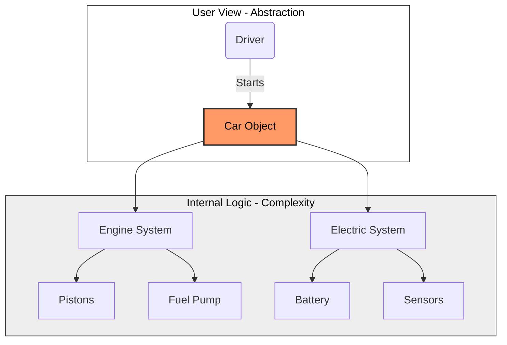
```mermaid
graph TD
    %% Subgraph 1: User View
    subgraph View ["User View - Abstraction"]
        direction TB
        User(Driver) -->|Starts| Car[Car Object]
    end

    %% Subgraph 2: Implementation
    subgraph Logic ["Internal Logic - Complexity"]
        direction TB
        Car --> Engine[Engine System]
        Car --> Elec[Electric System]
        
        Engine --> Pistons[Pistons]
        Engine --> Fuel[Fuel Pump]
        
        Elec --> Batt[Battery]
        Elec --> Sens[Sensors]
    end

    %% Styling
    style Car fill:#f96,stroke:#333,stroke-width:2px,color:black
    style Logic fill:#eee,stroke:#333,color:black
    style View fill:#fff,stroke:#333,color:black
```
---

### Encapsulation: The Protective Shield ๐Ÿ›ก๏ธ

**(ุงู„ุชุบู„ูŠู: ุงู„ุฏุฑุน ุงู„ูˆุงู‚ูŠ)**

ุงู„ุชุนุฑูŠู ุงู„ุฃูƒุงุฏูŠู…ูŠ ุจูŠู‚ูˆู„: "ู‡ูˆ ุฑุจุท ุงู„ูƒูˆุฏ ุจุงู„ุจูŠุงู†ุงุช ูˆุญู…ุงูŠุชู‡ู… ู…ู† ุงู„ุชุฏุฎู„ ุงู„ุฎุงุฑุฌูŠ".

ุจุณ ุนุดุงู† ุชูู‡ู…ู‡ุง ุตุญุŒ ุชุฎูŠู„ู‡ุง "ูƒุจุณูˆู„ุฉ ุฏูˆุงุก":

- **ุงู„ู…ุงุฏุฉ ุงู„ูุนุงู„ุฉ (Data):** ุฏูŠ ุงู„ุจูŠุงู†ุงุช ุงู„ุญุณุงุณุฉ ุงู„ู„ูŠ ุฌูˆู‡.
    
- **ุงู„ุบู„ุงู ุงู„ุฌูŠู„ุงุชูŠู†ูŠ (Methods):** ุฏู‡ ุงู„ุบู„ุงู ุงู„ู„ูŠ ุจูŠุญูˆุท ุงู„ู…ุงุฏุฉ ุงู„ูุนุงู„ุฉ.
    
- **ุงู„ุญู…ุงูŠุฉ:** ู…ูŠู†ูุนุด ุชูุชุญ ุงู„ูƒุจุณูˆู„ุฉ ูˆุชู„ู…ุณ ุงู„ู…ุงุฏุฉ ุงู„ูุนุงู„ุฉ ุจุฅูŠุฏูƒ (Direct Access)ุŒ ู„ุงุฒู… ุชุจู„ุน ุงู„ูƒุจุณูˆู„ุฉ ูƒู„ู‡ุง ูˆุงู„ุบู„ุงู ู‡ูˆ ุงู„ู„ูŠ ูŠุชุตุฑู.
    

ููŠ ุงู„ุจุฑู…ุฌุฉุŒ ุฅุญู†ุง ุจู†ุนู…ู„ ูƒุฏู‡ ุจุงู„ุธุจุท:

- ุจู†ุฎุจูŠ ุงู„ู€ **Data** (ุงู„ู…ุชุบูŠุฑุงุช) ุฌูˆู‡ ุงู„ุตู†ุฏูˆู‚.
    
- ูˆุจู†ุฌุจุฑ ุฃูŠ ุญุฏ ุนุงูŠุฒ ูŠุชุนุงู…ู„ ู…ุนุงู‡ุง ุฅู†ู‡ ูŠุณุชุฎุฏู… ุงู„ู€ **Methods** (ุงู„ุฏูˆุงู„) ุงู„ู„ูŠ ุฅุญู†ุง ุณุงู…ุญูŠู† ุจูŠู‡ุง ุจุณ.
    

---

### Class vs. Object: The Blueprint Paradox ๐Ÿ—๏ธ

**(ุงู„ูƒู„ุงุณ ูˆุงู„ูƒุงุฆู†: ุงู„ุฎุฑูŠุทุฉ ูˆุงู„ู…ุจู†ู‰)**

ุฏูŠ ู†ู‚ุทุฉ ุฌูˆู‡ุฑูŠุฉ ุงู„ุณู„ุงูŠุฏ ุฑูƒุฒ ุนู„ูŠู‡ุง: **"Class is logical; Object is physical"**. ูŠุนู†ูŠ ุฅูŠู‡ุŸ

**The Class (ุงู„ููƒุฑุฉ/ุงู„ู…ู†ุทู‚):**

- ุฏู‡ **"ุงู„ุฑุณู… ุงู„ู‡ู†ุฏุณูŠ"** (Blueprint) ู„ู„ุนู…ุงุฑุฉ.
    
- ุงู„ุฑุณู…ุฉ ุฏูŠ ุญุจุฑ ุนู„ู‰ ูˆุฑู‚ุŒ ู…ุจุชุฎุฏุด ู…ุณุงุญุฉ ููŠ ุงู„ูˆุงู‚ุนุŒ ูˆู…ูŠู†ูุนุด ุชุณูƒู† ููŠู‡ุง.
    
- ู‡ูŠ ู…ุฌุฑุฏ "ูˆุตู" ู„ู„ุดูƒู„ ูˆุงู„ุณู„ูˆูƒ.
    

**The Object (ุงู„ูˆุงู‚ุน/ุงู„ููŠุฒูŠุงุก):**

- ุฏู‡ **"ุงู„ู…ุจู†ู‰ ุงู„ุญู‚ูŠู‚ูŠ"** ุงู„ู„ูŠ ุงุชุจู†ู‰ ุจู†ุงุกู‹ ุนู„ู‰ ุงู„ุฑุณู…ุฉ.
    
- ุฏู‡ ุฃุฎุฏ ู…ุณุงุญุฉ ูุนู„ูŠุฉ ููŠ ุงู„ู€ Memory (RAM).
    
- ุชู‚ุฏุฑ ุชุนู…ู„ ู…ู† ู†ูุณ ุงู„ู€ Class (ุงู„ุฑุณู…ุฉ) 100 ุนู…ุงุฑุฉ (100 Objects)ุŒ ูˆูƒู„ ุนู…ุงุฑุฉ ู„ูŠู‡ุง ุณูƒุงู†ู‡ุง ุงู„ู…ุณุชู‚ู„ูŠู†.
    

---

### Components of a Class ๐Ÿงฉ

**(ุชุดุฑูŠุญ ุงู„ูƒู„ุงุณ ู…ู† ุฌูˆู‡)**

ุฃูŠ ูƒู„ุงุณ ููŠ ุงู„ุฏู†ูŠุง ุจูŠุชูƒูˆู† ู…ู† ุนู†ุตุฑูŠู† ุฃุณุงุณูŠูŠู†ุŒ ูˆุงู„ุณู„ุงูŠุฏ ุณู…ุงู‡ู… "Members" (ุฃุนุถุงุก):

**Member Variables (Instance Variables):**

- ุฏูŠ **ุงู„ุจูŠุงู†ุงุช (Data)**.
    
- ุฒูŠ: `name`, `age`, `width`, `height`.
    
- ุฏูŠ ุจุชู…ุซู„ "ุญุงู„ุฉ" ุงู„ูƒุงุฆู† (State).
    

**Member Methods:**

- ุฏูŠ **ุงู„ูƒูˆุฏ (Code)**.
    
- ุฒูŠ: `calculateSalary()`, `printInfo()`.
    
- ุฏูŠ ุจุชู…ุซู„ "ุณู„ูˆูƒ" ุงู„ูƒุงุฆู† (Behavior) ูˆู‡ูŠ ุงู„ูˆุญูŠุฏุฉ ุงู„ู„ูŠ ุงู„ู…ูุฑูˆุถ ุชู„ู…ุณ ุงู„ู€ Variables.
    

---

### ๐Ÿ“Š ุงู„ู…ุฎุทุท ุงู„ู‡ู†ุฏุณูŠ (Encapsulation Architecture)

ุฏู‡ ุฑุณู… ุจูŠูˆุถุญ ุฅุฒุงูŠ ุงู„ู€ Class ุจูŠุดุชุบู„ ูƒู€ "ุณูˆุฑ" ุจูŠุญู…ูŠ ุงู„ุฏุงุชุง ู…ู† ุงู„ุนุงู„ู… ุงู„ุฎุงุฑุฌูŠ.

Code snippet

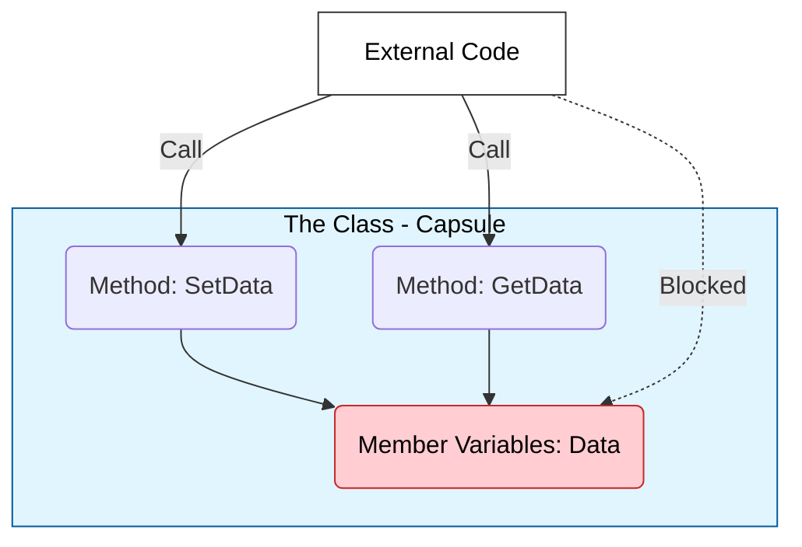
```mermaid
graph TD
    %% Class Definition
    subgraph ClassBox [The Class - Capsule]
        direction TB
        Data(Member Variables: Data)
        Method1(Method: SetData)
        Method2(Method: GetData)
        
        Method1 --> Data
        Method2 --> Data
    end

    %% External World
    User[External Code]

    %% Interaction
    User -->|Call| Method1
    User -->|Call| Method2
    User -.->|Blocked| Data

    %% Styling
    style ClassBox fill:#e1f5fe,stroke:#01579b,color:black
    style Data fill:#ffcdd2,stroke:#c62828,color:black
    style User fill:#fff,stroke:#333,color:black
```
---
### ๐Ÿงฌ The Genetic Code of Software

**(ุงู„ุชูˆุฑูŠุซ: ุงู„ุฌูŠู†ุงุช ุงู„ุจุฑู…ุฌูŠุฉ)**

ุงู„ุณู„ุงูŠุฏ ุจูŠู‚ูˆู„: _"Inheritance is the process by which one object acquires the properties of another object."_

ุฒูŠ ู…ุง ุฃู†ุช ูˆุฑุซุช ู„ูˆู† ุงู„ุนูŠู† ุฃูˆ ุงู„ุทูˆู„ ู…ู† ูˆุงู„ุฏูƒุŒ ุงู„ูƒู„ุงุณุงุช ููŠ ุงู„ุจุฑู…ุฌุฉ ุจุชูˆุฑุซ ู…ู† ุจุนุถ.

- **Parent Class (Superclass):** ุฏู‡ ุงู„ุฃุจ. ุจู†ุญุท ููŠู‡ ุงู„ุตูุงุช "ุงู„ุนุงู…ุฉ" ุงู„ู…ุดุชุฑูƒุฉ (ุฒูŠ ุฅู† ุฃูŠ ูƒุงุฆู† ุญูŠ ุจูŠุชู†ูุณ).
    
- **Child Class (Subclass):** ุฏู‡ ุงู„ุงุจู†. ุจูŠุงุฎุฏ ูƒู„ ุตูุงุช ุงู„ุฃุจ "ุนู„ู‰ ุงู„ุฌุงู‡ุฒ"ุŒ ูˆุจูŠุฒูˆุฏ ุนู„ูŠู‡ุง ุตูุงุชู‡ ุงู„ุฎุงุตุฉ (ุฒูŠ ุฅู† ุงู„ุฅู†ุณุงู† ุจูŠุชูƒู„ู…ุŒ ุจุณ ุงู„ู‚ุท ู…ุจูŠุชูƒู„ู…ุด).
    

### ๐Ÿ›๏ธ Hierarchical Classification

**(ุงู„ุชู†ุธูŠู… ุงู„ู‡ุฑู…ูŠ: ู…ู† ุงู„ุนุงู… ู„ู„ุฎุงุต)**

ุจุฏูˆู† ุงู„ุชูˆุฑูŠุซุŒ ุงู„ุจุฑู…ุฌุฉ ูƒุงู†ุช ู‡ุชุจู‚ู‰ ุฌุญูŠู… ู…ู† ุงู„ุชูƒุฑุงุฑ (Redundancy). ุชุฎูŠู„ ู„ูˆ ุจุชุนู…ู„ ู„ุนุจุฉ ููŠู‡ุง `Dog` ูˆ `Cat` ูˆ `Lion`.

- **ุจุฏูˆู† ุชูˆุฑูŠุซ:** ู‡ุชูƒุชุจ ูƒูˆุฏ `eat()` ูˆ `sleep()` ูˆ `walk()` ุฌูˆู‡ ุงู„ู€ DogุŒ ูˆุชุนูŠุฏ ูƒุชุงุจุชู‡ู… ุฌูˆู‡ ุงู„ู€ CatุŒ ูˆุชุนูŠุฏู‡ู… ุชุงู†ูŠ ุฌูˆู‡ ุงู„ู€ Lion.
    
- **ุจุงู„ุชูˆุฑูŠุซ:** ุฅุญู†ุง ุจู†ุนู…ู„ ูƒู„ุงุณ ูƒุจูŠุฑ ุงุณู…ู‡ `Animal` ู†ุญุท ููŠู‡ `eat, sleep, walk` ู…ุฑุฉ ูˆุงุญุฏุฉ. ูˆุงู„ูƒู„ ูŠูˆุฑุซ ู…ู†ู‡.
    

### โšก The "Delta" Strategy

**(ุงูƒุชุจ ุงู„ูุฑู‚ ุจุณ)**

ุงู„ุณู„ุงูŠุฏ ููŠู‡ ุฌู…ู„ุฉ ุนุจู‚ุฑูŠุฉ: _"an object need only define those qualities that make it unique."_

ุฏู‡ ุฌูˆู‡ุฑ ุงู„ู€ **Inheritance**. ุฃู†ุช ู…ุด ุจุชุนูŠุฏ ุงุฎุชุฑุงุน ุงู„ุนุฌู„ุฉ.

- ุงู„ุงุจู† ู…ุด ู…ุญุชุงุฌ ูŠู‚ูˆู„ "ุฃู†ุง ุจุขูƒู„ ูˆุฃุดุฑุจ"ุŒ ู„ุฃู† ุฏูŠ ู…ุณู„ู…ุงุช ูˆุฑุซู‡ุง.
    
- ุงู„ุงุจู† ุจูŠุฑูƒุฒ ุจุณ ุนู„ู‰ ุงู„ู€ **Unique Behavior** (ุงู„ุณู„ูˆูƒ ุงู„ู…ู…ูŠุฒ).
    
- ู…ุซู„ุงู‹: ุงู„ู€ `Dog` ู‡ูŠุนุฑู ุฏุงู„ุฉ `bark()` (ูŠู‡ูˆู‡ูˆ). ูˆุงู„ู€ `Cat` ู‡ุชุนุฑู ุฏุงู„ุฉ `meow()` (ุชู†ูˆู†ู†).
    

---

### ๐Ÿง Senior Insight: The IS-A Rule

**(ู‚ุงุนุฏุฉ ุงู„ู€ Senior: ุงุฎุชุจุงุฑ ุงู„ู†ุณุจ)**

ุนุดุงู† ุชุนุฑู ุงู…ุชู‰ ุชุณุชุฎุฏู… InheritanceุŒ ุงุณุฃู„ ู†ูุณูƒ ุณุคุงู„ ูˆุงุญุฏ: **"Is A?"** (ู‡ู„ ู‡ูˆุŸ).

- ู‡ู„ ุงู„ู€ Dog **is an** AnimalุŸ โœ… (ูŠุจู‚ู‰ ูŠู†ูุน ูŠูˆุฑุซ).
    
- ู‡ู„ ุงู„ู€ Car **is a** WheelุŸ โŒ (ู„ุฃุŒ ุงู„ุนุฑุจูŠุฉ "ุนู†ุฏู‡ุง" ุนุฌู„ุฉุŒ ุจุณ ู‡ูŠ ู…ุด ุนุฌู„ุฉ. ุฏู‡ ุงุณู…ู‡ Composition ู…ุด Inheritance).
    

---

### ๐Ÿ“Š ุงู„ู…ุฎุทุท ุงู„ู‡ู†ุฏุณูŠ (Inheritance Tree)

ุฏู‡ ู…ุฎุทุท ูŠูˆุถุญ ุฅุฒุงูŠ "ุงู„ุฎุตุงุฆุต ุงู„ุนุงู…ุฉ" ุจุชู†ุฒู„ ู…ู† ููˆู‚ ู„ุชุญุชุŒ ูˆุงู„ุฎุตุงุฆุต ุงู„ุฎุงุตุฉ ุจุชุชูƒุชุจ ููŠ ู…ูƒุงู†ู‡ุง ุจุณ.

Code snippet

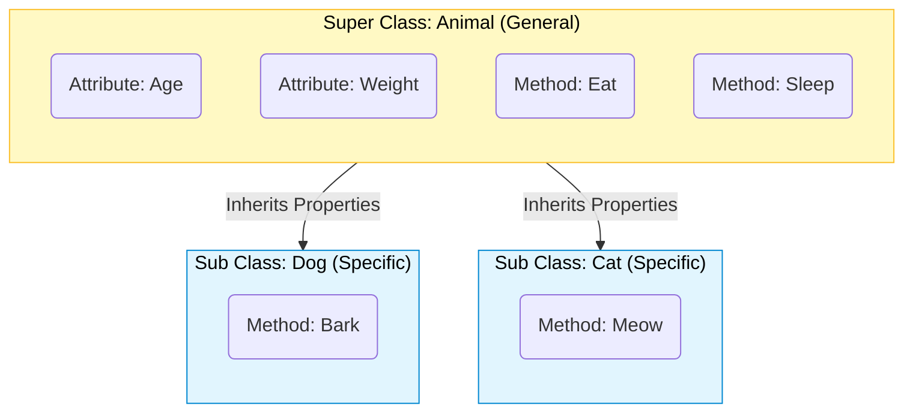
```mermaid
graph TD
    %% Parent Class (General)
    subgraph Parent ["Super Class: Animal (General)"]
        direction TB
        Attr1(Attribute: Age)
        Attr2(Attribute: Weight)
        Method1(Method: Eat)
        Method2(Method: Sleep)
    end

    %% Child Classes (Specific)
    subgraph Child1 ["Sub Class: Dog (Specific)"]
        direction TB
        DogUnique(Method: Bark)
    end

    subgraph Child2 ["Sub Class: Cat (Specific)"]
        direction TB
        CatUnique(Method: Meow)
    end

    %% Inheritance Relationships
    Parent -->|Inherits Properties| Child1
    Parent -->|Inherits Properties| Child2

    %% Styling
    style Parent fill:#fff9c4,stroke:#fbc02d,color:black
    style Child1 fill:#e1f5fe,stroke:#0288d1,color:black
    style Child2 fill:#e1f5fe,stroke:#0288d1,color:black
```

---
### 1. ูู„ุณูุฉ ุงู„ู€ Polymorphism: "ุงู„ุชุนุงู…ู„ ู…ุน ุงู„ู…ุฌู‡ูˆู„" ๐ŸŽญ

**(The Philosophy of Handling the Unknown)**

ููŠ ุงู„ุจุฑู…ุฌุฉ ุงู„ุชู‚ู„ูŠุฏูŠุฉ (C Style)ุŒ ู„ุงุฒู… ุชูƒูˆู† ุนุงุฑู ูƒู„ ุญุงุฌุฉ ุจุงู„ุชูุตูŠู„ ู‚ุจู„ ู…ุง ุงู„ุจุฑู†ุงู…ุฌ ูŠุดุชุบู„.

ููŠ ุงู„ู€ Java (OOP)ุŒ ุฅุญู†ุง ุจู†ุตู…ู… ุงู„ูƒูˆุฏ ุนุดุงู† ูŠุชุนุงู…ู„ ู…ุน ุญุงุฌุงุช ู„ุณู‡ ู…ุด ู…ูˆุฌูˆุฏุฉ!

**ุงู„ู…ุซุงู„ ุงู„ุฃุนู…ู‚ (USB Port):**

- ู…ุฏุฎู„ ุงู„ู€ USB ููŠ ุงู„ู„ุงุจุชูˆุจ ู‡ูˆ **(Interface)**.
    
- ุงู„ู„ุงุจุชูˆุจ ู…ูŠุนุฑูุด ุฃู†ุช ู‡ุชุฑูƒุจ ููŠู‡ ุฅูŠู‡ (ู…ุงูˆุณุŸ ูƒูŠุจูˆุฑุฏุŸ ู…ุฑูˆุญุฉุŸ).
    
- ู„ูƒู† ุงู„ู„ุงุจุชูˆุจ ู…ุจุฑู…ุฌ ุฅู†ู‡ ูŠุจุนุช ุฑุณุงู„ุฉ ูˆุงุญุฏุฉ: `"Get Power & Start Data"`.
    
    - ู„ูˆ ุฑูƒุจุช **ู…ุงูˆุณ**: ู‡ูŠูู‡ู… ุงู„ุฑุณุงู„ุฉ ูˆูŠู†ูˆุฑ ุงู„ู„ูŠุฒุฑ.
        
    - ู„ูˆ ุฑูƒุจุช **ูƒูŠุจูˆุฑุฏ**: ู‡ูŠูู‡ู… ุงู„ุฑุณุงู„ุฉ ูˆูŠู†ูˆุฑ ุงู„ู„ู…ุจุงุช.
        
    - ู„ูˆ ุฑูƒุจุช **ู…ุฑูˆุญุฉ**: ู‡ุชูู‡ู… ุงู„ุฑุณุงู„ุฉ ูˆุชู„ู.
        

ุฏู‡ ู‡ูˆ ุงู„ู€ Polymorphism: **ูˆุงุฌู‡ุฉ ูˆุงุญุฏุฉ (USB Port)ุŒ ูˆุงุณุชุฌุงุจุงุช ู…ุชุนุฏุฏุฉ (ุญุณุจ ุงู„ุฌู‡ุงุฒ ุงู„ู„ูŠ ุฑูƒุจ).**

---

### 2. ุฃู†ูˆุงุน ุงู„ู€ Polymorphism (ุชุดุฑูŠุญ ุชู‚ู†ูŠ) โš™๏ธ

ุงู„ุฌุงูุง ุจุชุนู…ู„ ุงู„ุณุญุฑ ุฏู‡ ุจุทุฑูŠู‚ุชูŠู†ุŒ ูˆู„ุงุฒู… ุชูุฑู‚ ุจูŠู†ู‡ู… ุฒูŠ ุงุณู…ูƒ:

#### ุฃ) Static Polymorphism (Overloading) - "ุชุนุฏุฏ ูˆู‚ุช ุงู„ูƒุชุงุจุฉ"

ุฏู‡ ุงู„ู†ูˆุน "ุงู„ุทูŠุจ". ุงู„ูƒูˆู…ุจุงูŠู„ุฑ ุจูŠุนุฑูู‡ ูˆุฃู†ุช ุจุชูƒุชุจ ุงู„ูƒูˆุฏ.

- **ุงู„ููƒุฑุฉ:** ุฏูˆุงู„ ุจู†ูุณ ุงู„ุงุณู… ุจุณ "ุจุชุงุฎุฏ ุฏุงุชุง ู…ุฎุชู„ูุฉ".
    
- **ุงู„ู…ุซุงู„:** ุฏุงู„ุฉ `print(int x)` ูˆุฏุงู„ุฉ `print(String s)`.
    
- **ุงู„ุฑุจุท:** ุฏู‡ ุจูŠุนุชู…ุฏ ุนู„ู‰ **Encapsulation**ุŒ ุฅู†ูƒ ุนุงู…ู„ ูƒู„ุงุณ ู…ู†ุธู… ููŠู‡ ุฏูˆุงู„ ุจุชู‚ูˆู… ุจู…ู‡ุงู… ู…ุชุดุงุจู‡ุฉ ุจุฃุณู…ุงุก ู†ุธูŠูุฉ.
    

#### ุจ) Dynamic Polymorphism (Overriding) - "ุชุนุฏุฏ ูˆู‚ุช ุงู„ุชุดุบูŠู„"

ุฏู‡ ุงู„ู†ูˆุน "ุงู„ุดุฑูŠุฑ ูˆุงู„ุนุจู‚ุฑูŠ" (The Real Magic). ุฏู‡ ุงู„ู„ูŠ ุจูŠุญุตู„ ููŠู‡ **Late Binding**.

- **ุงู„ููƒุฑุฉ:** ุงู„ูƒูˆู…ุจุงูŠู„ุฑ ู…ูŠูƒูˆู†ุด ุนุงุฑู ู‡ูˆ ู‡ูŠู†ุงุฏูŠ ุงู†ู‡ูŠ ุฏุงู„ุฉ ุจุงู„ุธุจุท! ุงู„ู‚ุฑุงุฑ ุจูŠุชุฃุฌู„ ู„ุญุฏ ู…ุง ุงู„ุจุฑู†ุงู…ุฌ ูŠุดุชุบู„ (Runtime).
    
- **ุงู„ุณุฑ:** ู‡ู†ุง ุจู†ุณุชุฎุฏู… **Inheritance** ุนุดุงู† ู†ุนู…ู„ "ุฃุจ" (Superclass) ูˆ"ุฃุจู†ุงุก" (Subclasses) ุจูŠุบูŠุฑูˆุง ุณู„ูˆูƒ ุงู„ุฃุจ.
    

---

### 3. ุฑุจุท ุงู„ู€ Principles ุจุจุนุถ (The Holy Trinity) ๐Ÿ”—

ุงู„ุณู„ุงูŠุฏ ูƒุงู† ุจูŠุดุฑุญ ูƒู„ ูˆุงุญุฏ ู„ูˆุญุฏู‡ุŒ ุจุณ ููŠ ุงู„ุญู‚ูŠู‚ุฉ ู‡ู… "ุชุฑูˆุณ" ููŠ ู…ูƒู†ุฉ ูˆุงุญุฏุฉ. ุฑูƒุฒ ููŠ ุงู„ุณูŠู†ุงุฑูŠูˆ ุฏู‡:

ุชุฎูŠู„ ุจู†ุนู…ู„ ู†ุธุงู… ุฏูุน ุฅู„ูƒุชุฑูˆู†ูŠ (Payment System).

#### ุงู„ุฎุทูˆุฉ 1: Inheritance (ุงู„ุชูˆุฑูŠุซ - ุงู„ู‡ูŠูƒู„ ุงู„ุนุธู…ูŠ) ๐Ÿ’€

ู‡ู†ุนู…ู„ ูƒู„ุงุณ ุฃุจ ุงุณู…ู‡ `PaymentMethod`ุŒ ูˆูƒู„ุงุณุงุช ุฃุจู†ุงุก: `Visa`, `MasterCard`, `PayPal`.

- **ุงู„ูุงูŠุฏุฉ:** ูˆูุฑู†ุง ูƒูˆุฏุŒ ูˆุนู…ู„ู†ุง ุชุณู„ุณู„ ู‡ุฑู…ูŠ (Hierarchy). ุฃูŠ ูˆุณูŠู„ุฉ ุฏูุน ู‡ูŠ ููŠ ุงู„ุฃุตู„ `IS-A PaymentMethod`.
    

#### ุงู„ุฎุทูˆุฉ 2: Encapsulation (ุงู„ุชุบู„ูŠู - ุงู„ุญู…ุงูŠุฉ) ๐Ÿ›ก๏ธ

ุฌูˆู‡ ูƒู„ุงุณ VisaุŒ ุฑู‚ู… ุงู„ูƒุงุฑุช cardNumber ู‡ูŠูƒูˆู† private.

ูˆุทุฑูŠู‚ุฉ ุงู„ุงุชุตุงู„ ุจุงู„ุจู†ูƒ ู‡ุชูƒูˆู† ุฌูˆู‡ ู…ูŠุซูˆุฏ pay() ูˆู…ุญุฏุด ูŠุนุฑู ุชูุงุตูŠู„ู‡ุง.

- **ุงู„ูุงูŠุฏุฉ:** ุงู„ู€ Polymorphism ู…ุด ู…ุญุชุงุฌ ูŠุนุฑู "ุฅุฒุงูŠ" ุงู„ููŠุฒุง ุจุชุฏูุนุŒ ู‡ูˆ ุจุณ ู…ุญุชุงุฌ ูŠู†ุงุฏูŠ `pay()`. ุงู„ุชูุงุตูŠู„ "ู…ุบู„ูุฉ".
    

#### ุงู„ุฎุทูˆุฉ 3: Polymorphism (ุงู„ุฐูƒุงุก - ุงู„ู…ุฎ) ๐Ÿง

ู‡ู†ุง ุงู„ู„ุญุธุฉ ุงู„ุญุงุณู…ุฉ. ุงู„ูƒูˆุฏ ุจุชุงุนูƒ ู‡ูŠูƒูˆู† ูƒุฏู‡:

Java

```java
// ุฏุงู„ุฉ ุจุชุณุชู‚ุจู„ "ุฃูŠ" ูˆุณูŠู„ุฉ ุฏูุน
public void processPayment(PaymentMethod method) {
    method.pay(100); // ุงู„ุณุญุฑ ู‡ู†ุง!
}
```

- ู„ูˆ ุจุนุช `Visa`.. ุงู„ู€ Java ู‡ุชุดุบู„ `Visa.pay()`.
    
- ู„ูˆ ุจุนุช `PayPal`.. ุงู„ู€ Java ู‡ุชุดุบู„ `PayPal.pay()`.
    
- **ุงู„ู…ูุงุฌุฃุฉ:** ู„ูˆ ุจุนุฏ ุณู†ุฉ ุถูุช ุทุฑูŠู‚ุฉ ุฏูุน ุฌุฏูŠุฏุฉ `Bitcoin`.. ุงู„ุฏุงู„ุฉ `processPayment` **ู…ุด ู‡ุชุชุนุฏู„ ูˆู„ุง ุญุฑู!** (Extensibility).
    

---

### 4. ุงู„ู…ุฎุทุท ุงู„ู‡ู†ุฏุณูŠ ุงู„ุนู…ูŠู‚ (The Dynamic Binding Flow) ๐Ÿ“Š

ุงู„ู…ุฎุทุท ุฏู‡ ุจูŠูˆุถุญ ุฅุฒุงูŠ ุงู„ู€ Runtime ุจูŠู‚ุฑุฑ ูŠู†ุงุฏูŠ ู…ูŠู†ุŒ ูˆุฅุฒุงูŠ ุงู„ู€ 3 ู…ุจุงุฏุฆ ุดุบุงู„ูŠู† ู…ุน ุจุนุถ.

Code snippet

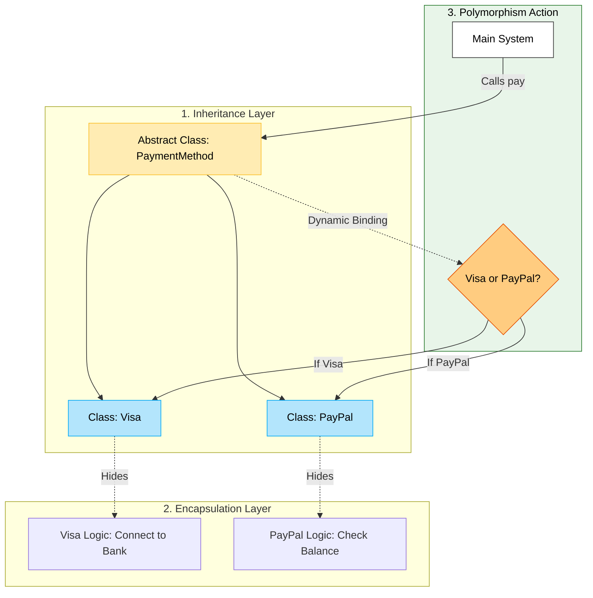
```mermaid
graph TD
    %% 1. Define Nodes
    Parent[Abstract Class: PaymentMethod]
    Child1[Class: Visa]
    Child2[Class: PayPal]
    
    Secret1[Visa Logic: Connect to Bank]
    Secret2[PayPal Logic: Check Balance]
    
    UserCode[Main System]
    Decision{Visa or PayPal?}

    %% 2. Structure & Connections
    subgraph Inheritance [1. Inheritance Layer]
        direction TB
        Parent --> Child1
        Parent --> Child2
    end

    subgraph Encapsulation [2. Encapsulation Layer]
        direction TB
        Child1 -.->|Hides| Secret1
        Child2 -.->|Hides| Secret2
    end

    subgraph Polymorphism [3. Polymorphism Action]
        direction TB
        UserCode -->|Calls pay| Parent
        Parent -.->|Dynamic Binding| Decision
        
        Decision -->|If Visa| Child1
        Decision -->|If PayPal| Child2
    end

    %% 3. Styling
    style Parent fill:#ffecb3,stroke:#fbc02d,color:black
    style Child1 fill:#b3e5fc,stroke:#03a9f4,color:black
    style Child2 fill:#b3e5fc,stroke:#03a9f4,color:black
    style UserCode fill:#fff,stroke:#333,color:black
    style Polymorphism fill:#e8f5e9,stroke:#2e7d32,color:black
    style Decision fill:#ffcc80,stroke:#e65100,color:black
```

### ๐Ÿ’ก ุงู„ุฎู„ุงุตุฉ ุงู„ุณูŠู†ูŠูˆุฑ (The Senior Verdict)

- **Encapsulation:** ุจูŠุฎู„ูŠ ุงู„ูƒุงุฆู† "ุตู†ุฏูˆู‚ ุฃุณูˆุฏ" (ู…ุญุฏุด ูŠู„ู…ุณ ุงู„ุฏุงุชุง).
    
- **Inheritance:** ุจูŠุฎู„ูŠ ุงู„ุตู†ุงุฏูŠู‚ ุฏูŠ "ู‚ุฑุงูŠุจ" (ุนุดุงู† ู†ุนุงู…ู„ู‡ู… ู…ุนุงู…ู„ุฉ ูˆุงุญุฏุฉ).
    
- **Polymorphism:** ุจูŠุฎู„ูŠู†ุง ู†ูƒู„ู… ุงู„ุตู†ุงุฏูŠู‚ ุฏูŠ ูƒู„ู‡ุง "ุจู„ุบุฉ ูˆุงุญุฏุฉ" (Interface)ุŒ ูˆูƒู„ ุตู†ุฏูˆู‚ ูŠุฑุฏ ุจุทุฑูŠู‚ุชู‡.
    

ุจุฏูˆู† PolymorphismุŒ ูƒู†ุช ู‡ุชุถุทุฑ ุชูƒุชุจ `if (type == Visa) ... else if (type == PayPal) ...` ูˆุฏู‡ ูƒูˆุฏ "ู…ุจุชุฏุฆูŠู†" ุบูŠุฑ ู‚ุงุจู„ ู„ู„ุชุทูˆูŠุฑ. ุงู„ู€ Polymorphism ู‡ูˆ ุณุฑ ุงู„ู€ **Clean Code**.

---
### The Anatomy of a Java Program ๐Ÿงฌ

**(ุชุดุฑูŠุญ ุงู„ูƒูˆุฏ)**

ุงู„ูƒูˆุฏ ุงู„ู„ูŠ ู‚ุฏุงู…ูƒ ุฏู‡ ู…ุด ู…ุฌุฑุฏ ุณุทูˆุฑุŒ ุฏู‡ ู‡ูŠูƒู„ ู…ุนู…ุงุฑูŠ ุตุงุฑู….

Java

```java
/*
This is a simple Java program.
Call this file "Example.java".
*/
class Example {
    // Your program begins with a call to main().
    public static void main(String args[]) {
        System.out.println("This is a simple Java program.");
    }
}
```

**Compilation Unit (ูˆุญุฏุฉ ุงู„ุชุฌู…ูŠุน)**

- ุงู„ู…ู„ู ุงู„ู†ุตูŠ ุงู„ู„ูŠ ุจุชูƒุชุจ ููŠู‡ ุงู„ูƒูˆุฏ (ุงู„ู„ูŠ ุขุฎุฑู‡ `.java`) ุงุณู…ู‡ ุงู„ุฑุณู…ูŠ ููŠ ุงู„ุฌุงูุง **Compilation Unit**.
    
- **ุงู„ู‚ุงุนุฏุฉ ุงู„ุฐู‡ุจูŠุฉ:** ุงุณู… ุงู„ู…ู„ู ู„ุงุฒู… ูŠุทุงุจู‚ ุงุณู… ุงู„ู€ Class ุงู„ู„ูŠ ุฌูˆุงู‡ (Case Sensitive).
    
    - ุงู„ูƒู„ุงุณ ุงุณู…ู‡ `Example`ุŸ ูŠุจู‚ู‰ ุงู„ู…ู„ู ู„ุงุฒู… ูŠูƒูˆู† `Example.java`. ู„ูˆ ุณู…ูŠุชู‡ `example.java` (ุจุญุฑู ุตุบูŠุฑ) ุงู„ูƒูˆู…ุจุงูŠู„ุฑ ู‡ูŠุนุชุฑุถ.
        

**The Class Block**

- `class Example { ... }`
    
- ููŠ ุงู„ุฌุงูุงุŒ ู…ููŠุด ุฏุงู„ุฉ ูŠุชูŠู…ุฉ. ุฃูŠ ูƒูˆุฏ ู„ุงุฒู… ูŠุนูŠุด ุฌูˆู‡ **Class**. ุงู„ูƒู„ุงุณ ู‡ูˆ "ุงู„ุญุงูˆูŠุฉ" ุงู„ุฃุณุงุณูŠุฉ ู„ู„ูƒูˆุฏ ูˆุงู„ุจูŠุงู†ุงุช (ุฒูŠ ู…ุง ุดุฑุญู†ุง ููŠ ุงู„ู€ Encapsulation).
    

---

### The Sacred Line: `public static void main` ๐Ÿ—๏ธ

**(ุงู„ุณุทุฑ ุงู„ู…ู‚ุฏุณ)**

ุฏู‡ ุฃู‡ู… ุณุทุฑ ููŠ ุงู„ุฌุงูุงุŒ ูˆุฏู‡ ุงู„ู…ุฏุฎู„ (Entry Point) ุงู„ู„ูŠ ุงู„ู€ JVM ุจูŠุฏูˆุฑ ุนู„ูŠู‡ ุนุดุงู† ูŠุจุฏุฃ ุงู„ุจุฑู†ุงู…ุฌ. ู„ูŠู‡ ู…ูƒุชูˆุจ ูƒุฏู‡ุŸ

- **`public`:** ุนุดุงู† ุงู„ู€ JVM (ุงู„ู„ูŠ ู‡ูˆ ุจุฑู†ุงู…ุฌ ุฎุงุฑุฌูŠ) ูŠู‚ุฏุฑ ูŠุดูˆู ุงู„ุฏุงู„ุฉ ูˆูŠู†ุงุฏูŠู‡ุง. ู„ูˆ ูƒุงู†ุช `private`ุŒ ุงู„ู€ JVM ู…ุด ู‡ูŠู‚ุฏุฑ ูŠุฏุฎู„.
    
- **`static`:** ุฏูŠ ูƒู„ู…ุฉ ุงู„ุณุฑ. ุงู„ู€ `main` ุจุชุดุชุบู„ **ู‚ุจู„** ู…ุง ุฃูŠ Object ูŠุชุฎู„ู‚ ููŠ ุงู„ู…ูŠู…ูˆุฑูŠ. ุงู„ู€ JVM ุจูŠู†ุงุฏูŠู‡ุง ุจุงุณู… ุงู„ูƒู„ุงุณ ู…ุจุงุดุฑุฉ `Example.main()`ุŒ ู…ุด ู…ุญุชุงุฌ ูŠุนู…ู„ `new Example()`.
    
- **`void`:** ุงู„ู€ `main` ู…ุด ุจุชุฑุฌุน ู‚ูŠู…ุฉ. ู„ู…ุง ุจุชุฎู„ุตุŒ ุงู„ุจุฑู†ุงู…ุฌ ุจูŠู…ูˆุช.
    
- **`String args[]`:** ุฏูŠ ู…ุตููˆูุฉ ุจุชุดูŠู„ ุฃูŠ ูƒู„ุงู… ุจุชูƒุชุจู‡ ุฌู†ุจ ุงุณู… ุงู„ุจุฑู†ุงู…ุฌ ูˆุฃู†ุช ุจุชุดุบู„ู‡ (Command Line Arguments).
    

---

### The Lifecycle: From Text to Life ๐Ÿ”„

**(ุฏูˆุฑุฉ ุญูŠุงุฉ ุงู„ุจุฑู†ุงู…ุฌ)**

ู‡ู†ุง ุจู†ุดูˆู ุงู„ู€ Buzzwords ุงู„ู„ูŠ ุดุฑุญู†ุงู‡ุง (Compiler, Bytecode, JVM) ูˆู‡ูŠ ุดุบุงู„ุฉ ุนู…ู„ูŠ.

**Step 1: Compiling (ุงู„ุชุฑุฌู…ุฉ)**

- **ุงู„ุฃู…ุฑ:** `javac Example.java`
    
- **ุงู„ู„ูŠ ุจูŠุญุตู„:** ุงู„ู€ Compiler (`javac`) ุจูŠู‚ุฑุฃ ุงู„ูƒูˆุฏุŒ ูŠุชุฃูƒุฏ ุฅู† ู…ููŠุด ุฃุฎุทุงุก (Syntax Errors)ุŒ ูˆูŠุญูˆู„ู‡ ู„ู€ **Bytecode**.
    
- **ุงู„ู†ุชูŠุฌุฉ:** ู…ู„ู ุฌุฏูŠุฏ ุจูŠุธู‡ุฑ ุงุณู…ู‡ `Example.class`.
    
    - ุงู„ู…ู„ู ุฏู‡ **ู…ููŠู‡ูˆุด** Machine Code.
        
    - ุงู„ู…ู„ู ุฏู‡ ููŠู‡ **Bytecode** (ู„ุบุฉ ุงู„ู€ JVM).
        

**Step 2: Running (ุงู„ุชุดุบูŠู„)**

- **ุงู„ุฃู…ุฑ:** `java Example`
    
- **ู…ู„ุงุญุธุฉ ุฎุทูŠุฑุฉ:** ู„ุงุญุธ ุฅู†ู†ุง ูƒุชุจู†ุง `Example` ุจุณุŒ ู…ู† ุบูŠุฑ `.class` ูˆู…ู† ุบูŠุฑ `.java`.
    
- **ุงู„ู„ูŠ ุจูŠุญุตู„:**
    
    1. ุจุฑู†ุงู…ุฌ ุงู„ู€ Launcher (`java`) ุจูŠู‚ูˆู… ุงู„ู€ **JVM**.
        
    2. ุงู„ู€ JVM ุจูŠุญู…ู„ ู…ู„ู `Example.class` ููŠ ุงู„ู…ูŠู…ูˆุฑูŠ.
        
    3. ุจูŠุฏูˆุฑ ุนู„ู‰ ุฏุงู„ุฉ `main` ูˆูŠุจุฏุฃ ูŠู†ูุฐ ุงู„ุชุนู„ูŠู…ุงุช ุณุทุฑ ุณุทุฑ (ุฃูˆ ูŠุฏูŠู‡ุง ู„ู„ู€ JIT Compiler).
        
- **ุงู„ู†ุชูŠุฌุฉ:** ุงู„ุฌู…ู„ุฉ ุชุธู‡ุฑ ุนู„ู‰ ุงู„ุดุงุดุฉ.
    

---

### ๐Ÿ“Š ุงู„ู…ุฎุทุท ุงู„ู‡ู†ุฏุณูŠ (The Workflow)

ุฏู‡ ุงู„ุฑุณู… ุงู„ู„ูŠ ุจูŠูˆุถุญ ุงู„ุฑุญู„ุฉ ู…ู† ุงู„ูƒูŠุจูˆุฑุฏ ุจุชุงุนูƒ ู„ุญุฏ ุงู„ุดุงุดุฉุŒ ูˆุชุทุจูŠู‚ ู…ูู‡ูˆู… ุงู„ู€ "Write Once, Run Anywhere".


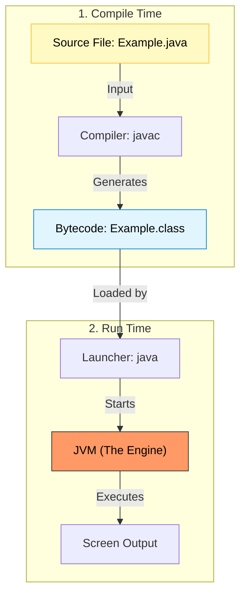
```mermaid
graph TD
    %% Nodes Definition
    SourceFile["Source File: Example.java"]
    Compiler["Compiler: javac"]
    BytecodeFile["Bytecode: Example.class"]
    Launcher["Launcher: java"]
    JVM["JVM (The Engine)"]
    Output["Screen Output"]

    %% Flow
    subgraph Development [1. Compile Time]
        direction TB
        SourceFile -->|Input| Compiler
        Compiler -->|Generates| BytecodeFile
    end

    subgraph Execution [2. Run Time]
        direction TB
        BytecodeFile -->|Loaded by| Launcher
        Launcher -->|Starts| JVM
        JVM -->|Executes| Output
    end

    %% Styling
    style SourceFile fill:#fff9c4,stroke:#fbc02d,color:black
    style BytecodeFile fill:#e1f5fe,stroke:#0288d1,color:black
    style JVM fill:#f96,stroke:#333,color:black
```

### ๐Ÿ’ก Senior Tip (ู†ุตูŠุญุฉ ู…ุญุชุฑู)

ู„ูˆ ุฌูŠุช ุชุดุบู„ ุงู„ุจุฑู†ุงู…ุฌ ูˆูƒุชุจุช java Example.classุŒ ุงู„ู€ Java ู‡ุชุถุฑุจ Error ู…ุดู‡ูˆุฑ ุฌุฏุงู‹:

Could not find or load main class Example.class.

ู„ูŠู‡ุŸ ู„ุฃู† ุงู„ู€ java command ู…ู†ุชุธุฑ ุงุณู… Class (ู…ู†ุทู‚ูŠ)ุŒ ู…ุด ุงุณู… ู…ู„ู (ููŠุฒูŠุงุฆูŠ). ู‡ูˆ ุฃูˆุชูˆู…ุงุชูŠูƒ ุนุงุฑู ุฅู†ู‡ ู‡ูŠุฏูˆุฑ ุนู„ู‰ .classุŒ ูู…ุชูƒุชุจุด ุงู„ุงู…ุชุฏุงุฏ.

---
### The Silent Code: Comments ๐Ÿคซ

**(ุงู„ูƒูˆุฏ ุงู„ุตุงู…ุช: ุงู„ุชุนู„ูŠู‚ุงุช)**

ุงู„ุชุนู„ูŠู‚ุงุช ู‡ูŠ ุณุทูˆุฑ **ู„ู„ุจุดุฑ ูู‚ุท**. ุงู„ู€ Compiler ุจูŠุนู…ู„ู‡ุง "Ignore" ุชู…ุงู…ุงู‹ ูˆูƒุฃู†ู‡ ู…ุด ุดุงูŠูู‡ุง. ูˆุธูŠูุชู‡ุง ุงู„ูˆุญูŠุฏุฉ ู‡ูŠ ุงู„ุชูˆุซูŠู‚ (Documentation).

ุงู„ุฌุงูุง ุจุชู‚ุฏู… 3 ุฃู†ูˆุงุนุŒ ูˆูƒู„ ู†ูˆุน ู„ูŠู‡ ุงุณุชุฎุฏุงู…ู‡ ุงู„ุงุญุชุฑุงููŠ:

- **Single Line Comment `//`**:
    
    - ุฏู‡ ู„ู„ู…ู„ุงุญุธุงุช ุงู„ุณุฑูŠุนุฉ. ุฃูŠ ุญุงุฌุฉ ุจุนุฏ ุงู„ุนู„ุงู…ุฉ ุฏูŠ ู„ุญุฏ ุขุฎุฑ ุงู„ุณุทุฑ ุจุชุนุชุจุฑ ุชุนู„ูŠู‚.
        
    - _ุงุณุชุฎุฏุงู…ู‡:_ ุดุฑุญ ุณุทุฑ ูƒูˆุฏ ู…ุนู‚ุฏุŒ ุฃูˆ ุชู‡ู…ูŠุด ุณุทุฑ ู…ุคู‚ุชุงู‹ (Debugging).
        
- **Multiline Comment `/* ... */`**:
    
    - ุฏู‡ ู„ู„ู…ู‚ุงู„ุงุช ุงู„ู‚ุตูŠุฑุฉ. ู…ู…ูƒู† ุชูƒุชุจ ููŠู‡ ุณุทูˆุฑ ูƒุชูŠุฑ ูˆุฑุง ุจุนุถ.
        
    - _ุงุณุชุฎุฏุงู…ู‡:_ ุดุฑุญ ุฎูˆุงุฑุฒู…ูŠุฉ ูƒุงู…ู„ุฉุŒ ุฃูˆ ูƒุชุงุจุฉ ุญู‚ูˆู‚ ุงู„ู…ู„ูƒูŠุฉ ููŠ ุฃูˆู„ ุงู„ู…ู„ู.
        
- **Documentation Comment `/** ... */` (Javadoc)**: ๐Ÿ›‘ **ุฑูƒุฒ ู‡ู†ุง ุนุดุงู† ุฏูŠ ุจุชุงุนุฉ ุงู„ุณูŠู†ูŠูˆุฑ**
    
    - ุดูƒู„ู‡ ุดุจู‡ ุงู„ู€ Multiline ุจุณ ุจูŠุจุฏุฃ ุจู€ `/**`.
        
    - ุงู„ู†ูˆุน ุฏู‡ ู…ุด ู…ุฌุฑุฏ ู…ู„ุงุญุธุงุช. ุฏู‡ ุจูŠุชุนุงู„ุฌ ุจุฃุฏุงุฉ ุงุณู…ู‡ุง `javadoc`.
        
    - ุงู„ุฃุฏุงุฉ ุฏูŠ ุจุชุณุญุจ ุงู„ูƒู„ุงู… ุงู„ู„ูŠ ุฌูˆู‡ ุงู„ุชุนู„ูŠู‚ ุฏู‡ ูˆุชุทู„ุน ู…ู†ู‡ ู…ู„ูุงุช **HTML** (ุตูุญุงุช ูˆูŠุจ) ุชุดุฑุญ ุงู„ูƒูˆุฏ ุจุชุงุนูƒ ุชู„ู‚ุงุฆูŠุงู‹.
        
    - ุฏู‡ ุงู„ู„ูŠ ุจูŠุชุนู…ู„ ุจูŠู‡ ุงู„ู€ Java Official Documentation ุงู„ู„ูŠ ุจู†ุฐุงูƒุฑ ู…ู†ู‡ุง!
        

---

### The Container: Class Definition ๐Ÿ“ฆ

**(ุงู„ูˆุนุงุก: ุชุนุฑูŠู ุงู„ูƒู„ุงุณ)**

Java

```java
class Example {
    // ...
}
```

ุงู„ุณุทุฑ ุฏู‡ ู‡ูˆ ุฅุนู„ุงู† ุงู„ู…ูŠู„ุงุฏ.

- **`class`**: ุฏูŠ **Keyword** (ูƒู„ู…ุฉ ู…ุญุฌูˆุฒุฉ). ุจุชู‚ูˆู„ ู„ู„ูƒูˆู…ุจุงูŠู„ุฑ: "ุฃู†ุง ู‡ุจุฏุฃ ุฃุนุฑู ูƒู„ุงุณ ุฌุฏูŠุฏ ุฏู„ูˆู‚ุชูŠ".
    
- **`Example`**: ุฏู‡ **Identifier** (ุงุณู… ุงู„ู…ุนุฑู). ุฏู‡ ุงู„ุงุณู… ุงู„ู„ูŠ ุฃู†ุช ุงุฎุชุฑุชู‡ ู„ู„ูƒู„ุงุณ.
    
    - _ู‚ุงุนุฏุฉ:_ ู„ุงุฒู… ูŠุจุฏุฃ ุจุญุฑู ูƒุงุจูŠุชุงู„ (PascalCase) ูƒุนุฑู ุณุงุฆุฏ (Convention).
        
    - _ุดุฑุท:_ ู„ุงุฒู… ูŠูƒูˆู† ู…ุทุงุจู‚ ู„ุงุณู… ุงู„ู…ู„ู `Example.java`.
        
- **`{ }` (Curly Braces)**: ุฏูŠ ุญุฏูˆุฏ ุงู„ุฏูˆู„ุฉ.
    
    - ุงู„ู‚ูˆุณ ุงู„ู…ูุชูˆุญ `{`: ุจุฏุงูŠุฉ ุงู„ูƒู„ุงุณ.
        
    - ุงู„ู‚ูˆุณ ุงู„ู…ู‚ููˆู„ `}`: ู†ู‡ุงูŠุฉ ุงู„ูƒู„ุงุณ.
        
    - ุฃูŠ ุญุงุฌุฉ ุจุฑู‡ ุงู„ุฃู‚ูˆุงุณ ุฏูŠ ู…ุชุฎุตุด ุงู„ูƒู„ุงุณ ุฏู‡.
        

---

### The Gatekeeper: `public` Access Modifier ๐Ÿ”“

**(ุงู„ุจูˆุงุจ: ุฅุฐู† ุงู„ุฏุฎูˆู„)**

Java

```java
public static void main(String args[])
```

ุงู„ุณู„ุงูŠุฏ ุฑูƒุฒุช ุฌุฏุงู‹ ุนู„ู‰ ูƒู„ู…ุฉ **`public`**. ู„ูŠู‡ ุงู„ู€ main ู„ุงุฒู… ุชูƒูˆู† publicุŸ

- **Access Modifier (ู…ุญุฏุฏ ุงู„ูˆุตูˆู„):** ุฏูŠ ูƒู„ู…ุงุช ุจุชุชุญูƒู… ู…ูŠู† ูŠู‚ุฏุฑ ูŠุดูˆู ุงู„ูƒูˆุฏ ูˆู…ูŠู† ู„ุง (`public`, `private`, `protected`).
    
- **ู„ู…ุงุฐุง PublicุŸ**
    
    - ุฏุงู„ุฉ ุงู„ู€ `main` ู‡ูŠ ุฃูˆู„ ุญุงุฌุฉ ุจุชุดุชุบู„.
        
    - ู…ูŠู† ุงู„ู„ูŠ ุจูŠุดุบู„ู‡ุงุŸ ุงู„ู€ **JVM**.
        
    - ุงู„ู€ JVM ุฏู‡ ุจุฑู†ุงู…ุฌ ุฎุงุฑุฌูŠ (ุบุฑูŠุจ ุนู† ุงู„ูƒู„ุงุณ ุจุชุงุนูƒ).
        
    - ุนุดุงู† ุงู„ุบุฑูŠุจ ูŠู‚ุฏุฑ ูŠุฏุฎู„ ุฌูˆู‡ ุงู„ูƒู„ุงุณ ูˆูŠู†ุงุฏูŠ ุงู„ุฏุงู„ุฉุŒ ู„ุงุฒู… ุงู„ุฏุงู„ุฉ ุชูƒูˆู† "ู…ุดุงุน" ุฃูˆ "ุนุงู…ุฉ" (**Public**).
        
    - ู„ูˆ ุฎู„ูŠุชู‡ุง `private`ุŒ ุงู„ู€ JVM ู‡ูŠุฎุจุท ุนู„ู‰ ุงู„ุจุงุจ ูˆู…ุด ู‡ูŠุนุฑู ูŠุฏุฎู„ุŒ ูˆุงู„ุจุฑู†ุงู…ุฌ ู‡ูŠุถุฑุจ `Main method not found`.
        

---

### ๐Ÿ“Š ุงู„ู…ุฎุทุท ุงู„ู‡ู†ุฏุณูŠ (Anatomy of Execution)

ุงู„ู…ุฎุทุท ุฏู‡ ุจูŠูˆุถุญ ุงู„ุนู„ุงู‚ุฉ ุจูŠู† ุงู„ู€ JVM (ุงู„ุทุงุฑู‚) ูˆุจูŠู† ุงู„ู€ `public main` (ุงู„ุจุงุจ ุงู„ู…ูุชูˆุญ)ุŒ ูˆุฏูˆุฑ ุงู„ุชุนู„ูŠู‚ุงุช ุงู„ู…ุฎุชููŠุฉ.

Code snippet

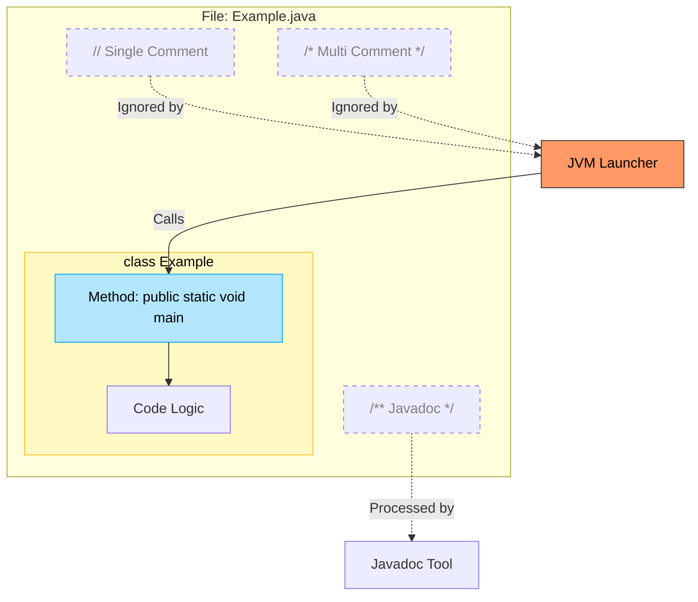
```mermaid
graph TD
    %% Entities
    JVM[JVM Launcher]
    JavadocTool[Javadoc Tool]
    
    subgraph File_Scope [File: Example.java]
        direction TB
        
        %% ๐Ÿ›‘ ุงู„ุญู…ุงูŠุฉ: ู„ุงุฒู… ุนู„ุงู…ุงุช ุชู†ุตูŠุต ุนุดุงู† ุงู„ุฑู…ูˆุฒ ุฏูŠ ู…ุชุนู…ู„ุด ู…ุดุงูƒู„
        Comment1["// Single Comment"]
        Comment2["/* Multi Comment */"]
        Comment3["/** Javadoc */"]
        
        %% The Class Structure
        subgraph Class_Scope [class Example]
            direction TB
            MainMethod["Method: public static void main"]
            CodeLogic[Code Logic]
            
            MainMethod --> CodeLogic
        end
    end

    %% Relationships
    JVM -->|Calls| MainMethod
    
    Comment1 -.->|Ignored by| JVM
    Comment2 -.->|Ignored by| JVM
    Comment3 -.->|Processed by| JavadocTool

    %% Styles
    style JVM fill:#f96,stroke:#333,color:black
    style MainMethod fill:#b3e5fc,stroke:#03a9f4,color:black
    style Class_Scope fill:#fff9c4,stroke:#fbc02d,color:black
    style Comment1 stroke-dasharray: 5 5,color:gray
    style Comment2 stroke-dasharray: 5 5,color:gray
    style Comment3 stroke-dasharray: 5 5,color:gray
```

### ๐Ÿ’ก ุงู„ุฎู„ุงุตุฉ (Senior Insight)

ุงู„ู€ Curly Braces {} ู‡ู…ุง ุงู„ู„ูŠ ุจูŠุญุฏุฏูˆุง ุงู„ู€ Scope (ุงู„ู…ุฌุงู„).

ููŠ ุงู„ุฌุงูุงุŒ ุงู„ู…ุชุบูŠุฑ ุงู„ู„ูŠ ูŠุชุนุฑู ุฌูˆู‡ ู‚ูˆุณูŠู†ุŒ ุจูŠู…ูˆุช ุจู…ุฌุฑุฏ ู…ุง ู†ุฎุฑุฌ ู…ู†ู‡ู…. ุฏูŠ ู…ุนู„ูˆู…ุฉ ู‡ุชุญุชุงุฌู‡ุง ุฌุฏุงู‹ ู‚ุฏุงู… ููŠ ุงู„ู€ Memory Management.

---
### 1. The `static` Mystery ๐Ÿ‘ป

**(ุณุฑ ุงู„ูƒู„ู…ุฉ ุงู„ุซุงุจุชุฉ)**

> _โ€ข The keyword static allows main() to be called without having to instantiate a particular instance..._

ุงู„ุณุคุงู„ ุงู„ูู„ุณููŠ:

ุนุดุงู† ุชู†ุงุฏูŠ ุฃูŠ ุฏุงู„ุฉ ููŠ ุงู„ุฌุงูุงุŒ ู„ุงุฒู… ุงู„ุฃูˆู„ ุชุนู…ู„ new Object() ู…ู† ุงู„ูƒู„ุงุณ ุจุชุงุนู‡ุงุŒ ุตุญุŸ

ุทูŠุจ ู…ูŠู† ู‡ูŠุนู…ู„ new Example() ุนุดุงู† ูŠู†ุงุฏูŠ mainุŒ ุฅุฐุง ูƒุงู† main ู‡ูŠ ุฃุตู„ุงู‹ ุจุฏุงูŠุฉ ุงู„ุจุฑู†ุงู…ุฌุŸ!! (ุฏูŠ ู…ุดูƒู„ุฉ ุงู„ุจูŠุถุฉ ูˆุงู„ูุฑุฎุฉ).

ุงู„ุญู„ ุงู„ุณุญุฑูŠ (static):

ูƒู„ู…ุฉ static ุจุชู‚ูˆู„ ู„ู„ู€ JVM: "ูŠุง ุนู… ุงู„ู€ JVMุŒ ุงู„ุฏุงู„ุฉ ุฏูŠ ู…ุณุชู‚ู„ุฉุŒ ู…ุด ู…ุญุชุงุฌุฉ Object ุนุดุงู† ุชุดุชุบู„. ู‡ูŠ ู…ุญููˆุฑุฉ ููŠ ุฐุงูƒุฑุฉ ุงู„ูƒู„ุงุณ ู†ูุณู‡".

- ุนุดุงู† ูƒุฏู‡ ุงู„ู€ JVM ุจูŠู‚ุฏุฑ ูŠู†ุงุฏูŠู‡ุง ูƒุฏู‡: `Example.main()` ู…ู† ุบูŠุฑ ู…ุง ูŠุถุทุฑ ูŠุนู…ู„ `new Example()`.
    

---

### 2. The `void` Void โšซ

**(ุงู„ู„ุงุนูˆุฏุฉ)**

> _โ€ข The keyword void simply tells the compiler that main() does not return a value._

ุงู„ู€ `main` ู‡ูŠ "ุงู„ู…ุญุทุฉ ุงู„ุฃุฎูŠุฑุฉ". ู„ู…ุง ุจุชุฎู„ุตุŒ ุงู„ุจุฑู†ุงู…ุฌ ุจูŠู‚ูู„.

- ู…ููŠุด ุญุฏ ู…ุณุชู†ูŠ ู…ู†ู‡ุง ู†ุชูŠุฌุฉ (Result) ุชุฑุฌุนู„ู‡.
    
- ู„ูˆ ูƒุงู†ุช ุจุชุฑุฌุน `int` (ุฒูŠ ู„ุบุฉ C++)ุŒ ูƒุงู† ู„ุงุฒู… ู†ูƒุชุจ `return 0;`ุŒ ุจุณ ุงู„ุฌุงูุง ู‚ุงู„ุชู„ูƒ "ุฎู„ูŠู‡ุง `void` ูˆุฑูŠุญ ุฏู…ุงุบูƒ".
    

---

### 3. The Doorbell: `String args[]` ๐Ÿ””

**(ุฌุฑุณ ุงู„ุจุงุจ)**

> _โ€ข args receives any command-line arguments..._

ุฏู‡ "ุตู†ุฏูˆู‚ ุงู„ุจูˆุณุชู‡" ุจุชุงุน ุงู„ุจุฑู†ุงู…ุฌ.

ู„ูˆ ุญุจูŠุช ุชุจุนุช ุฑุณุงู„ุฉ ู„ู„ุจุฑู†ุงู…ุฌ ูˆู‡ูˆ ุจูŠุจุฏุฃ (ุฒูŠ ู…ุง ุจุชุนู…ู„ ููŠ ุงู„ู€ Command Line)ุŒ ุงู„ุฑุณุงู„ุฉ ุฏูŠ ุจุชุฏุฎู„ ู‡ู†ุง.

- **ู…ุซุงู„:** ู„ูˆ ุดุบู„ุช ุงู„ุจุฑู†ุงู…ุฌ ูˆูƒุชุจุช `java Example Hello`
    
- ุงู„ู€ JVM ู‡ูŠุงุฎุฏ ูƒู„ู…ุฉ "Hello" ูˆูŠุญุทู‡ุง ุฌูˆู‡ ุงู„ู…ุตููˆูุฉ ุฏูŠ: `args[0] = "Hello"`.
    

---

### 4. The Printing Chain: `System.out.println` ๐Ÿ–จ๏ธ

**(ุณู„ุณู„ุฉ ุงู„ุทุจุงุนุฉ)**

ุงู„ุณุทุฑ ุฏู‡ `System.out.println("...")` ู‡ูˆ ุฃุดู‡ุฑ ุณุทุฑุŒ ุจุณ ู‡ูˆ ุนุจุงุฑุฉ ุนู† "ุณู„ุณู„ุฉ" (Chain) ู…ู† 3 ุญู„ู‚ุงุช:

1. **`System` (The Class):**
    
    - ุฏู‡ ูƒู„ุงุณ ุถุฎู… ุฌุงู‡ุฒ ููŠ ุงู„ุฌุงูุง. ุฏู‡ "ุงู„ุณููŠุฑ" ุงู„ู„ูŠ ุจูŠูƒู„ู… ู†ุธุงู… ุงู„ุชุดุบูŠู„ (Windows/Linux).
        
2. **`.out` (The Object):**
    
    - ุฏู‡ ู…ุชุบูŠุฑ `static` ุฌูˆู‡ ูƒู„ุงุณ `System`.
        
    - ูˆุธูŠูุชู‡: ู…ุงุณูƒ "ูƒุงุจู„" ูˆุงุตู„ ุจุงู„ุดุงุดุฉ ุงู„ุณูˆุฏุงุก (Console).
        
3. **`.println()` (The Method):**
    
    - ุฏูŠ ุงู„ุฏุงู„ุฉ ุงู„ู„ูŠ ุฌูˆู‡ ุงู„ู€ `out` ุงู„ู„ูŠ ุจุชุงุฎุฏ ุงู„ูƒู„ุงู… ูˆุชุฒู‚ู‡ ููŠ ุงู„ูƒุงุจู„ ุนุดุงู† ูŠุธู‡ุฑ ุนู„ู‰ ุงู„ุดุงุดุฉ.
        

---

### ๐Ÿ“Š ุงู„ู…ุฎุทุท ุงู„ู‡ู†ุฏุณูŠ (The Chain of Command)

ุฏู‡ ุฑุณู… ุจูŠูˆุถุญ ุชุณู„ุณู„ ุนู…ู„ูŠุฉ ุงู„ุทุจุงุนุฉ ูˆู…ูŠู† ุจูŠูƒู„ู… ู…ูŠู†:

Code snippet

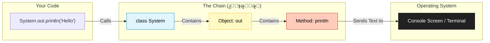
```mermaid
graph LR
    subgraph The_Code ["Your Code"]
        Instruction["System.out.println('Hello')"]
    end

    subgraph The_Chain ["The Chain (ุงู„ุชุณู„ุณู„)"]
        direction TB
        Sys[class System]
        Out[Object: out]
        Method[Method: println]
        
        Sys -->|Contains| Out
        Out -->|Contains| Method
    end

    subgraph The_OS ["Operating System"]
        Console[Console Screen / Terminal]
    end

    Instruction -->|Calls| Sys
    Method -->|Sends Text to| Console

    style Sys fill:#e1f5fe,stroke:#0288d1,color:black
    style Out fill:#fff9c4,stroke:#fbc02d,color:black
    style Method fill:#ffccbc,stroke:#bf360c,color:black
    style Console fill:#212121,stroke:#000,color:white
```

### ๐Ÿ’ก ุงู„ุฎู„ุงุตุฉ (Senior Takeaway)

ููŠ ุงู„ุฌุงูุงุŒ ุงู„ู†ู‚ุทุฉ . ู…ุนู†ุงู‡ุง "ุงุฏุฎู„ ุฌูˆู‡".

System.out.println ุชุชุฑุฌู… ู„ู€:

"ู‡ุงุช ูƒู„ุงุณ System --> ุงุฏุฎู„ ู‡ุงุช ู…ู†ู‡ ุงู„ูƒุงุฆู† out --> ุงุฏุฎู„ ู‡ุงุช ู…ู†ู‡ ุงู„ุฏุงู„ุฉ println ูˆู†ูุฐู‡ุง".

---
### The Birth of a Variable: Declaration ๐Ÿ“ฆ

**(ู…ูŠู„ุงุฏ ุงู„ู…ุชุบูŠุฑ: ุงู„ุฅุนู„ุงู†)**

Java

```java
int num; // this declares a variable called num
```

ุงู„ุณุทุฑ ุฏู‡ ู‡ูˆ ุฃู…ุฑ ู…ุจุงุดุฑ ู„ู†ุธุงู… ุงู„ุชุดุบูŠู„.

- **`int` (Type):** ุจุชู‚ูˆู„ ู„ู„ู€ Java: "ุฃู†ุง ุนุงูŠุฒ ุตู†ุฏูˆู‚ ุญุฌู…ู‡ 32-bitุŒ ูˆู†ูˆุนู‡ ู…ุฎุตุต ู„ู„ุฃุฑู‚ุงู… ุงู„ุตุญูŠุญุฉ ุจุณ (Integer)".
    
- **`num` (Identifier):** ุฏู‡ "ุงู„ุงุณุชูŠูƒุฑ" ุงู„ู„ูŠ ุจุชู„ุฒู‚ู‡ ุนู„ู‰ ุงู„ุตู†ุฏูˆู‚ ุนุดุงู† ุชุนุฑู ุชู†ุงุฏูŠู‡ ุจุนุฏูŠู†.
    
- **ู‚ุงุนุฏุฉ ุงู„ุณูŠู†ูŠูˆุฑ:** ุงู„ุฌุงูุง ู„ุบุฉ **Strongly Typed**. ูŠุนู†ูŠ ู„ูˆ ุญุฌุฒุช ุตู†ุฏูˆู‚ `int`ุŒ ู…ุณุชุญูŠู„ ุชุญุท ููŠู‡ ู†ุต `String` ุฃูˆ ูƒุณุฑ `double`. ุงู„ุตู†ุฏูˆู‚ ุฏู‡ ู„ู„ุฃุฑู‚ุงู… ุงู„ุตุญูŠุญุฉ ูˆูู‚ุท.
    

### The Assignment: Right-to-Left Rule โฌ…๏ธ

**(ุงู„ุชุนูŠูŠู†: ู‚ุงุนุฏุฉ ุงู„ูŠู…ูŠู† ู„ู„ุดู…ุงู„)**

Java

```java
num = 100;
```

ููŠ ุงู„ุฑูŠุงุถูŠุงุชุŒ ุนู„ุงู…ุฉ `=` ู…ุนู†ุงู‡ุง "ูŠุณุงูˆูŠ". ููŠ ุงู„ุจุฑู…ุฌุฉุŒ ู…ุนู†ุงู‡ุง **"ุฎูุฐ ุงู„ู‚ูŠู…ุฉ ุฏูŠ ูˆุญุทู‡ุง ู‡ู†ุงูƒ"**.

- ุงู„ูƒู…ุจูŠูˆุชุฑ ุจูŠู†ูุฐ ุงู„ุณุทุฑ ุฏู‡ ู…ู† **ุงู„ูŠู…ูŠู† ู„ู„ูŠุณุงุฑ**.
    
- ุจูŠุงุฎุฏ ุงู„ู€ `100` (Value).
    
- ูˆูŠุฑูˆุญ ูŠุญุทู‡ุง ุฌูˆู‡ ุงู„ุตู†ุฏูˆู‚ ุงู„ู„ูŠ ุงุณู…ู‡ `num`.
    
- ุงู„ุขู†ุŒ ุฃูŠ ู…ูƒุงู† ููŠ ุงู„ูƒูˆุฏ ู‡ุชูƒุชุจ ููŠู‡ ูƒู„ู…ุฉ `num`ุŒ ุงู„ูƒู…ุจูŠูˆุชุฑ ู‡ูŠุดูˆู ู…ูƒุงู†ู‡ุง `100`.
    

### The Magic Operator: Concatenation `+` ๐Ÿ”—

**(ุงู„ุฒุงุฆุฏ ุงู„ุณุญุฑูŠ)**

Java

```java
System.out.println("This is num: " + num);
```

ู‡ู†ุง ุนู„ุงู…ุฉ ุงู„ู€ `+` ุจุชู„ุนุจ ุฏูˆุฑ ุฌุฏูŠุฏ (Operator Overloading).

- ู„ูˆ ุงู„ู€ `+` ุจูŠู† ุฑู‚ู…ูŠู† โฌ…๏ธ ุจุชุฌู…ุนู‡ู… (Math).
    
- ู„ูˆ ุงู„ู€ `+` ุฌู‡ ุจุนุฏู‡ุง ุฃูˆ ู‚ุจู„ู‡ุง **String** โฌ…๏ธ ุจุชุชุญูˆู„ ู„ู€ **"ู„ุฒู‚" (Concatenation)**.
    
- **ุงู„ู„ูŠ ุจูŠุญุตู„ ููŠ ุงู„ูƒูˆุงู„ูŠุณ:** ุงู„ุฌุงูุง ุจุชุงุฎุฏ ู‚ูŠู…ุฉ `num` (ุงู„ู„ูŠ ู‡ูŠ 100)ุŒ ูˆุชุญูˆู„ู‡ุง ู„ู†ุต "100"ุŒ ูˆุชู„ุฒู‚ู‡ุง ุฌู†ุจ ุงู„ุฌู…ู„ุฉุŒ ูุงู„ู†ุชูŠุฌุฉ ุชุทู„ุน: `This is num: 100`.
    

### Manipulation & Reassignment ๐Ÿ”„

**(ุงู„ุชู„ุงุนุจ ูˆุฅุนุงุฏุฉ ุงู„ุชุนูŠูŠู†)**

Java

```java
num = num * 2;
```

ุฏู‡ ุฃู‡ู… ุณุทุฑ ููŠ ุงู„ุจุฑู†ุงู…ุฌ. ุงู„ุณุทุฑ ุฏู‡ ุจูŠุซุจุช ุฅู† ุงู„ู…ุชุบูŠุฑ ุงุณู…ู‡ "ู…ุชุบูŠุฑ" (Variable) ู„ุฃู†ู‡ ู‚ุงุจู„ ู„ู„ุชุบูŠูŠุฑ.

ุงู„ุชุฑุชูŠุจ ู…ู‡ู… ุฌุฏุงู‹ ู‡ู†ุง:

1. **Fetch:** ุงู„ูƒู…ุจูŠูˆุชุฑ ูŠุฑูˆุญ ุงู„ุฐุงูƒุฑุฉ ูŠุฌูŠุจ ู‚ูŠู…ุฉ `num` ุงู„ู‚ุฏูŠู…ุฉ (100).
    
2. **Calculate:** ูŠุถุฑุจู‡ุง ููŠ 2 (ุงู„ู†ุชูŠุฌุฉ 200).
    
3. **Store:** ูŠุงุฎุฏ ุงู„ู€ 200 ุงู„ุฌุฏูŠุฏุฉุŒ ูˆูŠู…ุณุญ ุงู„ู€ 100 ุงู„ู‚ุฏูŠู…ุฉุŒ ูˆูŠุญุท ู…ูƒุงู†ู‡ุง 200.
    

### `print` vs `println` ๐Ÿ–จ๏ธ

**(ุงู„ูุฑู‚ ุจูŠู† ุงู„ุทุจุงุนุฉ)**

ููŠ ุงู„ูƒูˆุฏ ุงุณุชุฎุฏู…ู†ุง ุงู„ุงุชู†ูŠู†:

- **`println`:** ุงุทุจุน ุงู„ูƒู„ุงู… ูˆุงู†ุฒู„ ุณุทุฑ ุฌุฏูŠุฏ (Enter).
    
- **`print`:** ุงุทุจุน ุงู„ูƒู„ุงู… ูˆุฎู„ูŠูƒ ูˆุงู‚ู ู…ูƒุงู†ูƒ ููŠ ู†ูุณ ุงู„ุณุทุฑ.
    
- ุนุดุงู† ูƒุฏู‡ ุฌู…ู„ุฉ `The value of num * 2 is` ูˆุฌู…ู„ุฉ `200` ุทู„ุนูˆุง ุฌู†ุจ ุจุนุถ ููŠ ุณุทุฑ ูˆุงุญุฏ.
    

### ๐Ÿ“Š ู…ุฎุทุท ุงู„ุฐุงูƒุฑุฉ (Memory Timeline)

ุงู„ู…ุฎุทุท ุฏู‡ ุจูŠูˆุถุญ ุฅุฒุงูŠ ู‚ูŠู…ุฉ ุงู„ุตู†ุฏูˆู‚ `num` ุจุชุชุบูŠุฑ ู…ุน ู…ุฑูˆุฑ ุงู„ูˆู‚ุช ูˆุงู„ุฃุณุทุฑ.

Code snippet

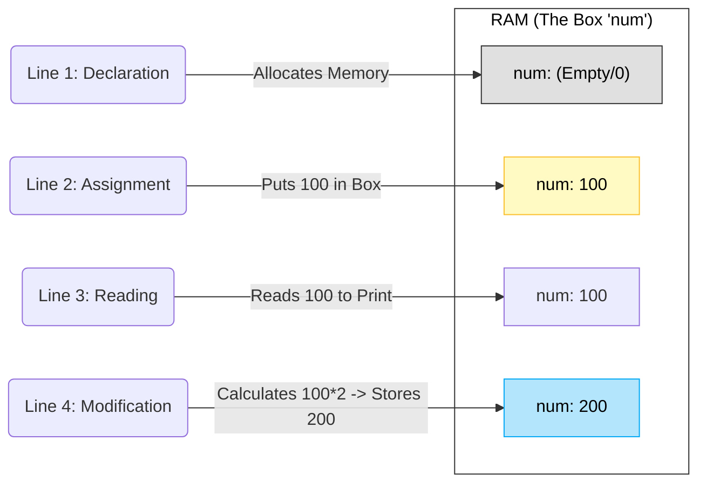
```mermaid
graph LR
    %% States of the Variable
    Step1(Line 1: Declaration)
    Step2(Line 2: Assignment)
    Step3(Line 3: Reading)
    Step4(Line 4: Modification)

    %% Memory Visualization
    subgraph Memory_State ["RAM (The Box 'num')"]
        direction TB
        State1["num: (Empty/0)"]
        State2["num: 100"]
        State3["num: 100"]
        State4["num: 200"]
    end

    %% Flow
    Step1 -->|Allocates Memory| State1
    Step2 -->|Puts 100 in Box| State2
    Step3 -->|Reads 100 to Print| State3
    Step4 -->|Calculates 100*2 -> Stores 200| State4

    %% Styling
    style State1 fill:#e0e0e0,stroke:#333,color:black
    style State2 fill:#fff9c4,stroke:#fbc02d,color:black
    style State4 fill:#b3e5fc,stroke:#03a9f4,color:black
    style Memory_State fill:#fff,stroke:#333,color:black
```

ู†ุตูŠุญุฉ ุณูŠู†ูŠูˆุฑ: ๐Ÿ’ก

ู„ุงุญุธ ุฅู†ู†ุง ุนุฑูู†ุง ุงู„ู…ุชุบูŠุฑ int num; ู…ุฑุฉ ูˆุงุญุฏุฉ ุจุณ ููŠ ุงู„ุฃูˆู„.

ู„ู…ุง ุฌูŠู†ุง ู†ุบูŠุฑ ู‚ูŠู…ุชู‡ ูƒุชุจู†ุง num = ... ุนู„ู‰ ุทูˆู„ ู…ู† ุบูŠุฑ int.

ู„ูˆ ูƒุชุจุช int num = ... ุชุงู†ูŠุŒ ุงู„ูƒูˆู…ุจุงูŠู„ุฑ ู‡ูŠุถุฑุจ Error ูˆูŠู‚ูˆู„ูƒ: Variable 'num' is already defined. ุงู„ุตู†ุฏูˆู‚ ุจูŠุชุญุฌุฒ ู…ุฑุฉ ูˆุงุญุฏุฉ ุจุณ.

---
### 1. ูƒูˆุฏ `IfSample.java` (ุชุชุจุน ุชุบูŠุฑ ุงู„ุญุงู„ุฉ) ๐Ÿšฆ

ุงู„ูƒูˆุฏ ุฏู‡ ุจูŠุนู„ู…ูƒ ุฅู† "ุงู„ุดุฑุท" (Condition) ู†ุชูŠุฌุชู‡ ุจุชุชุบูŠุฑ ู„ู…ุง "ู‚ูŠู…ุฉ ุงู„ู…ุชุบูŠุฑ" ุชุชุบูŠุฑ.

Java

```java
/*
Demonstrate the if. Call this file "IfSample.java".
*/
class IfSample {
    public static void main(String args[]) {
        int x, y;
        
        // 1. ุงู„ุจุฏุงูŠุฉ
        x = 10; 
        y = 20;
        
        // 2. ุงู„ู…ู‚ุงุฑู†ุฉ ุงู„ุฃูˆู„ู‰ (x ุจู€ 10 ูˆ y ุจู€ 20)
        if(x < y) System.out.println("x is less than y");
        
        // 3. ุงู„ุชุบูŠูŠุฑ ุงู„ุฃูˆู„ (x ุงู†ุถุฑุจุช ููŠ 2 ุจู‚ุช 20)
        x = x * 2;
        if(x == y) System.out.println("x now equal to y");
        
        // 4. ุงู„ุชุบูŠูŠุฑ ุงู„ุซุงู†ูŠ (x ุงู†ุถุฑุจุช ููŠ 2 ุจู‚ุช 40)
        x = x * 2;
        if(x > y) System.out.println("x now greater than y");
        
        // 5. ุงู„ุดุฑุท ุงู„ู…ุณุชุญูŠู„ (40 ู„ุง ุชุณุงูˆูŠ 20)
        if(x == y) System.out.println("you won't see this");
    }
}
```

**๐Ÿ” ุชุญู„ูŠู„ ุงู„ุชู†ููŠุฐ (Execution Trace):**

1. **ุงู„ุณุทุฑ 10:** `x=10, y=20`. ู‡ู„ 10 < 20ุŸ **(ู†ุนู…)** โœ….
    
    - _ุงู„ู†ุชูŠุฌุฉ:_ ูŠุทุจุน `x is less than y`.
        
2. **ุงู„ุณุทุฑ 13:** `x` ุงู†ุถุฑุจุช ููŠ 2ุŒ ู‚ูŠู…ุชู‡ุง ุจู‚ุช **20**.
    
3. **ุงู„ุณุทุฑ 14:** ู‡ู„ 20 == 20ุŸ **(ู†ุนู…)** โœ….
    
    - _ุงู„ู†ุชูŠุฌุฉ:_ ูŠุทุจุน `x now equal to y`.
        
4. **ุงู„ุณุทุฑ 17:** `x` ุงู†ุถุฑุจุช ููŠ 2ุŒ ู‚ูŠู…ุชู‡ุง ุจู‚ุช **40**.
    
5. **ุงู„ุณุทุฑ 18:** ู‡ู„ 40 > 20ุŸ **(ู†ุนู…)** โœ….
    
    - _ุงู„ู†ุชูŠุฌุฉ:_ ูŠุทุจุน `x now greater than y`.
        
6. **ุงู„ุณุทุฑ 21:** ู‡ู„ 40 == 20ุŸ **(ู„ุฃ)** โŒ.
    
    - _ุงู„ู†ุชูŠุฌุฉ:_ ูŠุชุฌุงู‡ู„ ุงู„ุณุทุฑ ูˆุงู„ุจุฑู†ุงู…ุฌ ูŠู†ุชู‡ูŠ.
        

---

### 2. ูƒูˆุฏ `ForTest.java` (ุงู„ุฏุงุฆุฑุฉ ุงู„ู…ุบู„ู‚ุฉ) ๐Ÿ”„

ุงู„ูƒูˆุฏ ุฏู‡ ุจูŠูˆุถุญ ุงู„ู€ 3 ุฃุฌุฒุงุก ุจุชูˆุน ุงู„ู„ูˆุจ: (ุงุจุฏุฃ ู…ู†ูŠู†ุŒ ุงู‚ู ุงู…ุชู‰ุŒ ุงู…ุดูŠ ุฅุฒุงูŠ).

Java

```java
/*
Demonstrate the for loop. Call this file "ForTest.java".
*/
class ForTest {
    public static void main(String args[]) {
        int x;
        
        // ุงู„ุจุฏุงูŠุฉ; ุงู„ุดุฑุท; ุงู„ุฎุทูˆุฉ
        for(x = 0; x < 10; x = x + 1)
            System.out.println("This is x: " + x);
    }
}
```

**๐Ÿ” ุชุญู„ูŠู„ ุงู„ู„ูˆุจ (Loop Anatomy):**

- **Initialization (`x = 0`):** ุจุชุญุตู„ ู…ุฑุฉ ูˆุงุญุฏุฉ ููŠ ุงู„ุฃูˆู„. ุงู„ุนุฏุงุฏ ุจูŠุจุฏุฃ ุจู€ ุตูุฑ.
    
- **Condition (`x < 10`):** ุงู„ุณุคุงู„ ุงู„ู„ูŠ ุจูŠุชุณุฃู„ ู‚ุจู„ ูƒู„ ู„ูุฉ. "ู‡ู„ ู„ุณู‡ ู…ูˆุตู„ุชุด ู„ู„ู€ 10ุŸ".
    
- **Iteration (`x = x + 1`):** ุฏูŠ ุงู„ุฎุทูˆุฉ ุงู„ู„ูŠ ุจุชุชู… **ุจุนุฏ** ุงู„ุทุจุงุนุฉ. ุจูŠุฒูˆุฏ 1 ูˆูŠุฑุฌุน ูŠุณุฃู„ ุงู„ุณุคุงู„ ุชุงู†ูŠ.
    

ุงู„ู†ุงุชุฌ (Output):

ู‡ูŠุทุจุน ู…ู† This is x: 0 ู„ุญุฏ This is x: 9.

ุจู…ุฌุฑุฏ ู…ุง ุงู„ู€ x ุชุจู‚ู‰ 10ุŒ ุงู„ุดุฑุท x < 10 ู‡ูŠุจู‚ู‰ FalseุŒ ูˆุงู„ุจุฑู†ุงู…ุฌ ูŠุฎุฑุฌ.

---

### ๐Ÿ“Š ู…ุฎุทุท ุชุชุจุน ุงู„ุฐุงูƒุฑุฉ (Memory Logic)

ุงู„ู…ุฎุทุท ุฏู‡ ุจูŠูˆุถุญู„ูƒ ุฅุฒุงูŠ ู‚ูŠู…ุฉ `x` ุจุชุชุบูŠุฑ ููŠ ูƒูˆุฏ `IfSample` ูˆุชุฃุซูŠุฑู‡ุง ุนู„ู‰ ู‚ุฑุงุฑ ุงู„ู€ `if`.

Code snippet

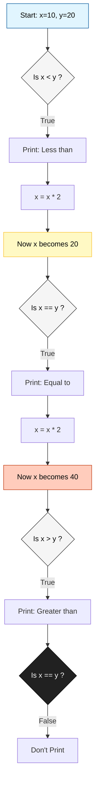
```mermaid
graph TD
    %% ุชุนุฑูŠู ุงู„ุญุงู„ุงุช
    Start[Start: x=10, y=20]
    
    Check1{Is x < y ?}
    Print1[Print: Less than]
    
    Update1[x = x * 2]
    State1[Now x becomes 20]
    
    Check2{Is x == y ?}
    Print2[Print: Equal to]
    
    Update2[x = x * 2]
    State2[Now x becomes 40]
    
    Check3{Is x > y ?}
    Print3[Print: Greater than]
    
    Check4{Is x == y ?}
    DeadEnd[Don't Print]

    %% ุงู„ู…ุณุงุฑ
    Start --> Check1
    Check1 -->|True| Print1
    Print1 --> Update1
    Update1 --> State1
    
    State1 --> Check2
    Check2 -->|True| Print2
    Print2 --> Update2
    Update2 --> State2
    
    State2 --> Check3
    Check3 -->|True| Print3
    Print3 --> Check4
    Check4 -->|False| DeadEnd

    %% ุงู„ุชู†ุณูŠู‚
    style Start fill:#e1f5fe,stroke:#01579b,color:black
    style State1 fill:#fff9c4,stroke:#fbc02d,color:black
    style State2 fill:#ffccbc,stroke:#bf360c,color:black
    style Check1 fill:#f5f5f5,stroke:#333,color:black
    style Check2 fill:#f5f5f5,stroke:#333,color:black
    style Check3 fill:#f5f5f5,stroke:#333,color:black
    style Check4 fill:#212121,stroke:#000,color:white
```
---

### 1. The Logical Unit (ุงู„ูˆุญุฏุฉ ุงู„ู…ู†ุทู‚ูŠุฉ) ๐Ÿ“ฆ

ููŠ ุงู„ุฌุงูุงุŒ ุงู„ู€ `if` ุฃูˆ ุงู„ู€ `for` ุจุทุจูŠุนุชู‡ู… ุจูŠุชุญูƒู…ูˆุง ููŠ **ุณุทุฑ ูˆุงุญุฏ ุจุณ** ุจูŠูŠุฌูŠ ูˆุฑุงู‡ู….

- ู„ูˆ ุนุงูŠุฒู‡ู… ูŠุชุญูƒู…ูˆุง ููŠ 10 ุณุทูˆุฑุŸ ู„ุงุฒู… ุชุญุทู‡ู… ุฌูˆู‡ "ุตู†ุฏูˆู‚".
    
- ุงู„ุตู†ุฏูˆู‚ ุฏู‡ ู‡ูˆ **ุงู„ุฃู‚ูˆุงุณ ุงู„ู…ุนู‚ูˆูุฉ `{ }` (Curly Braces)**.
    

**ุงู„ู‚ุงุนุฏุฉ:**

> "Any place that a single statement can be used, a block can be used."
> 
> (ุฃูŠ ู…ูƒุงู† ูŠู†ูุน ุชุญุท ููŠู‡ ุณุทุฑุŒ ูŠู†ูุน ุชุญุท ููŠู‡ ุจู„ูˆูƒ).

---

### 2. The Trap: Indentation is a Lie ๐Ÿคฅ

**(ุงู„ูุฎ: ุงู„ู…ุณุงูุงุช ูƒุฏุงุจุฉ)**

ููŠ ู„ุบุงุช ุฒูŠ PythonุŒ ุงู„ู…ุณุงูุงุช (Indentation) ุจุชุญุฏุฏ ู…ูŠู† ุชุจุน ู…ูŠู†.

ููŠ JavaุŒ ุงู„ูƒูˆู…ุจุงูŠู„ุฑ ุฃุนู…ู‰ ุนู† ุงู„ู…ุณุงูุงุช. ู‡ูˆ ุจูŠุดูˆู { } ูˆุจุณ.

**ุดูˆู ุงู„ูƒุงุฑุซุฉ ุฏูŠ (ุจุฏูˆู† ุจู„ูˆูƒ):**

Java

```java
if (x < 10)
    y = 5;          // ุงู„ุณุทุฑ ุฏู‡ ุชุจุน ุงู„ู€ if
    z = 10;         // โŒ ู…ุตูŠุจุฉ: ุงู„ุณุทุฑ ุฏู‡ ู‡ูŠุชู†ูุฐ ุฏุงูŠู…ุงู‹ุŒ ุณูˆุงุก ุงู„ุดุฑุท ุตุญ ุฃูˆ ุบู„ุท!
```

ุงู„ูƒู…ุจูŠูˆุชุฑ ุดุงูŠู ุฅู† `z = 10` ุฏูŠ ุจุฑู‡ ุงู„ู€ `if` ุฎุงู„ุตุŒ ุญุชู‰ ู„ูˆ ุฃู†ุช ุฑุงุณู…ู‡ุง ุชุญุชู‡ุง.

**ุงู„ุญู„ (ุจุงู„ุจู„ูˆูƒ):**

Java

```java
if (x < 10) {       // ุจุฏุงูŠุฉ ุงู„ุจู„ูˆูƒ
    y = 5;
    z = 10;         // โœ… ุชู…ุงู…: ุงู„ุณุทุฑ ุฏู‡ ุจู‚ู‰ ู…ุญู…ูŠ ุฌูˆู‡ ุงู„ุตู†ุฏูˆู‚
}                   // ู†ู‡ุงูŠุฉ ุงู„ุจู„ูˆูƒ
```

---

### 3. Senior Insight: Variable Scope (ุนู…ุฑ ุงู„ู…ุชุบูŠุฑ) โณ

**(ุณุฑ ุงู„ุณูŠู†ูŠูˆุฑ)**

ุฃุฎุทุฑ ุญุงุฌุฉ ููŠ ุงู„ู€ Code Block ู…ุด ุจุณ ุงู„ุชุฌู…ูŠุนุŒ ู„ูƒู† **"ุงู„ุฎุตูˆุตูŠุฉ"**.

- ุฃูŠ ู…ุชุบูŠุฑ ุชุนุฑูู‡ ุฌูˆู‡ `{ }`.. **ุจูŠู…ูˆุช** ุจู…ุฌุฑุฏ ู…ุง ุชุฎุฑุฌ ู…ู† ุงู„ู€ `}`.
    
- ุฏู‡ ุจู†ุณู…ูŠู‡ **Block Scope**.
    

Java

```java
if (x > 0) {
    int secret = 100; // ู…ุชุบูŠุฑ ุงุชูˆู„ุฏ ู‡ู†ุง
    System.out.println(secret); // ุดุบุงู„ ุชู…ุงู…
}

// System.out.println(secret); // โŒ Error!
// ุงู„ูƒูˆู…ุจุงูŠู„ุฑ ู‡ูŠู‚ูˆู„ูƒ: ู…ูŠู† secret ุฏู‡ุŸ ุงู„ู…ุชุบูŠุฑ ุฏู‡ ู…ุงุช ุฎู„ุงุต.
```

---

### ๐Ÿ“Š ุงู„ู…ุฎุทุท ุงู„ู‡ู†ุฏุณูŠ (Logic Flow)

ุงู„ู…ุฎุทุท ุฏู‡ ุจูŠูˆุถุญ ุงู„ูุฑู‚ ุงู„ุฌูˆู‡ุฑูŠ ููŠ ุชุฏูู‚ ุงู„ูƒูˆุฏ ุจูŠู† "ุณุทุฑ ูˆุงุญุฏ" ูˆ "ุจู„ูˆูƒ ูƒุงู…ู„".

Code snippet

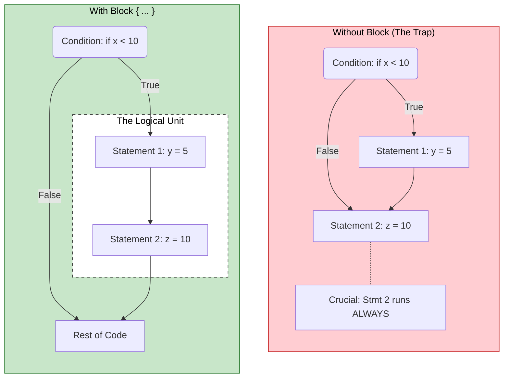
```mermaid
graph TD
    subgraph Scenario_A ["Without Block (The Trap)"]
        direction TB
        Start1(Condition: if x < 10)
        Stmt1[Statement 1: y = 5]
        Stmt2[Statement 2: z = 10]
        
        Start1 -->|True| Stmt1
        Start1 -->|False| Stmt2
        Stmt1 --> Stmt2
        
        Note1[Crucial: Stmt 2 runs ALWAYS]
        Stmt2 -.- Note1
    end

    subgraph Scenario_B ["With Block { ... }"]
        direction TB
        Start2(Condition: if x < 10)
        
        subgraph TheBlock ["The Logical Unit"]
            BlockStmt1[Statement 1: y = 5]
            BlockStmt2[Statement 2: z = 10]
            BlockStmt1 --> BlockStmt2
        end
        
        End2[Rest of Code]
        
        Start2 -->|True| BlockStmt1
        Start2 -->|False| End2
        BlockStmt2 --> End2
    end

    style Scenario_A fill:#ffcdd2,stroke:#c62828,color:black
    style Scenario_B fill:#c8e6c9,stroke:#2e7d32,color:black
    style TheBlock fill:#fff,stroke:#333,stroke-dasharray: 5 5,color:black
```

ุงู„ุฎู„ุงุตุฉ:

ุงู„ู€ { } ู‡ู…ุง "ุงู„ุณูˆุฑ" ุงู„ู„ูŠ ุจูŠุญู…ูŠ ุงู„ูƒูˆุฏ ุจุชุงุนูƒ. ู†ุตูŠุญุฉ ู…ู†ูŠุŒ ุฏุงูŠู…ุงู‹ ุงุณุชุฎุฏู… ุงู„ู€ Blocks ู…ุน if ูˆ for ุญุชู‰ ู„ูˆ ู‡ุชูƒุชุจ ุณุทุฑ ูˆุงุญุฏ ุจุณุŒ ุนุดุงู† ุชุญู…ูŠ ู†ูุณูƒ ู…ู† ุฃุฎุทุงุก ุงู„ู…ุณุชู‚ุจู„.

---
### 1. Whitespace: The Freedom ๐Ÿ•Š๏ธ

**(ุงู„ู…ุณุงูุงุช ุงู„ุจูŠุถุงุก: ุงู„ุญุฑูŠุฉ ุงู„ู…ุทู„ู‚ุฉ)**

ุงู„ุฌุงูุง ู„ุบุฉ **Free-form Language**.

- **ูŠุนู†ูŠ ุฅูŠู‡ุŸ** ูŠุนู†ูŠ ุงู„ุฌุงูุง ู…ุด ุจุชุดูˆู ุงู„ู…ุณุงูุงุชุŒ ูˆู„ุง ุงู„ู€ TabsุŒ ูˆู„ุง ุงู„ุณุทูˆุฑ ุงู„ุฌุฏูŠุฏุฉ (Enter).
    
- **ุงู„ุฏู„ูŠู„:** ุฃู†ุช ู…ู…ูƒู† ุชูƒุชุจ ุงู„ุจุฑู†ุงู…ุฌ ูƒู„ู‡ ููŠ ุณุทุฑ ูˆุงุญุฏ ุทูˆูŠู„ ุฌุฏุงู‹ุŒ ูˆู‡ูŠุดุชุบู„ ุนุงุฏูŠ!
    
- **ุงู„ุณุฑ:** ุงู„ุณุฑ ู‡ูˆ ุงู„ู€ **Semicolon `;`**. ุฏูŠ ุงู„ู„ูŠ ุจุชู‚ูˆู„ ู„ู„ุฌุงูุง "ุงู„ุณุทุฑ ุฎู„ุต"ุŒ ู…ุด ุฒุฑุงุฑ ุงู„ู€ Enter ุฒูŠ ู„ุบุฉ Python.
    
- **ู†ุตูŠุญุฉ:** ุฑุบู… ุฅู† ุงู„ุฌุงูุง ู…ุด ุจุชุฌุจุฑูƒ ุนู„ู‰ ุงู„ุชู†ุณูŠู‚ (Indentation)ุŒ ุจุณ ุฅุญู†ุง ูƒุจุดุฑ ู„ุงุฒู… ู†ู†ุณู‚ ุงู„ูƒูˆุฏ ุนุดุงู† ู†ู‚ุฏุฑ ู†ู‚ุฑุงู‡ (Code Readability).
    

---

### 2. Identifiers: The Naming Game ๐Ÿท๏ธ

**(ุงู„ู…ุนุฑูุงุช: ู„ุนุจุฉ ุงู„ุฃุณู…ุงุก)**

ุงู„ู€ Identifier ู‡ูˆ "ุงู„ุงุณู…" ุงู„ู„ูŠ ุฃู†ุช ุจุชุฏูŠู‡ ู„ุฃูŠ ุญุงุฌุฉ (ุงุณู… ู…ุชุบูŠุฑุŒ ุงุณู… ูƒู„ุงุณุŒ ุงุณู… ุฏุงู„ุฉ).

ุนุดุงู† ุชุฎุชุงุฑ ุงุณู…ุŒ ููŠู‡ ู‚ูˆุงู†ูŠู† ุตุงุฑู…ุฉ (Syntax Rules) ูˆููŠู‡ ุนุฑู (Conventions).

#### ๐Ÿšฆ ุงู„ู‚ูˆุงู†ูŠู† ุงู„ุตุงุฑู…ุฉ (Compiler Rules):

1. **ุงู„ุจุฏุงูŠุฉ:** ู„ุงุฒู… ูŠุจุฏุฃ ุจู€ (ุญุฑู `A-Z`ุŒ ุฃูˆ `_`ุŒ ุฃูˆ `$`). **ู…ู…ู†ูˆุน ูŠุจุฏุฃ ุจุฑู‚ู…**.
    
2. **ุงู„ุจุงู‚ูŠ:** ุจุนุฏ ุงู„ุญุฑู ุงู„ุฃูˆู„ุŒ ู…ู…ูƒู† ุชุญุท ุฃุฑู‚ุงู… ุนุงุฏูŠ.
    
3. **ุงู„ุฑู…ูˆุฒ:** ุงู„ุฑู…ุฒูŠู† ุงู„ูˆุญูŠุฏูŠู† ุงู„ู…ุณู…ูˆุญ ุจูŠู‡ู… ู‡ู…ุง `_` ูˆ `$`. ุฃูŠ ุฑู…ุฒ ุชุงู†ูŠ (`-`, `/`, `@`, `space`) ู…ู…ู†ูˆุน.
    
4. **Case Sensitive:** ุงู„ุฌุงูุง ู„ุบุฉ ุญุณุงุณุฉ ุฌุฏุงู‹. `Value` ุบูŠุฑ `VALUE` ุบูŠุฑ `value`. ุงู„ุชู„ุงุชุฉ ุฏูˆู„ 3 ู…ุชุบูŠุฑุงุช ู…ุฎุชู„ููŠู† ุชู…ุงู…ุงู‹.
    

#### ๐Ÿ›‘ JDK 9 Update (ุชุญุฏูŠุซ ู…ู‡ู… ุฌุฏุงู‹):

ุงู„ุณู„ุงูŠุฏ ุฐูƒุฑ ู†ู‚ุทุฉ ููŠ ุบุงูŠุฉ ุงู„ุฃู‡ู…ูŠุฉ:

> _Beginning with JDK 9, the underscore cannot be used by itself as an identifier._

- **ุฒู…ุงู†:** ูƒุงู† ูŠู†ูุน ุชุณู…ูŠ ู…ุชุบูŠุฑ ูƒุฏู‡: `int _ = 10;`.
    
- **ุฏู„ูˆู‚ุชูŠ:** ู…ู…ู†ูˆุน. ๐Ÿšซ
    
- **ุงู„ุณุจุจ:** ุงู„ุฌุงูุง ุญุฌุฒุช ุงู„ุนู„ุงู…ุฉ ุฏูŠ `_` ู„ุงุณุชุฎุฏุงู…ุงุช ู…ุณุชู‚ุจู„ูŠุฉ ูˆู…ุชู‚ุฏู…ุฉ (ุฒูŠ Lambda Parameters ุฃูˆ Pattern Matching) ุนุดุงู† ุชุนุจุฑ ุนู† "ู…ุชุบูŠุฑ ู…ู‡ู…ู„" (Unnamed Variable).
    

---

### 3. Valid vs. Invalid (ุชุญู„ูŠู„ ุงู„ุฃู…ุซู„ุฉ) ๐Ÿ•ต๏ธโ€โ™‚๏ธ

ุชุนุงู„ ู†ู…ุณูƒ ุงู„ุฃู…ุซู„ุฉ ุงู„ู„ูŠ ููŠ ุงู„ุณู„ุงูŠุฏ ูˆู†ุดูˆู ู„ูŠู‡ ุตุญ ูˆู„ูŠู‡ ุบู„ุท:

|**Identifier**|**ุงู„ุญุงู„ุฉ**|**ุงู„ุณุจุจ (Why?)**|
|---|---|---|
|`AvgTemp`|โœ… **Valid**|ุญุฑูˆู ูู‚ุทุŒ ุจุงุฏุฆุฉ ุจุญุฑู. (ุฏู‡ ุณุชุงูŠู„ ุชุณู…ูŠุฉ ุงู„ูƒู„ุงุณุงุช PascalCase).|
|`count`|โœ… **Valid**|ุญุฑูˆู ุตุบูŠุฑุฉ. (ุฏู‡ ุณุชุงูŠู„ ุงู„ู…ุชุบูŠุฑุงุช camelCase).|
|`a4`|โœ… **Valid**|ููŠู‡ ุฑู‚ู…ุŒ ุจุณ ู…ุด ููŠ ุงู„ุฃูˆู„.|
|`$test`|โœ… **Valid**|ุจุงุฏุฆ ุจู€ `$` (ู…ุณู…ูˆุญุŒ ุจุณ ุบูŠุฑ ู…ูุถู„ ุฅู„ุง ู„ู„ูƒูˆุฏ ุงู„ู…ูˆู„ุฏ ุขู„ูŠุงู‹).|
|`this_is_ok`|โœ… **Valid**|ุงู„ู€ Underscore ู…ุณู…ูˆุญุฉ ูˆุชุณุชุฎุฏู… ู„ู„ูุตู„ (Snake_Case).|
|`2count`|โŒ **Invalid**|**ุจุฏุฃ ุจุฑู‚ู….** ุงู„ูƒูˆู…ุจุงูŠู„ุฑ ู‡ูŠูุชูƒุฑู‡ ุฑู‚ู… 2 ูˆู‡ูŠุชู„ุฎุจุท ู„ู…ุง ูŠู„ุงู‚ูŠ ุญุฑูˆู ุจุนุฏู‡.|
|`high-temp`|โŒ **Invalid**|ุงู„ุนู„ุงู…ุฉ `-` ุฏูŠ ู…ุด ุดุฑุทุฉุŒ ุฏูŠ ุนู„ุงู…ุฉ **ุทุฑุญ (Minus)**. ุงู„ุฌุงูุง ู‡ุชูู‡ู…ู‡ุง `high` ู†ุงู‚ุต `temp`.|
|`Not/ok`|โŒ **Invalid**|ุงู„ุนู„ุงู…ุฉ `/` ุฏูŠ ุนู„ุงู…ุฉ **ู‚ุณู…ุฉ**. ุงู„ุฌุงูุง ู‡ุชูู‡ู…ู‡ุง `Not` ู…ู‚ุณูˆู…ุฉ ุนู„ู‰ `ok`.|

---

### ๐Ÿ“Š ุฎูˆุงุฑุฒู…ูŠุฉ ุงู„ุชุญู‚ู‚ ู…ู† ุงู„ุงุณู… (Naming Logic Flow)

ุฏู‡ ู…ุฎุทุท ูŠูˆุถุญู„ูƒ ุฅุฒุงูŠ ุงู„ูƒูˆู…ุจุงูŠู„ุฑ ุจูŠูุญุต ุงู„ุงุณู… ุญุฑู ุญุฑู ุนุดุงู† ูŠู‚ุฑุฑ ู‡ูˆ Valid ูˆู„ุง ู„ุฃ.

Code snippet

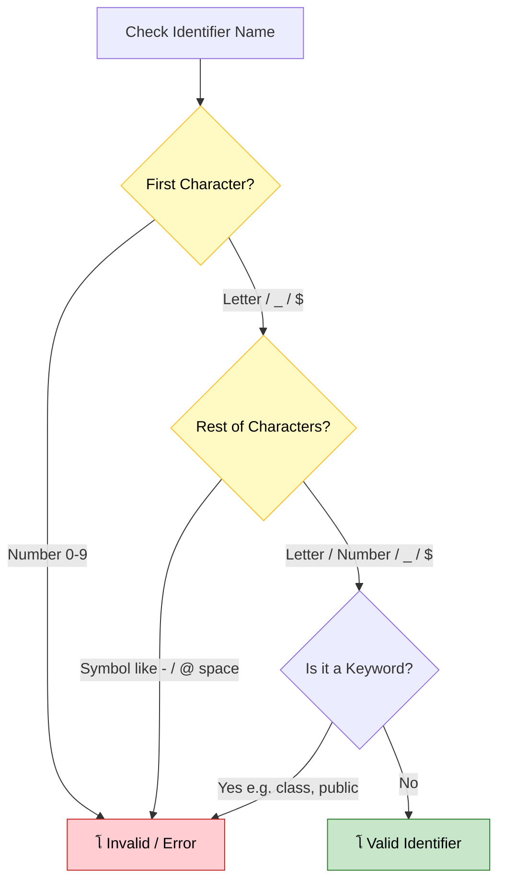
```mermaid
graph TD
    %% 1. Input Node
    Start[Check Identifier Name]
    
    %% 2. Decisions
    CheckFirst{First Character?}
    CheckRest{Rest of Characters?}
    CheckReserved{Is it a Keyword?}
    
    %% 3. Outcomes
    Valid[โœ… Valid Identifier]
    Invalid[โŒ Invalid / Error]

    %% 4. Logic Flow
    Start --> CheckFirst
    
    CheckFirst -->|Number 0-9| Invalid
    CheckFirst -->|Letter / _ / $| CheckRest
    
    CheckRest -->|Symbol like - / @ space| Invalid
    CheckRest -->|Letter / Number / _ / $| CheckReserved
    
    CheckReserved -->|Yes e.g. class, public| Invalid
    CheckReserved -->|No| Valid

    %% 5. Styling
    style Valid fill:#c8e6c9,stroke:#2e7d32,color:black
    style Invalid fill:#ffcdd2,stroke:#c62828,color:black
    style CheckFirst fill:#fff9c4,stroke:#fbc02d,color:black
    style CheckRest fill:#fff9c4,stroke:#fbc02d,color:black
```

### ๐Ÿ’ก Senior Tip (ู†ุตูŠุญุฉ ู…ุญุชุฑู)

ุฑุบู… ุฅู† `_` ูˆ `$` ู…ุณู…ูˆุญูŠู† ููŠ ุงู„ุฃูˆู„ุŒ ุญุงูˆู„ ุชุชุฌู†ุจู‡ู… ููŠ ูƒูˆุฏูƒ ุงู„ุนุงุฏูŠ.

- **`$`**: ุบุงู„ุจุงู‹ ุจุชุณุชุฎุฏู…ู‡ุง ุงู„ู€ Frameworks ูˆุงู„ู€ Inner Classes.
    
- **`_`**: ุจุชุณุชุฎุฏู… ู„ู„ุซูˆุงุจุช (CONSTANTS) ุจุณ ุจุชูƒูˆู† ููŠ ุงู„ู†ุตุŒ ุฒูŠ `MAX_VALUE`.
    

ุฎู„ูŠูƒ ุฏุงูŠู…ุงู‹ ู…ุงุดูŠ ุนู„ู‰ ุงู„ู€ **CamelCase** ู„ู„ู…ุชุบูŠุฑุงุช (ุฒูŠ `myVariable`) ูˆุงู„ู€ **PascalCase** ู„ู„ูƒู„ุงุณุงุช (ุฒูŠ `MyClass`).

---
### 1. Literals: The Raw Data ๐Ÿ’Ž

**(ุงู„ู‚ูŠู… ุงู„ู…ุฌุฑุฏุฉ)**

ูƒู„ู…ุฉ Literal ู…ุนู†ุงู‡ุง "ู‚ูŠู…ุฉ ุตุฑูŠุญุฉ ูˆู…ุจุงุดุฑุฉ" ู…ูƒุชูˆุจุฉ ุฌูˆู‡ ุงู„ูƒูˆุฏ.

ูŠุนู†ูŠ ู„ู…ุง ุชูƒุชุจ int x = 100;... ุงู„ู€ x ุฏู‡ ู…ุชุบูŠุฑุŒ ู„ูƒู† ุงู„ู€ 100 ุฏูŠ Literal.

ุงู„ุณู„ุงูŠุฏ ู…ุฏูŠูƒ 4 ุฃู†ูˆุงุนุŒ ู„ุงุฒู… ุชูุฑู‚ ุจูŠู†ู‡ู… ุฒูŠ ุนูŠู†ูŠูƒ:

|**ุงู„ู†ูˆุน (Type)**|**ุงู„ู…ุซุงู„ (Example)**|**ุงู„ุชูˆุถูŠุญ ุงู„ุณูŠู†ูŠูˆุฑ ๐Ÿง**|
|---|---|---|
|**Integral Literal**<br><br>  <br><br>(ุนุฏุฏ ุตุญูŠุญ)|`100`|ุฃูŠ ุฑู‚ู… ุตุญูŠุญ ุจุชูƒุชุจู‡ุŒ ุงู„ุฌุงูุง ุจุชุนุชุจุฑู‡ `int` ุฃูˆุชูˆู…ุงุชูŠูƒ.|
|**Floating-Point**<br><br>  <br><br>(ุนุฏุฏ ุนุดุฑูŠ)|`98.6`|ุฃูŠ ุฑู‚ู… ููŠู‡ ู†ู‚ุทุฉุŒ ุงู„ุฌุงูุง ุจุชุนุชุจุฑู‡ `double` (ุฏู‚ุฉ ู…ุฒุฏูˆุฌุฉ) ุฃูˆุชูˆู…ุงุชูŠูƒุŒ ู…ุด `float`.|
|**Character Literal**<br><br>  <br><br>(ุญุฑู ูˆุงุญุฏ)|`'X'`<br><br>  <br><br>`'\u03c0'`|**ุฑูƒุฒ ุฌุฏุงู‹:** ู„ุงุฒู… ูŠุชุญุท ุจูŠู† **Single Quotes** `' '`.<br><br>  <br><br>ุงู„ู€ `\u03c0` ุฏู‡ ูƒูˆุฏ **Unicode** ู„ุญุฑู "ุจุงูŠ" (ฯ€). ุงู„ุฌุงูุง ุจุชูู‡ู… ู„ุบุงุช ุงู„ุนุงู„ู… ูƒู„ู‡ุง.|
|**String Literal**<br><br>  <br><br>(ู†ุต)|`"This is a test"`|ู…ุฌู…ูˆุนุฉ ุญุฑูˆู. **ู„ุงุฒู…** ุชุชุญุท ุจูŠู† **Double Quotes** `" "`.|

**๐Ÿšจ ูุฎ ุงู„ู…ุจุชุฏุฆูŠู†:**

- `'A'` ุฏู‡ ุญุฑู (Char) โฌ…๏ธ ุจูŠุงุฎุฏ 2 ุจุงูŠุช.
    
- `"A"` ุฏู‡ ู†ุต (String) โฌ…๏ธ ุฏู‡ ูƒุงุฆู† (Object) ูƒุงู…ู„ ููŠ ุงู„ู…ูŠู…ูˆุฑูŠ.
    
- ู…ุชุฎู„ุทุด ุจูŠู† ุงู„ู€ `'` ูˆุงู„ู€ `"` ุนุดุงู† ุงู„ูƒูˆู…ุจุงูŠู„ุฑ ู‡ูŠุฑูุถ.
    

---

### The Skeleton Builders (ุนุถู… ุงู„ูƒูˆุฏ) ๐Ÿ’€

- **`()` Parentheses (ุงู„ุฃู‚ูˆุงุณ ุงู„ู‡ู„ุงู„ูŠุฉ):**
    
    - ุฏูŠ "ุฃู‚ูˆุงุณ ุงู„ุชุดุบูŠู„" ูˆุงู„ู…ู†ุทู‚.
        
    - ุจุชุชุญุท ููŠู‡ุง ุดุฑูˆุท ุงู„ู€ `if`ุŒ ูˆุจุชุชุญุท ููŠู‡ุง ุงู„ู€ Parameters ูˆุฃู†ุช ุจุชู†ุงุฏูŠ ุฃูŠ ุฏุงู„ุฉ `method()`.
        
- **`{}` Braces (ุงู„ุฃู‚ูˆุงุณ ุงู„ู…ุนู‚ูˆูุฉ):**
    
    - ุฏูŠ "ุฃู‚ูˆุงุณ ุงู„ุญุฏูˆุฏ".
        
    - ุจุชุญุฏุฏ ุงู„ู€ **Scope** (ุงู„ู…ุฌุงู„). ุจุฏุงูŠุฉ ูˆู†ู‡ุงูŠุฉ ุงู„ูƒู„ุงุณุŒ ุงู„ู…ูŠุซูˆุฏุŒ ุฃูˆ ุงู„ู„ูˆุจ.
        
    - ุฃูŠ ู…ุชุบูŠุฑ ูŠุชูˆู„ุฏ ุฌูˆุงู‡ุงุŒ ุจูŠู…ูˆุช ู„ู…ุง ุชุชู‚ูู„.
        
- **`[]` Brackets (ุงู„ุฃู‚ูˆุงุณ ุงู„ู…ุฑุจุนุฉ):**
    
    - ุฏูŠ "ุฃู‚ูˆุงุณ ุงู„ู…ุตููˆูุงุช".
        
    - ุญุตุฑูŠุฉ ู„ู„ู€ Arrays. ุชุนุฑูŠู `int[] x` ุฃูˆ ูˆุตูˆู„ ู„ุนู†ุตุฑ `x[0]`.
        

---

### The Navigation Tools (ุฃุฏูˆุงุช ุงู„ูˆุตูˆู„) ๐Ÿงญ

- **`.` Period (ุงู„ู†ู‚ุทุฉ):**
    
    - ุฏูŠ "ู…ูุชุงุญ ุงู„ุฏุฎูˆู„".
        
    - ู…ุนู†ุงู‡ุง: "ุงุฏุฎู„ ุฌูˆู‡ ุงู„ูƒุงุฆู† ุฏู‡ ูˆู‡ุงุช ู…ู†ู‡ ูƒุฐุง".
        
    - ู…ุซุงู„: `System.out` (ุงุฏุฎู„ ุฌูˆู‡ System ู‡ุงุช out).
        
- **`::` Double Colon (ุงู„ู†ู‚ุทุชูŠู† ุงู„ุฑุฃุณูŠุชูŠู†) - ๐ŸŒŸ (Java 8+):**
    
    - ุฏูŠ ุงุณู…ู‡ุง **Method Reference**.
        
    - ุฏูŠ ุทุฑูŠู‚ุฉ ุญุฏูŠุซุฉ ุฌุฏุงู‹ (Functional Programming).
        
    - ุจุฏู„ ู…ุง ุชู†ุงุฏูŠ ุงู„ู…ูŠุซูˆุฏ ูˆุชู†ูุฐู‡ุงุŒ ุฃู†ุช "ุจุชุดุงูˆุฑ ุนู„ูŠู‡ุง" ุจุณ ุนุดุงู† ุชุจุนุชู‡ุง ู„ุญุฏ ุชุงู†ูŠ ูŠู†ูุฐู‡ุง.
        
    - _ู…ุซุงู„:_ `System.out::println` (ุดุงูˆุฑ ุนู„ู‰ ุฏุงู„ุฉ ุงู„ุทุจุงุนุฉ).
        

---

### The Flow Controllers (ู…ู†ุธู…ูŠู† ุงู„ู…ุฑูˆุฑ) ๐Ÿšฆ

- **`;` Semicolon (ุงู„ูุตู„ุฉ ุงู„ู…ู†ู‚ูˆุทุฉ):**
    
    - ู†ู‚ุทุฉ ุงู„ู†ู‡ุงูŠุฉ. ุงู„ุฌุงูุง ู…ุจุชูู‡ู…ุด ุฅู† ุงู„ุณุทุฑ ุฎู„ุต ุบูŠุฑ ู„ู…ุง ุชุดูˆูู‡ุง.
        
- **`,` Comma (ุงู„ูุตู„ุฉ):**
    
    - ุจุชูุตู„ ุจูŠู† ุงู„ุญุงุฌุงุช ุงู„ู…ุชุดุงุจู‡ุฉ. (ู…ุชุบูŠุฑุงุช ุฌู†ุจ ุจุนุถุŒ ุฃูˆ ู…ุฏุฎู„ุงุช ุฏุงู„ุฉ).
        

---

### The Syntactic Sugar (ุงู„ุฅุถุงูุงุช ุงู„ุณุญุฑูŠุฉ) ๐Ÿฌ

- **`...` Ellipses (ุงู„ุซู„ุงุซ ู†ู‚ุงุท) - (Java 5+):**
    
    - ุฏูŠ ุงุณู…ู‡ุง **Varargs** (Variable Arguments).
        
    - **ุงู„ููƒุฑุฉ:** ุจุชุณู…ุญ ู„ู„ุฏุงู„ุฉ ุชุณุชู‚ุจู„ "ุฃูŠ ุนุฏุฏ" ู…ู† ุงู„ู…ุฏุฎู„ุงุช.
        
    - _ู…ุซุงู„:_ `void printAll(String... texts)`.
        
    - ู…ู…ูƒู† ุชู†ุงุฏูŠู‡ุง ุจู€ `printAll("A")` ุฃูˆ `printAll("A", "B", "C")`. ุงู„ุฌุงูุง ุจุชุญูˆู„ู‡ู… ู„ู…ุตููˆูุฉ ุฃูˆุชูˆู…ุงุชูŠูƒ.
        
- **`@` At Sign (ุนู„ุงู…ุฉ ุงู„ู€ At):**
    
    - _ุชุตุญูŠุญ:_ ุงู„ุณู„ุงูŠุฏ ู…ูƒุชูˆุจ ููŠู‡ "Ampersand"ุŒ ูˆุฏู‡ ุฎุทุฃ ุดุงุฆุน ุฃูˆ ู…ุทุจุนูŠ ููŠ ุงู„ุณู„ุงูŠุฏ. ุงู„ู€ Ampersand ู‡ูŠ `&`. ุฃู…ุง ุงู„ู€ `@` ุงุณู…ู‡ุง "At Sign".
        
    - **ุงู„ูˆุธูŠูุฉ:** ุจุฏุงูŠุฉ **Annotation**.
        
    - ุฏูŠ "ู…ู„ุตู‚ุงุช" ุจุชุชุญุท ุนู„ู‰ ุงู„ูƒูˆุฏ ุนุดุงู† ุชุฏูŠ ู…ุนู„ูˆู…ุงุช ุฅุถุงููŠุฉ ู„ู„ูƒูˆู…ุจุงูŠู„ุฑ.
        
    - _ุฃุดู‡ุฑ ู…ุซุงู„:_ `@Override` (ุจุชู‚ูˆู„ ู„ู„ูƒูˆู…ุจุงูŠู„ุฑ ุชุฃูƒุฏ ุฅู†ูŠ ุจุบูŠุฑ ุฏุงู„ุฉ ู…ูˆุฑูˆุซุฉ ู…ู† ุงู„ุฃุจ).
        

---

### ๐Ÿ“Š ุฎุฑูŠุทุฉ ุงู„ุฑู…ูˆุฒ (The Separators Map)

ู…ุฎุทุท ูŠุฌู…ุนู„ูƒ ุงู„ุฑู…ูˆุฒ ุญุณุจ ูˆุธูŠูุชู‡ุง ููŠ ุจู†ุงุก ุงู„ูƒูˆุฏ:

Code snippet

```mermaid
graph TD
    %% Categories
    Structure[Structure & Scope]
    Access[Access & Reference]
    Control[Control & Metadata]

    %% Symbols
    Braces["{ }  (Scope/Blocks)"]
    Parens["( )  (Logic/Params)"]
    Brackets["[ ]  (Arrays)"]

    Dot[" .  (Member Access)"]
    Ref["::  (Method Reference)"]
    
    Semi[";  (Terminator)"]
    Comma[",  (Separator)"]
    Varargs["... (Varargs)"]
    Annot["@  (Annotation)"]

    %% Connections
    Structure --> Braces
    Structure --> Parens
    Structure --> Brackets

    Access --> Dot
    Access --> Ref

    Control --> Semi
    Control --> Comma
    Control --> Varargs
    Control --> Annot

    %% Styling
    style Structure fill:#bbdefb,stroke:#1976d2,color:black
    style Access fill:#fff9c4,stroke:#fbc02d,color:black
    style Control fill:#c8e6c9,stroke:#2e7d32,color:black
```

### ๐Ÿ’ก Senior Insight (ุณุฑ Varargs)

ุงู„ุฑู…ุฒ ... ู‡ูˆ ููŠ ุงู„ุญู‚ูŠู‚ุฉ ุฎุฏุนุฉ.

ู„ู…ุง ุชูƒุชุจ public void foo(int... numbers)ุŒ ุงู„ูƒูˆู…ุจุงูŠู„ุฑ ุจูŠุญูˆู„ู‡ุง ููŠ ุงู„ุณุฑ ู„ู€ public void foo(int[] numbers).

ุงู„ูุฑู‚ ุงู„ูˆุญูŠุฏ ุฅู†ูƒ ูˆุฃู†ุช ุจุชู†ุงุฏูŠู‡ุง ู…ุด ู…ุถุทุฑ ุชุนู…ู„ new int[] {1, 2}ุŒ ุจุชูƒุชุจ ุงู„ุฃุฑู‚ุงู… ุนู„ู‰ ุทูˆู„ foo(1, 2) ูˆุงู„ุฌุงูุง ุจุชุฎุฏู…ูƒ ูˆุชุญูˆู„ู‡ู… ู„ู€ Array.
---

### ๐Ÿ“Š ุฎุฑูŠุทุฉ ุฐู‡ู†ูŠุฉ ู„ู„ู‚ูŠู… (Literals Taxonomy)

ุฏู‡ ู…ุฎุทุท ูŠู„ู…ู„ูƒ ุฃู†ูˆุงุน ุงู„ู€ Literals ุนุดุงู† ูŠุซุจุชูˆุง ููŠ ุฏู…ุงุบูƒ:

Code snippet

```mermaid
graph TD
    %% Root
    Root["Java Literals"]

    %% Categories
    Num["Numeric Values"]
    Text["Textual Values"]
    Bool["Logical Values"]

    %% Breakdown
    Integer["Integral: 100, -5"]
    Decimal["Floating-Point: 98.6, 3.14"]
    
    Char["Character: 'A', 'u03c0'"]
    Str["String: 'Hello'"]
    
    TF["Boolean: true, false"]

    %% Connections
    Root --> Num
    Root --> Text
    Root --> Bool

    Num --> Integer
    Num --> Decimal
    
    Text --> Char
    Text --> Str
    
    Bool --> TF

    %% Styling
    style Root fill:#212121,stroke:#000,color:white
    style Num fill:#bbdefb,stroke:#1976d2,color:black
    style Text fill:#ffccbc,stroke:#bf360c,color:black
    style Bool fill:#c8e6c9,stroke:#2e7d32,color:black
    style Integer fill:#e3f2fd,stroke:#1565c0,color:black
    style Decimal fill:#e3f2fd,stroke:#1565c0,color:black
    style Char fill:#fbe9e7,stroke:#d84315,color:black
    style Str fill:#fbe9e7,stroke:#d84315,color:black
    style TF fill:#e8f5e9,stroke:#2e7d32,color:black
```

### ๐Ÿ’ก Senior Tip (Unicode Magic)

ุจู…ุง ุฅู†ูƒ ุดูˆูุช \u03c0ุŒ ู„ุงุฒู… ุชุนุฑู ุฅู† ุงู„ุฌุงูุง ุจุชุฏุนู… Unicode.

ูŠุนู†ูŠ ูŠู†ูุน ุชุณู…ูŠ ู…ุชุบูŠุฑ ุจุงู„ุนุฑุจูŠ!

Java

```java
int ู…ุฑุชุจ = 5000; // ุฏู‡ ูƒูˆุฏ valid ุฌุฏุงู‹ ููŠ ุงู„ุฌุงูุง!
char myChar = '\u0041'; // ุฏูŠ ู‡ูŠ ู‡ูŠ ุญุฑู 'A'
```

ุจุณ ุทุจุนุงู‹ ููŠ ุงู„ุดุบู„ ุงู„ุญู‚ูŠู‚ูŠ ุจู†ูƒุชุจ ุฅู†ุฌู„ูŠุฒูŠ ุจุณ ุนุดุงู† ุงู„ุงุญุชุฑุงููŠุฉ (Standardization).

---
### 1. The Forbidden Names Rule ๐Ÿšซ

**(ู‚ุงุนุฏุฉ ุงู„ุฃุณู…ุงุก ุงู„ู…ุญุฑู…ุฉ)**

ุงู„ุณู„ุงูŠุฏ ุจูŠู‚ูˆู„: "cannot be used as identifiers".

ูŠุนู†ูŠ ุจู…ุง ุฅู† ูƒู„ู…ุฉ class ู„ูŠู‡ุง ูˆุธูŠูุฉ ู…ุญุฏุฏุฉุŒ ู…ูŠู†ูุนุด ุชูŠุฌูŠ ุฃู†ุช ูˆุชุณู…ูŠ ู…ุชุบูŠุฑ:

int class = 10; // โŒ ุฎุทุฃ ู‚ุงุชู„! ุงู„ูƒูˆู…ุจุงูŠู„ุฑ ู‡ูŠุชู„ุฎุจุท ูˆู…ุด ู‡ูŠูู‡ู….

ุงู„ุงุณุชุซู†ุงุก ุงู„ุฐูƒูŠ (Context-Sensitive - JDK 9):

ุงู„ุณู„ุงูŠุฏ ุฐูƒุฑ ุฅู† ููŠู‡ ูƒู„ู…ุงุช ุฌุฏูŠุฏุฉ ุฎุงุตุฉ ุจุงู„ู€ Modules (ุฒูŠ module, exports, requires).

- ุงู„ูƒู„ู…ุงุช ุฏูŠ **"ุฐูƒูŠุฉ"**. ู‡ูŠ ุจุชุดุชุบู„ ูƒู€ Keywords ุจุณ ุฌูˆู‡ ู…ู„ู `module-info.java`.
    
- ู„ูƒู† ููŠ ุงู„ูƒูˆุฏ ุงู„ุนุงุฏูŠุŒ ู„ูˆ ุญุจูŠุช ุชุณู…ูŠ ู…ุชุบูŠุฑ `int module = 5;`.. ุงู„ุฌุงูุง ู‡ุชุณู…ุญู„ูƒ (ุนุดุงู† ุงู„ุชูˆุงูู‚ ู…ุน ุงู„ุฃูƒูˆุงุฏ ุงู„ู‚ุฏูŠู…ุฉ)ุŒ ุจุณ ุฏู‡ ุทุจุนุงู‹ **Bad Practice**.
    

---

### 2. The Ghosts: `const` & `goto` ๐Ÿ‘ป

**(ุงู„ุฃุดุจุงุญ ุงู„ู…ุญุฌูˆุฒุฉ)**

ุงู„ุณู„ุงูŠุฏ ุจูŠู‚ูˆู„: _"reserved but not used"_.

- **ู„ูŠู‡ ู…ูˆุฌูˆุฏูŠู†ุŸ** ุฏูˆู„ ูƒุงู†ูˆุง ู…ูˆุฌูˆุฏูŠู† ููŠ C++.
    
- **ู„ูŠู‡ ู…ุด ุดุบุงู„ูŠู†ุŸ** ูุฑูŠู‚ ุงู„ุฌุงูุง ุดุงู ุฅู† `goto` ุจุชุนู…ู„ ูƒูˆุฏ ุณุจุงุฌูŠุชูŠ (Spaghetti Code) ูˆุชุฎู„ูŠ ุงู„ุจุฑู†ุงู…ุฌ ุตุนุจ ุงู„ุชุชุจุนุŒ ูู‚ุฑุฑูˆุง ูŠู„ุบูˆู‡ุง.
    
- **ู„ูŠู‡ ุญุฌุฒูˆู‡ุงุŸ** ุนุดุงู† ูŠู…ู†ุนูˆุง ู…ุจุฑู…ุฌูŠู† C++ ุฅู†ู‡ู… ูŠุณุชุฎุฏู…ูˆู‡ุง ุจุงู„ุบู„ุทุŒ ูˆูƒู…ุงู† ุนุดุงู† ู„ูˆ ู‚ุฑุฑูˆุง ูŠุถูŠููˆู‡ุง ููŠ ุงู„ู…ุณุชู‚ุจู„ (ูˆุฏู‡ ู…ุญุตู„ุด ุจู‚ุงู„ู‡ 30 ุณู†ุฉ).
    
- **ุงู„ุฎู„ุงุตุฉ:** ู„ูˆ ูƒุชุจุช `goto` ููŠ ุงู„ูƒูˆุฏุŒ ุงู„ูƒูˆู…ุจุงูŠู„ุฑ ู‡ูŠุฏูŠูƒ ErrorุŒ ู…ุด ุนุดุงู† ู‡ูŠ ู…ุด ู…ูˆุฌูˆุฏุฉุŒ ู„ูƒู† ุนุดุงู† ู‡ูŠ "ู…ู…ู†ูˆุนุฉ".
    

---

### 3. The VIP Guests: `true`, `false`, `null` ๐ŸŽฉ

**(ุงู„ุถูŠูˆู ุงู„ู…ู‡ู…ูŠู†)**

ุงู„ุณู„ุงูŠุฏ ุจูŠู‚ูˆู„: "In addition to the keywords...".

ุชู‚ู†ูŠุงู‹ุŒ ุงู„ุชู„ุงุชุฉ ุฏูˆู„ ู…ุด KeywordsุŒ ุฏูˆู„ ุงุณู…ู‡ู… Literals (ู‚ูŠู… ุซุงุจุชุฉ).

- ุจุณ ุจูŠุชุนุงู…ู„ูˆุง ู†ูุณ ุงู„ู…ุนุงู…ู„ุฉ: **ู…ุญุฌูˆุฒูŠู†**.
    
- ู…ูŠู†ูุนุด ุชุณู…ูŠ ู…ุชุบูŠุฑ ุงุณู…ู‡ `true`.
    
- `boolean true = false;` // โŒ ู…ุณุชุญูŠู„.
    

---

### ๐Ÿ“Š ุชุตู†ูŠู ุงู„ูƒู„ู…ุงุช (Mental Map)

ุจุฏู„ ู…ุง ุชุญูุธ ุงู„ู€ 61 ูƒู„ู…ุฉ ูˆุฑุง ุจุนุถุŒ ุงู„ุณูŠู†ูŠูˆุฑ ุจูŠู‚ุณู…ู‡ู… ููŠ ุฏู…ุงุบู‡ ู„ู…ุฌู…ูˆุนุงุช ูˆุธูŠููŠุฉ.

ุนู…ู„ุชู„ูƒ ุฎุฑูŠุทุฉ ุฐู‡ู†ูŠุฉ ุชู„ู…ู‡ู… ุนุดุงู† ู…ูŠุชู†ุณูˆุด:

Code snippet

```mermaid
mindmap
  root((Java Keywords))
    Primitives & Void
      int
      byte
      char
      boolean
      void
    Flow Control
      if
      else
      switch
      for
      break
      return
    OOP & Objects
      class
      interface
      extends
      new
      this
      super
    Modifiers
      public
      private
      static
      final
      abstract
    Exceptions
      try
      catch
      throw
      finally
    The Ghosts
      goto
      const
    Modules JDK9
      module
      requires
      exports
```

### ๐Ÿ’ก Senior Insight

ูƒู„ู…ุฉ strictfp ุงู„ู„ูŠ ููŠ ุงู„ู‚ุงุฆู…ุฉ ุฏูŠ ู†ุงุฏุฑุงู‹ ู…ุง ุญุฏ ุจูŠุณุชุฎุฏู…ู‡ุง.

ุฏูŠ ุงุฎุชุตุงุฑ ู„ู€ Strict Floating Point.

ูˆุธูŠูุชู‡ุง ุฅู†ู‡ุง ุชุฌุจุฑ ุงู„ุนู…ู„ูŠุงุช ุงู„ุญุณุงุจูŠุฉ ุงู„ุนุดุฑูŠุฉ (Double/Float) ุฅู†ู‡ุง ุชุทู„ุน ู†ูุณ ุงู„ู†ุงุชุฌ ุจุงู„ู…ู„ู„ูŠ ุนู„ู‰ ุฃูŠ ุฌู‡ุงุฒ (Windows, Mac, Linux). ู…ู† ุบูŠุฑู‡ุงุŒ ู…ู…ูƒู† ุชู„ุงู‚ูŠ ูุฑูˆู‚ุงุช ุจุณูŠุทุฉ ุฌุฏุงู‹ ููŠ ุงู„ูƒุณูˆุฑ ุจุณุจุจ ุงุฎุชู„ุงู ุงู„ุจุฑูˆุณูŠุณูˆุฑ.