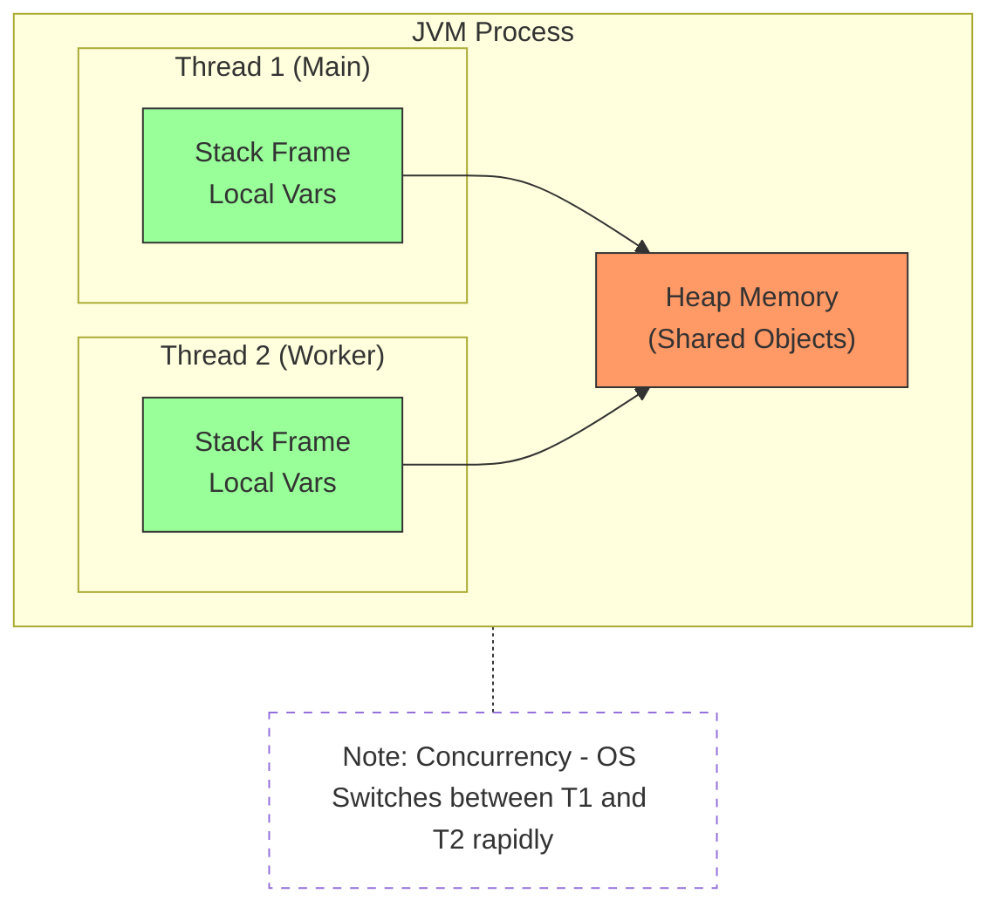
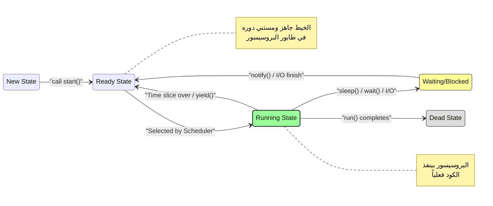
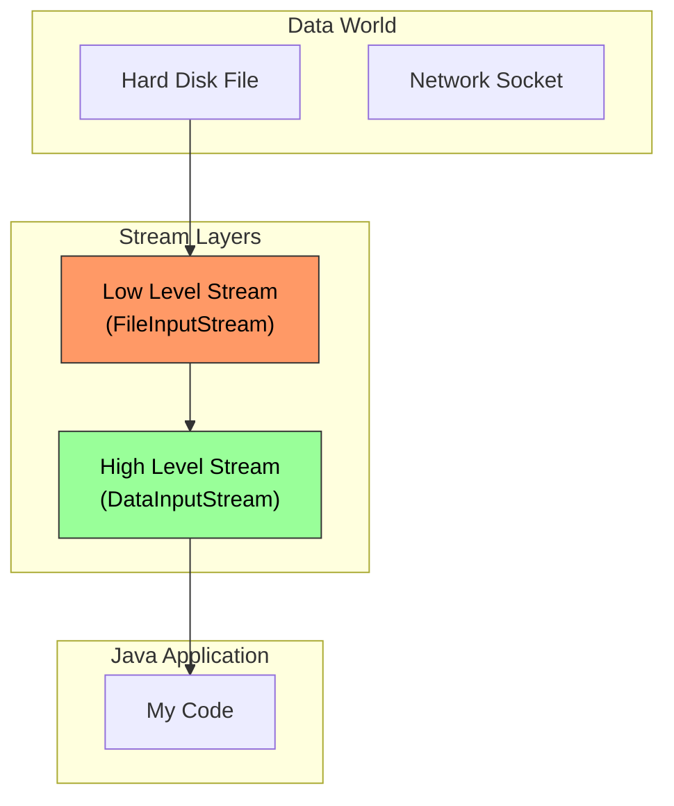

# Lesson 10: Multi-Threading in Java

**(Slides 473 - 493)**

> [!ABSTRACT] **خريطة الطريق**
> 
> 1. **المفهوم (The Concept):** يعني إيه Thread؟ وإيه الفرق بين Concurrency و Parallelism؟
> 2. **استراتيجيات الإنشاء (Creation Strategies):** الخناقة بين `extends Thread` و `implements Runnable`.
> 3. **تطور الكود (Code Evolution):** دراسة حالة `DateTimeApp` من الطريقة القديمة (Legacy) للطريقة الحديثة (Lambda).

---

## 1. What is a Thread? (التشريح الداخلي)

**(Slides 473 - 477)**

### 📖 المفهوم العميق (Deep Dive)

الـ Thread هو أصغر وحدة معالجة (Unit of Execution) جوه البروسيس. أي برنامج Java بيقوم، الـ JVM بيعمل على الأقل 2 Threads:

1. **Main Thread:** ده اللي بيبدأ ينفذ `public static void main`.
2. **Garbage Collector Thread:** ده شغال في الخلفية بينضف الميموري (Daemon Thread).

> [!WARNING] **معلومة سينيور:** الـ Threads بتشارك الـ **Heap Memory** (يعني بيشوفوا نفس الأوبجيكتس)، لكن كل Thread ليه **Stack** خاص بيه (Local Variables & Method Calls). دي نقطة القوة (سرعة تبادل البيانات) ونقطة الضعف (Thread Safety Issues).

### 📊 المخطط الهندسي (JVM Memory Model)



- **Concurrency vs Parallelism (Slide 475):**
    - لو عندك CPU واحد، الـ OS بيعمل **Context Switching** (يوقف ده ويشغل ده) بسرعة رهيبة عشان يوهمك إنهم شغالين مع بعض. ده اسمه **Concurrency**.
    - لو عندك Multi-Core CPU، الـ Threads بتشتغل فعلياً في نفس الوقت. ده اسمه **Parallelism**.

---

## 2. Thread Handling API (أدوات التحكم)

**(Slide 478)**

الجافا بتديك أدوات تتحكم في الـ Threads، بس خد بالك فيه "ألغام".

|Class|Method|Description & Senior Notes 🧠|
|:--|:--|:--|
|**`Thread`**|`start()`|**أهم ميثود.** دي اللي بتكلم الـ OS عشان يحجز Thread حقيقي.|
|**`Thread`**|`run()`|ده الكود اللي هيتنفذ. **إوعى تناديها بنفسك!** لو ناديتها هتبقى Method call عادية مش Thread جديد.|
|**`Thread`**|`sleep(ms)`|بتنيم الـ Thread وتقول للـ Scheduler "شوف غيري دلوقتي".|
|**`Thread`**|`stop()`, `suspend()`, `resume()`|**⛔ Deprecated!** ممنوع استخدامهم نهائياً لأنهم بيعملوا Deadlocks ومشاكل في الـ Lock Release.|
|**`Object`**|`wait()`, `notify()`|بيستخدموا للتنسيق بين الـ Threads (Communication).|

---

## 3. How to Create Threads? (استراتيجيات الإنشاء)

**(Slides 479 - 485)**

عندنا طريقتين عشان نعمل Thread في الجافا. والفرق بينهم معماري بحت.

### Strategy 1: Extending `Thread` Class

**(Slides 480 - 481)**

دي الطريقة المباشرة، بس مش الأفضل معمارياً.

#### 💻 تشريح الكود (Slide 481)

```java
// 1. Define a class that extends Thread
public class MyThread extends Thread {
    // 2. Override run() -> This is the "Job" description
    public void run() {
        // ... write the job here
        System.out.println("Running in a separate thread");
    }
}

// 3. Usage
public void anyMethod() {
    // 3.a Create the object
    MyThread th = new MyThread();

    // 3.b Call start() -> Magic happens here!
    th.start();
}
```

- **`class MyThread extends Thread`**: هنا ربطت الـ Business Logic بالـ Threading Mechanism (Coupling).
- **`th.start()`**: الجافا هنا بتطلب من الـ OS يعمل Native Thread، وبعدين الـ OS ينده `run()`.

### Strategy 2: Implementing `Runnable` Interface

**(Slides 482 - 483)**

دي الطريقة الاحترافية (Design Pattern: Strategy Pattern).

#### 💻 تشريح الكود (Slide 483)

```java
// 1. Define the Task (Separation of Concerns)
class MyTask implements Runnable {
    // 2. Override run()
    public void run() {
        // ... write the job here
    }
}

// 3. Usage
public void anyMethod() {
    // 3.a Create the Task object (The Job)
    MyTask task = new MyTask();

    // 3.b Create the Worker (The Thread) and give it the Job
    Thread th = new Thread(task);

    // 3.c Kickoff
    th.start();
}
```

### 🌍 في سوق العمل (Production Reality)

**(Slides 484 - 485)** ليه بنفضل `Runnable` عن `extends Thread`؟

1. **Composition over Inheritance:** الجافا لا تدعم Multiple Inheritance. لو عملت `extends Thread`، كلاسك مش هيقدر يورث من أي كلاس تاني (زي `JFrame` مثلاً).
2. **Separation of Concerns:** الـ `Runnable` بيمثل "الشغلانة" (Job)، والـ `Thread` بيمثل "العامل" (Worker). ممكن نفس الـ Job تديها لـ Thread Pool ينفذها.

---

## 4. Case Study: DateTimeApplication (تطور الكود عبر الزمن)

**(Slides 486 - 493)**

المثال ده عبقري لأنه بيوريك إزاي الكود اتطور من الشكل البدائي للشكل الحديث (Java 8). **الهدف:** تطبيق GUI بيعرض الساعة وبتتحدث كل ثانية في الخلفية.

### المرحلة 1: الطريقة القديمة (Bad Practice)

**(Slide 486)** هنا الكلاس بيعمل كل حاجة: هو `JFrame` (واجهة)، وهو `Runnable` (تاسك).

```java
// Class extends JFrame AND implements Runnable (Mixing concerns)
public class DateTimeApp extends JFrame implements Runnable {
    Thread th;
    Date d = new Date();

    public DateTimeApp() {
        this.setTitle(d.toString()); // Set initial title
        // "this" refers to the App itself which is Runnable
        th = new Thread(this);
        th.start(); // Start the background thread
    }

    // The logic running in the background
    public void run() {
        while(true) { // Infinite Loop
            d = new Date();
            this.setTitle(d.toString()); // Update UI
            try {
                Thread.sleep(1000); // Pause for 1 second
            } catch (Exception e) { ... }
        }
    }
}
```

- **المشكلة:** الكلاس ده "بتاع كله". صعب تعمل Unit Test للـ Logic لوحده.

### المرحلة 2: استخدام Inner Class

**(Slide 487)** فصلنا الـ Thread Logic في كلاس داخلي `DateTimeThread`.

```java
public class DateTimeApp extends JFrame {
    // ... setup code
    public DateTimeApp() {
        // ...
        // We create an instance of the Inner Class
        this.setTitle(d.toString());
        th = new Thread(new DateTimeThread());
        th.start();
    }
	public static void main(String[] args){
		DateTimeApp app = new DateTimeApp();
		app.setBounds(50,50,600,400);
		app.setVisible(true);
	}
    // Inner Class: Can access Outer Class members (like setTitle)
    class DateTimeThread implements Runnable {
        public void run() {
            while(true) {
                d = new Date();
                // Accessing method of the Outer Class
                DateTimeApp.this.setTitle(d.toString());
				Thread.sleep(1000); // you’ll need to catch an exception here
            }
        }
    }
}
```

- **التحسن:** Encapsulation أفضل. الـ `DateTimeApp` بقى نضيف شوية.

### المرحلة 3: Anonymous Inner Class

**(Slide 488)** بدل ما نعمل كلاس كامل ونسميه، هنعمل كلاس "مجهول الهوية" في مكانه. دي كانت الطريقة الشائعة قبل Java 8.

```java
public DateTimeApp() {
    this.setTitle(d.toString());

    // Creating Runnable "on the fly"
    th = new Thread(new Runnable() {
        public void run() {
            while(true) {
                d = new Date();
                DateTimeApp.this.setTitle(d.toString());
                try { Thread.sleep(1000); } catch(...) {}
            }
        }
    }); // End of anonymous class

    th.start();
}
```

- **المشكلة:** الكود شكله "مجعلك" (Boilerplate code كتير).

### المرحلة 4: Java 8 Lambda Expression (The Modern Way) 🚀

**(Slide 489)** بما إن `Runnable` هو **Functional Interface** (فيه ميثود واحدة `run`)، نقدر نستخدم الـ Lambda.

```java
public DateTimeApp() {
    this.setTitle(d.toString());

    // Lambda Expression: () -> { body }
    // No need to write "new Runnable", "public void run"
    th = new Thread(() -> {
        while(true) {
            d = new Date();
            DateTimeApp.this.setTitle(d.toString());
            try { Thread.sleep(1000); } catch(...) {} // Still need try-catch
        }
    });

    th.start();
}
```

- **الميزة:** كود أنظف بكتير، مقروء، و Direct to the point.

### Final Complete Code (النسخة النهائية)

**(Slides 491 - 493)** ده الشكل النهائي للكلاس بعد التظبيط، وفصل الـ UI Components.

```java
public class DateTimeApp extends JFrame implements Runnable {
    Thread th;
    Date d = new Date();
    JLabel timeLabel = new JLabel(); // UI Component to show time

    public DateTimeApp() {
        this.setTitle("Date & Time Frame Application");

        // UI Setup
        timeLabel.setHorizontalAlignment(JLabel.CENTER);
        timeLabel.setText(d.toString());
        this.add(timeLabel, BorderLayout.CENTER);

        // Thread creation
        th = new Thread(this);
        th.start();
    }

    public static void main(String[] args) {
        DateTimeApp app = new DateTimeApp();
        app.setBounds(50, 50, 600, 400);
        app.setVisible(true);
    }

    // The Background Task
    public void run() {
        while(true) {
            d = new Date(); // Update Data
            timeLabel.setText(d.toString()); // Update View
            try {
                Thread.sleep(1000); // Wait
            } catch (InterruptedException e) {
                // Good practice: Handle interruption
            }
        }
    }
}
```

![[Screenshot from 2025-12-13 15-53-01.png]]
 
> [!NOTE] **Senior Architecture Note:** في تطبيقات الـ Swing الحقيقية، تعديل الـ UI (زي `timeLabel.setText`) من Thread خارجي يعتبر **Not Thread-Safe**. الصح نستخدم `SwingUtilities.invokeLater(...)`. بس في المثال التعليمي ده (Slide 493)، هو بيوريك الفكرة الأساسية للـ Concurrency.

---

> [!success] **Checkpoint: Slides 473-493** إحنا كده غطينا:
> 
> 1. أساسيات الـ Threading والفرق بينه وبين الـ Parallelism.
> 2. طرق الإنشاء (Inheritance vs Composition).
> 3. تطور كتابة الـ Thread Code وصولاً للـ Lambdas.
> 4. تطبيق عملي `DateTimeApp`.
> 
> **المحطة الجاية:** هنبدا في **Slide 494** بعنوان **Thread Life Cycle** (دورة حياة الـ Thread من المهد إلى اللحد).
> 
> جاهز نكمل؟ 🚦

---


# Lesson 10 (Part 2): Thread Life Cycle

**(Slide 494)**

### 🧠 المفهوم العميق (Deep Dive)

الـ Thread مش مجرد `start()` وخلصنا. الـ Thread عامل زي الكائن الحي، بيمر بمراحل (States). الـ JVM والـ OS Scheduler هما اللي بيتحكموا في التنقل بين المراحل دي. فهمك للمراحل دي هو اللي هيخليك تعرف تحل مشاكل الـ Deadlocks والـ Starvation.

### 🔄 دورة الحياة (The Life Cycle)

أي Thread في الجافا بيمر بالمراحل دي:

1. **New (Ready):** لما تعمل `new Thread()`. هنا هو مجرد Object في الميموري، لسه الـ OS ميعرفش عنه حاجة كـ Process شغالة.
2. **Runnable (Selected by Scheduler):** لما تنادي `start()`. هنا الـ JVM بيقول للـ OS: "أنا جاهز، لما يجيلي دور على الـ CPU شغلني".
3. **Running:** دي اللحظة اللي الـ CPU بيبدأ ينفذ فيها الكود اللي جوه `run()`.
4. **Waiting/Blocked/Sleeping:** هنا الـ Thread لسه عايش، بس "مريح" شوية (يا إما نايم `sleep`، يا إما مستني I/O، يا إما مستني Thread تاني يخلص).
5. **Dead (Terminated):** لما ميثود `run()` تخلص تنفيذ، أو يحصل Exception يموته.

### 📊 المخطط الهندسي (Life Cycle Diagram)

بناءً على الرسمة الموجودة في **Slide 494**:



### 💣 تحذيرات السينيور (Senior Warnings)

- **`stop()` (Deprecated):** السلايد بتقولك إنها Deprecated. إوعى تستخدمها لأنها بتموت الـ Thread فجأة وممكن تسيب الداتا في حالة مش مستقرة (Corrupted State).
- **`yield()`:** دي بتقول للـ Scheduler "لو فيه حد تاني عايز يشتغل، خليه يشتغل وأنا هرجع للـ Ready Queue". بس خد بالك، مفيش ضمان إن الـ Scheduler هيسمع كلامك.

---

### 💻 تطبيقات عملية (Assignments)

**(Slides 495 - 498)** السلايدز بتديك أفكار مشاريع عشان تجرب الـ Threading:

1. **Digital Clock:** ثريد بيصحى كل ثانية (`sleep(1000)`) يحدث الوقت على الشاشة.
2. **Text Banner:** شريط أخبار بيتحرك (Marquee). الثريد بيغير الـ X, Y coordinates للنص ويرسمه تاني بسرعة.
3. **Bouncing Ball:** كرة بتتحرك وتخبط في الحيطان. محتاج ثريد يحسب الفيزياء ويرسم الحركة.

---

# Appendix 1: Input and Output Streams

**(Slides 501 - End)**

من أول هنا هندخل في عالم الـ **I/O**. يعني إزاي الجافا بتكلم العالم الخارجي.

## 1. فلسفة الـ Streams (الأنابيب)

**(Slide 502)**

### 📖 المفهوم

كلمة **Stream** معناها "مجرى" أو "تدفق". تخيل إن الداتا دي "مية".

- **Data Source:** الخزان (ممكن يكون ملف على الهارد، كيبورد، أو سيرفر على النت).
- **Java Program:** الحنفية اللي بتستقبل المية.
- **Stream:** الماسورة اللي بتوصل بينهم.

ميزة الـ Stream إنك مش لازم تحمل الملف كله في الرامات (Imagine reading a 10GB movie). أنت بتفتح "ماسورة" وتسحب بايت بايت.

### 📊 المخطط المعماري (High vs Low Level)

**(Slides 502 - 503)**

الجافا بتقسم الـ Streams لنوعين بيتركبوا فوق بعض:



- **Low Level Stream:** دي الماسورة الخام. متوصلة مباشرة بالـ Hardware (الهارد ديسك). بتفهم بس في الـ Raw Bytes (أصفار وحايد).
- **High Level Stream:** دي "فلتر" بيركب فوق الماسورة الخام. بيفهم في الـ Data Types (يعني يعرف يقرأ `int` كامل، أو `String` كامل) بدل ما تقعد تجمع بايتس بإيدك.

---

## 2. Low Level vs High Level Classes

**(Slides 504 - 505)**

### 🛠️ Low Level Streams (العمال)

دول اللي بيشيلوا الطوب والزلط (Bytes & Chars).

- **Byte Oriented:** `FileInputStream`, `FileOutputStream` (للملفات الصوتية، الصور، الفيديوهات).
- **Character Oriented:** `FileReader`, `FileWriter` (للملفات النصية txt, xml, json).

### 🛠️ High Level Streams (المهندسين)

دول بياخدوا شغل العمال وينظموه.

- `DataInputStream`, `DataOutputStream`: عشان تقرأ وتكتب Primitive Types (`int`, `double`).
- `ObjectInputStream`: عشان تقرأ Objects كاملة (Serialization).

---

## 3. التعامل مع الملفات (The File Class)

**(Slide 506)**

الـ Class ده `java.io.File` مش بيمثل "محتوى" الملف، هو بيمثل "عنوان" الملف (Metadata).

### 💻 أهم الميثودز (Method Anatomy)

- **`exists()`**: هل الملف ده موجود أصلاً؟
- **`isDirectory()`**: هل ده فولدر ولا ملف؟
- **`length()`**: حجم الملف بالبايت.
- **`delete()`**: امسح الملف.
- **`mkdir()`**: اعمل فولدر جديد.

> [!NOTE] الـ `File` class ملوش دعوة بالقراءة والكتابة. هو بس مدير ملفات (File Manager).

---

## 4. Byte Streams: FileInputStream & FileOutputStream

**(Slides 507 - 508)**

دول الأساس اللي بنبني عليه أي I/O للبيانات الخام (Raw Data).

### `FileInputStream` (الحنفية)

- **Constructor:** بياخد مسار الملف `String path` أو أوبجيكت `File`.
- **`read()`**: بترجع `int` بيمثل البايت اللي عليه الدور. لو رجعت `-1` يبقى الملف خلص.
- **`read(byte[] b)`**: دي أسرع بكتير (Buffer). بتقول للديسك "هاتلي 1024 بايت مرة واحدة" بدل ما تروح وتيجي كل شوية.

### `FileOutputStream` (البلوعة)

- **`write(int b)`**: بتكتب بايت واحد.
- **`write(byte[] b)`**: بتكتب مصفوفة بايتس كاملة.
- **`flush()`**: مهمة جداً! بتجبر الـ OS إنه يكتب الداتا من الرامات للهارد حالاً (عشان لو النور قطع الداتا متضيعش).

---

## 5. Character Streams: FileReader & FileWriter

**(Slide 509)**

### 🧠 ليه عملوا دول؟

الـ `FileInputStream` بيقرأ بايت (8 bits). بس الحروف (زي العربي والـ Unicode) ممكن تكون 16 bits. لو قرأت العربي بايت-بايت الحروف هتطلع "مخرفنة" (Garbage). عشان كدة `FileReader` بيقرأ **Characters** وبيظبط الـ Encoding أوتوماتيك.

---

## 6. RandomAccessFile (المسجل)

**(Slide 510)**

ده كلاس "الجوكر". هو الوحيد اللي ينفع يقرأ ويكتب في نفس الوقت، وينفع ينط (Jump) لأي مكان في الملف.

- **Modes:**
    - `"r"`: قراءة فقط.
    - `"rw"`: قراءة وكتابة.
- **`seek(long pos)`**: حرك "الإبرة" بتاعت القراءة للمكان رقم كذا (مثلاً فوت أول 100 بايت).
- **`getFilePointer()`**: إحنا واقفين فين دلوقتي؟

---

## 7. Data Streams (Processing Primitives)

**(Slides 511 - 512)**

لو عايز تكتب رقم `1000` في ملف.

- بالـ `FileOutputStream`: لازم تحوله لـ Bytes بإيدك وتقسمه.
- بالـ `DataOutputStream`: بتنادي `writeInt(1000)` وهو يتصرف.

**أهم الميثودز:**

- `readInt()`, `writeInt()`
- `readDouble()`, `writeDouble()`
- `readUTF()`, `writeUTF()` (ممتازة لقراءة وكتابة الـ Strings).

---

## 8. أمثلة عملية بالكود (Code Examples)

**(Slides 513 - 515)**

### مثال 1: قراءة ملف نصي وعرضه (Slide 513)

هنا بيستخدم `FileInputStream` (Low Level) عشان يقرأ ملف تكست.

```java
public static void main(String[] args) {
    // 1. Open the stream pipeline
    FileInputStream fis = new FileInputStream("sample.txt");

    // 2. Check how much water is in the pipe
    int size = fis.available();

    // 3. Prepare a bucket (Buffer)
    byte[] b = new byte[size];

    // 4. Fill the bucket
    fis.read(b);

    // 5. Convert bytes to String and Print
    System.out.println(new String(b));

    // 6. Close the tap! (Very Important)
    fis.close();
}
```

- **نقد هندسي:** الكود ده خطر لأنه بيقرأ الملف كله في الرامات (`new byte[size]`). لو الملف 5 جيجا البرنامج هيعمل Crash (Out of Memory). الصح نقرأ حتة حتة (Chunks).

### مثال 2: الكتابة في ملف (Slide 514 - 515)

هنا بيستخدم High Level Stream (`PrintWriter`) عشان يكتب داتا بتنسيق محترم.

```java
public static void main(String[] args) {
    FileWriter fileWriter = null;
    PrintWriter printWriter = null;

    try {
        // 1. Create File Writer (append mode = true)
        // يعني لو الملف موجود، زود عليه متمسحوش
        fileWriter = new FileWriter("sample.txt", true);

        // 2. Wrap it with PrintWriter (The Engineer)
        // عشان نعرف نستخدم methods زي println
        printWriter = new PrintWriter(fileWriter);

        printWriter.println(); // New Line

        // 3. Write arguments passed to main
        for(String data : args) {
            printWriter.println(data);
        }
    } catch (IOException e) {
        e.printStackTrace();
    } finally {
        // 4. Cleanup Resources (Best Practice)
        // لازم نقفل اللي بره الأول (PrintWriter) وبعدين اللي جوه (FileWriter)
        try {
            if (printWriter != null) printWriter.close();
            if (fileWriter != null) fileWriter.close();
        } catch (IOException e) {
            e.printStackTrace();
        }
    }
}
```

### 🧠 التشريح (Autopsy)

- **Wrapper Pattern:** شوف إزاي ركبنا `PrintWriter` فوق `FileWriter`. ده هو جوهر الـ IO Streams في الجافا.
- **`finally` Block:** ده المكان الوحيد المضمون لقفل الملفات سواء حصل Error أو لا، لمنع الـ Resource Leaks.

---

> [!success] **خاتمة الكورس** بكدة يا هندسة نكون خلصنا المنهج بالكامل من الـ Slides اللي بعتها:
> 
> 1. بدأنا بتاريخ الجافا والـ Basics.
> 2. دخلنا في الـ OOP والـ Exceptions.
> 3. تعمقنا في الـ Generics, Lambdas, Streams API.
> 4. فرمنا الـ Collections Framework.
> 5. وختمنا بالـ Multi-Threading والـ I/O Streams.
> 
> مبروك عليك! أنت دلوقتي جاهز تدخل في الـ Enterprise Java (Spring Boot / Jakarta EE) بقلب جامد. 🚀🎓